## Apple M1 ~ M4 系列芯片全解析

苹果从 Intel 转向自研 **Apple Silicon**，不仅是换了一颗芯片，更是改变了整个计算生态的思维方式  
从 2020 年的 M1，到如今的 M4，苹果在短短四年内，完成了从“移动端芯片”到“桌面级算力平台”的演化  
这篇文章，本人就来完整地解析 Apple M 系列芯片的设计逻辑、性能变化与 未来 AI 方向上的布局

（为了让不太熟技术的读者也能掌握以下内容的含义，我下面先做几个术语超链接解释）

- **[ARM 架构](https://baike.baidu.com/item/ARM%E6%9E%B6%E6%9E%84/9154278)**：一种广泛用于手机／平板／嵌入式设备的 CPU 架构，典型特点是低功耗。苹果 M 系列采用 ARM 指令集（AArch64）为基础
- **[x86 架构](https://baike.baidu.com/item/X86%E6%9E%B6%E6%9E%84?fromModule=lemma_search-box)**：传统 PC／笔记本 CPU 多用的架构，由 Intel 和 AMD 主导。苹果以前 Mac 使用的即为此架构
- **[统一内存架构](https://baike.baidu.com/item/%E7%BB%9F%E4%B8%80%E5%86%85%E5%AD%98%E6%9E%B6%E6%9E%84?fromModule=lemma_search-box)（Unified Memory Architecture, UMA）**：即 CPU、GPU、神经网络引擎（Neural Engine）等共享同一物理内存，而不是各自独立分配，这样可减少复制、降低延迟、提升带宽利用率
- **[SoC（System on Chip）](https://feeds-drcn.cloud.huawei.com.cn/landingpage/latest?docid=105120369ccbfb270776ad6f1b954197aef87ba&to_app=hwbrowser&dy_scenario=relate&tn=486eb2d4d803630155155f328494b99e25a0c7e36bb9345d0baa03df77f3be34&channel=HW_TECH&ctype=news&cpid=666&r=CN#/)**：顾名思义，它就是把一整套微型计算机系统都塞进了一个小小的芯片里！这可不是简单的换个名字，而是芯片功能本质的升级
- **[神经网络引擎](https://blog.csdn.net/u013132758/article/details/145709360)（Neural Engine）**：苹果自研的 AI 加速器，用于机器学习／推理任务，在 M 系列芯片中成为标配
- **[制程工艺](https://baike.baidu.com/item/%E5%88%B6%E7%A8%8B%E5%B7%A5%E8%89%BA?fromModule=lemma_search-box)（如 5 nm、3 nm）**：指半导体器件中 晶体管 和互连线的最小特征尺寸。数值越小，理论上可做更多晶体管、功耗更低、性能更强
- **[大语言模型](https://baike.baidu.com/item/%E5%A4%A7%E8%AF%AD%E8%A8%80%E6%A8%A1%E5%9E%8B?fromModule=lemma_search-box)（Large Language Model, LLM）**：近年来 AI 领域热门，指如 GPT 系列此类拥有大量参数、用于生成语言／对话／推理的模型。苹果将这些 AI 能力与设备端硬件结合，是 M 系列发展的未来方向之一
- **[Dynamic Caching（动态缓存）](https://www.trustedreviews.com/explainer/what-is-dynamic-caching-4385742)**： 是一种动态缓存机制，主要用于优化模型生成过程中的性能和内存使用。它通过动态调整缓存大小，存储生成过程中计算的键值对（Key-Value Pairs），从而避免重复计算，提高生成效率

## M1：从“换芯”到“重启”的开端

M1 是苹果芯片的分水岭  
我认为它不仅仅只是 A12X/Z 的强化版，而是一场彻底的“革命”，直到如今，再次回顾当年苹果 M1 芯片发布会，给我的感觉是不亚于，iPhone重新定义手机，iPad重新定义平板得存在

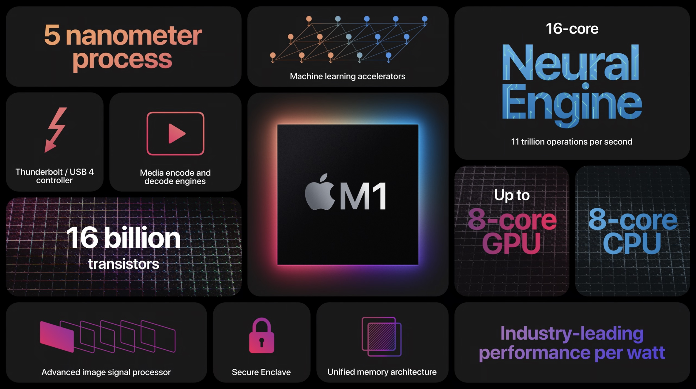

M1 首次采用了 **ARM 指令集**（与 Intel 的 x86 不同），并结合苹果自研的 **Firestorm 高性能核心 + Icestorm 高能效核心**，实现了前所未有的能效比

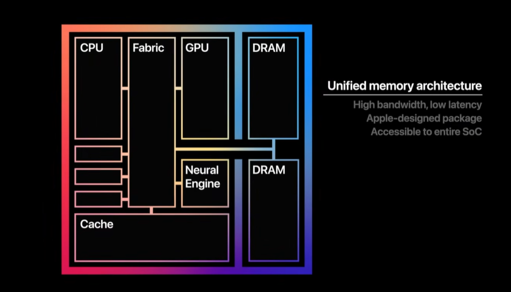

更重要的是，M1 采用了 **UMA（统一内存架构）**

这意味着 CPU、GPU、NPU（神经引擎）都在同一个内存池中工作——不再像传统电脑那样来回搬运数据  
所以哪怕只有 8GB 内存，M1 的性能表现依然能媲美 16GB 的传统笔电

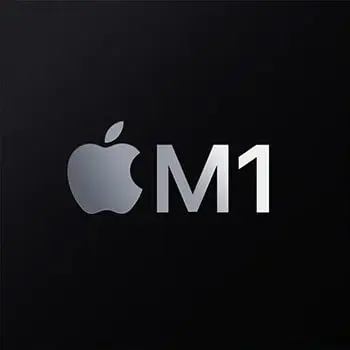

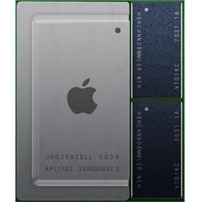

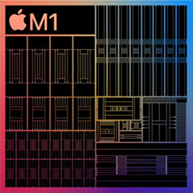

在当时，M1 芯片的单核性能超越了 Intel i9，而功耗却只有它的三分之一

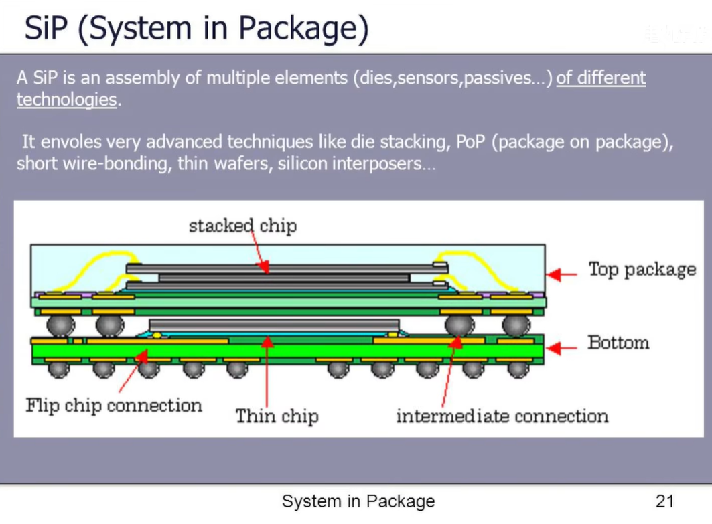

此外，苹果把不同的核心和缓存采用多层堆叠的方式，集成在很小的面积上，进一步加快了核心与核心/缓存/内存之间的通讯速度，相比于平铺式的设计（例如Intel的CPU，核心与核心之间存在着几到几十纳秒的通讯延迟）而从苹果的设计就可看出，这种堆叠的设计就是为了能让电信号少绕弯路，减少延迟和功耗

无奈当时的技术条件有限（指的是M1芯片面积不大，为保证时钟周期内的芯片之间的互联不出现错误，所以为了保证不降低时钟频率所导致的CPU性能的降低，当时的封装技术只能做到这样），M1 只能做到16GB这种大小的统一内存

这也就说明了为什么同时期 M1 芯片相比于去年最新的Intel底压处理器，性能提升了3倍  
这也是为什么那一代 MacBook Air 即使“无风扇设计”，也能长时间高性能运行

M1 的意义，不在于速度的暴涨，而在于 **重新定义了性能与能耗的关系**

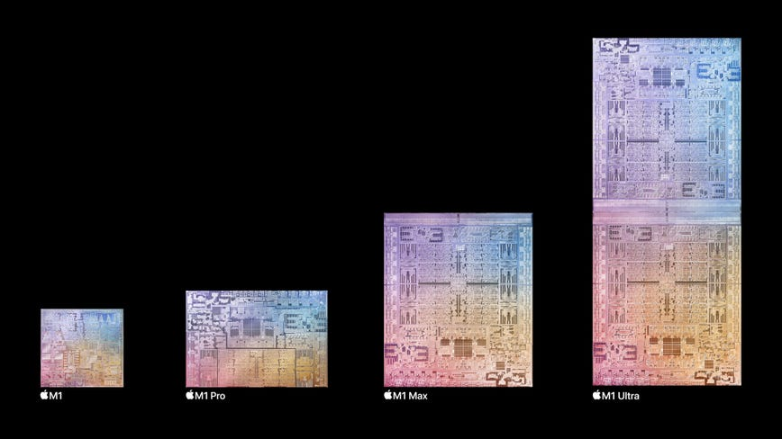

有关于M1这么强大的原因，还得益于以下几个优势：

1. ARM架构的精简指令集的优势
2. 系统级的封装芯片的设计
3. 硬件封闭的生态系统和自家操作系统的优势
4. 神经网络引擎协助进行图像方面的计算

## M1 Pro / Max / Ultra：性能的层层扩展

苹果在 M1 成功的基础上，开始了分层策略：

| 芯片 | CPU规格 | GPU规格 | 使用设备 |
| --- | --- | --- | --- |
| M1 | 3.20GHz ×4 2.06GHz ×4 | Apple ×7 112 EUs 896 ALUs/Apple ×8 128 EUs 1024 ALUs @1278MHz | MacBook Air (M1, 2020 年) MacBook Pro (13英寸,M1,2020年) Mac mini (M1, 2020 年) iMac (24 英寸, M1, 2021 年) iPad Air (第 5 代) iPad Pro 11 英寸 (第 3 代) iPad Pro 12.9 英寸 (第 5 代) |
| M1 Pro | 3.23GHz ×6 2.06GHz ×2/3.23GHz ×8 2.06GHz ×2 | Apple ×14 224 EUs 1792 ALUs/Apple ×16 256 EUs 2048 ALUs @1296MHz | MacBook Pro (14 英寸,2021 年) MacBook Pro (16 英寸,2021 年) |
| M1 Max | 3.23GHz ×8 2.06GHz ×2 | Apple ×24 384 EUs 3072 ALUs/Apple ×32 512 EUs 4096 ALUs @1296MHz | MacBook Pro (14 英寸,2021 年) MacBook Pro (16 英寸, 2021 年) Mac Studio (2022 年) |
| M1 Ultra | 3.23GHz ×16 2.06GHz ×4 | Apple ×48 768 EUs 6144 ALUs/Apple ×48 768 EUs 6144 ALUs@1296MHz | Mac Studio (2022 年) |

**UltraFusion 架构** 是苹果在芯片设计史上的一次里程碑。  
它让两颗 M1 Max 通过硅互联桥高速通信，就像两颗芯片变成“一颗超芯片”，  
实现了桌面级 CPU 的性能，但保持 ARM 架构的能效

M1 家族的出现，使苹果不再依赖外部厂商，彻底掌控了从芯片到系统的底层生态

## M2：性能的线性提升与AI能力的觉醒

M2 并没有像 M1 那样一夜改写整个行业，但它把 M1 的架构优势继续放大并补足了实际使用中暴露的短板。M2 在 CPU 架构上仍然延续 Firestorm/Icestorm 思路（高性能核心 + 高能效核心），但在 **GPU 核心数、内存带宽、媒体引擎与最大统一内存容量** 上都进行了升级——这让它在创作类工作（视频编解码、图像处理、模型推理的边缘任务）上更“顺手”

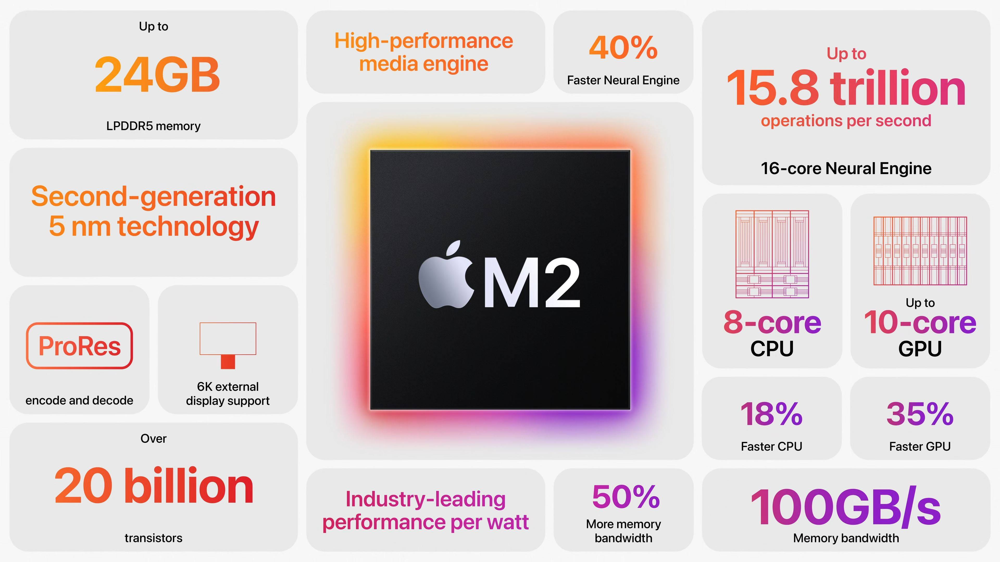

M2 发布于 2022 年，依旧基于 ARM 架构，但制程从 5nm 升级为第二代 5nm。  
相比 M1，CPU 提升 18%，GPU 提升 35%，神经引擎提升 40%，M2 提供了更高的 GPU 性能、更大的统一内存上限（最高 24GB）以及 100GB/s 的内存带宽

**M2 的升级点：**

- 继续以 UMA（统一内存架构）为核心，使得 CPU/GPU/NPU 更高效共享同一内存池，减少数据搬运开销并提高实际应用中的响应速度与能耗效率
- 在媒体处理方面加入更强的硬件加速（ProRes 编码/解码等），对创作者友好

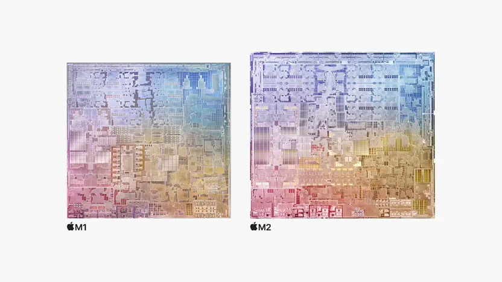

| 芯片 | CPU（高性能 × 高能效） | GPU（最大核数） | Neural Engine | 统一内存带宽 | 最大统一内存 | 常见搭载设备 |
| --- | --- | --- | --- | --- | --- | --- |
| **M2** | 8 核（4P + 4E） | 8 / 10 核 | 16 核 | 100 GB/s | 24 GB | MacBook Air (M2)、13" MacBook Pro (M2)、iPad Pro（部分型号）。([苹果支持](https://support.apple.com/en-us/111867?utm_source=chatgpt.com "MacBook Air (M2, 2022) - Tech Specs")) |
| **M2 Pro** | 可达 12 核（8P + 4E）或 10 核（6P + 4E） | 16 / 19 核 | 16 核 | 200 GB/s | 32 GB | 14"/16" MacBook Pro、Mac mini（部分配置） |
| **M2 Max** | 可达 12 核（8P + 4E） | 可达 30 / 38 核 | 16 核 | 400 GB/s | 96 GB | 14"/16" MacBook Pro（高阶）、Mac Studio（部分版本） |
| **M2 Ultra** | 24 核（16P + 8E，Ultra 为两颗 M2 Max 互联） | 可达 60 / 76 核 | 32 核 | 800 GB/s | 192 GB | Mac Studio、Mac Pro（部分型号） |

换句话说，从 M2 开始，Mac 进入了“AI 预备阶段”，搭载了 M2 的 Mac 本地调式没问题，跑训练真的够呛

### M2（芯片，开新篇）

- 核心配置：8 核 CPU（4P+4E），GPU 可选 8 或 10 核，Neural Engine 16 核。支持最多 24GB 统一内存，带宽 100GB/s。适合日常生产力、轻量创作与编码加速。官方示范中，M2 的 GPU 在相同功耗下比 M1 有显著提升
- 点评：把 M1 的“高能效+统一内存”优点继续保持，并适度提升图形与媒体性能，目标是让轻薄本在视频剪辑与图形处理上更实用（而不是仅仅跑分更高）。UMA 的优势在 24GB 的上限下仍能带来强感知收益（比如小模型推理、合成任务）

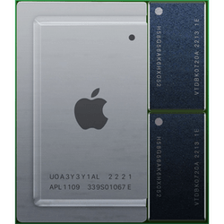

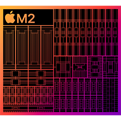

### M2 Pro（让 Pro 级性能再晋级）

- 核心配置：将 M2 横向扩展，最高 12 核 CPU、最高 19 核 GPU，带宽翻倍到 200GB/s，内存上限 32GB。苹果称这是为“next-level workflows”设计的
- 点评：相比 M2，M2 Pro 的亮点是**带宽与更多高性能核心**，这直接提升了工程、影像后期、并行编译等对内存带宽/多核扩展依赖高的工作负载表现。对笔记本来说，这是一条“性能明显提升但仍保电池友好”的路径

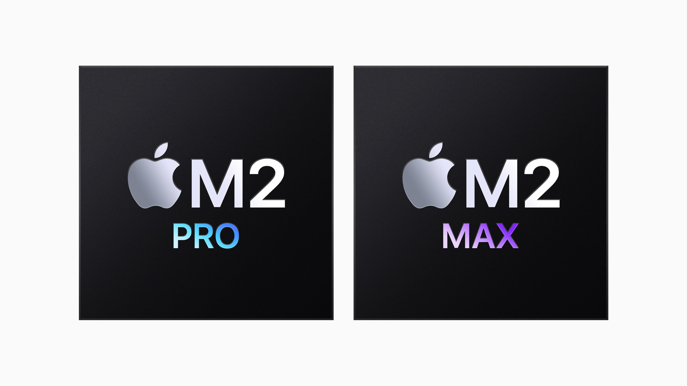

### M2 Max（迅猛冲新高）

- 核心配置：在 M2 Pro 基础上进一步放大 GPU（最高可达 38 核）、内存带宽翻倍至 400GB/s、统一内存可选到 64/96GB（视机型）。官方强调它能处理大场景的 3D、超大分辨率视频与多镜头 ProRes 工作流
- 点评：这颗芯定义了“轻薄工作站”的概念：无需外接显卡也能处理很多此前只有桌面级机器能做的任务。内存带宽与大容量统一内存，是 M2 Max 的王牌，真实场景下能减少交换/分页带来的性能坎

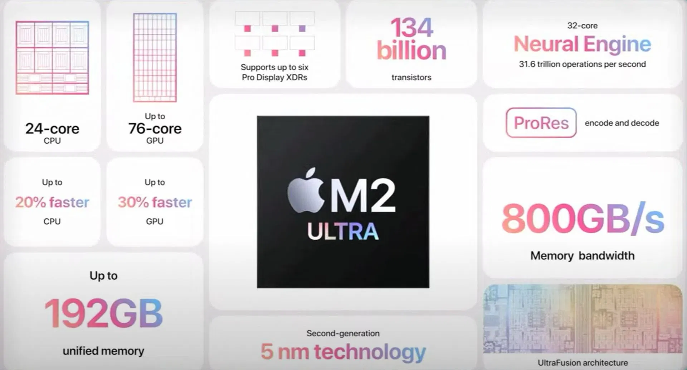

### M2 Ultra（桌面级工作站&一块惊天动地的芯片）

- 核心配置：通过 UltraFusion 把两颗 M2 Max 互联（类似 M1 Ultra 的策略），达到 24 核 CPU、可达 76 核 GPU、32 核 Neural Engine、800GB/s 带宽与最高 192GB 统一内存。官方把它定位为面向专业工作站的 Apple Silicon
- 点评：M2 Ultra 是把 SoC 可扩展性推到极致——相比传统桌面 CPU + 独立 GPU + 显存 的分离架构，Ultra 的 UMA 在带宽与延迟层面做得更好（当然它仍然受制于封装和可支持的最大内存）。这意味着在某些大模型训练、超高分辨率多轨视频实时编辑等任务上，M2 Ultra 能提供非常竞争力的单机体验

## M3：从“强化”到“智能平台”的跃升

M3 是苹果芯片战略中，“AI 时代”开始真正变得可执行的一步  
我认为它不仅仅是在 M2 的基础上再提升一点性能，而是一次 **“大模型语言本地化”** 的趋势  
M3 首次采用了成熟的 3 nm 制程，使得其内部的神经网络加速单元、媒体处理引擎与统一内存架构有了突破性的能力——尤其在处理语音识别、抠像、图像生成、以及大语言模型（LLM）推理方面，M3 的神经方面进化值得重视

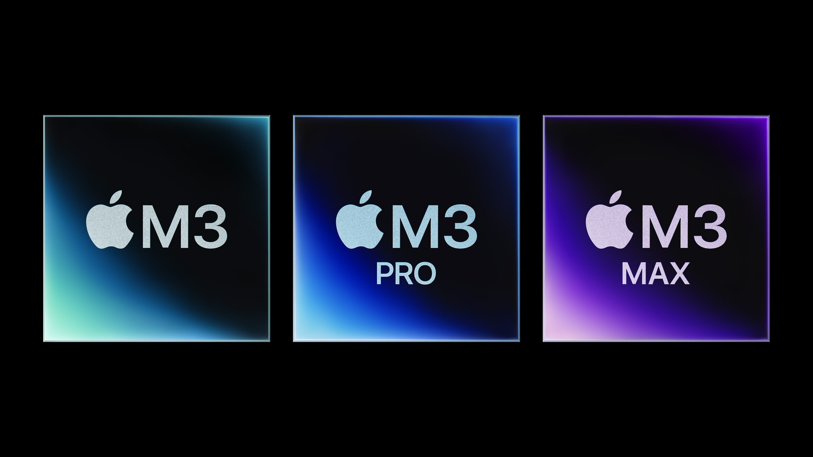

M3 仍然采用 UMA（统一内存架构），但在 AI／神经网络任务中，这一点显得尤为关键：CPU、GPU、Neural Engine 共享高速统一内存池，使得数据从输入（例如语音信号、视频帧、文本序列）进到模型推理，再输出结果的路径更短、延迟更低、能耗更少  
这意味着即便是在笔记本／轻薄本中，M3 也具备比传统架构更强的 **本地化大规模推理能力**

在发布会上，苹果宣称 M3 的 Neural Engine 比第一代 M1 快 “多达 60%”  
这告诉我们：神经网络相关任务如语音识别、多模态输入、图像生成、语言模型推理，在 M3 上将变得更高效、更实用

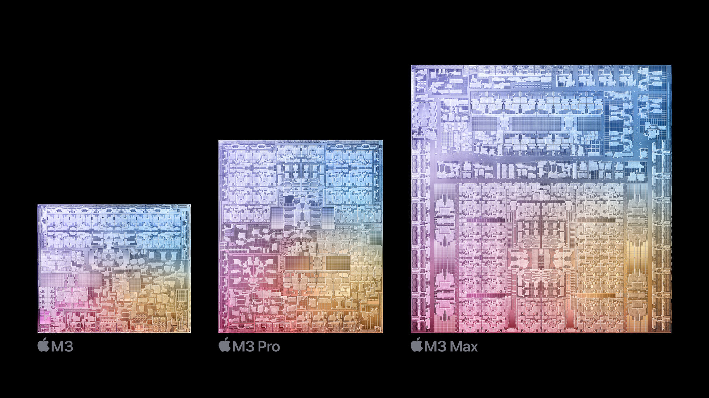

## 1. 大语言模型（LLM）适配能力

- 关键原因在于：Neural Engine 的加速 + 高速统一内存带宽 + UMA 架构。根据资料，M3 的 Neural Engine 峰值约 18 TOPS（每秒 18 万亿次运算）这比前代提升明显
- 在语言模型推理时，关键的是“矩阵乘法 +激活函数 +注意力机制”这一类重复性大、并行度高的操作。Neural Engine 专为这类任务设计，在效率上优于纯 CPU／纯 GPU
- 因此，M3 在本地运行语言理解／生成、语音转文字、文本分析等任务时，具有比传统笔电更低延迟、更优功耗的优势

## 2. 语音处理与实时推理

- 在语音识别、语音转文字、语音理解、语义响应等场景里，延迟与功耗是关键。M3 的 Neural Engine 与媒体引擎协同，使得音频信号的捕获 → 特征提取 → 模型推理 →反馈生成这一流程更高效
- 并且，因为统一内存，音频帧、特征张量、模型中间状态都能快速共享，无需跨芯片／跨存储搬运，这点在未来的本地大语言的部署上，会很吃香
- 举例来说，如果你在 MacBook Air（M3）上用实时语音助手或会议转录应用，理论上你所感受到的“响应延迟”将明显低于传统架构

## 3. 抠像／图像生成／图形化处理

- 本地化的抠像（例如视频背景抠除）、图像生成（如 AI 绘图、风格转换）、图形化处理（如实时渲染、Mesh Shading、Ray Tracing）这一类别，对神经网络 + GPU +内存带宽要求非常高。M3 在这几方面也有显著加强：例如 M3 系列 GPU 支持硬件加速的 Mesh Shading／Ray Tracing
- 在抠像任务中，典型流程是：摄像头捕获 →图像分割模型（神经网络）识别前景/背景 →结合 GPU 渲染输出。这其中分割模型运行在 Neural Engine + GPU 上，而数据在统一内存里快速流动。M3 的高带宽和优化结构使这个流程更流畅
- 图像生成方面，比如 AI 绘图、图层合成、灯光渲染、实时反馈，M3 能做到“在本机”更快完成，而不必频繁上传云端。对于创作者而言，这意味着更低延迟、更高效率

## 为什么 M3 的神经网络表现值得留意？

- **3 nm 制程**：M3 是苹果首款大规模采用 3nm 制程的 Mac SoC。 制程的改进不仅带来更高晶体管密度，也带来了更大潜力在神经网络加速单元上的提升。
- **统一内存架构（UMA）继续强化**：神经网络模型推理往往受内存移动与带宽限制。M3 在带宽与内存容量上的提升，直接利好模型推理。比如资料显示起步带宽约 100 GB/s
- **Neural Engine 专用加速**：虽然苹果没有完全公开每一个细节，但可知 M3 的 Neural Engine 提升明显。且被用于推理任务。对于大语言模型推理、语音处理、图像分割等任务尤为关键
- **媒体／渲染引擎协同**：M3 不只是“神经网络加速”，它还在媒体引擎（视频编/解码）、图形引擎（Ray Tracing/Mesh Shading）方面同步加强。对于 AI 应用场景（如 AR/VR、实时视频处理）极具实际价值
- **本地化 AI 趋势匹配**：随着“隐私、安全、实时响应”在终端设备上的需求越来越高，能够在设备侧运行语言模型、视觉模型，是一种趋势。M3 为这种趋势提供了硬件基础
- **生态与软件支撑**：苹果的 Core ML、Accelerate、Metal 等工具链支持这些硬件加速单元。开发者可以更便捷地部署模型于 Mac 上

## M3 的 NPU：从加速单元到「智能中枢」

在 M3 芯片中，苹果的 **Neural Engine（神经引擎）** 实际上就是其自研的 **NPU（Neural Processing Unit）**  
这颗 NPU 是苹果在 AI 能力上“从辅助加速器，迈向主处理核心”的关键

不同于 CPU 的通用逻辑和 GPU 的图形并行处理，**NPU 专为神经网络计算而生**，特别擅长执行大量矩阵乘法、卷积运算、激活函数和注意力机制等深度学习核心操作

而与 NPU 密切相关的另一颗重要模块是 **DSP（Digital Signal Processor，数字信号处理器）**

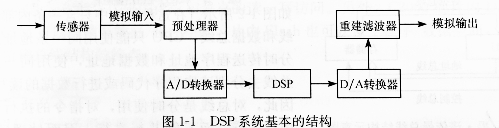

在传统架构中，DSP 负责处理音频、图像、视频等“信号级任务”，比如语音波形、相机图像降噪、视频帧优化；而 NPU 则进一步在“特征级任务”上工作（例如语义识别、图像理解、语言模型推理）  
可以简单理解为：

> **DSP 负责把信号变成特征，NPU 负责让特征变成智能**

在 M 系列芯片中，这两者往往是紧密协作的：  
语音输入时，DSP 先将音频信号做噪声消除、特征提取，再交由 NPU 完成语音识别或语义理解  
图像处理时，DSP 做降噪、色彩恢复，而 NPU 则做人物分割、背景抠像或物体识别。  
这种“信号 + 语义”的耦合，是苹果 AI 能力高效落地的根基

## NPU 在大语言模型中的角色

大语言模型（LLM）本质上是一个高维矩阵计算问题：  
每一次推理都需要执行海量的矩阵乘加、Softmax、Attention 等操作，这正是 NPU 擅长的部分  
在 Apple Silicon 的架构中，NPU 可直接接管这些 **张量级并行计算任务**，并以极低功耗完成

相比 GPU 的高并行但高功耗，NPU 的设计更“定制化”

- 它的计算单元直接映射 Transformer 模型中的矩阵运算逻辑
- 内部缓存对张量的读写做了极致优化；
- 数据流路径被简化到最短，以减少访存延迟

在 M3 上，这意味着：

- 即便在本地运行 ollama、Gemini 等 4B～7B 级别模型，推理速度依然可用
- 模型可部分卸载到 NPU 上运行，从而释放 CPU / GPU 资源
- 系统级能耗维持在笔电可承受的水平，而不需要外接 GPU

换句话说，**M3 的 NPU 让 “离线运行大语言模型” 成为现实** —— 这正是苹果在 Vision Pro 和 macOS AI 功能（如本地转录、智能总结、语义搜索）中的基础

这使得 M3 系列成为了 Apple Silicon 时代的转折点——  
从“移动芯片性能奇迹”走向“桌面级计算中心”

## M4：为 AI 而生的计算核心

M4 是苹果首个“面向人工智能”优化的芯片。  
它采用 **第二代 3nm 工艺**，并在内部增加了全新的 **高带宽内存架构（HBM-like设计思路）**，使数据传输效率进一步提高

### 平台生态与 Apple Intelligence

苹果在 M4 发布时强调，这一代芯片是为了支撑 **Apple Intelligence** 而打造——即“个人人工智能”在设备端的实现  
换句话说，M4 不仅是面向创作者或专业用户的算力平台，更是面向“人人都能用 AI 助手／本地模型”时代的硬件基石

| 芯片 | CPU 规格 | GPU 规格 | Neural Engine | 内存带宽 | 最大统一内存 | 常见搭载设备 |
| --- | --- | --- | --- | --- | --- | --- |
| **M4** | 10 核 | 10 核 | 16 核 | 120 GB/s 起步 | 起步可配置至 32GB 以上 | MacBook Pro 14″ (M4)；iMac/Mac mini 等 |
| **M4 Pro** | 12-14 核 | 16-20 核 | 16 核 | 273 GB/s 起步 | 高达 64 GB 内存 | MacBook Pro 14"/16" (M4 Pro) |
| **M4 Max** | 14-16 核 | 32-40 核 | 16 核 | 410-546 GB/s | 高达 128 GB 内存 | MacBook Pro 高配版/Mac Studio (部分版本) |

更值得注意的是，M4 的 **神经引擎（Neural Engine）** 达到了 38 万亿次操作／秒（38 TOPS）的算力，比 M1 提升了近 3 倍，M4 在 AI 推理能力上实现显著跃进

这让 Apple Intelligence（苹果的本地AI系统）能在设备上实时运行，  
不依赖云端，也不牺牲隐私

M4 的重点，不在于CPU提升，而在于为未来的“本地AI模型”铺平道路  
未来的 Siri、图像生成、文字摘要、语音翻译，都会在设备本地完成——  
而这正是苹果硬件战略的核心：**AI 私有化、本地化、隐私化**

## M 系列的整体演进：不是追求极限，而是重构效率

如果要总结 M1 到 M4 的核心变化，可以用一句话来概括：

> M1 改变了电脑的形态，M4 改变了电脑的思维

| 代数 | 制程 | CPU提升 | GPU提升 | 神经引擎 | 关键变化 |
| --- | --- | --- | --- | --- | --- |
| M1 | 5nm | 基准 | 基准 | 16TOPS | ARM + UMA架构 |
| M2 | 第二代5nm | +18% | +35% | 20TOPS | 媒体引擎、AI加速 |
| M3 | 3nm | +20% | +65% | 18TOPS | 硬件光追、动态缓存 |
| M4 | 第二代3nm | +25% | +50% | 38TOPS | 第二代3nm，10核CPU架构 |

## Apple Silicon 的意义：硬件、软件与AI的统一

M 系列芯片真正强大的地方，并不在于跑分，而在于 **整合能力**：

- **系统级优化**：macOS、iPadOS 与芯片架构高度绑定，效率远高于Windows生态
- **统一内存架构**：CPU、GPU、NPU共享资源，无需数据搬运
- **本地AI算力**：从M4开始，Siri与生成式AI不再依赖云计算
- **生态联动**：iPhone、iPad、Mac间的数据传输无缝协同

换句话说，M系列的每一次迭代，都不是单纯的性能提升，  
而是苹果在为未来的“个人计算AI时代”做底层铺路

## 总结：M系列芯片代表的，是苹果的计算哲学

**这就是 Apple Silicon 的意义在于：**

> 让计算不再依赖参数，而回归到“效率”与“体验”的本质
>
> 它不只是芯片的迭代，更是苹果对未来计算形态的答案

感谢你能看到这里，倘若与您的观点有任何出处，那么一切以您的为准  
如果这篇分析能帮你更好地理解 M 系列芯片的演变，  
那就是我写作的意义  
我们下一篇见 (ง •\_•)ง✨
