## 实现这个的前提是你得有开通Apple Music的账号（不限区域）

> ###### 本章用到的工具来自于Github大佬做的开源工具
>
> Google云盘分享链接下载：[点我下载](https://drive.google.com/drive/folders/1KrEXu_Z57wLOhy1-pZawIaMn-MBaIQG6?usp=drive_link)
>
> Github源地址：[点我跳转](https://github.com/wenfeng110402/AppleMusic-Downloader/releases)

## 前期工作：下载这个文件

下载后你会看到有两个文件分别为：

1. AppleMusicDownloader.exe --核心下载软件
2. OpenCookies.txt.crx --获取浏览器cookie的浏览器插件

## 步骤一：安装Edge拓展，获取cookie

（1）打开Edge的拓展选项

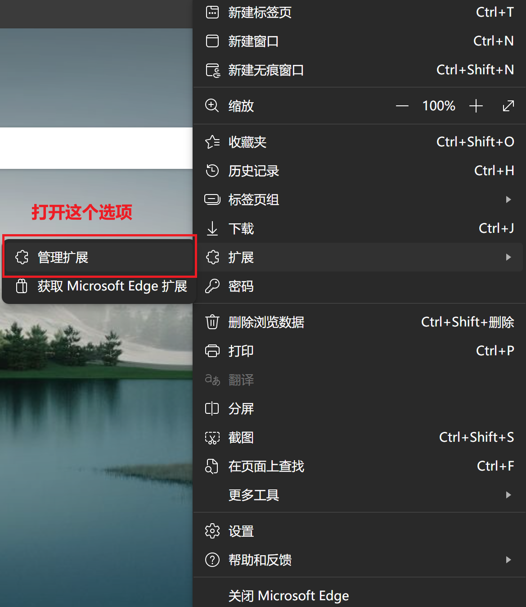

（2）打开开发人员选项

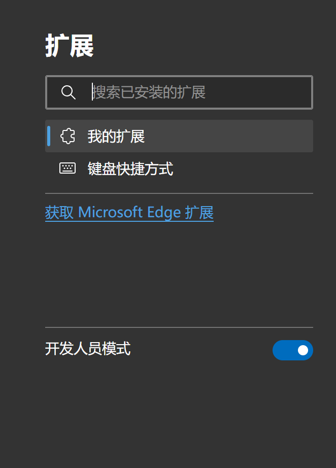

（3）将这个下载的`OpenCookies.txt.crx`拖入这个Edge的拓展里

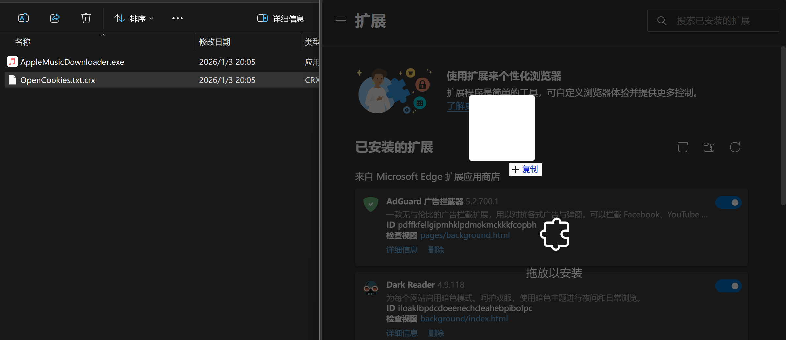

## 步骤二：打开Apple Music的这个网页端，并登录账号到网页端

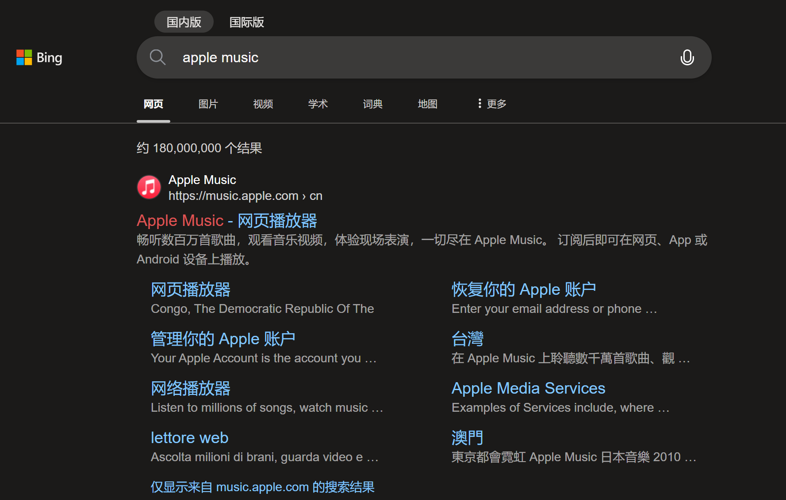

## 步骤三：使用Edge插件获取cookie文件

（1）在Apple Music的这个网页端，随便找到一个歌曲的界面，打开插件，点击下图的按钮

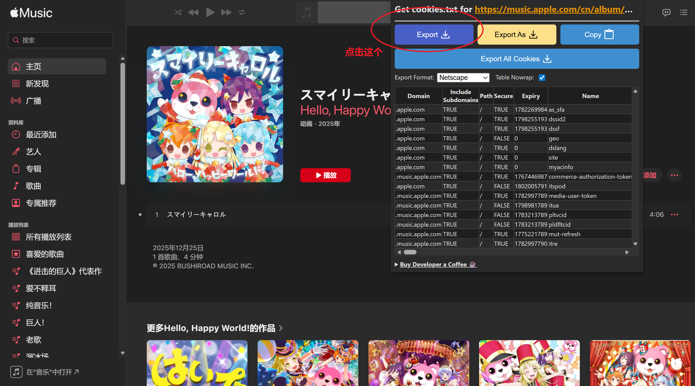

（2）将这个获取到的这个文件下载并存好（存在一个你记住的地方，后面文件地址会有用）

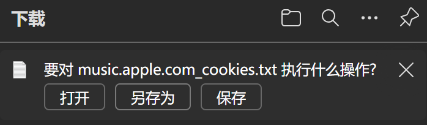

## 步骤四：使用AppleMusicDownloader，下载音乐

（1）双击打开之前下载的应用程序，选择之前保存的cookie路径（每个人的文件保存路径不一样，请根据实际的来，不要一味的照抄）

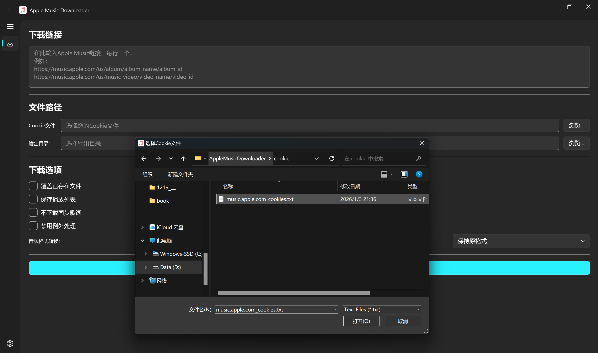

（2）选择下载后的保存路径（一会下载的音乐文件会直接出现在这里）

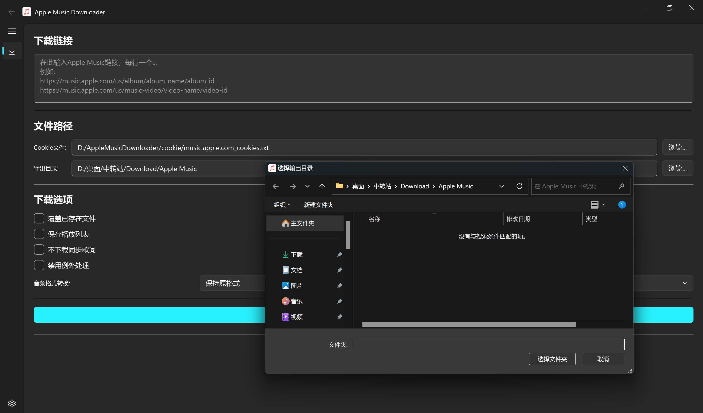

（3）去复制一首你需要下载的音乐连接（这里我以《す、好きなんかじゃない!》来示例）

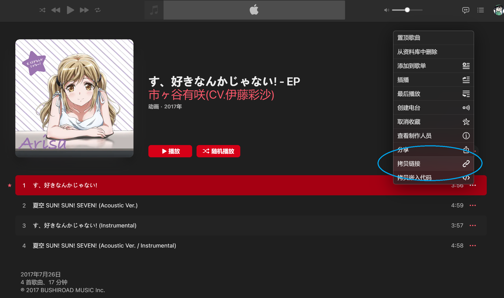

（4）将刚刚拷贝的链接粘贴进这个里面，以及可以下载的音频/视频格式（这里我以flac的格式来演示）

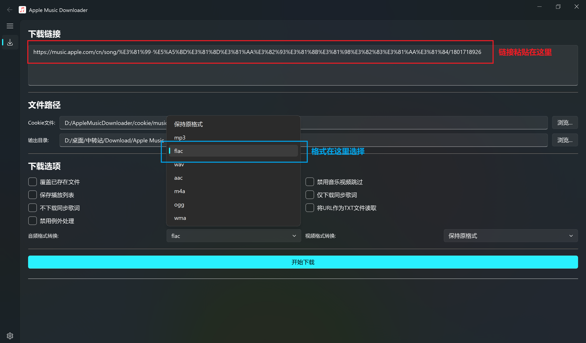

## 步骤五：验证结果

可以看到，之前选择的保存路径下出现了我们选择的格式文件

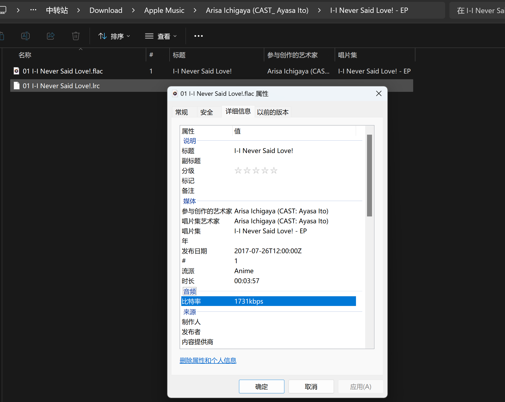

**那么本篇的内容就到这里结束了**

**感谢您的观看，您的肯定是我继续更新的动力♪(´▽｀)**
