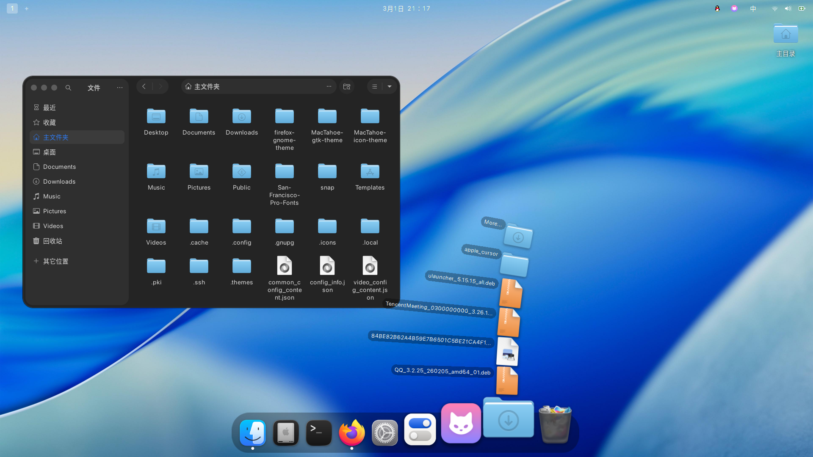

在前一章节，我带领大家配置完基础的安装过程，以及换完国内的源等基础的Ubuntu的设置后，接下来我会带领大家实现如下图的美化效果（如下图所示）

如果没看我前一章节的朋友，可以回头看看：点我直达

别担心，本篇文章我会带着从零开始，一步一步地美化这个系统

所需材料来源于Github的大佬们制作的美化包，所以务必请准备好外网环境，如果没有的话，可以使用国内的镜像站（改成bgithub.xyz即可）

剩余内容还在更新中....
