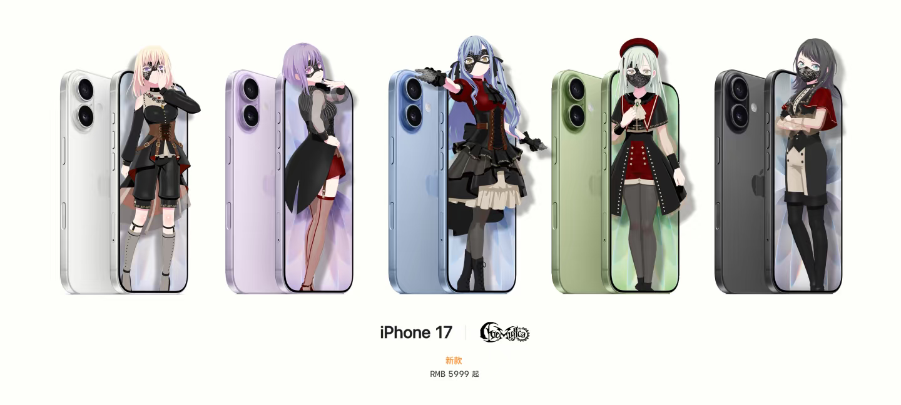
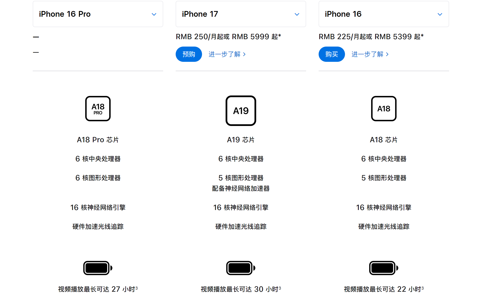
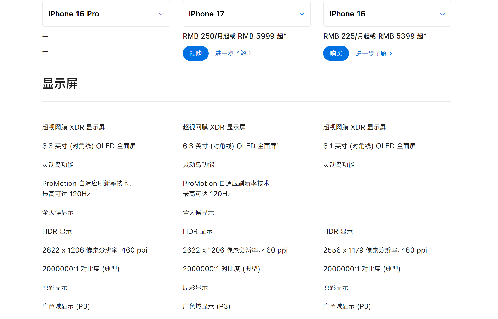
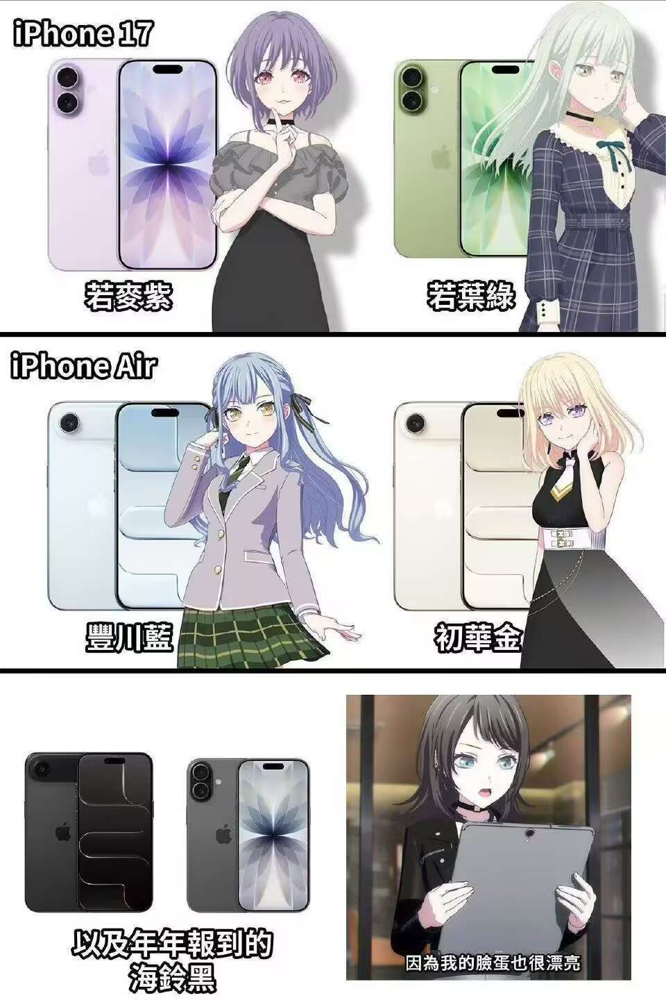

不知道大家注意到了iPhone17标准版系列的颜色了吗？

很巧合地是和我们有史以来[バンドリ！（邦邦）](https://baike.baidu.com/item/BanG%20Dream!/19290509)剧情最逆天的“神人”[Ave\_mujica](https://mzh.moegirl.org.cn/Ave_Mujica)乐队的成员代表配色惊人的一致

\*联动信息是PS的

但是这真的很像啊喂！！！（不说是假的，看这图我还真以为是的）

扯远了，来说说iPhone17标准版的性价比吧

**先说结论：我认为iPhone17标准版是今年最值的入手的iPhone，没有之一**

原因如下：

首先先对比一下去年的老机皇iPhone16 Pro（姜还是老的辣）

在核心处理器方面，iPhone 17 搭载的是全新的 A19 芯片，而 iPhone 16 Pro 搭载的是 A18 Pro 处理器。这两颗处理器的性能表现其实旗鼓相当，但由于 iPhone 17 采用了更先进的技术，使得它的单核性能可以和 A18 Pro 一较高下

屏幕方面，这一代 iPhone 17 标准版弥补了上代 iPhone 16 没有高刷的短板，和 iPhone 17 Pro 一样，搭载了 6.3 英寸的 **超窄物理四等边 OLED 直屏**，并且支持 120Hz ProMotion 自适应刷新率。很多人关心的续航也有大幅提升，远超 16 Pro

在做工方面，iPhone 17 的中框是铝合金，耐摔能力确实不如 16 Pro 的钛合金，但它的正面防护能力得到了明显增强。采用了第二代超瓷晶面板，耐刮能力相比 iPhone 16 Pro 的第一代提升了 3 倍

在充电方面，也有史诗级的提升。续航能力方面，iPhone 17 官方数据显示可连续播放视频 30 小时，而 iPhone 16 Pro 为 27 小时。充电功率更是翻倍：iPhone 17 可在 20 分钟充入 50%，而 16 Pro 需要 30 分钟。iPhone 17 的充电功率达到了 40W，iPhone 16 Pro 为 20W。两者都支持磁吸充电，还有 Qi2 以及 Qi 无线充电

需要注意的是，国行版 MagSafe 只有 15W，而海外版本则能达到 25W（港版也是 25W 哦）

综合来看，iPhone 17 标准版不仅补齐了高刷屏的短板，还在性能、续航和充电等方面全面提升，可以说是 **近几年最均衡的一款 iPhone**。如果你想要一款既有旗舰体验，又不想花太多溢价的机型，那 iPhone 17 标准版绝对是今年的首选
