## 前言：

在进行安全测试或靶场练习时，直接在本地物理机上运行相关服务（如 MySQL 等）存在一定风险，可能影响系统稳定性甚至带来安全隐患。因此，更推荐使用“虚拟机 + Docker”的方式来搭建实验环境

通过这种方式，我们可以在隔离的虚拟环境中快速部署和管理多个靶场实例，在保证主机安全的同时，也便于环境的复用与销毁，提高学习与测试效率

需要注意的是，在部署 Docker 之前，请确保当前环境（物理机或虚拟机）具备良好的网络访问能力，否则可能会影响镜像的下载与容器的正常运行

本教程的结尾附上了docker常见的命令表，可供参考（在本文的最后）

## 虚拟机桥接设置：

在部署 Docker 之前，需要先配置虚拟机的网络模式。本文采用桥接模式，使虚拟机能够直接接入局域网，从而保证后续服务部署与访问的正常进行

**环境说明：**

- 虚拟化软件：VMware Workstation Pro 25H2
- 系统镜像：CentOS-7x86\_64-Minimal-2009

CentOS7镜像：[下载地址1](https://pan-yz.cldisk.com/v2/external/resourceDetail.html?appid=1D734FA7-035A-4DEC-AA1C-DD63331D9267&nonce=557161100&timestamp=1775926805515&showAppBar=true&puid=305794623&autoPreview=true&objectId=b8bbab41ebbcb75ec2f8b69b08afe54a&signature=6bcc793e13be0b90beb8503f1e6360cf "下载地址1")（NAS分享链接）[下载地址2](https://mirrors.aliyun.com/centos/7/isos/x86_64/CentOS-7-x86_64-Minimal-2009.torrent "下载地址2")（种子链接）

如果第一个链接挂了，请使用第二个下载链接（种子使用教程：[点我前往](/posts/qbittorrent_teaching/ "点我前往")）

## 添加windows防火墙规则

### 步骤一：Win+R，输入`control`打开控制面板

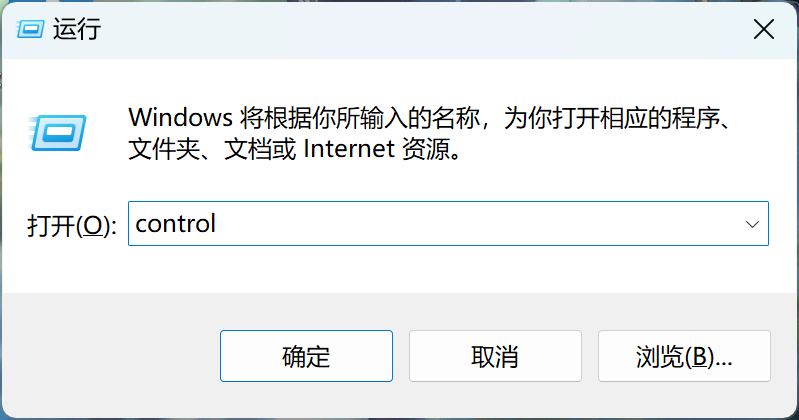

### 步骤二：依次按照下图，找到“高级设置”

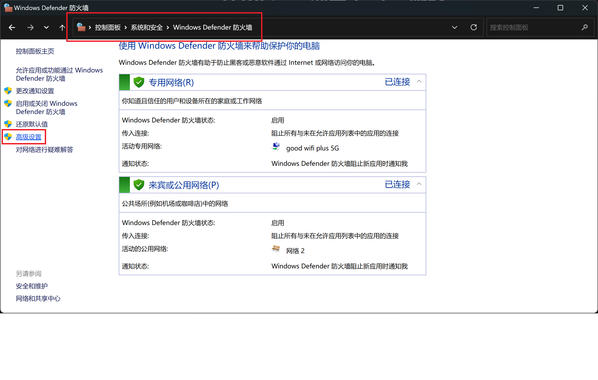

### 步骤三：新建一条windows的防火墙策略

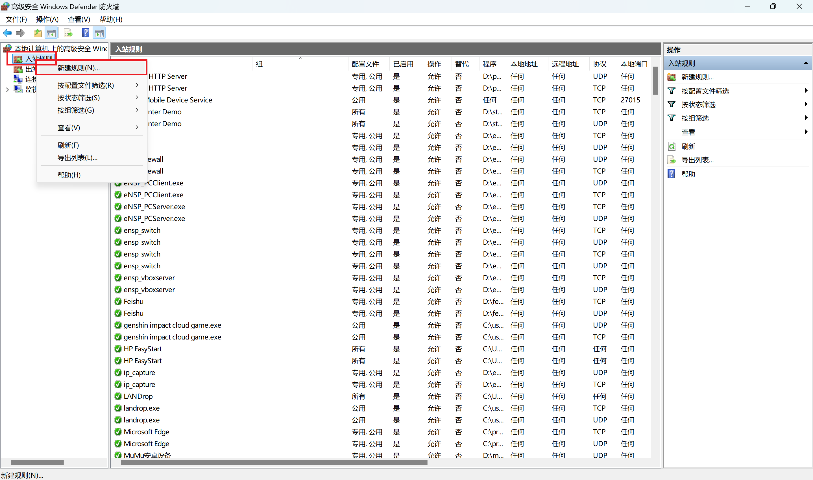

### 步骤四：选择端口设置

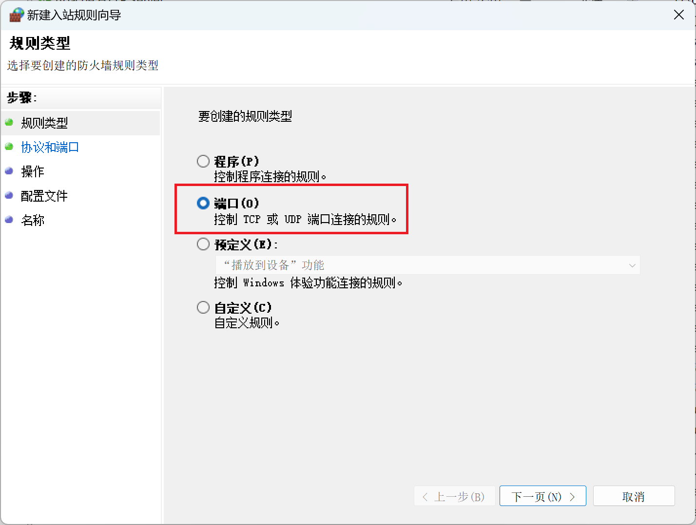

### 步骤五：选择协议（`*注`：这里的端口要设置的和clash或者其他的代理工具所提供的端口一致，不能乱填）

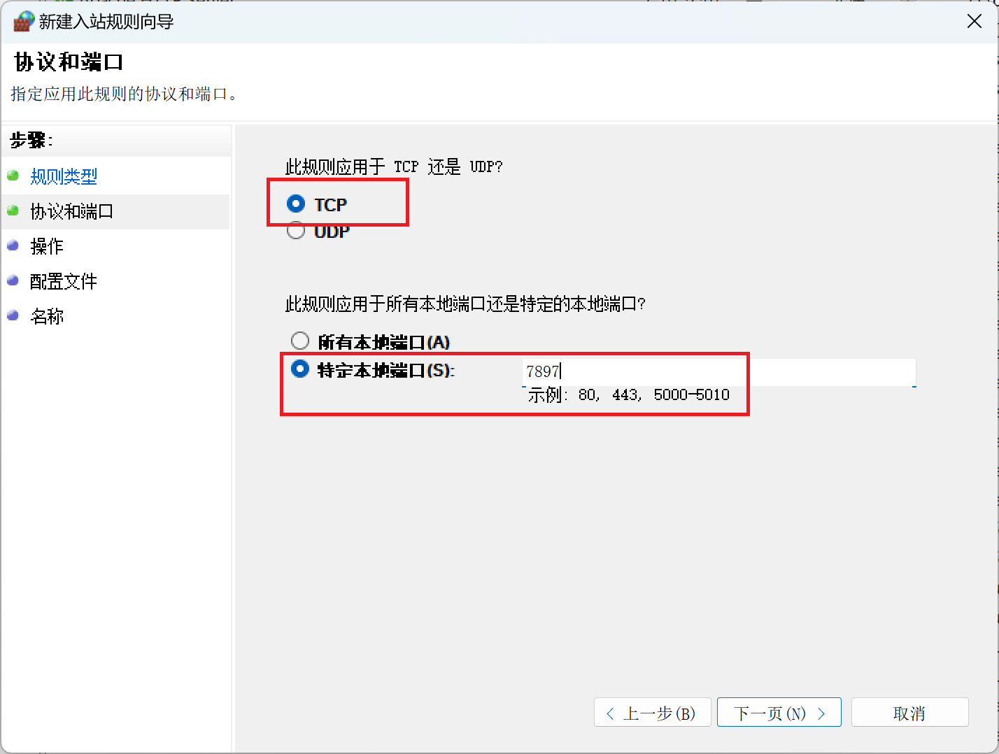

### 步骤六：选择“允许连接”

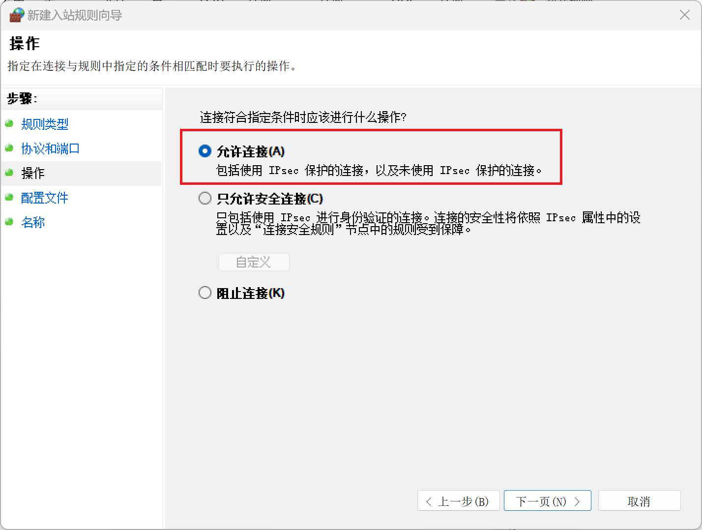

### 步骤七：把所有的网络环境都勾选上

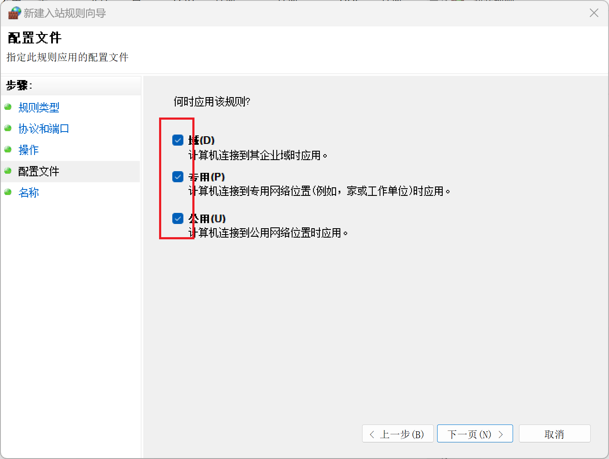

### 步骤八：最终取一个自己记得住的名字即可

### 测试连接：

打开VMware的设置，将网卡模式设置成NAT

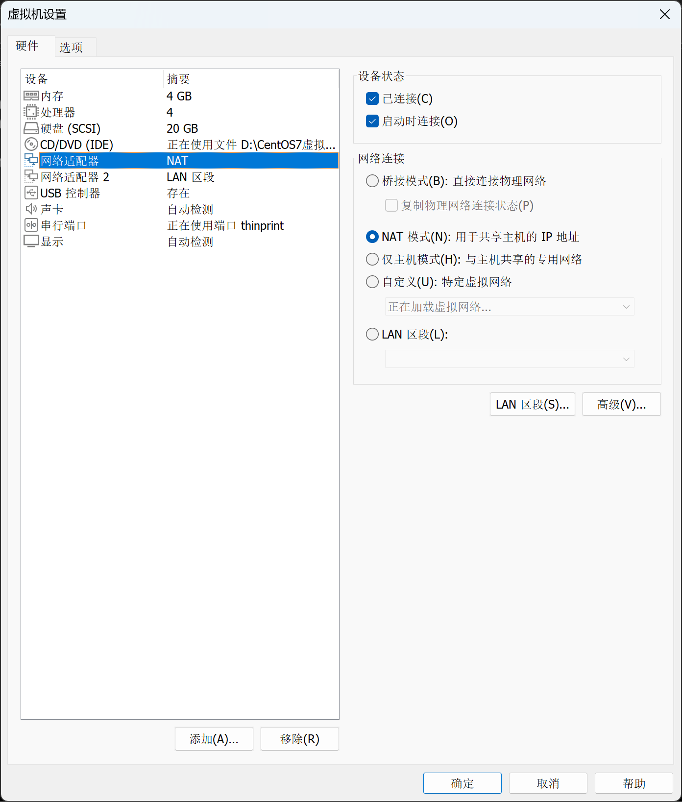

## 检查物理机和虚拟机的连通性

输入以下命令查看虚拟机的IP地址

```bash
ip addr | more
```

测试连通性

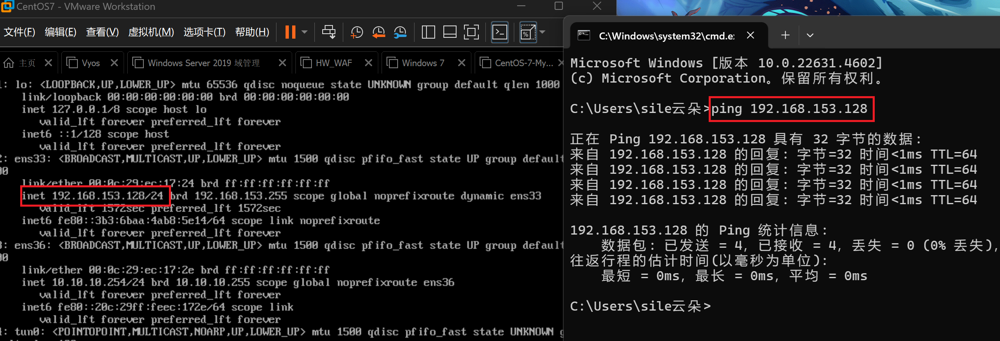

## 代理配置部分：

`*注`：如果你完全使用国内的镜像站操作，那么也不必配置代理，这部分可跳过（如果没有科学上网，也请别担心，我在后面docker安装好了之后的部分会提到使用镜像站的方法）

（请自行解决科学上网的部分，这里我直接跳过）


我使用的是Clash Verge，这里就以Clash的局域网模式来示例

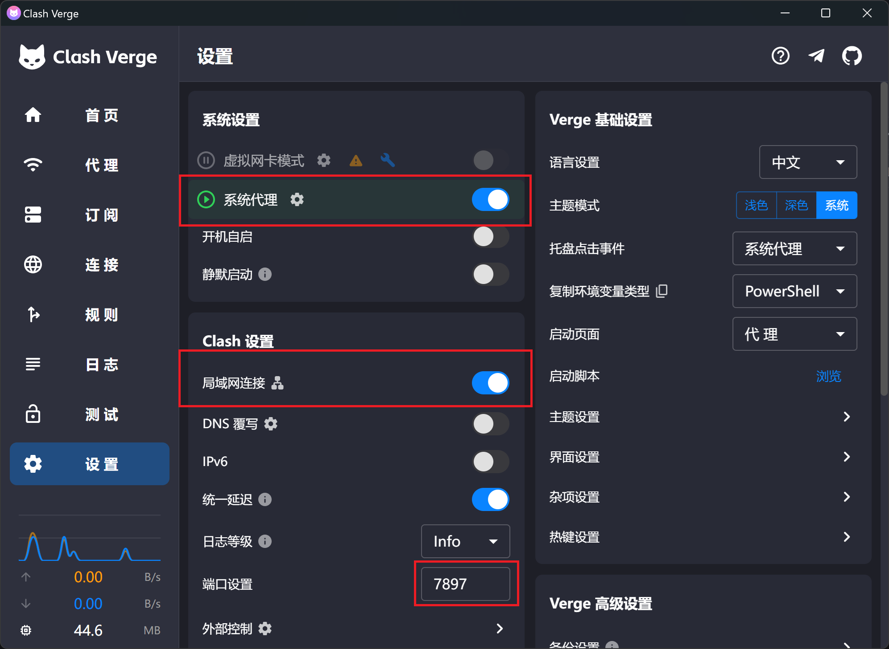

## 在CentOS7的配置：

首先确保这个CentOS7能够远程SSH连接（后续粘贴命令很方便）

我使用的是MobaXtream（[点我下载](https://wwbte.lanzn.com/b014x4mvif)，密码：enk9）[点我跳转软件官网](https://mobaxterm.mobatek.net/download-home-edition.html)

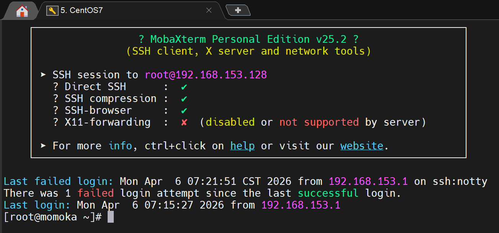

打开CMD，输入ipconfig命令来查看自己的Vmware里的ip地址信息

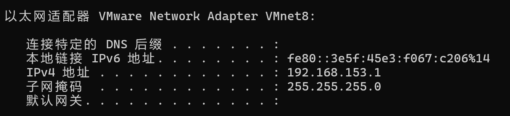

执行以下代码，使得CentOS7的代理指向宿主机的端口（这里我的这个是153，你的需要替换成你自己的端口）

```bash
export http_proxy=http://192.168.153.1:7897
export https_proxy=http://192.168.153.1:7897
```

将代理配置永远写入（不建议这么做，这里下载docker也只是临时的，所以临时设置一下即可）可跳过

### 步骤一：编辑配置文件

```bash
vi ~/.bashrc
```

### 步骤二：在文件末尾添加上述两行 `export` 命令，保存退出后执行以下命令

```bash
source ~/.bashrc
```

即可保存成功

## 验证部分：

在终端中使用如下命令查看是否成功连接外网

```bash
curl -I www.google.com
```

下图即为成功（可以看到这里已经是200 OK了，代表已经获取到了响应头）

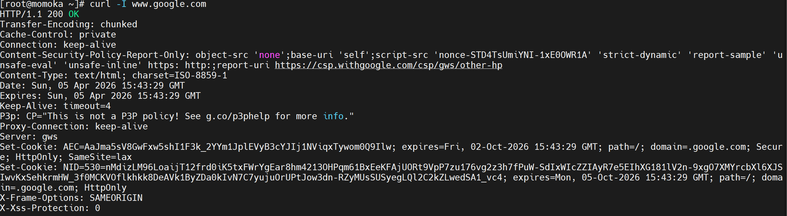

## 开始部署docker

### 步骤一：安装 Docker 引擎

（CentOS 7 自带的软件包版本通常较低，建议通过 Docker 官方的仓库进行安装，以确保版本最新）

卸载旧版本（可选）如果系统之前安装过旧版 Docker，请先清理：

```bash
sudo yum remove docker \
                  docker-client \
                  docker-client-latest \
                  docker-common \
                  docker-latest \
                  docker-latest-logrotate \
                  docker-logrotate \
                  docker-engine
```

### 步骤二：设置存储库

执行以下命令，安装必要的工具包并添加阿里云仓库源：

```bash
sudo yum install -y yum-utils
sudo yum-config-manager --add-repo http://mirrors.aliyun.com/docker-ce/linux/centos/docker-ce.repo
```

### 步骤三：生成缓存并安装（第一次安装不用清理缓存，不过我还是建议清理一下，避免出错）

执行以下命令，清理旧缓存

```bash
sudo yum clean all
```

### 建立新缓存并安装

```bash
sudo yum makecache fast
sudo yum install -y docker-ce docker-ce-cli containerd.io
```

### 步骤四：启动docker并设置开机自启

```bash
sudo systemctl start docker
sudo systemctl enable docker
```

### 验证docker是否部署成功

输入 `docker version`，看到 Client 和 Server 信息即表示安装成功（如下图所示）

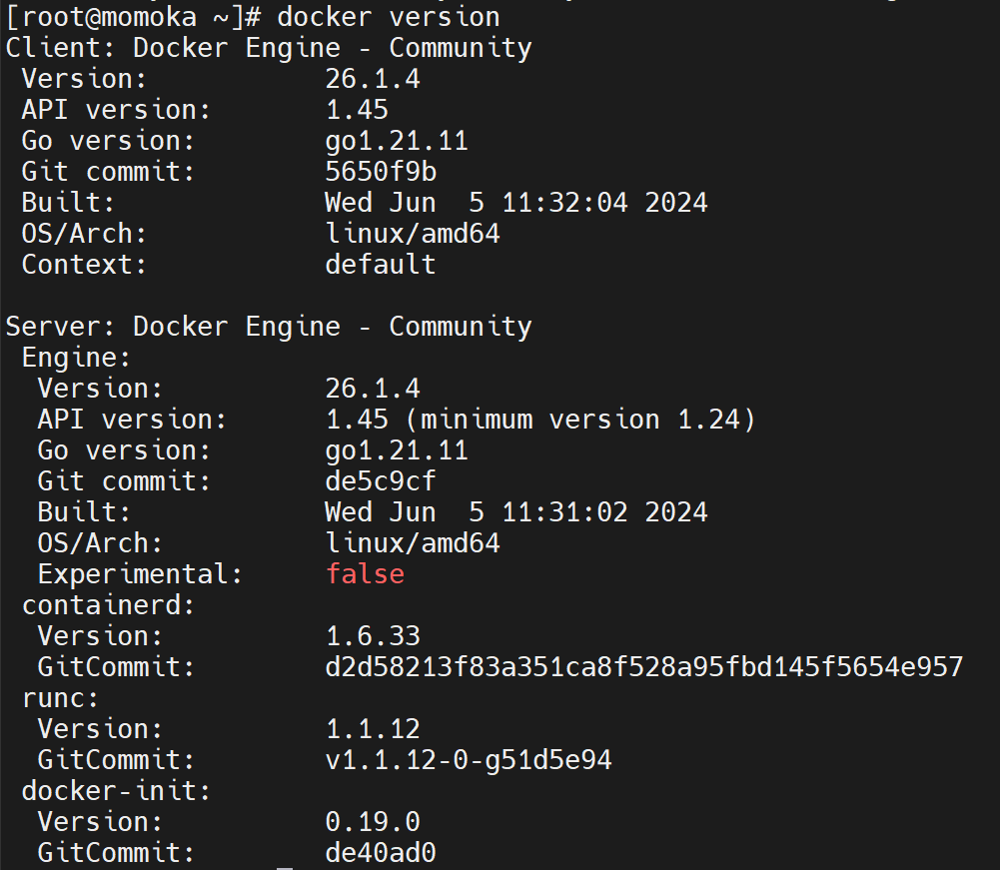

## 虚拟机Docker的代理的设置

## 方法一：使用国内镜像站的配置

### 步骤一：创建或编辑 Docker 的配置文件

```bash
sudo mkdir -p /etc/docker
sudo vi /etc/docker/daemon.json
```

### 步骤二：在文件中粘贴以下内容（推荐如下的国内镜像站）

```json
{
    "registry-mirrors": [
        "https://docker.1panel.live",
        "https://hub.rat.dev/",
        "https://docker.chenby.cn",
        "https://docker.kubesre.xyz",
        "https://huecker.io",
        "https://dockerhub.timeweb.cloud",
        "https://dockerproxy.com",
        "https://docker.anyhub.us.kg",
        "https://dockerhub.icu",
        "https://docker.aws19527.cn",
        "https://registry.dockermirror.com",
        "https://hub-mirror.c.163.com",
        "https://mirror.baidubce.com",
        "https://ccr.ccs.tencentyun.com",
        "https://docker.m.daocloud.io",
        "https://docker.mirrors.ustc.edu.cn"
    ]
}
```

### 步骤三：保存后，重启 Docker 服务使配置生效：

```bash
sudo systemctl daemon-reload
sudo systemctl restart docker
```

### 步骤四：验证国内镜像是否生效

```bash
docker info | grep -A 10 "Registry Mirrors"
```

输出结果如下图所示即可

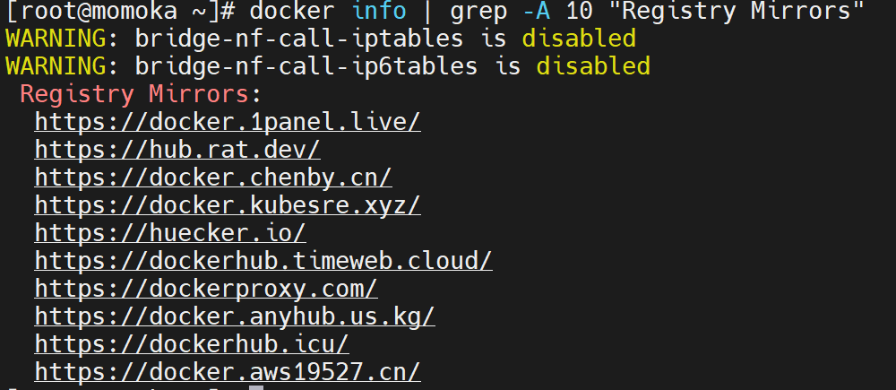

### 至此，国内镜像方法配置结束

## 方法二：使用刚刚配置的本地代理

如果你没有代理工具，可使用国内镜像站的即可

使用代理的时候，这里需要配置两处

- 第一处：解决“Docker 能不能下载镜像”的问题
- 第二处：解决“容器里面能不能上网”的问题

### 第一处：配置 Docker Daemon（让 docker pull、docker run 下载镜像时走代理）

```bash
sudo mkdir -p /etc/systemd/system/docker.service.d
sudo vi /etc/systemd/system/docker.service.d/http-proxy.conf
```

在文件中添加以下内容（把 http://127.0.0.1:7890 改成你自己的代理地址和端口）

```ini
[Service]
Environment="HTTP_PROXY=http://127.0.0.1:7897"
Environment="HTTPS_PROXY=http://127.0.0.1:7897"
Environment="NO_PROXY=localhost,127.0.0.1,::1"
```

这里我的是7897端口，所以在后面配置这个7897

按下`：`，输入`wq`，保存后执行：

```bash
sudo systemctl daemon-reload
sudo systemctl restart docker
```

验证代理镜像是否生效

```bash
sudo systemctl show --property=Environment docker
```

### 第二处：配置 Docker Client（让容器内部默认走代理，新版 Docker 推荐方式）

创建或编辑用户配置文件

```bash
mkdir -p ~/.docker
vi ~/.docker/config.json
```

添加以下内容：

```json
{
  "proxies": {
    "default": {
      "httpProxy": "http://127.0.0.1:7897",
      "httpsProxy": "http://127.0.0.1:7897",
      "noProxy": "localhost,127.0.0.1"
    }
  }
}
```

这个配置会让新启动的容器自动继承代理环境变量

### 临时测试代理（不想永久配置时）

直接在命令前加环境变量

```bash
HTTP_PROXY=http://127.0.0.1:7890
HTTPS_PROXY=http://127.0.0.1:7890
```

配置完后，试一下拉取镜像：

```bash
docker pull hello-world
```

可以看到，我这里可以成功拉取镜像（这里仅仅做测试，就不运行了）

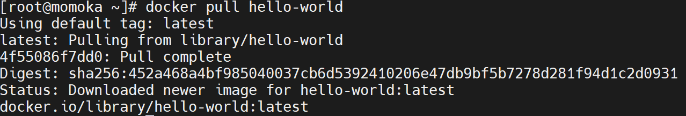

## Docker镜像部署

访问docker hub，寻找我们需要的镜像

docker hub：[点我前往](https://hub.docker.com/)

这里我会使用这个`pikachu`网络安全靶场，作为从零开始部署整个靶场的全流程（包含每一步的详细原理）从而带你认识docker的部署于使用

### 具体的流程图如下

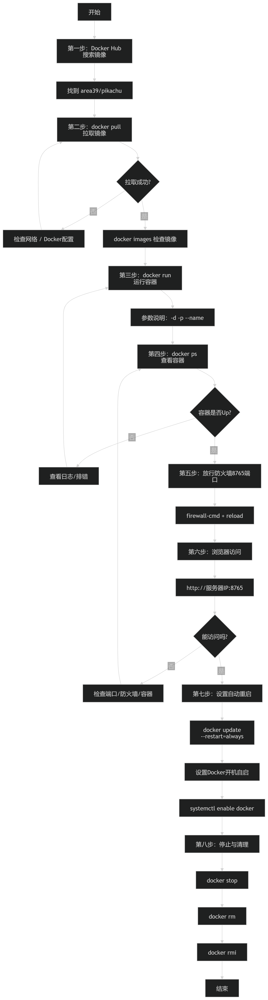

### 第一步：寻宝（Docker Hub 搜索与选择）

这里我找到了我需要的靶场，并且和它对应的部署链接

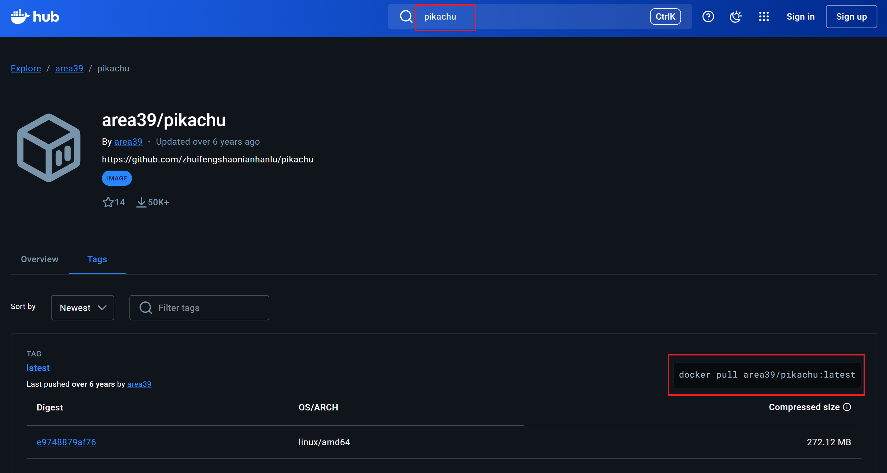

### 第二步：入库（拉取镜像到本地）

输入以下命令，拉取`area39/pikachu`的镜像文件（如果下载失败，请检查之前的环境配置）

```bash
docker pull area39/pikachu:latest
```

- 名词解释：Pull（拉取）：这就是从云端把“零件包”下载到你服务器的仓库里（`/var/lib/docker`）
- 检查动作：下载完后，输入 `docker images`，如果你能看到 `area39/pikachu` 出现在列表里，说明“零件”已经到货了

### 第三步：开工（运行容器）

这是最关键的一步，把静态的“零件”变成动态的“程序”

```bash
docker run -d -p 8765:80 --name my_pikachu area39/pikachu:latest
```

- **`-d`**：后台运行，不占用你的终端窗口。
- **`-p 8765:80`**：把服务器的 **8765** 端口连到容器内部的 **80** 端口。
- **`--name my_pikachu`**：（新知识！）给你的容器起个名字叫 `my_pikachu`，以后管理它（停止或重启）就不用背那串长长的 ID 了

### 第四步：巡查（确认容器状态）

命令运行完会返回一串长字符（容器 ID），但这不代表程序真的跑稳了

输入以下命令，查看当前正在运行的容器：

```bash
docker ps
```

- 名词解释：ps (Process Status)：查看当前正在运行的容器。
- 看什么？：看 STATUS 是不是 `Up ... seconds`（启动中），看 PORTS 是不是 `0.0.0.0:8765->80/tcp`

### 第五步：破壁（放行系统防火墙）

即便 Docker 内部映射好了端口，CentOS 7 自带的 `firewalld` 防火墙默认通常只开启了 22 端口（SSH）。你需要手动推开 **8765** 这扇大门

输入以下命令，永久放行8765端口：

```bash
sudo firewall-cmd --zone=public --add-port=8765/tcp --permanent
```

使用以下命令，重新加载防火墙配置，让刚才的修改立即生效

```bash
sudo firewall-cmd --reload
```

- 名词解释：`firewall-cmd`这是 CentOS 7 的防火墙管理工具
- 名词解释：`--permanent`意思是“永久生效”，如果不加这个，你重启服务器后，这扇门又会被锁上

### 第六步：验收（在浏览器中与它见面）

在你的物理机（比如你的 Windows 电脑）浏览器地址栏输入： `http://服务器IP:8765`

我这里的是192.168.153.128，那就直接输入`http://192.168.153.128:8765`，即可访问

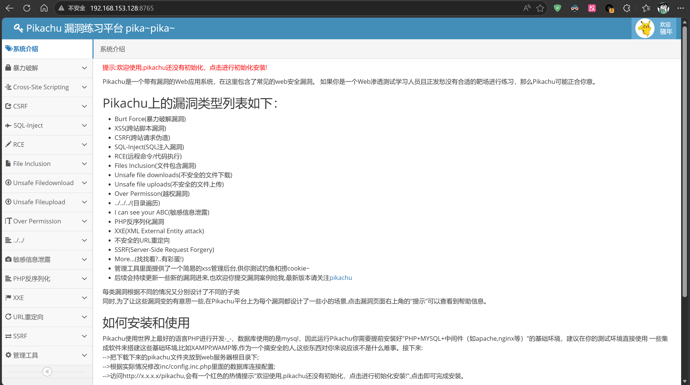

### 第七步：上锁（设置容器“自动复活甲”）

即使容器现在跑得欢，如果虚拟机重启，它默认是不会自己活过来的。我们需要给它补上一粒“后悔药”，让它学会自救

```bash
docker update --restart=always my_pikachu
```

- 名词解释：update：这是 Docker 的“动态修改器”，它允许你在不删除、不停止容器的情况下，直接修改它的运行规则
- 名词解释：--restart=always：这是“自启策略”

  - 它的含义：只要 Docker 服务在运行，无论容器是因为程序崩溃停了，还是因为服务器重启关了，Docker 都会**立刻、无条件**把它重新拉起来

给容器加了“复活甲”还不够，如果你的 CentOS 7 开机时根本没启动 Docker 软件（那个总管），那容器也无从谈起

输入以下命令，让docker服务，开启自启动：

```bash
sudo systemctl enable docker
```

### 第八步：善后（停止与清理）

如果你练习完了，不想让这个容器继续占用资源

输入以下命令，停止容器：

```bash
docker stop my_pikachu
```

删除容器命令（`*注意`：删除后，你在容器里做的改动会消失，但镜像还在）

```bash
docker rm my_pikachu
```

- 名词解释：`stop` 只是让程序“关机”休息，`rm` 则是把这个“组装好的零件”彻底拆散扔掉

如果你以后不打算再玩这个镜像了，需要把它从磁盘上抹掉

```bash
docker rmi my_pikachu
```

- 名词解释：`rmi` 就是 remove image。
- 注意：如果这个镜像还在被某个容器（哪怕是停止的容器）使用，Docker 会报错不允许你删除。必须先执行上面的 `docker rm` 删掉容器，才能删镜像

## Docker 常用命令（超实用清单，建议收藏）

| **动作分类** | **命令部分** | **通俗解释** | **实战案例** |
| --- | --- | --- | --- |
| **环境检查** | `systemctl show --property=Environment docker` | **查水表**：看看 Docker 内部上网有没有挂代理 | 确认是否能顺畅拉取国内外镜像 |
| **入库/下载** | `docker pull [镜像名]` | **下订单**：从云端仓库把零件包拉到本地 | `docker pull area39/pikachu` |
| **给容器取名** | `--name [自定义名称]` | **起绰号**：给你的容器起个名字，方便以后点名 | 在 `run` 命令中加上 `--name my-pikachu` |
| **开工/运行** | `docker run -d -p [端口映射] --name [名] [镜像]` | **组装并开机**：后台运行并分配名字和端口 | `docker run -d -p 8080:80 --name pikachu area39/pikachu` |
| **查看状态** | `docker ps -a` | **点名**：看看有哪些容器在干活，哪些在偷懒 | 检查名为 `pikachu` 的容器是否状态为 `Up` |
| **停止/拆除** | `docker stop/rm [名字/ID]` | **下班/拆迁**：让容器停止或直接销毁 | `docker rm -f pikachu` |
| **清理零件** | `docker rmi [镜像ID]` | **清空仓库**：删掉本地存着的镜像原始包 | 注意：必须先删掉关联容器才能删镜像 |

### 感谢您的访问，本章教程到此结束(\*/ω＼\*)
