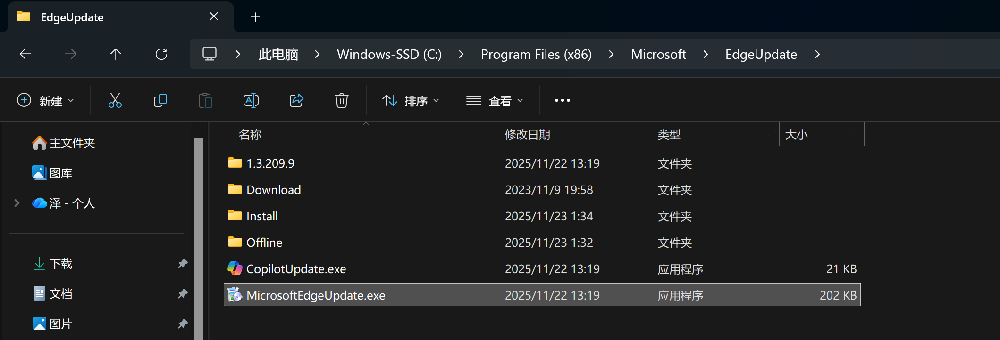
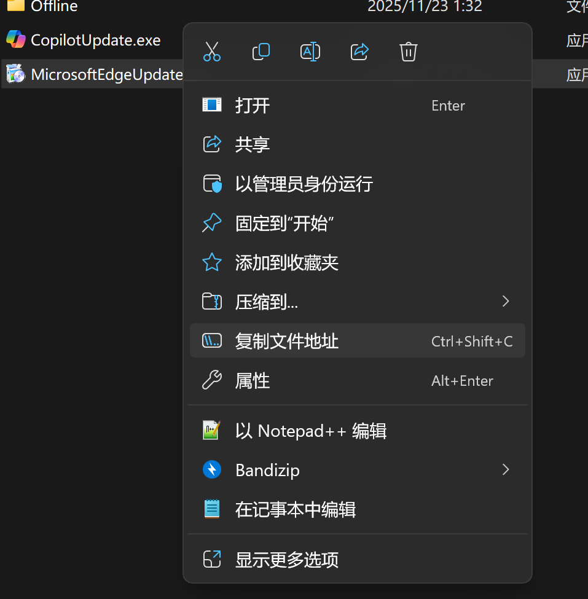
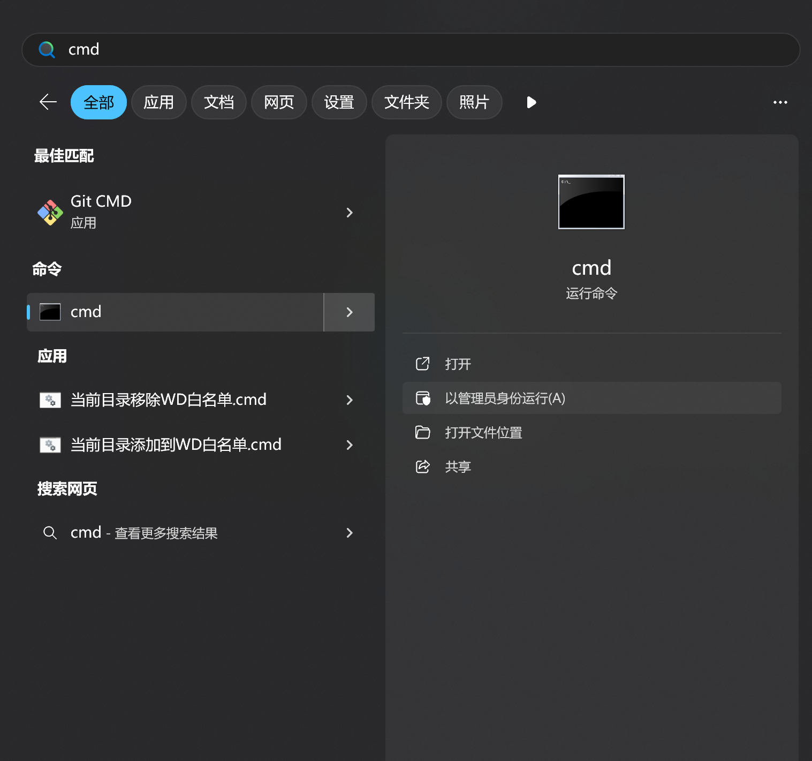
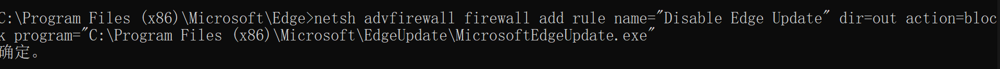
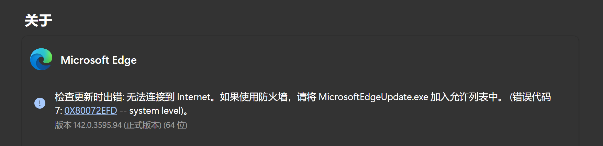
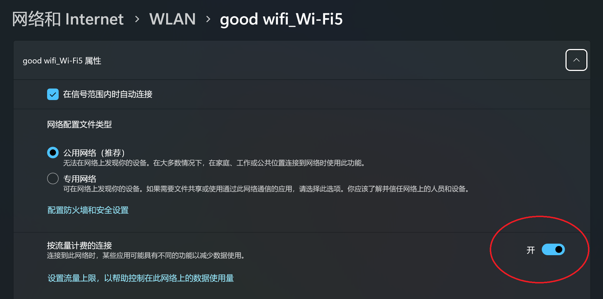
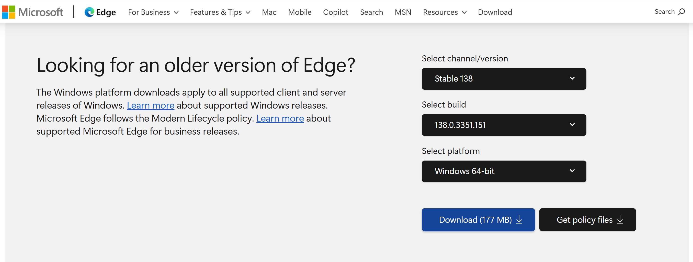
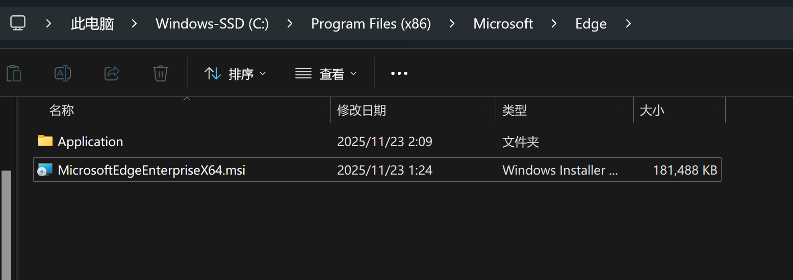
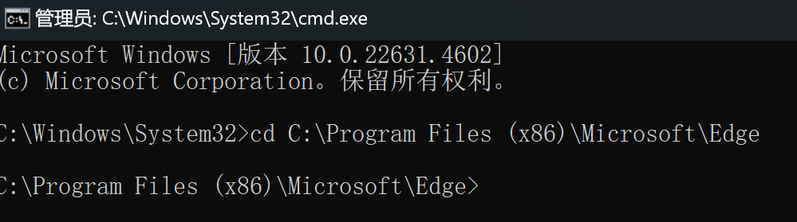
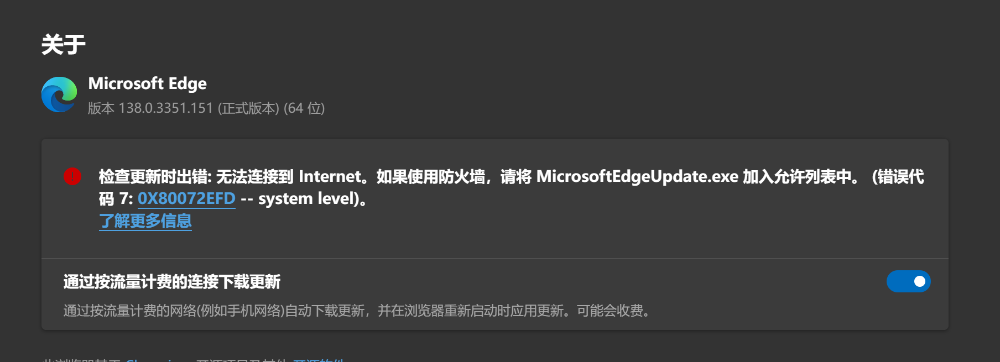

## 以下操作需要确保你当前的系统为win10/win11专业版及以上，否则无效

## 屏蔽Edge更新方法一

使用Windows内置防火墙禁用Edge更新

stp1：打开文件资源管理器，找到默认路径`C:\Program Files (x86)\Microsoft\EdgeUpdate`



stp2：鼠标右击下图的这个文件图标，点击复制文件地址



stp3：按下windows徽标，搜索CMD，**以管理员身份运行**CMD



stp4：复制以下代码，然后点击鼠标右键，粘贴刚刚的复制的路径（cmd中是右击鼠标粘贴）

```batch
netsh advfirewall firewall add rule name="Disable Edge Update" dir=out action=block program= 你的文件路径
#将“你的文件路径“替换成你刚才复制的内容
```

然后再按下回车，成功后终端会显示“成功”字样



打开Edge，可以看到成功将Edge禁止联网更新了



如果第一个不行，就试试以下的这个方法二（如果你担心后面还会悄咪咪的更新，那也可以跟着下面接着做）

想要直接降级的，可跳过方法二，看后面的安装部分

## 屏蔽Edge更新方法二

`*注`：以下的操作可能会影响到其他的应用，还请注意

stp1：打开设置→网络和Internet→属性（good wifi是我的wifi名称，每个人的不一样）→按流量计费，打开这个



stp2：打开Edge，设置→关于Edge→通过流量计费，打开这个开关


至此，你已经成功屏蔽Edge更新

stp1：下载官方的Edge安装包：[点我跳转](https://www.microsoft.com/en-gb/edge/business/download?form=MA13H4)



**下载后不要双击安装，请按照以下来操作**

stp2：复制你自己的下载的文件路径（你的位置肯能和我的不一样，那是因为我是自行移动了文件位置，如下如所示）



stp2：依旧以**管理员身份运行**CMD（如果你上一个窗口没关，可以继续操作）

stp3：使用以下的命令，进入下载的安装包的目录

```bash
cd 你的文件目录

#例如，我的是C:\Program Files (x86)\Microsoft\Edge
#那就cd C:\Program Files (x86)\Microsoft\Edge
```



stp4：输入以下的代码

```bash
msiexec /I MicrosoftEdgeEnterpriseX64.msi ALLOWDOWNGRADE=1
```

安装完毕后，可以看到，你的Edge已经成功降级了



The END

感谢您的阅读，下一篇再见（￣︶￣）↗
