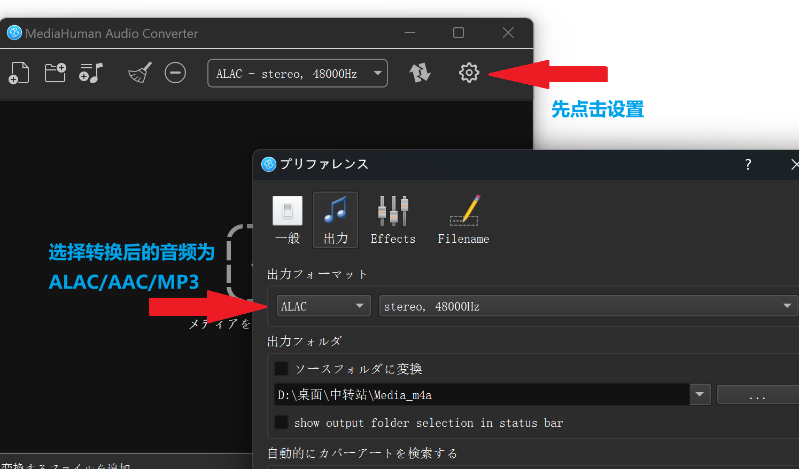
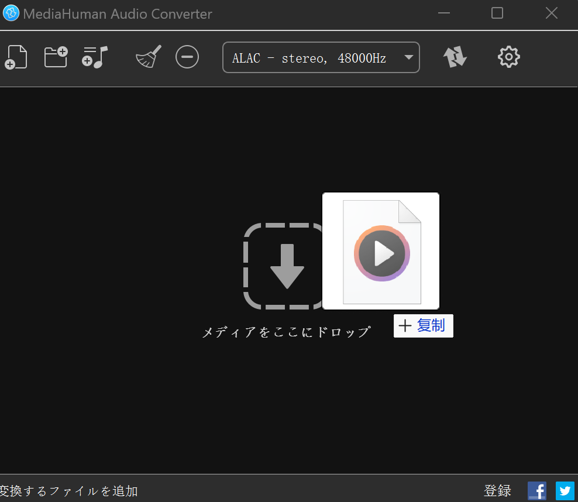
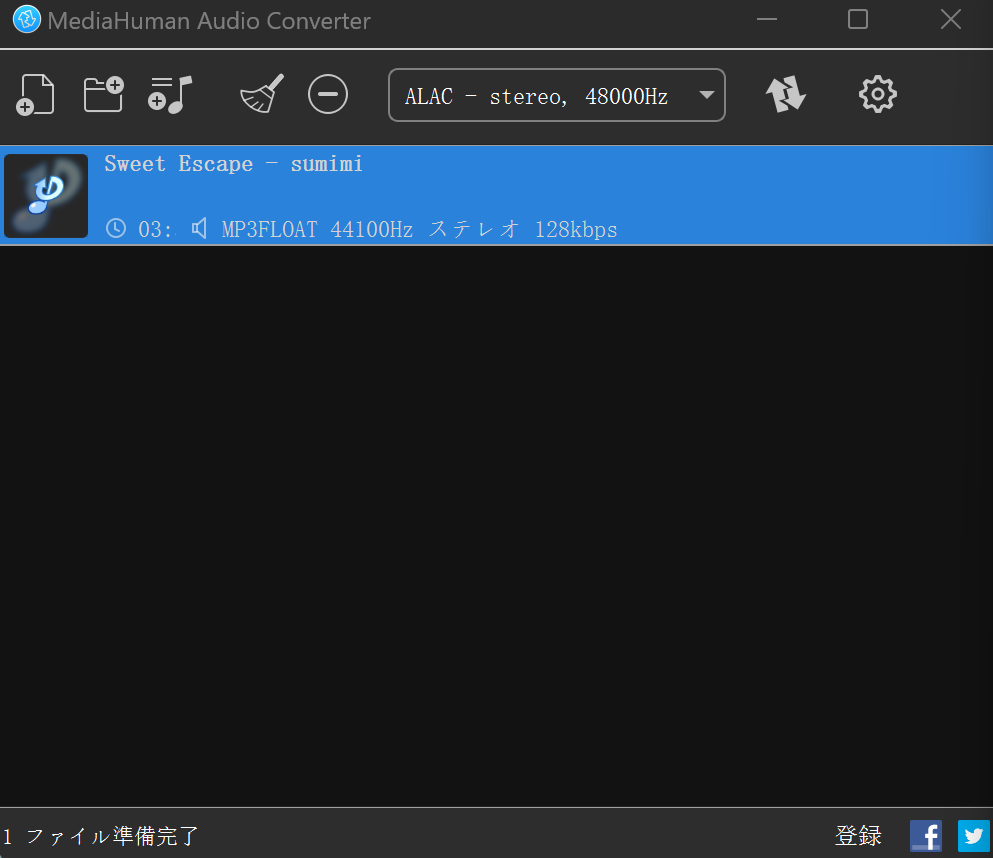
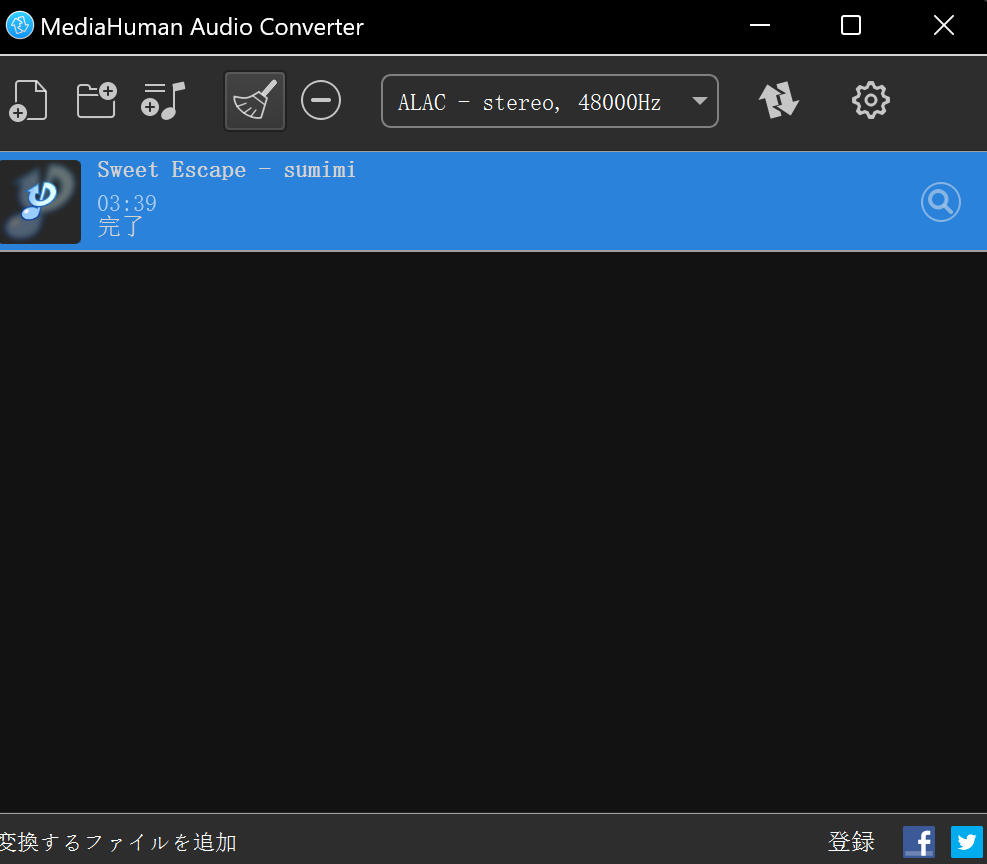
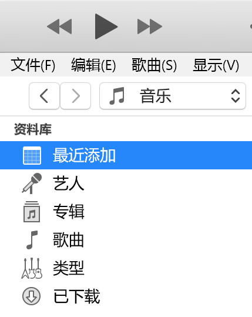
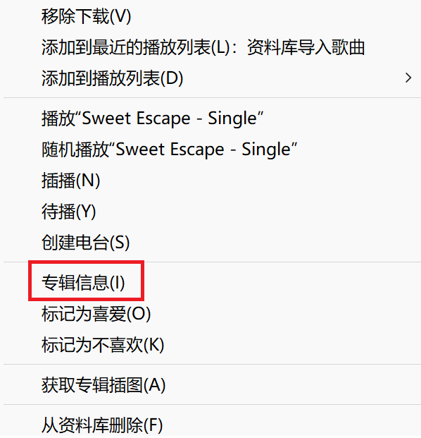

## 1.下载音频格式转换工具

- 下载 MHAudioConverter 音频工具：[点我下载](https://wwve.lanzn.com/b014wvf02h)
- 密码：6npq

## 2.应用推荐设置如图（注意文件保存路径）

### （因此软件不支持中文显示，我这里换成类似的日文做演示）

## 3.拖入待转换音频文件

拖入文件后，会如下图所示

## 4.双击待转换的音频文件

可以看到完成了格式转换，点击右侧的放大镜，就可打开文件位置

## 5.打开iTuns

点击“最近添加”，将文件拖入

即可看到有一个新的“未知专辑”

之后的歌曲信息等内容自己按需填写就行（歌词导入也是同理，只不过没有滚动效果）

打开手机上的Apple Music也可以看到，成功同步

> 写在最后：
>
> 建议单独创一个播放列表，将所有导入的音乐备份一份到这个列表中
>
> 我的个人建议是：导入的音乐都下载下来，有时候这个Apple Music服务器，会经常抽风，从而导致自己上传的歌听不了
>
> 所以保存一份在本地是一个不错的选择

The end

下一篇见 ^o^
