## 下载Ubuntu

打开Ubuntu官网，找到24.04.4 LTS，点击下载（这里为了便于操作，我们下载的是带有桌面环境的版本）

Ubuntu官网：[点我直达](https://ubuntu.com/download/desktop)

## 安装Ubuntu

- **安装过程我们保持全程不联网安装，后续安装好系统，换完国内源之后再联网**
- **如果我在这里没有提到的步骤，那么默认选择默认的选项，不需要改动**
- **我这里为了方便截图所以使用虚拟机展示，实体机安装也是同理，只不过多了一步制作启动盘的步骤而已，其他都是一样的**

步骤一：选择Try or install Ubuntu，回车

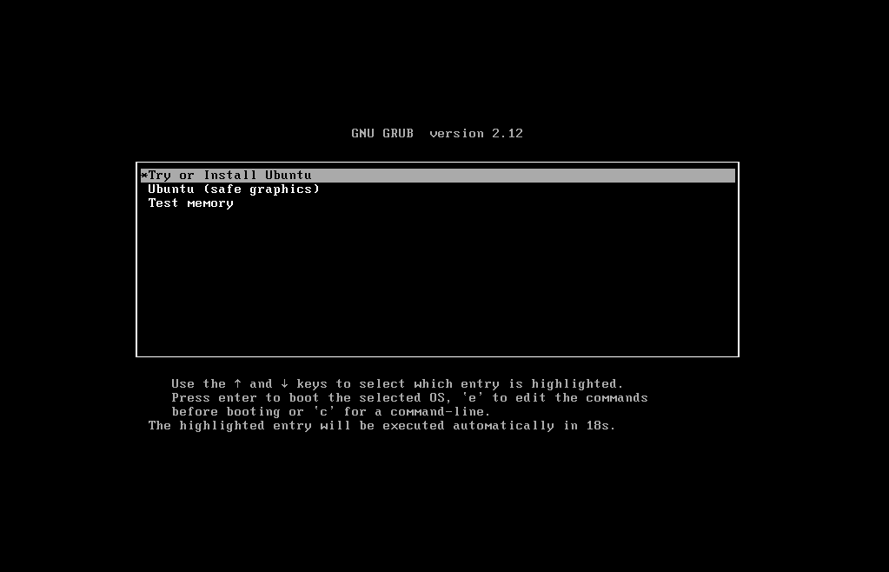

步骤二：选择安装语言，为了避免后续切换以及不必要的麻烦，这里强烈建议选择English，待之后我们在换回中文

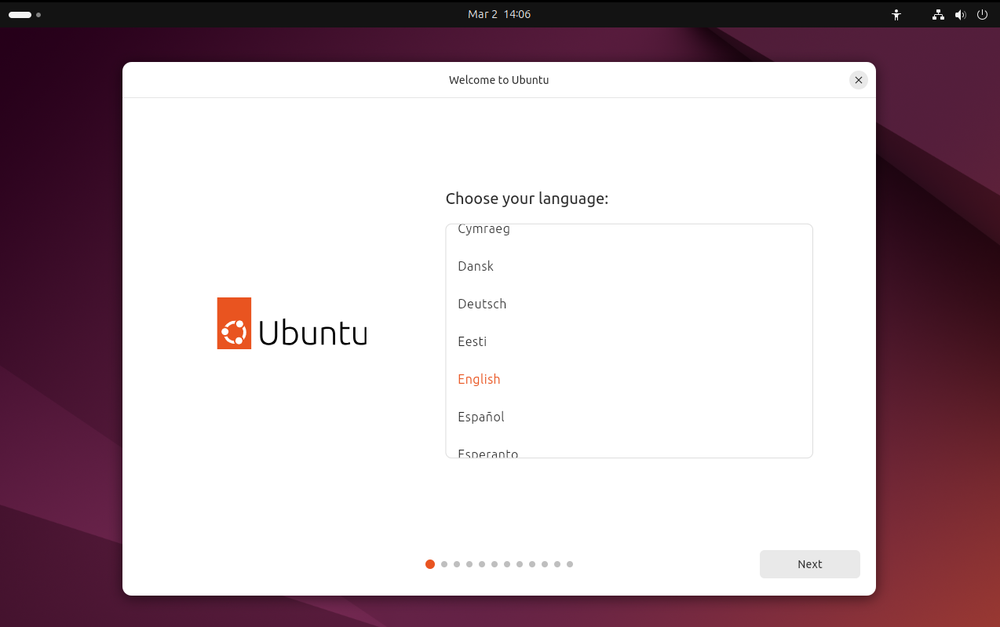

接下来的选择键盘布局的部分也是选择English（US）

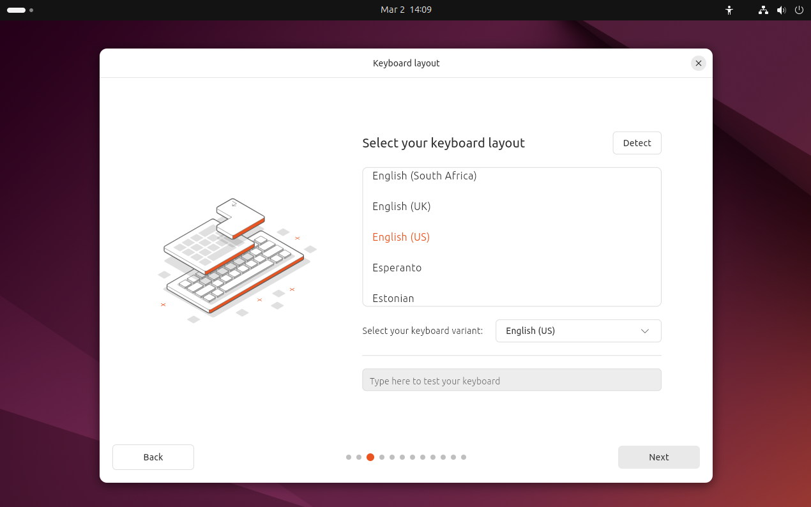

\*注意：这里网络选择这一块，我们选择无网络安装

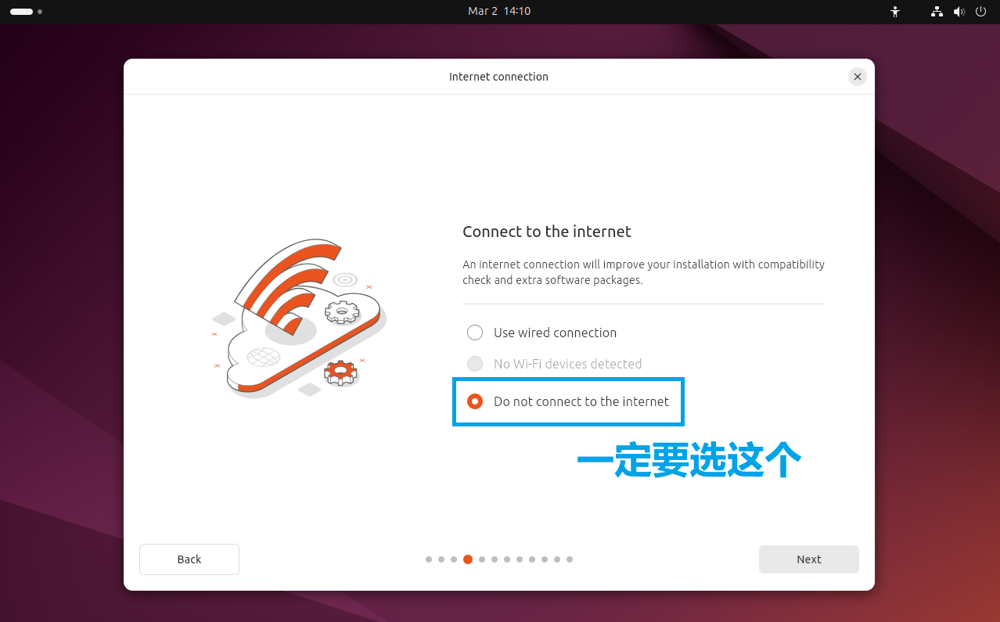

如果在这一步联网，无论是WIFI还是网线，只要是国内的网络环境，都会导致后续的下载部分因为没提前换国内的源，一直下载系统文件的时候卡死

步骤三：接下来的选择Install Ubuntu，而不是Try Ubuntu

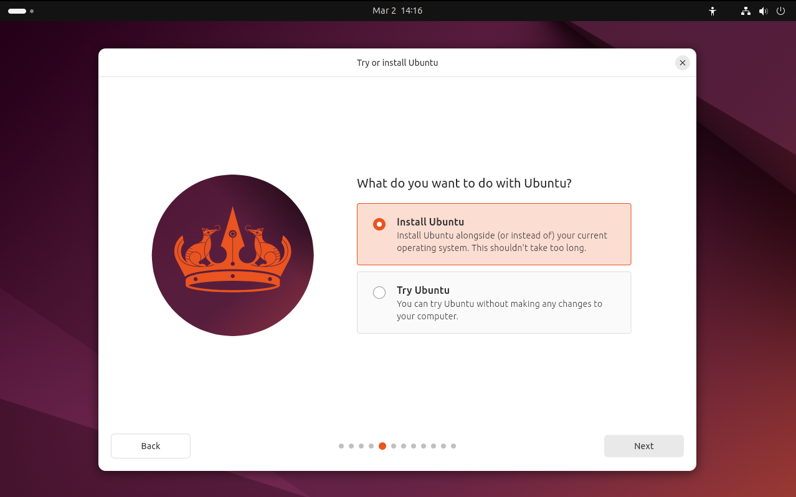

这一步的时候，只选择第一个（通常来说，如果前期没有网络，那么这个第二个选项因该是灰色）如果你的第二个可以选择，那么说明你的电脑大概率是插着网线的，需要点击右上角的那个网线图标，关掉网线连接

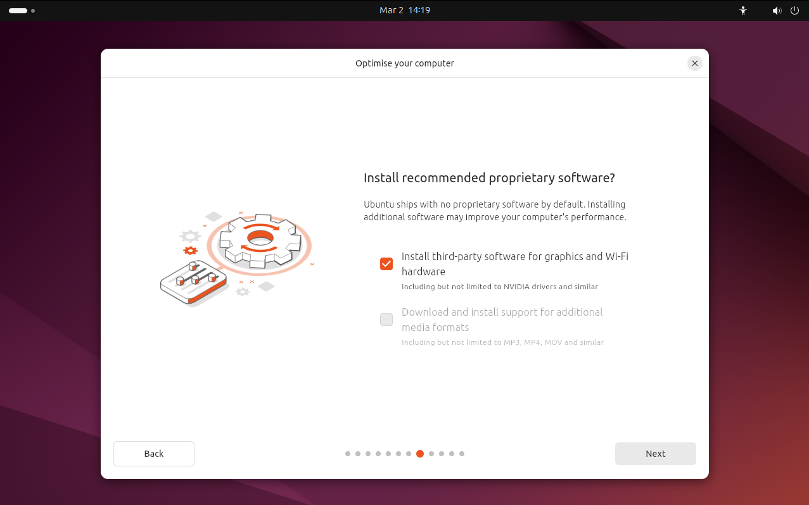

在这之后，下一个选项时，根据你自己的实际情况来选择（我这里安装一整块硬盘，所以我选择第一个）

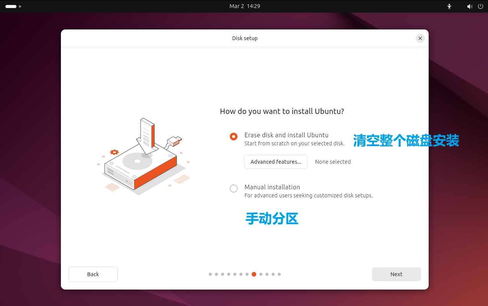

步骤四：接下来就是创建用户（自己记得住就行）

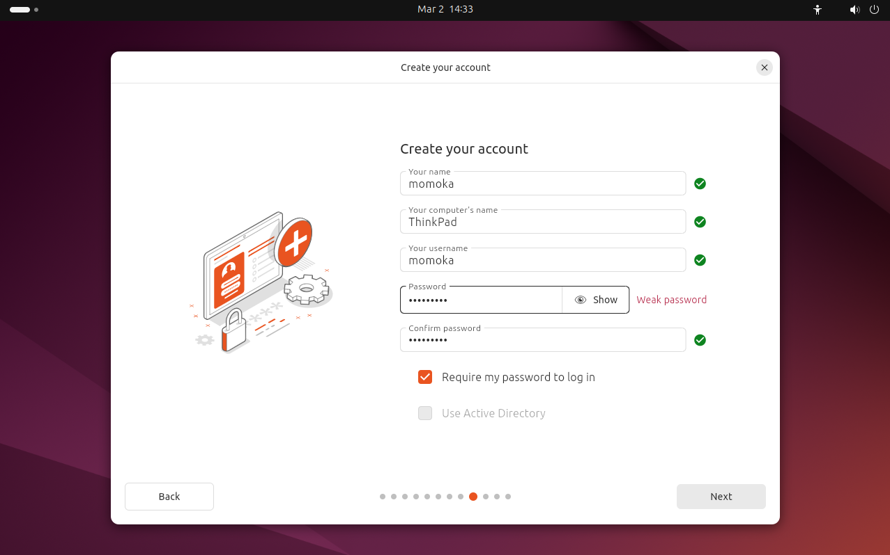

步骤五：时区选择上海

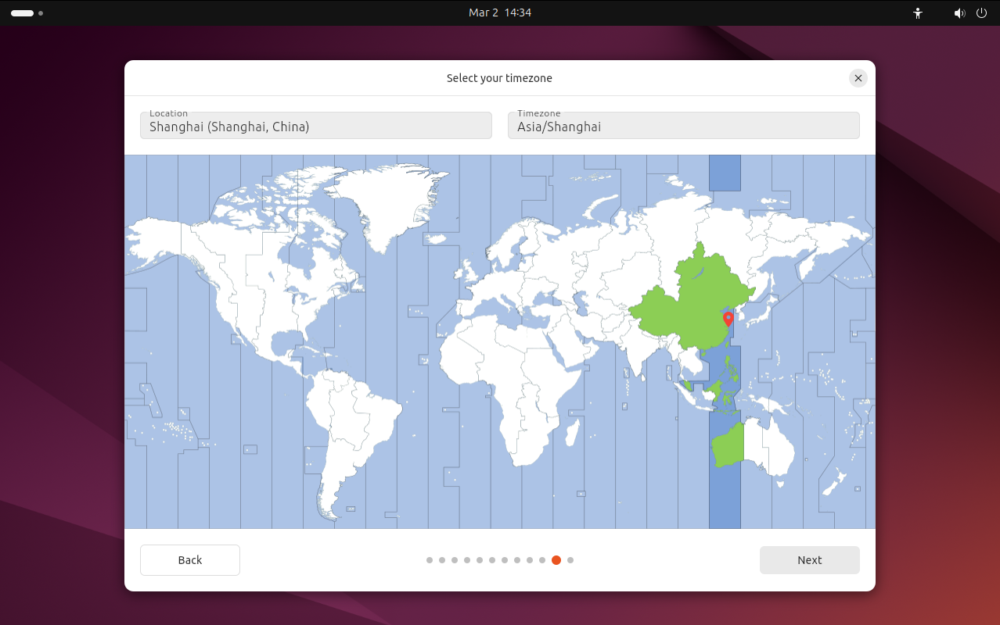

步骤六：最后再次确认一下自己的配置，点击Install（由于我这里时虚拟机进行示范的，所以就直接点击install了）

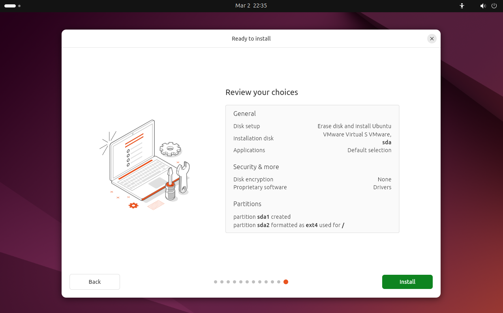

再然后的话，点击Restart，重启即可

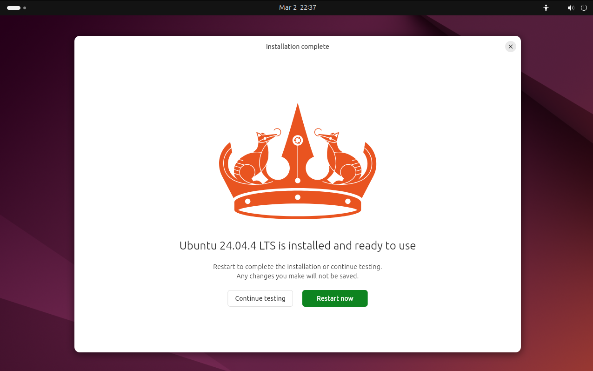

至此，整个安装过程就结束了（实体机安装的朋友，记得等重启之后在进行拔掉启动U盘的操作）

## 换国内源（这里我推荐aliyun的源，速度快，其他的也是同理）

安装好系统之后就可以联网了，在自带的FireFox浏览器里打开我的网站的网址，跟着教程复制命令即可

点击桌面，右击鼠标，选择“在此处打开终端”

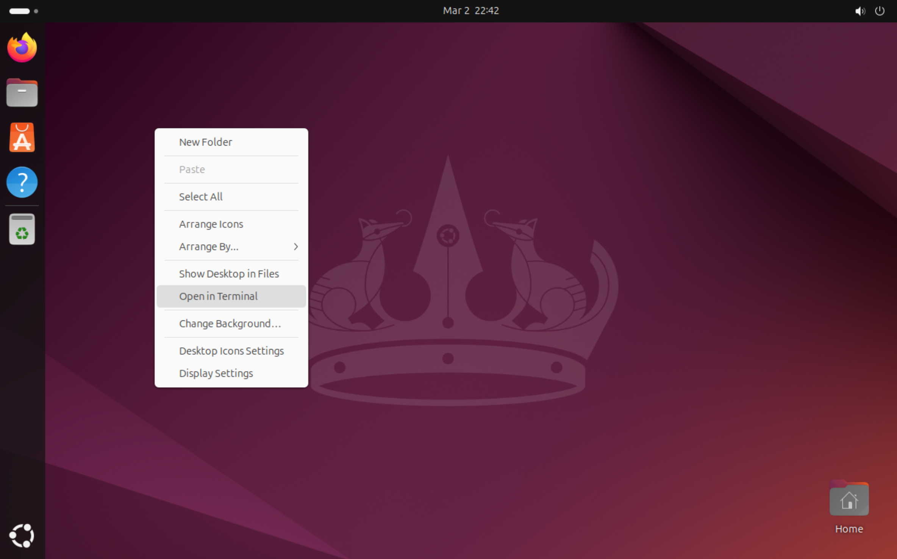

`*Tips`：Linux系统里的粘贴不同于windows，可以选择Ctrl+Shift+V或者右击选择“Paste”粘贴（复制是Ctrl+Shift+C，不是Ctrl+C）当然，这个加Shift的逻辑也只适用于终端界面，而非全部（在浏览器或者其他地方复制/粘贴的时候，依然是Ctrl+C/V）

1.备份原文件（必做，防出错）

```bash
sudo cp /etc/apt/sources.list.d/ubuntu.sources /etc/apt/sources.list.d/ubuntu.sources.bak
```

2.编辑源文件

```bash
sudo nano /etc/apt/sources.list.d/ubuntu.sources
```

3. 替换成阿里云源（光标移动至最后一行，开始依次删除，直至清空，并粘贴下面内容）

```bash
Types: deb
URIs: https://mirrors.aliyun.com/ubuntu/
Suites: noble noble-updates noble-backports
Components: main restricted universe multiverse
Signed-By: /usr/share/keyrings/ubuntu-archive-keyring.gpg

Types: deb
URIs: https://mirrors.aliyun.com/ubuntu/
Suites: noble-security
Components: main restricted universe multiverse
Signed-By: /usr/share/keyrings/ubuntu-archive-keyring.gpg
```

4.依次按下键盘的Ctrl+O（保存），回车（确定文件名），Ctrl+X（退出）

5.保存关闭，刷新源

```bash
sudo apt update
```

如果不出意外，的现在输入完上面的指令，因该会跑一小会时间的代码，而不是卡住

按下键盘的“上键“，再次重复输入这条sudo apt update，和我这个一样就对了

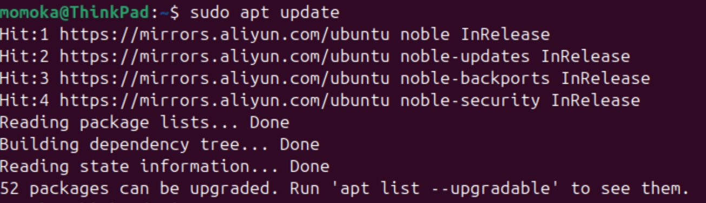

6.升级这些包

```bash
sudo apt upgrade
```

一路按下回车，或者按提示输入Y即可

## 更换语言

按下左下角的Ubuntu徽标，打开设置（如果有弹窗更新的选项，就点击Install即可）

选择最底下的System选项，并按照图片步骤操作

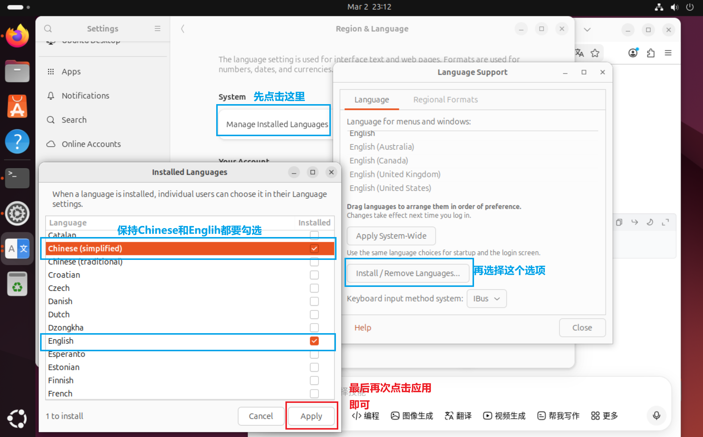

再次将这个界面的”中文“选项，拖拽到第一个，并点击”Apply System-Wide“

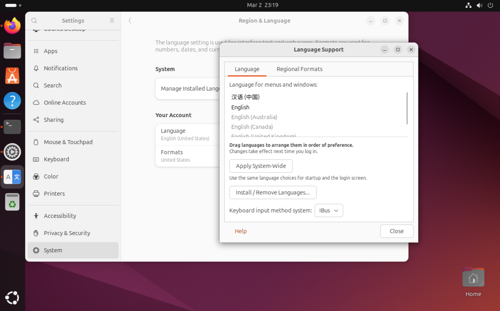

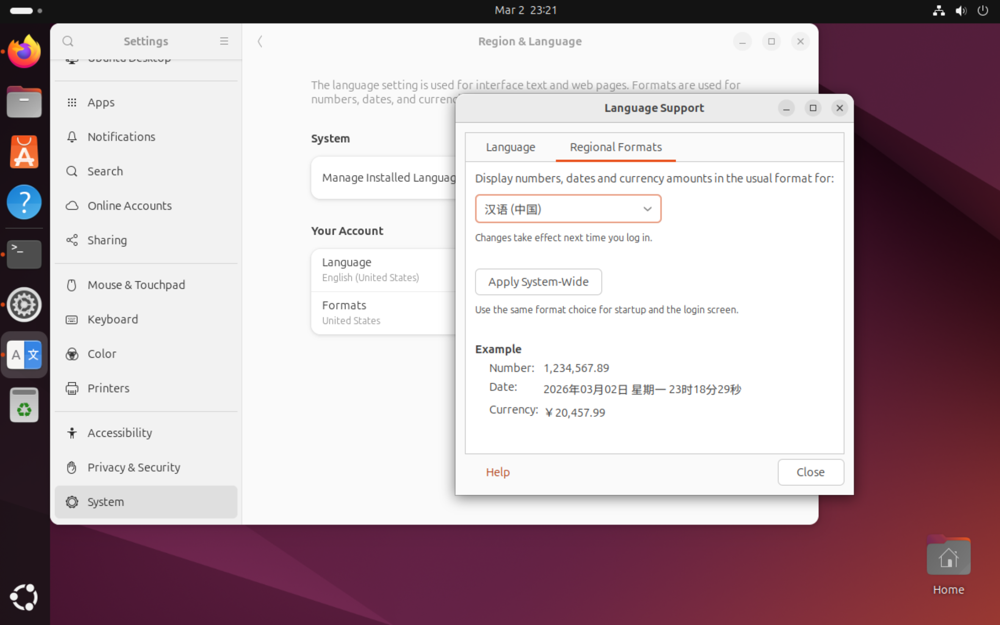

旁边的选项也可以选择一下，记得都点击Apply System-Wide

在之后把下面的Formats改成”中文“，之后会弹出一个”Log out“的选项，选择退出重新登陆即可

`*注意：`重新登陆完成之后会出现这个弹窗，千万要点击保留旧的名称（之前不选择改中文的原因也就在这）

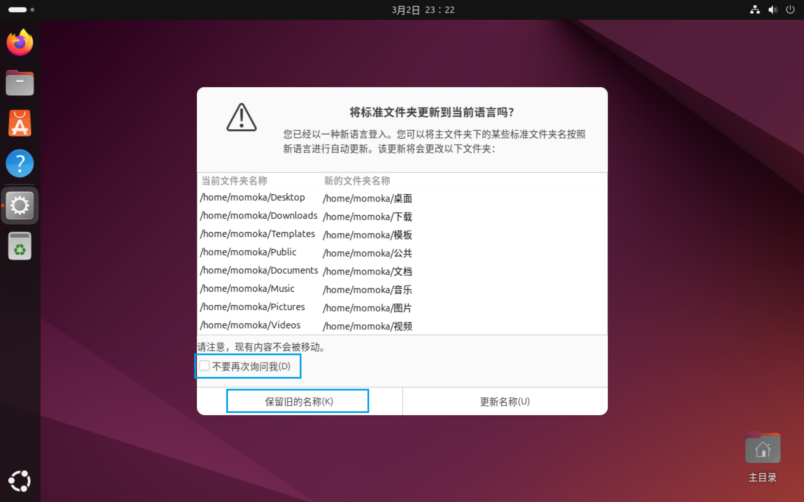

## 使用中文的输入法

1：安装雾凇拼音（IBus 版）

```bash
sudo apt install ibus-rime -y
```

这里 ibus-rime 就是雾凇拼音的官方包，安装完成后需要重启 IBus 框架

2：重启 IBus 框架（让雾凇拼音生效）

```bash
ibus restart
```

执行后，桌面右上角的输入法图标（通常是键盘或英文图标）会闪烁一下，代表重启完成

3.打开设置，键盘，输入源，选择汉语

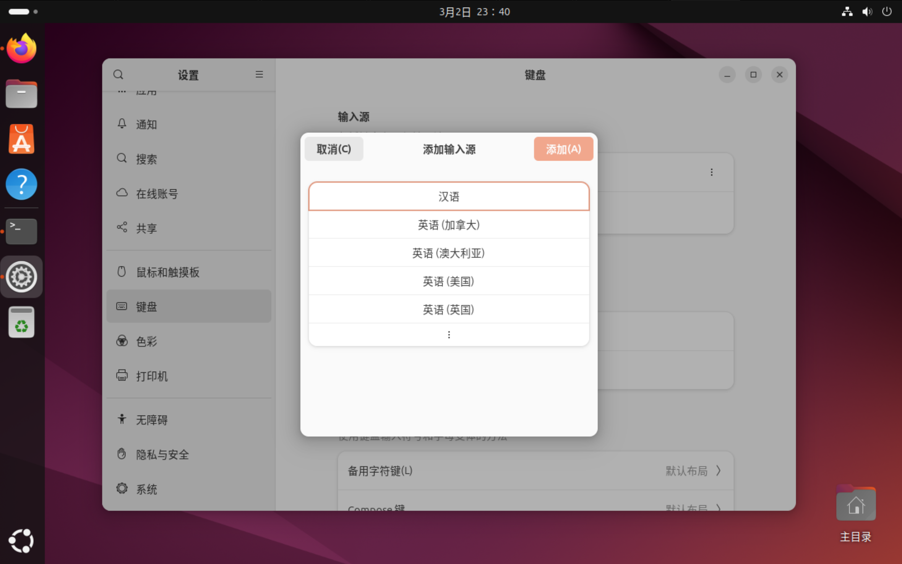

选择中文（智能拼音），添加

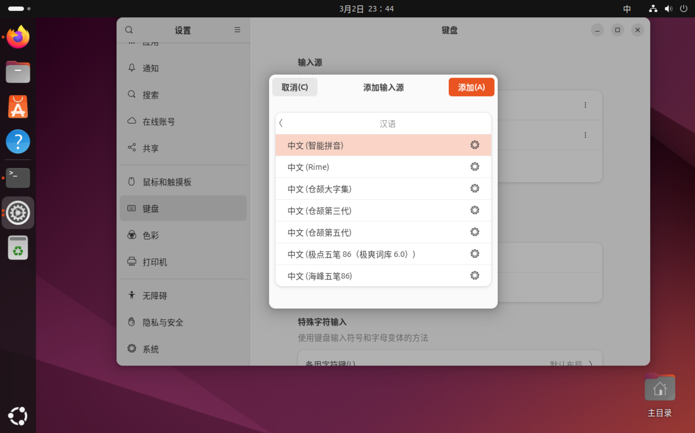

添加后点击3个点，打开首选项

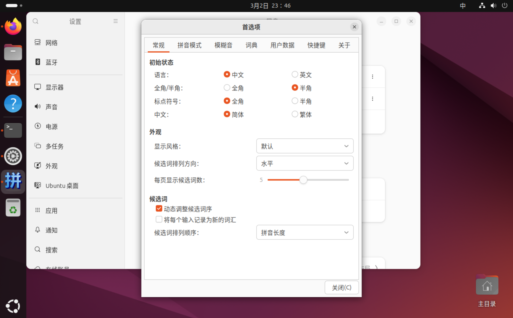

可根据自己的喜好来调整即可

## 安装一些好用的软件

## 1.Fish

Q：Fish是什么

A：比 Ubuntu 默认终端（bash）更好用、更智能的升级版终端

可以按下”Tab按键“补全命令的终端，强烈建议新手安装，超好用

### 先搞懂核心概念

- **bash**：Ubuntu 默认的终端解释器（就像手机默认输入法），功能够用但偏老旧，新手用起来容易踩坑。
- **fish**：全称 `Friendly Interactive Shell`（友好的交互式 Shell），是专门为提升终端使用体验设计的替代品，核心优势就是「易用、智能、直观」

安装命令

```bash
sudo apt install fish -y
```

安装完成后在终端里输入fish即可启动

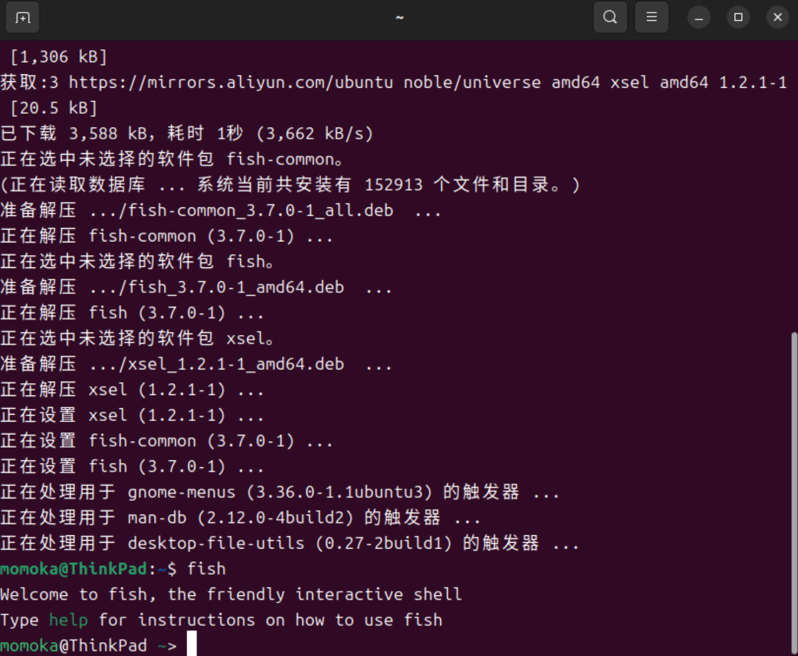

设置为默认终端（以后打开终端不用输入fish，自动就是）

```bash
chsh -s /usr/bin/fish
```

## **2.Fastfetch + lolcat（好玩的小软件，展示系统配置小工具）**

Fastfetch：展示系统配置的软件（通常用这个）

lolcat：使得这个软件的结果输出时候为彩色界面（与Fastfetch搭配使用效果更佳哦！）

`*注意：`Ubuntu 24.04 默认源里没有 fastfetch，所以直接 apt install 会提示 “无法定位”。我们需要先添加官方 PPA 源，再安装

步骤一：添加 fastfetch 官方 PPA

```bash
sudo add-apt-repository ppa:zhangsongcui3371/fastfetch
```

提示时按 **Enter** 确认添加

步骤二：更新软件源列表

```bash
sudo apt update
```

步骤三：安装 fastfetch

```bash
sudo apt install fastfetch -y
```

步骤四：安装lolcat

```bash
sudo apt install lolcat -y
```

使用fastfetch搭配lolcat产生的炫酷效果

输入以下命令打开fastfetch的炫酷界面

```bash
fastfetch | lolcat
```

成果展示！！（锵锵！🎉🎉🎉）

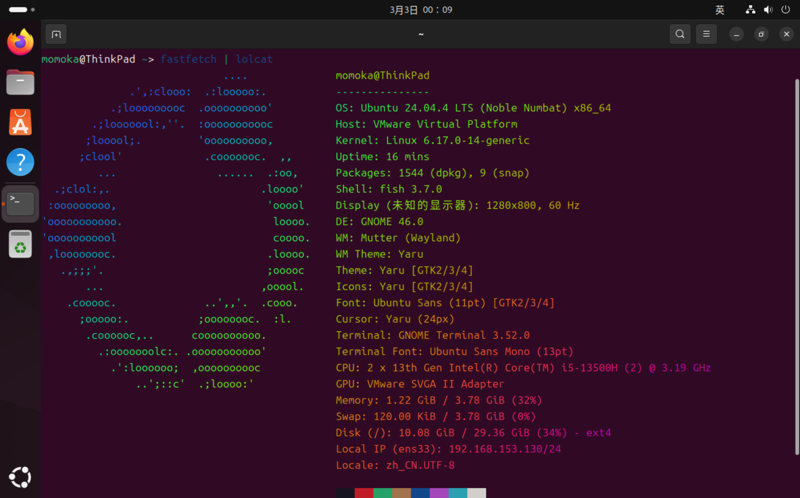

这里我时虚拟机操作的哈，所以才这样

不过至此，你已经成功安装Ubuntu系统，并且完成了基础的配置

下一期我来给大家介绍如何美化这个Ubuntu系统
