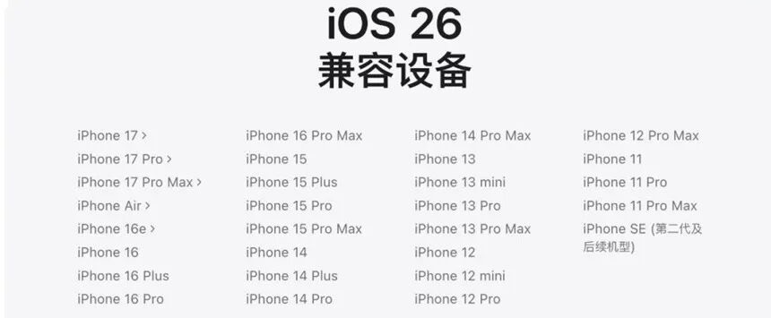
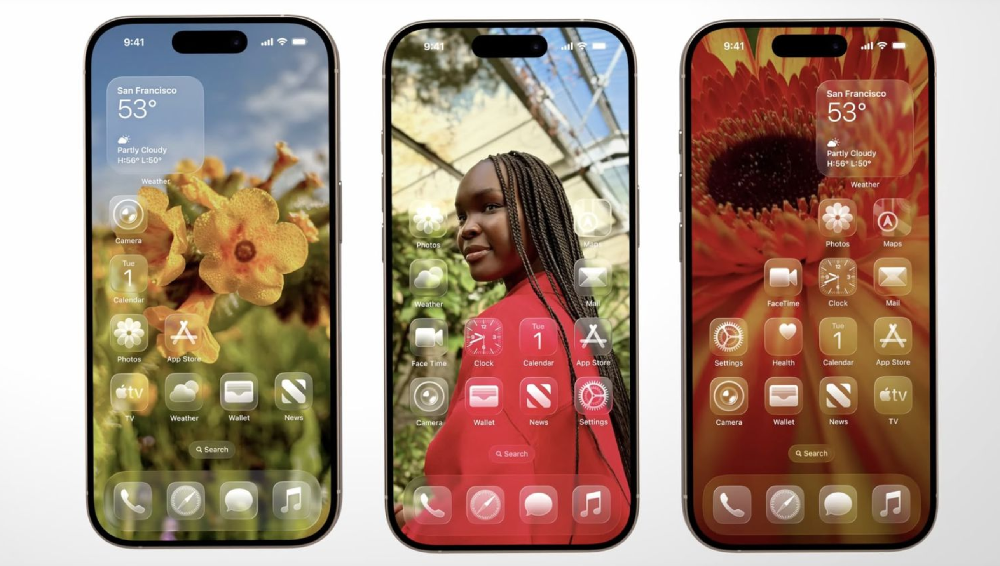
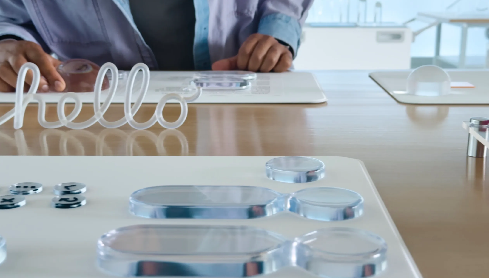
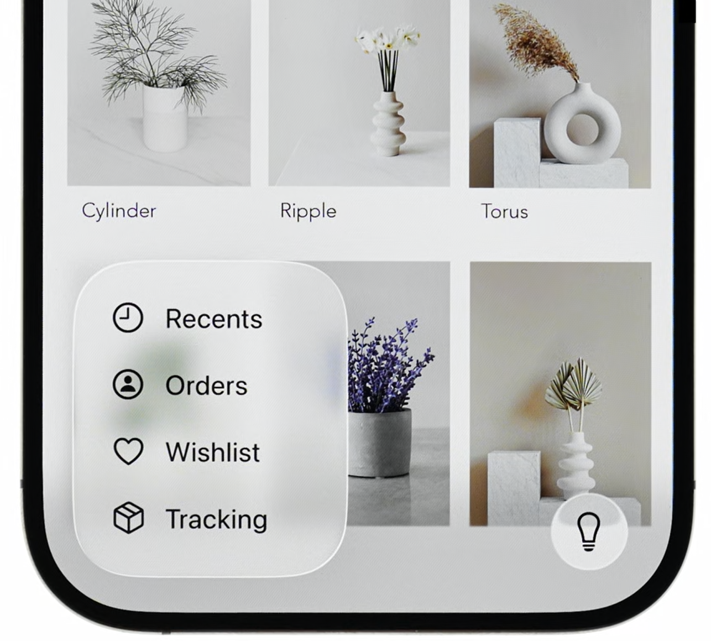
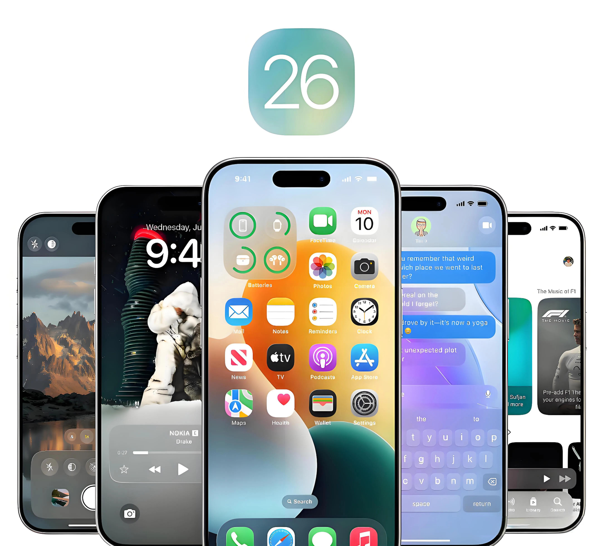

在 2025 年9月16日，苹果正式推送了**[iOS 26](https://www.apple.com.cn/os/ios/)**（原定为iOS 19，只可惜苹果公司不喜欢19这个数字）这一次大版本系统更新，可以说是Apple近年来变化幅度最大的一次系统更新，相比以往只在细节上修修补补，这次的 iOS 26 从视觉设计到功能体验都做了大刀阔斧的调整，也有人说iOS更偏向于安卓化了

**首先是本次支持的设备列表（如下图）**

## **先说重点！！！**

## 诶？新系统？我的设备是否值得升级？

> 以下内容为人个观点，仅供参考

我个人认为：**旧系统养老YYDS**

- 我建议是**iPhone15系列及以前**的用户谨慎选择要不要升级（这些设备通常出厂是iOS 17或之前的系统，当下节点，iOS 18或者17都适合养老，完全没必要为了那3分钟的热度换来日后糟糕的使用体验）
- iPhone16系列的用户可以决定出厂的iOS 18是否合胃口，来选择是否升级iOS 26（我个人觉得没啥必要，[Apple intelligence](https://www.apple.com.cn/newsroom/2024/06/introducing-apple-intelligence-for-iphone-ipad-and-mac/)在iOS 18也能用，没太大必要去升级。对于长久使用的iPhone来说，旧系统养老才是最舒服的）虽然现在对于国行iPhone来说，Apple intelligence完全就是cook画的”大饼“
- 倘若你用的是**iPhone 11~14 这几代，甚至些更老设备**，再加上你日常大量使用，我建议谨慎升级。保持现在的系统，往往是较为省心的选择（众所周知，由于iPhone操作系统降级困难的原因，所以二手市场普遍iPhone老系统比较保值）

换句话说：**新机升新系统，老机守原厂**，这是最符合用户体验的做法

## 那么接下来说说iOS 26更新之后的好处和亮点

## 升级的最大亮点：Liquid Glass（液态玻璃）

如果要说 iOS 26 最直观、也是最令人印象深刻的升级，那毫无疑问就是引入了 **[Liquid Glass（液态玻璃）](https://developer.apple.com/cn/videos/play/wwdc2025/219/)** 设计语言

这一设计让系统界面有了类似“半透明玻璃+光影折射”的质感

图标、菜单、通知栏、控制中心等界面元素仿佛漂浮在一层玻璃之下，随着光影和背景的变化而呈现出不同的通透感  
举几个直观的例子：

- **控制中心**：展开时不再是单一的灰色或白色背景，而是带有透明度的“雾面玻璃”，背景应用的色彩和亮度会隐隐透出
- **主屏图标**：在 Liquid Glass 的衬托下更立体，配合动态光影有了空间感
- **锁屏界面**：支持 3D 透视和动态背景，手机轻轻移动时，壁纸和控件有微妙的景深效果，仿佛能看见层叠的空间

这种变化带来的好处是：**视觉层次更丰富，交互更有沉浸感**

你会感觉手机不再是一个平面的界面，而像是透过一块晶莹剔透的玻璃在操作

当然，也有用户反馈说透明度和光影过多会影响文字可读性，特别是在强对比壁纸或阳光直射下，毕竟这种设计的前卫感是 iOS 26 的“招牌”（doge

## 其他功能与体验升级

除了 Liquid Glass，iOS 26 还有一些相比于iOS 18值得一提的细微改动：

1. **相机界面简化**  
   主界面保留最常用的拍照、录像，其他模式被收纳到二级菜单中，界面更直观，更加突出类似于玻璃的质感（部分新机型还会在镜头被遮挡或脏污时给出提示）
2. **文件与截图的智能化**  
   截图后可以更快地标注、转换 PDF；文件预览和分享更加智能，减少了额外操作
3. **AI 辅助与翻译**  
   在电话、信息里加入了更强的实时翻译和推荐功能，对跨语言用户很友好（目前国行iPhone由于没有接入正式的Apple intelligence，所以此功能还没有）
4. **生态一致性**  
   iPadOS 26 也用上了 Liquid Glass，这让 iPhone，iPad 乃至Apple watch和Mac的视觉体验更接近，跨设备的操作更统一

## 升级的缺点与风险

当然，新版本不可能只有惊喜，还有惊吓（doge

- **过时产品**：部分 iPhone 老机型（例如苹果官方给出的定义是iPhone Xs系列及以前的设备，在苹果看来都算“[过时产品](https://support.apple.com/zh-cn/102772#iphonevintage)”）
- **老设备卡顿与耗电：**还有戏能升级的老设备（iPhone SE 2020 ~ iPhone14系列）升级后出现发热、续航缩短甚至小卡顿。尤其在透明度、动态效果全开的情况下更明显（高情商：节省性能开销，低情商：阉割动画）
- **兼容性问题**：一些第三方应用尚未完全适配 iOS 26，可能会出现小 bug 或界面异常（说实话，我觉得今天Apple推出iOS 26正式版，目的就是为了给即将上市的iPhone 17系列最后的一次试水）
- **支持机型减少**：从A13芯片之前的iPhone机型（部分搭载A12X/Z型号的芯片的iPad除外）已被排除在支持名单之外

话又说回来，本次的iOS 26不可否认的是，确实是苹果多年来最大的一次系统革新。Liquid Glass 带来了前所未有的视觉体验，让手机仿佛变成了一块流动的玻璃。但与此同时，性能压力、适配问题和老设备体验下降，也是绕不开的现实

**最终要不要升级，还是要结合设备情况和个人需求来决定**

\*以上内容是我个人的观点，仅供参考。倘若与您的认知有任何出处，一切以您的为准

那行吧！就先这样吧！拜拜！！
