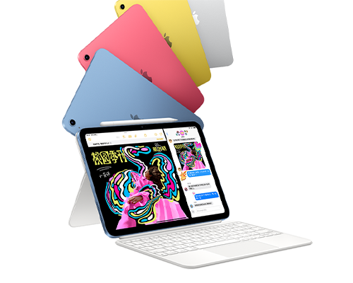
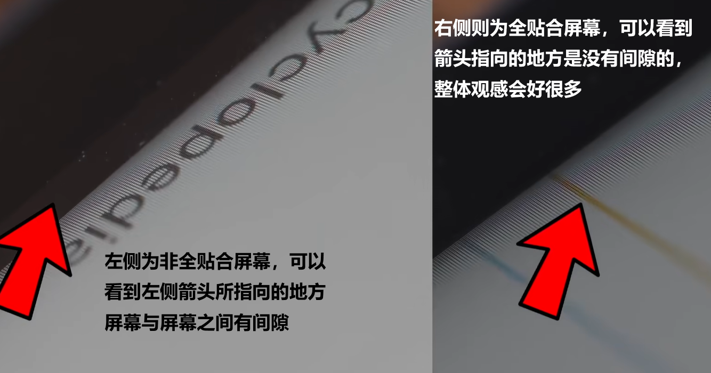
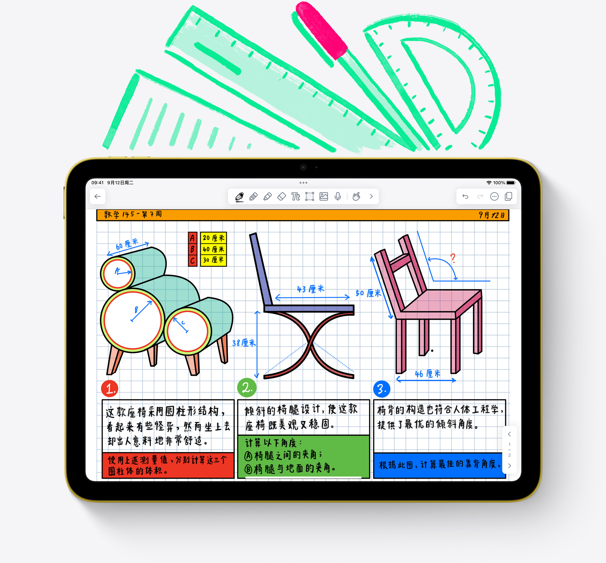
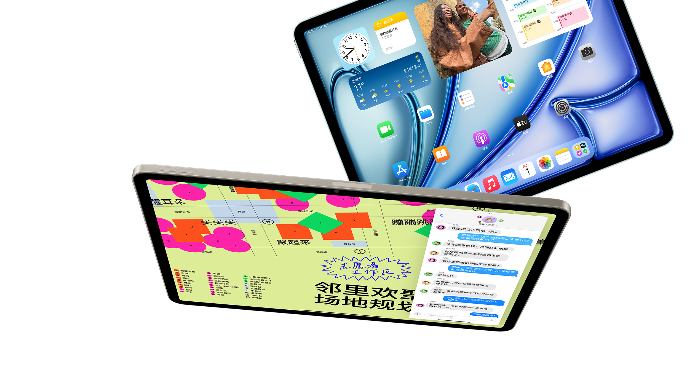
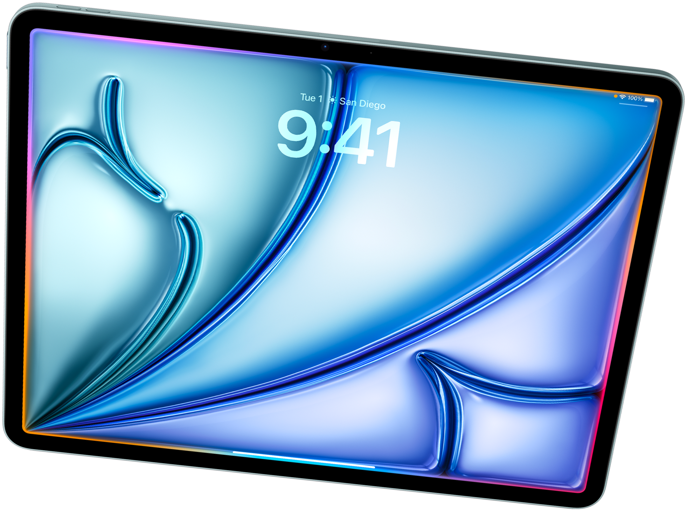
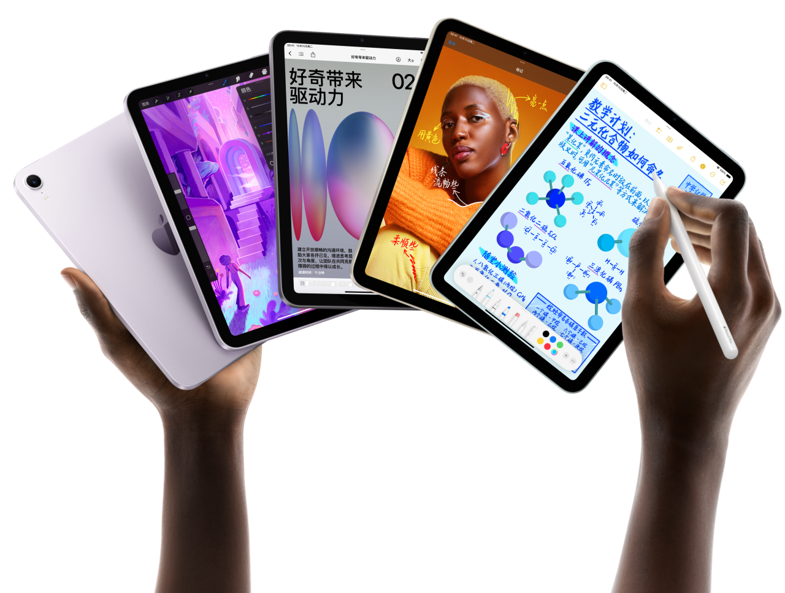
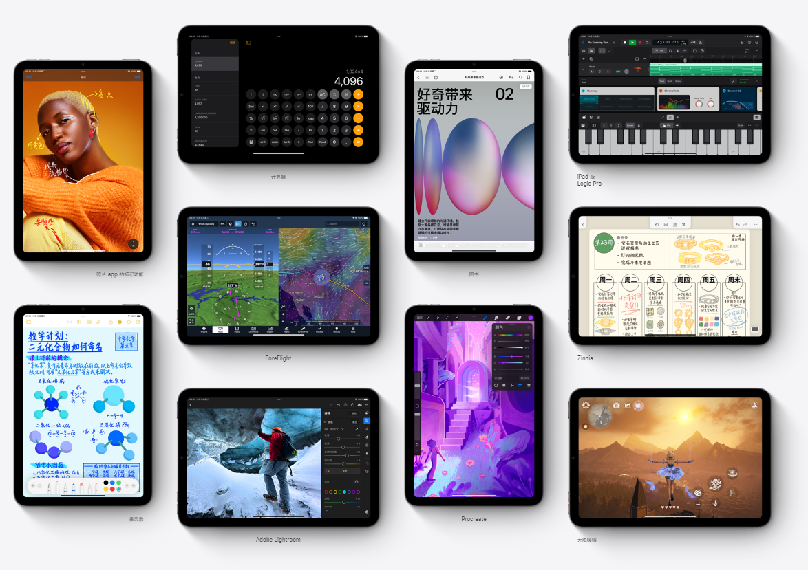
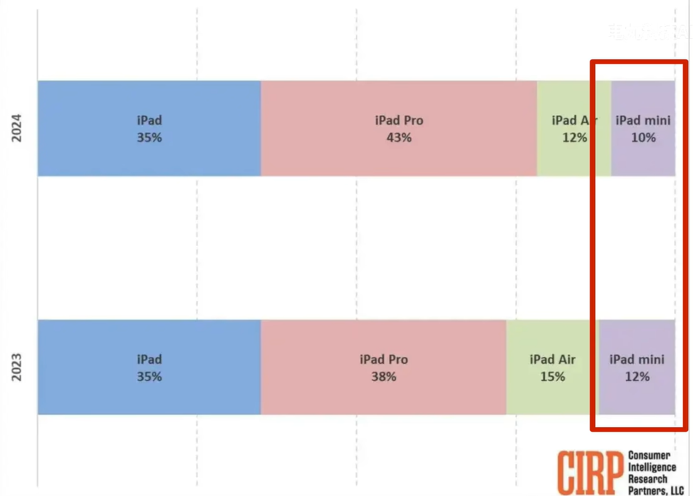
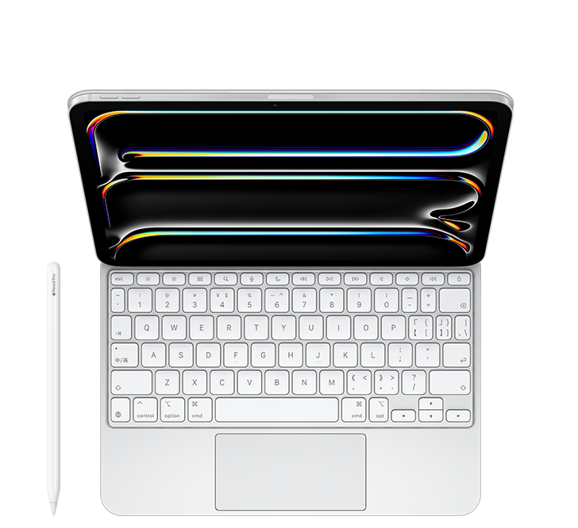

> 让好的工具去适配你的生活，而不是为了工具改变生活
>
> 在讨论性能与配件之前，更重要的是明确：**iPad 的生产力价值并不完全取决于硬件，而在于使用场景**。即使是一台价格不高的平板，只要能够高效完成学习或工作任务，同样具备生产力价值
>
> *切记：适合你个人需求的工具才是最好的*

## 苹果曾经宣称

- iPad 标准版 是 “出货量之王”的存在
- iPad mini 是“极致便携”的代表
- iPad Air 是“轻薄体验”的代名词
- iPad Pro 则是“性能极限”的象征

随着 2024年 M4 芯片版 iPad Pro 的推出，iPad产品线的定位也更加清晰  
这篇文章，我就来完整地分析 **iPad 全系列的定位、差异与选购逻辑**

## iPad 标准版：出货量之王，买的人不喷，喷的人不买

### iPad 标准版（数字系列） 的核心定位

苹果对于 iPad 标准版 的定位：**入门 + 教育 + 大众市场**

如果说 iPad Pro 是性能顶点、Air 是中坚力量、mini 是便携担当  
那 iPad 标准版（也就是“普通 iPad”或者“数字版 iPad”）就是苹果生态中最“接地气”的存在

苹果推出标准版 iPad 的初衷一直很明确——**教育市场与普及市场**  
它的**价格相对低、功能较为完整、适配面广**，是全球出货量最高的一款 iPad  
尤其是在北美、日本、中国大陆的教育采购中，iPad（标准版）几乎承担了绝大部分的出货量（比如说作为一些餐厅的点餐平板或者学校大批量的采购教学场景就很合适）

如果你已经有了较为有全面的iOS生态，那么选择一个较为普通的平板，作为一个完整iOS生态的载体，也会是一个不错的选择

**我总结了历代（iPad 9 → iPad 11）的升级方向，也可以看出苹果的策略：**

| 机型 | 芯片 | 运行内存 | 接口 | 屏幕 |
| --- | --- | --- | --- | --- |
| iPad 9 （2021） | A13 (6核心[CPU](https://zhuanlan.zhihu.com/p/357233976)) | 3GB | Lightning | 视网膜非全贴合屏幕 |
| iPad 10 （2022） | A14 (6核心CPU) | 4GB | USB-C | LCD 非全贴合屏幕 |
| iPad 11（2025） | A16 (5核心CPU) | 6GB | USB-C | LCD 非全贴合屏幕 |

虽然这次升级，芯片仍是 A 系列，但日常使用上，足以应对学习、视频、会议、办公笔记等轻度任务  
同时，随着 USB-C 接口的加入，也让它的兼容性不再“落后”于其他型号

可惜的是由于 iPad 标准版 全系列[运行内存](https://zhidao.baidu.com/question/1394859867026606780.html)没有达到苹果所规定的8GB要求，所以不支持Apple intelligence，甚至苹果为了区分标准版，还给给iPad 11 上的这颗 A16 砍掉了一颗 CUP 和 GPU 核心（相比与[iPhone 15/14 Pro](https://www.apple.com.cn/iphone/compare/?modelList=iphone-14-pro,iphone-15)上的 A16 来说）

\*[非全贴合屏幕](https://www.xinxlcd.com/zixun/xinwen/390.html)：指的是画面所看到的屏幕和这个玻璃不在同一个层面上，而是有两层。在看视频或者电视剧的时候，视觉观感体验会差一些，一般体现为反光现象较为严重。另外在做屏幕上写笔记的时候，会有一种隔着两层玻璃的感觉，长时间使用，内屏会进灰

那么问题来了，明明 iPad 标准版 体验上差这么多，这么多销量又是哪里来的呢？

### 为什么出货量大？

1. **教育采购主力**：苹果针对教育市场有大量补贴，标准版价格最低，成批采购成本最低
2. **家庭娱乐与学生刚需**：很多家长给孩子入门使用 iPad 时，优先考虑价格与耐用性
3. **生态兼容稳定**：虽不支持最新的 [Pencil Pro](https://www.apple.com.cn/apple-pencil/)，但依然支持主流键盘与 Pencil 1，满足基础需求（非全贴合屏幕，不太适合长期写笔记之类的）
4. **系统寿命长**：即便是搭载 A13/A14 芯片的旧款 iPad，依旧可以流畅运行 iPadOS 18 及未来几年更新

### 适合人群

- **中小学学生 / 教师**：用于作业批改、备课、上网课、浏览网页
- **家庭娱乐用户**：看剧、追番、阅读、视频通话
- **预算有限但想入门苹果生态的人**：想尝试 iPadOS 或 Apple Pencil 的体验者

### 不适合人群

- 对屏幕要求高（如绘画 / 视频剪辑）
- 需要更强大的性能或120Hz屏幕高刷体验
- 想长期用作生产力设备（外接显示、视频导出等）

> 如果你只是想买一台“能用、顺手、不贵”的 iPad  
> 那么标准版依然是最务实的选择  
> 它或许没有搭载 M 系芯片的性能溢出，但它足够“iPad”，足够稳

## iPad Air：最平衡，却也最“保守”的中坚力量

### Air 系列的核心定位

[iPad Air](https://www.apple.com.cn/ipad-air/) 一直是苹果在“性能与价格之间”的平衡点  
它主打轻薄便携、性能强劲、体验稳定，无疑 iPad Air 系列是多数人眼中最“稳妥”的选择（可是当今iPad Air早已不是最薄iPad，iPad Pro 2024 反而变得最薄了）

然而，从 Air 5 到 Air 6、再到 2025 年的 Air 7  
它的升级几乎只集中在一个地方：**芯片**

| 机型 | 芯片 | 功能性变化 |
| --- | --- | --- |
| Air 5（2022） | M1（8核[GPU](https://zhuanlan.zhihu.com/p/560541961)） | 仅支持第二代 Pencil |
| Air 6（2024） | M2（9核GPU） | 横向12MP Center Stage摄像头 |
| Air 7（2025） | M3（9核GPU） | 支持Apple Pencil Pro，更多视频编码格式，[硬件级光追](https://blog.csdn.net/haisendashuju/article/details/126945533) |

这次的新Air的**屏幕依旧是 60Hz、扬声器仍是单侧双声道，全系标配 8GB 运存**

苹果为了维持产品等级差异，始终不给 Air 系列上高刷新率、四扬声器（包括这次iPad Air 7 上搭载的 M3 芯片，也是相比于搭载了 M3 系列的 Mac Book，阉割了一个GPU核心）

同样地iPad一整个系列都无一幸免，搭载 M4 的 iPad Pro 相比于同样搭载 M4 芯片的 Mac Book 来说，也砍掉了一颗CPU核心。iPad Mini 7 相比于同样搭载 A17 Pro 的 iPhone 16 Pro来说，砍掉了一颗GPU核心。而iPad 标准版搭载的 A16 也砍掉了一颗 CPU 和一颗 GPU 核心

就算 [Tim cook](https://baike.baidu.com/item/%E8%92%82%E5%A7%86%C2%B7%E5%BA%93%E5%85%8B/4576793) 精准的刀法砍掉了iPad 系列上的处理器的核心数，即使是阉割版芯片，这颗芯片的水平肯定也是远超安卓阵营的大部分的处理器的，就算是阉割最多的 A16芯片 的性能也是要基本持平于骁龙 8 Gen2的水平的

相比于这次 iPhone 17 Pro 系列的搭载的 12GB 运存，貌似这 iPad Air 上的 Apple Intelligence 可能还不如 iPhone 17 Pro 的流畅

不过话又说回来，即使搭载的是 8GB 运存，对于iOS系统的系统调度来说，也绝对够用，因为你[永远可以相信苹果对于内存的调教](https://zhuanlan.zhihu.com/p/1930766200142536982)

所以即使你买最新的 iPad Air 7，它的影音和屏幕的刷新率体验，可能仍然**不如三年前的 [iPad Pro 2022](https://www.gsmarena.com/apple_ipad_pro_12_9_(2022)-11939.php)**  
这让新款的 iPad Air 系列显得有些“稳到无聊”——性能有进步，但体验没变化

## iPad mini：便携的极致与边缘化的命运

### Mini 系列的核心定位

[iPad mini](https://www.apple.com.cn/ipad-mini/) 的定位很明确：**最轻、最小、最便携**  
对于喜欢随身携带、阅读、看视频、轻度办公或随时笔记的用户来说，  
它的体验几乎无可替代

但问题在于，mini 的用户群体相对小众  
销量、利润都不及 Air 与 Pro，加上成本高、定价尴尬，  
让人不得不怀疑它未来是否会继续存在

不过，mini 的“存在意义”从未消失  
它是一台“你用不到时嫌鸡肋，用到了就离不开”的设备

如果你还在使用 mini 4~5 或更老的机型，那么这次升级到全面屏 mini 7 会是一次质的提升

但是不禁让人感觉到，iPad mini 以现在的市场份额，是否还能等待出下一代的发布

我认为苹果推出iPad mini 这条产品线，主要是对iPad小屏市场的一个补充

但是当这些需求进一步缩小的时候，苹果会怎么做？可以参考以下iPhone mini 系类的结局

倘若给足iPad mini足够的性能和体验，那么等iPhone折叠屏出来的时候，就和自家产品“打架了”（其实从苹果的生态，早就可以看出苹果已经证实了最终iPad mini 会走向iPhone mini 的结局）

## iPad Pro：从 M2 到 M4 的进化与分水岭

### Pro 系列的核心定位

不可否认的是 [iPad Pro 系列](https://www.apple.com.cn/ipad-pro/) 确实是苹果平板的技术展示平台  
尤其到了 **2024 年的 iPad Pro（M4）**，可以说是一次性能大跃迁

### 2024 iPad Pro (M4) 的亮点

- **[Tandem OLED](https://zhuanlan.zhihu.com/p/563392464) 屏幕**：双层 OLED 叠加结构，亮度与对比度显著提升
- **[ProMotion 自适应刷新率](https://www.zhihu.com/question/439164387)（1Hz–120Hz）**：流畅度与省电兼顾
- **[M4 芯片](https://baike.baidu.com/item/Apple%20M4/64296948)**：台积电的第二代3nm制程工艺，新架构 + 高带宽内存 + 超强 GPU
- **超薄机身**：11 寸版 5.3mm、13 寸版仅 5.1mm，是史上最薄 iPad
- **前摄横置**：[Center Stage](https://support.apple.com/en-us/111102) 改进了横屏的视频会议体验
- **四扬声器立体环绕 + [Thunderbolt 4](https://zhuanlan.zhihu.com/p/15379993288) 接口**：影音与扩展体验满分

这一代 Pro 明显在为“内容创作者”服务  
不论是设计师、摄影师、视频剪辑师，还是高负载办公人群，  
它都能胜任，甚至超出预期

**新款 iPad Pro 2024 与旧款 iPad Pro2022 & 新款iPad Air 7 的对比（11 寸）**

| 设备 | iPad Pro 2024 (M4) | iPad Pro 2022 (M2) | iPad Air 7 (M3) |
| --- | --- | --- | --- |
| 屏幕 | Tandem OLED + 120Hz | mini-LED / LCD + 120Hz | Liquid LCD + 60Hz |
| 芯片 | M4（10核GPU） | M2（10核GPU） | M3（9核GPU） |
| 扬声器 | 四扬声器 | 四扬声器 | 双扬声器（单侧） |
| 摄像头 | 横向居中 | 竖向居中 | 横向居中 |
| 接口 | Thunderbolt / USB 4 | Thunderbolt / USB 4 | USB-C（10Gbps） |
| 解锁 | Face ID | Face ID | Touch ID |
| 内存 | 8GB/16GB | 8GB/16GB | 8GB |

结论很明确：  
**尽管相差3年，iPad Pro 系列仍然是性能与体验顶点，即使是老款的 iPad Pro 2022 综合体验，也是要比新款 iPad Air 7强很多**

## 未来趋势：Air or Mini 的危机

从苹果的产品策略来看，  
**高利润、高认知度产品优先保留**，低利润线逐渐弱化

因此：

- **iPad Air 系列短期内不会被砍**，目前是产品线中稳定的中层支柱，未来可能会被标准版的市场份额所替代
- **iPad mini 系列** 因为用户群小、成本高，未来可能会停更
- **iPad Pro 系列** 会继续成为技术展示与高端标杆
- **iPad 标准版系列** 持续走销量，出货量大

如果苹果不在 Air 上增加 120Hz 屏幕或改进扬声器  
那么 Air 的“性价比优势”将会逐渐被旧款 iPad Pro 与iPad 标准版所蚕食，倘若这么发展，想必未来不会出现综合体验高于 iPad 标准版，但是又低于 iPad Pro 的折中体验了

iPad mini 也亦是如此，产品市场需求量日益减少，倘若加上用户所需要的功能则必然会增加成本，苹果不会为了满足少部分人的需求而舍弃自己的利润，所以iPad mini 未来的状态很难说

## iPad全系列的优势如下：

- **iPad 标准版**：大屏追剧LCD护眼（当然，长时间看对眼睛也不好）
- **iPad mini**：小而美，适合极致便携人群
- **iPad Air**：平衡、稳妥、实用，是大多数人的理智之选
- **iPad Pro（尤其 2024 M4 ）**：面向专业人群的生产力终端 & 游戏发烧友

## **结合性能、价格与实际需求，我的建议如下：**

> 如果你是 M 系列以前的用户 / 学生 / 对 Pro 功能无感，又有做笔记or绘画的需求：  
> 👉 选 **iPad Air（M3）**，目前各大平台有国补加持，现在入手性价比高
>
> 如果你是创作者 / 视频色彩方面的剪辑 / 高强度办公用户/预算无上限&年年换新：  
> 👉 选 **iPad Pro（M4）** ，性能强大，强无敌
>
> 如果你只想随身阅读 /小屏爱好者/经常外出携带使用：  
> 👉 选 **iPad mini（A17PRO）**，芯片提升巨大，适合随身轻度使用
>
> 如果你只想要大屏且不太需求性能/只是用来简单上网学生党/刚需iOS应用的需求：  
> 👉 选 **iPad 11（A16）**，追求较为便宜的价格，大屏需求者使用

感谢您能看完我写的这篇分析，我们下一篇见┏ (゜ω゜)=👉bye~~

您的肯定是我更新的动力，谢谢ψ(｀∇´)ψ
