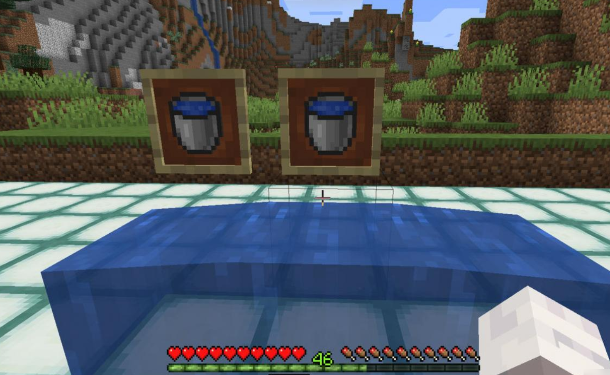
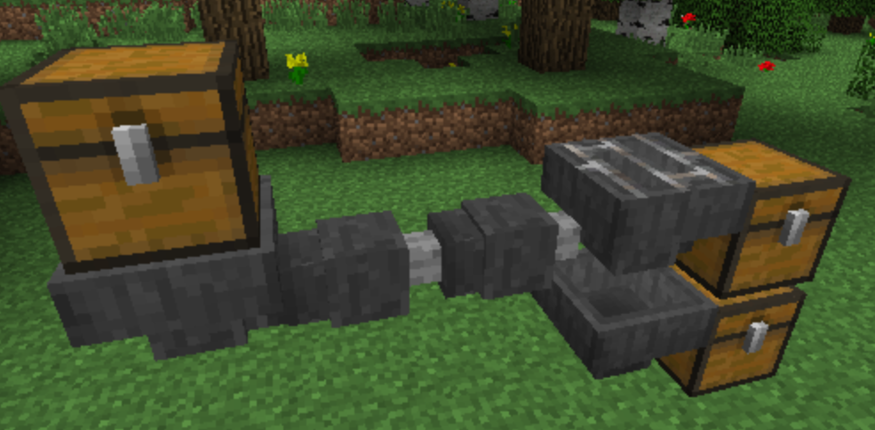
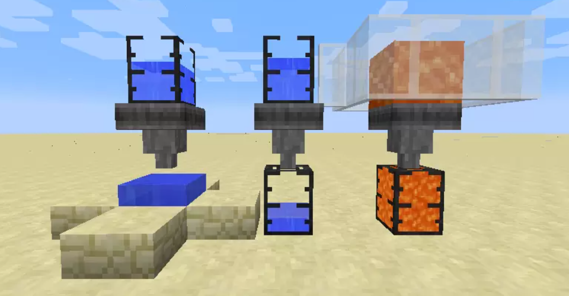

生活里藏着许多容易被忽略的小疑问，比如在洗手池遇见了带四个接水口的水龙头——当我们需要接水时，总会下意识纠结：是把四个口全打开一起接，还是只开一个口单独接？这两种方式，到底哪个效率更高？🧐  

  
一、先明确问题核心：总闸水流是固定前提  
   
要讨论效率，首先得锚定一个关键前提：**总闸的水流是固定的**  
按照实际场景设定：  
   
- 四个接水口同时打开时，每个口的出水量会分流为总闸的1/4；  
- 关闭其他三个，只开一个时，这个口的出水量等于总闸的满额速度  
   
此时第一个关键疑问出现：我们评判“效率”的标准，究竟是“单个接水口的出水速度”，还是“所有接水口加起来的总出水量”？  
   
二、算笔明白账：总出水量决定真实效率  
   
若将“效率”定义为“单位时间内的总出水量”，我们可以直接通过计算拆解：  
   
- 四个口同时工作：每个口贡献1/4总闸水流，总出水量 = 1/4 + 1/4 + 1/4 + 1/4 = 1（即总闸满额水流）；  
- 单个口单独工作：总出水量 = 1（直接等于总闸满额水流）  
   
看到这里，你或许会反问：既然两种方式的总出水量完全相同，那所谓的“效率差异”，难道只是我们的主观错觉？🤷‍♂️  
   
三、再看时间维度：“单开更快”的误区在哪？

  
   
假设接满一桶固定容量的水，四个口同时开需要N秒，那只开一个口真的会像直觉里想的那样，只需要N/4秒吗？  
答案是否定的。因为“时间 = 总水量 ÷ 总出水量”，而：  
   
- 总水量是固定的（一桶水）；  
- 两种方式的总出水量又完全相同（均为总闸满额水流）  
   
由此可见，两种方式的接水时间必然相等。所谓“单开更快”，不过是把“单个接水口的速度”和“整体效率”混为一谈——单个口水流冲击感强，让我们误以为效率更高，但这并非客观事实😏  
   
四、延伸思考：多接水口的设计意义是什么？

若再往深想一层：如果四个口一起接效率更高，那接水口越多是不是越好？可总闸水流固定，就算增加十个、二十个接水口，总出水量依然不会变；反过来，若单开一个效率更高，那多设计几个接水口的意义又在哪？  
   
其实答案很简单：多接水口的设计，本质是为了“同时接多份水”（比如同时接四杯水），而非“加快接一份水的速度”。我们混淆了“接水数量”和“接水效率”的概念  
   
五、最终结论：效率无差异，习惯即最优

  
   
只要总闸的水流不变，无论选择四个口一起接，还是单个口单独接，总效率和接水时间都不会有差异  
我们之所以纠结，不过是被“单个水流速度”的主观感受迷惑——水流快不代表效率高，水流慢也不代表效率低  
   
下次再面对那个多接水口的水龙头时，完全可以少一点纠结：两种方式效率相同，跟着自己的习惯来，就是最优选择。生活里的很多小疑问，只要静下心来拆解，答案往往比我们想象中更简单

哦！那么就这样吧！下一篇见！！
