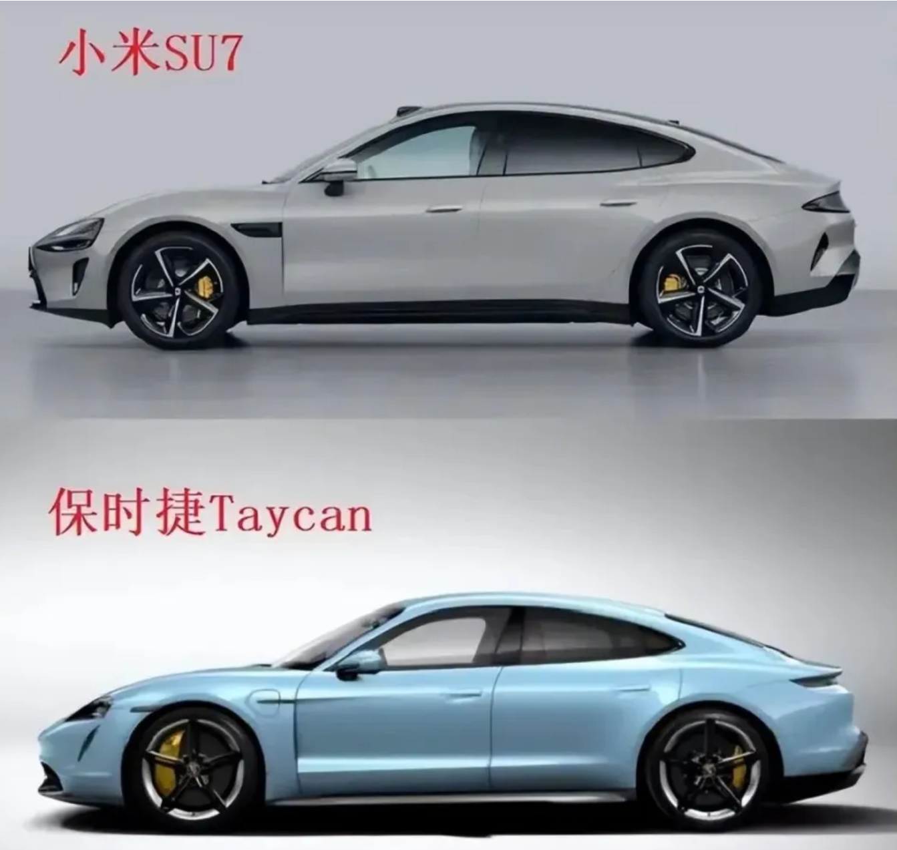

说到科技圈，很多人第一反应就是“抄袭”要么是苹果抄安卓，要么是安卓厂商（某米17就是典型例子）反过来抄苹果

久而久之，大家都习惯了：一个新功能刚出来，不出几个月，整个行业都开始跟风

## 问题是，这样的“抄”，到底有意义吗？

难道真的就像网上调侃的那样——科技以换壳为本？

先别急着下结论，所谓的“抄”，在科技行业里几乎是必然的

> • 省去试错成本：别人已经验证过的东西，说明能解决需求，后来者直接跟进，风险小很多
>
> • 用户推动：一旦用户体验过某个好用的功能，就会希望所有设备都有，不跟上，就显得落伍
>
> • 竞争压力：这个行业迭代太快，不抄、不跟进，就等于掉队

所以抄并不是偷懒，而是一种“保证自己不被淘汰”的本能反应

## 抄得好，还是抄的烂？

## 区别就在于：你是“机械复制”，还是“消化吸收再重构”

> • 机械抄：原样搬运，结果往往四不像，体验还割裂
>
> • 深度吸收：在别人的思路上，结合自身系统和生态，重新打磨，甚至做到比原版更好

比如全面屏手势，最早是安卓厂商探索，但体验一般。后来苹果在 iOS 上做了完善，变得流畅自然，反过来又影响了安卓，才形成今天相对统一的交互方式。这就是“抄 + 改 + 优化”的典型案例

## “科技以换壳为本”？

这句话虽然是段子，但也戳中了现实：不少厂商确实只会在外观和参数上折腾，比如堆摄像头、换名字、搞噱头，短期看热闹，长期看没用  
  
不过换壳并不是完全没有意义。行业在过渡期缺乏底层突破时，厂商只能靠外观和堆料去卷。但等到行业成熟，真正能留下来的，还是那些在系统、芯片、生态联动上有积累的厂商

> • 抄不可避免，但它不该是终点
>
> • 有意义的抄，是消化吸收之后做出自己的改进，让体验更好。否则就只能永远跟在别人后面

**抄是进化的起点，创新才是走得更远的关键**  
  
写到这里，我并不是要为“抄袭”正名，而是想说：与其争论谁抄谁，不如看看谁能在抄的基础上走得更远。对用户来说，真正重要的从来不是“谁先做”，而是最后用到手里的产品好不好用

感谢您得阅读，以上内容可能会含有较多主观成分在内，还请多多包涵

那么就这样吧，下一篇见~~
