## **模拟运行在Macintosh上的Mac OS 7 系统安装教程**

安装前提及必要准备准备如下：

- [Mac OS 7 系统安装包](https://winworldpc.com/product/mac-os-7/71)
- [Mac OS 7 Rom](https://www.macintoshrepository.org/7038-all-macintosh-roms-68k-ppc-)
- 系统引导盘(最好是64M的空盘，推荐使用[UltraIOS](https://www.ultraiso.com/download.html)制作)
- [Mini vMac模拟软件](https://www.gryphel.com/c/minivmac/dnld_std.html)

以上所有内容我已打包在我分享的蓝奏云网盘（密码：1szz，[点我下载](https://wwve.lanzoup.com/b014wpyzha)）也可自己根据我提供的对应网站的超链接下载

## 当你准备好了以上的条件，即可开始安装，**安装过程如下**

> 首先确保解压的MacOS.zip已经至自己电脑本地，以下安装过程中不会涉及到文件的删除，移动（指的是换文件的位置）等修改文件的操作

## **1**，双击Mini vMac.exe，并拖入Apple Mac OS 7.1 文件夹下的Install 1.img文件至这个Mini vMac.exe窗口，点击“好”

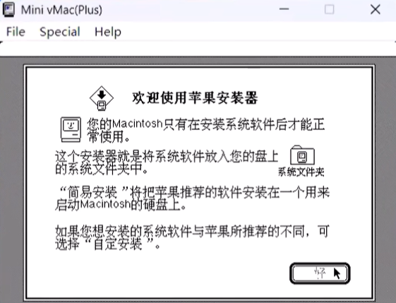

## **2，拖入文件夹里我制作好的mac.img文件（也可通过UltraOS自行制作，要求64M的就行），点击初始化→抹掉→取个名字（只要是英文就行）→安装**

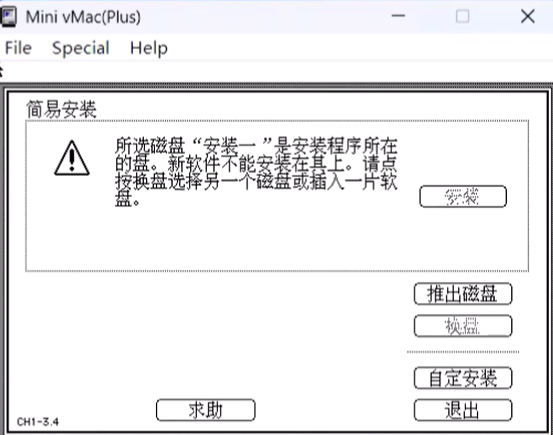

## **3，打开Apple Mac OS 7.1 文件夹，按照软件提示拖入对应的文件**

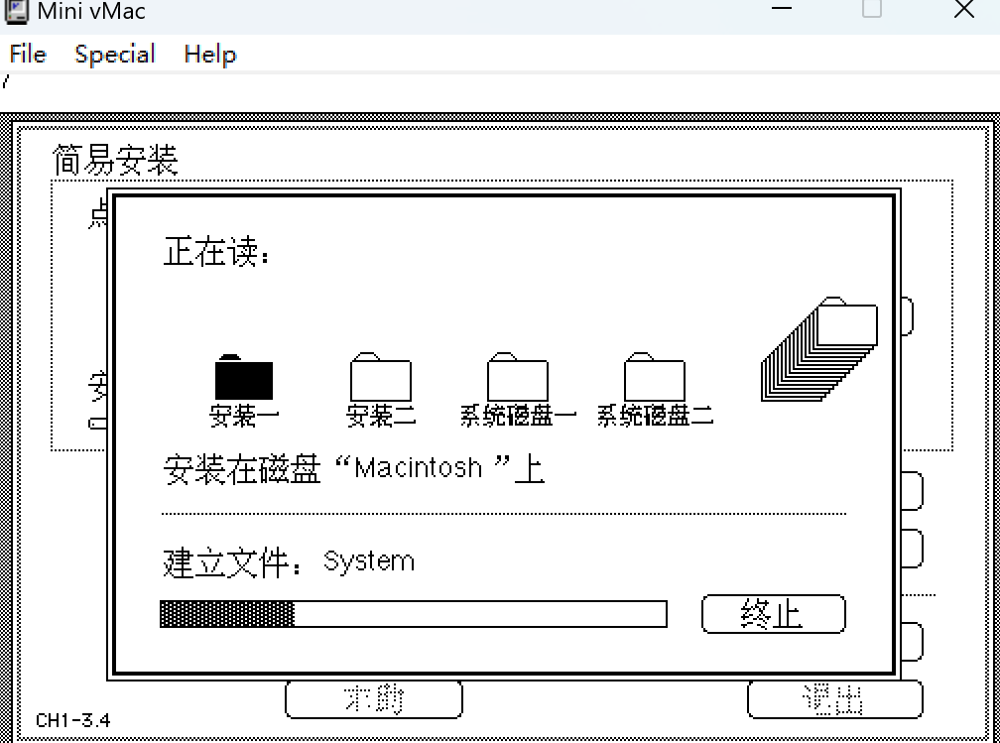

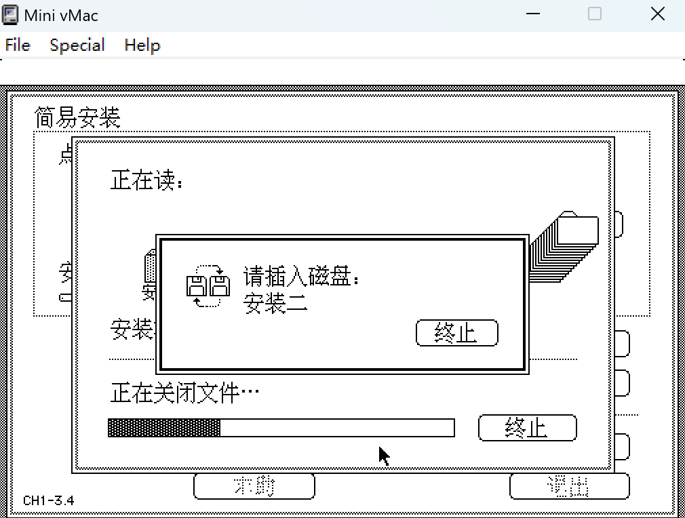

后面都是一样的操作，注意文件名称就行，没什么难度的（就是此过程会很长很繁琐，好在操作比较简单）

如果模拟器提示按下C不起作用，再按下ctrl+C 继续即可

## **4，最后拖拽完字体后，再次拖入Install 1.img完成安装**

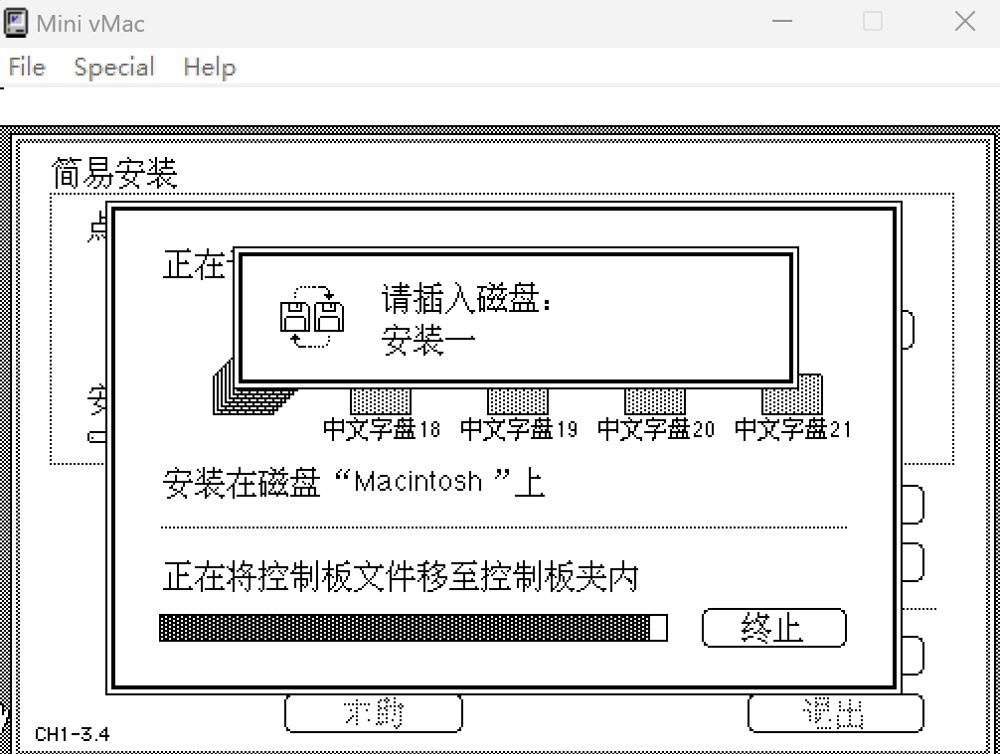

## **5，此处点击退出→重启动**

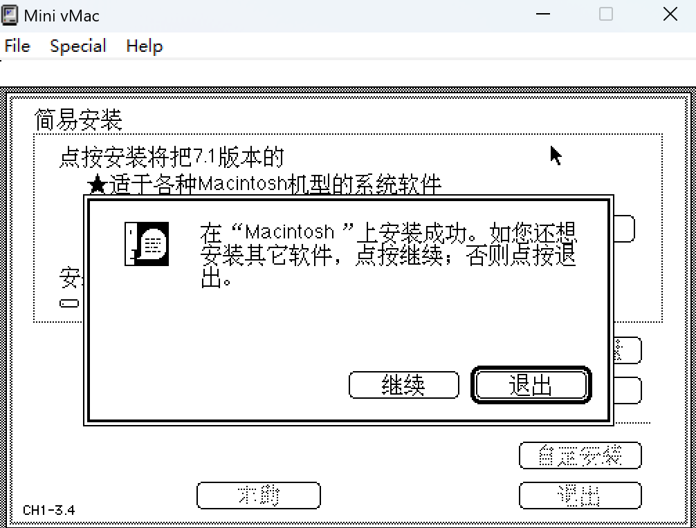

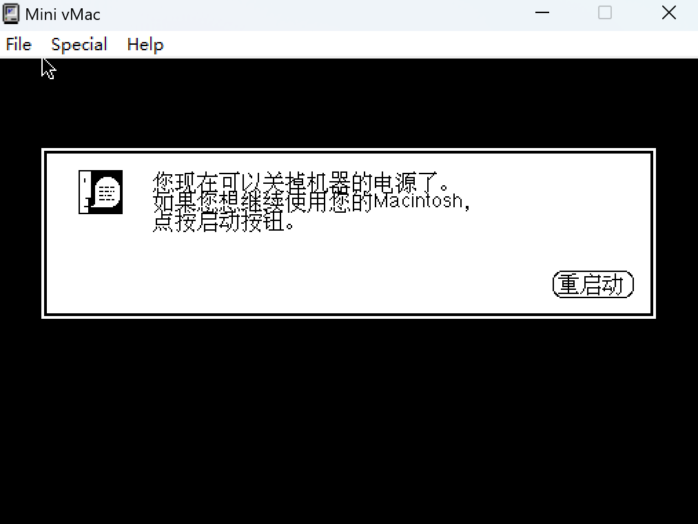

## **6，当再次出现次界面后，将我文件夹提供的mac.img文件再次拖拽至此窗口中**

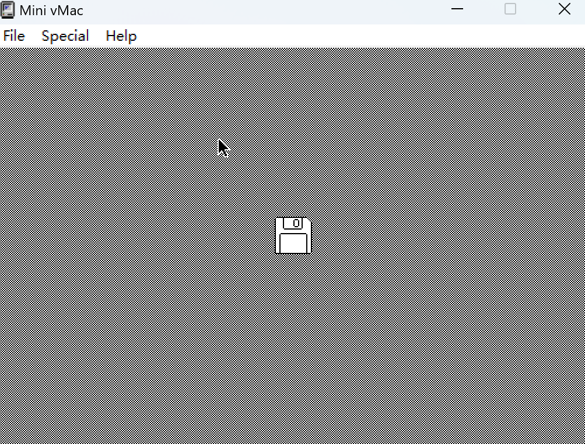

## **7，现在，你已经成功安装了Mac OS 7 中文版🎉🎉🎉**

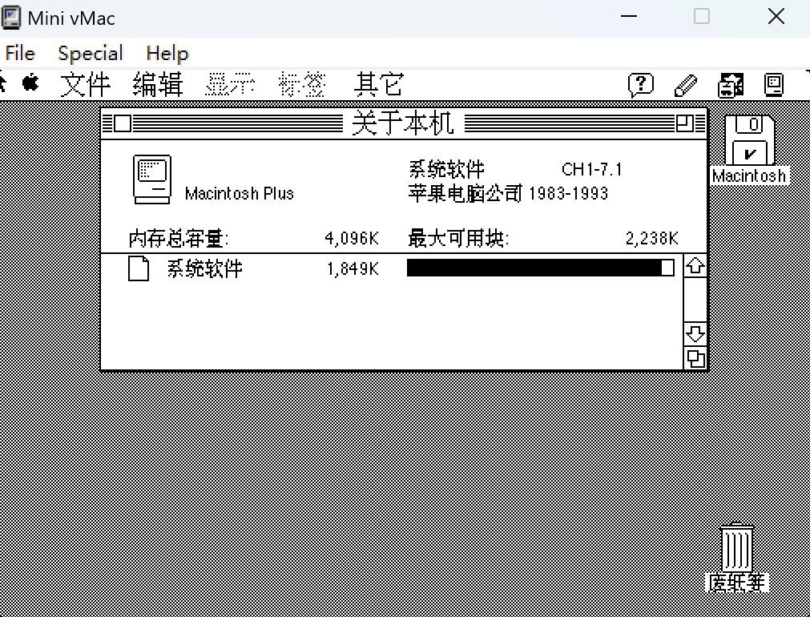

按下ctrl+F即可在全屏和小窗口之间转换（由于分辨率不一致的原因，不能将这个软件全屏和电脑一样QAQ）

## **8，后续开/关机操作：**

找到关机键后关机即可关闭软件（避免损坏磁盘，建议这样做）

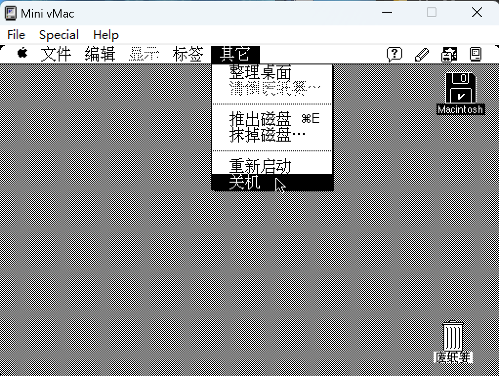

  
  
再次打开Mini vMac.exe的时候，直接拖拽mac.img文件至窗口内即可  

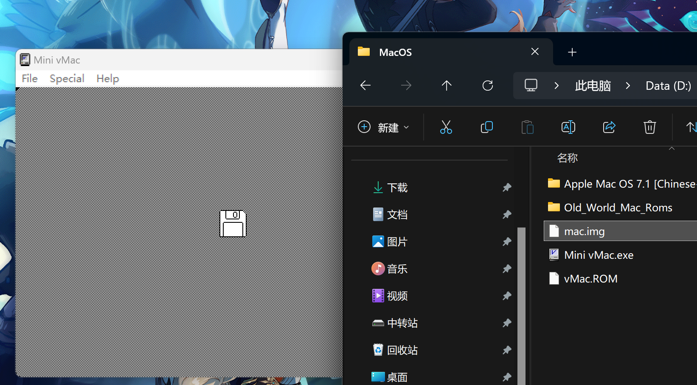

以上就是Mac OS 7 安装教程，感谢您的观看，您的肯定是我更新的动力，谢谢
