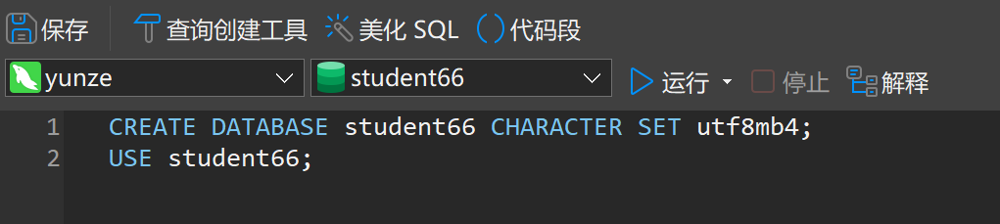
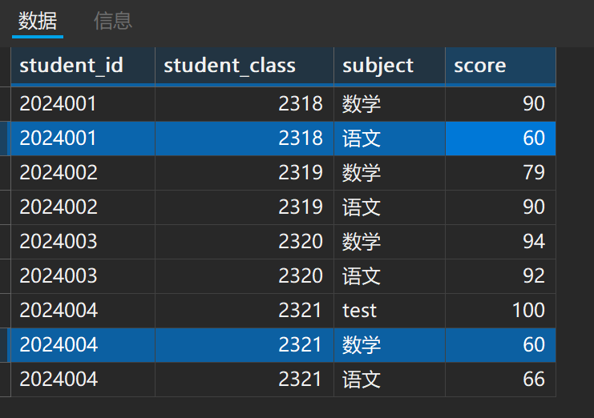
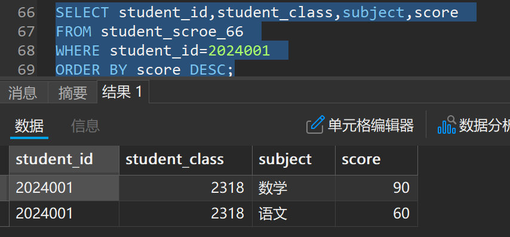
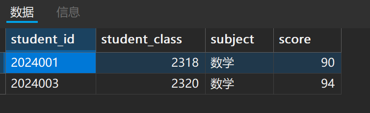
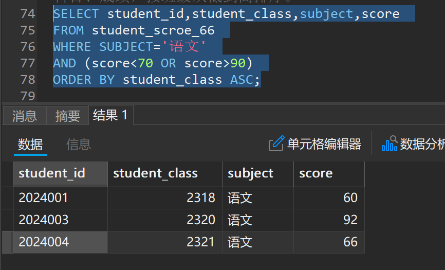
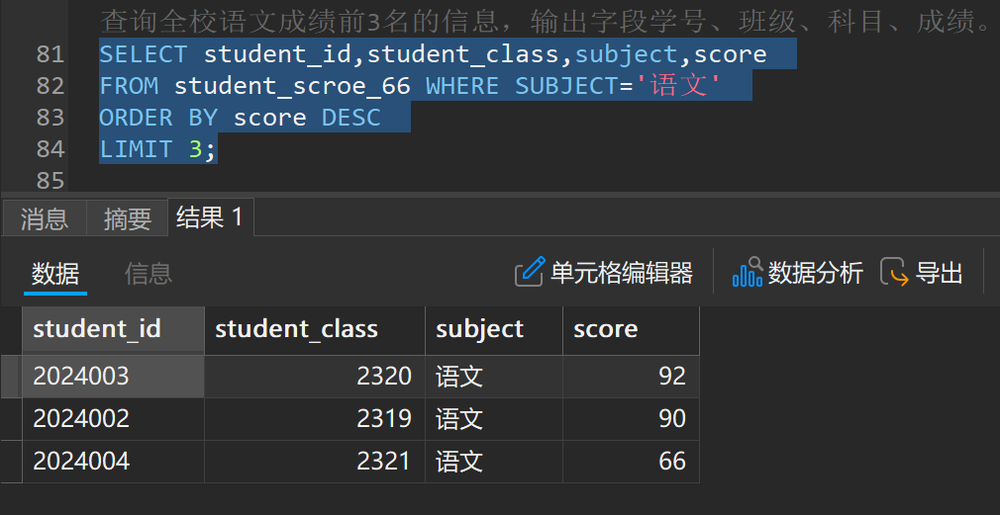

## 本章内容：从软件的下载，到学会数据库的简单查询

本章难度：(🌵🌵🌵/🌵🌵)

### Stp 1：如何下载？

Navicat Premium 17 安装及下载链接：[点我下载](https://www.123865.com/s/foFNjv-Bq9TH)

为了便于演示和理解，以下内容将使用 Navicat Premium 17 演示

说实话，我不建议直接copy我的示例代码，我认为自己敲一遍能加深初学的印象

（**Don't copy. Study it by yourself！**）        ヾ(≧▽≦\*)o

此外由于代码部分的内容全由本人敲写，由于中英混用，难免出现些符号的问题，例如：（；&;）（，&,），如果执意copy我示例代码的，如果出错了，还请多多包涵(；′⌒`)

### Stp 2：适当了解些基础概念

1.字段：可以理解成Excel表格里横着的表头，不可再划分的最小单位

2.第一范式：所有字段值都是不可分解的原子值

3.主键（PRIMARY KEY）：一张表中仅有一个主键，不能为NULL，设置为主键的字段不能重复，多个字段共同构成的主键称为联合主键

4.唯一键（UNIQE）：字段值不能重复”（允许 NULL 值，且多个 NULL 不视为重复）

5.外键（FOREIGN KEY）：与主键建立关系的键，一张表中 “引用另一张表主键” 的字段，作用是把两个表 “绑在一起”的就是外键

6.非空约束值（NOT NULL）：代表这个字段不能为空值

7.自增约束值（AUTO\_INCREMENT）：实现（主键，唯一键）的数值自增，实际中用到的最多的是主键的自增约束，外键不能设置自增

### Stp 3：实操演练

不妨看看数据库在实际中应用的例子，边用边学，才会有效果（此内容为虚构，仅供教学使用，请勿当真）

假设你是xx学校教务处的实习生，现在需要用 SQL 语句管理该校的学生成绩数据，从**创建专属数据库**开始，到**创建表存储学生信息和成绩**，再到**录入数据**、**修正错误**成绩、**删除**无效记录，最后按老师要求**查询**各类成绩报表

## 第一步：创建专属数据库（数据库管理）

首先是得要新建一个连接

打开Navicat17，左上角新建连接→选择my sql→随便输入连接名称和你记得住的密码→双击左侧打开（一般是变成绿色），即可创建成功

点击左上角“新建查询”按钮，即可开始以下指令的操作

要求：数据库名为`student+两个数字`（比如我是 66，就叫`student66`），字符集用`utf8mb4`（支持中文和特殊符号，避免乱码，默认就是）

```sql
--创建数据库，指定字符集
CREATE DATABASE student66 CHARACTER SET utf8mb4; 

--创建数据库的语法格式
CREATE DATABASE + 数据库名 + CHARACTER SET + 字符类型 ;

--切换到刚创建的数据库（后续操作都在这个库下） 
USE student66;

--切换数据库的语法格式
USE + 数据库名
```

输入之后，选择你输入的这条代码，点击”运行已选择的“按钮，即可运行成功（这里不建议全选运行，或者直接不选择单条代码直接点击”运行“，因为同时多条代码运行起来大概率会导致报错。主要是这玩意同时运行，总会会遇到很多奇奇怪怪的问题）



确保这个数据库变为上图这样，也就是切换成你所创建的之后再写，否则所有的内容都将会运行失败（左侧可使用右击鼠标右键或者按下键盘上的 F5 按键，来刷新实时的表的状态）没出现的话，可以多刷新几次，有时会不太灵敏

## 第二步：创建数据表（数据表管理）

要求：需要两个表：`student_info_66`（存学生基本信息）和`student_score_66`（存学生成绩）字段要求已给

**1. 创建学生信息表（student\_info\_66）**

字段要求：如下

| 字段名 | 字段类型 | 字段约束 | 备注 |
| --- | --- | --- | --- |
| student\_id | 字符串 | 主键 | 学号（唯一） |
| student\_name | 字符串 | 非空 | 姓名（不能为空） |
| student\_class | 字符串 |  | 班级 |
| student\_sex | 字符串 |  | 性别 |

**2.创建学生成绩表（student\_score\_66）**

字段要求：如下

| 字段名 | 字段类型 | 字段约束 | 备注 |
| --- | --- | --- | --- |
| student\_id | 字符串 | 主键（联合主键） | 学号 |
| student\_class | 整数 | 非空 | 班级（比如 2318） |
| subject | 字符串 | 主键（联合主键） | 科目 |
| score | 小数 |  | 成绩（支持小数，比如 58.9） |

示例如下：

```sql
--添加表的代码示例
CREATE TABLE student_info_66(
student_id VARCHAR(20) PRIMARY KEY,
student_name VARCHAR(50) NOT NULL,
student_class VARCHAR(20), 
student_sex VARCHAR(10)
);

CREATE TABLE student_score_66(
student_id VARCHAR(20),
student_class INT NOT NULL,
subject VARCHAR(20),
score FLOAT,
PRIMARY KEY(student_id,subject) --这里是联合主键，使用主键 + （）即可
);

--添加表的语法格式
CREATE TABLE 表名(
student_id VARCHAR(20) PRIMARY KEY,
表的字段名 + 类型 + 约束 + ,
如下同理可得...
);
```

注意的是使用VARCHAR/CHAR都需要加（）应为这个类型是用来限制长度的，VARCHAR/CHAR都会需要预设长度，一般来说，使用VARCHAR就行，通用性很高

### 此处的避坑点如下：

- 学号用`VARCHAR`（字符串）而非`INT`（整数）：因为学号可能以 0 开头（比如 001），用整数会丢失前面的 0
- `NOT NULL`约束：姓名必须填，否则插入数据时会报错，避免 “无名学生” 的无效数据

## **附加题**

**1.尝试添加一个外键**

现在需要给`student_info_66`里的`student_class`添加一个外键，并且关联到`student_score_66`这张表里，命名为`class_id`

```sql
--添加外键代码示例（两种方法）
--方法一：使用常规方法，建表时直接定义外键
CREATE TABLE student_info_66 (
student_id VARCHAR(20) PRIMARY KEY,
student_name VARCHAR(20) NOT NULL,
student_class VARCHAR(20),  -- 外键字段（关联班级表的 class_id）
student_sex VARCHAR(20),
FOREIGN KEY (student_class) REFERENCES student_score_66(class_id) -- 外键：关联班级分数表的键 class_id
);

--方法二：使用 ALTER 方法，如果表已创建，用 ALTER TABLE 添加外键
ALTER TABLE student_info_66
ADD FOREIGN KEY (student_class)  -- 本表里的外键字段
REFERENCES student_score_66(class_id);  -- 关联班级表的主键

-- ALTER 方法的添加外键的代码语法格式
ALTER TABLE + 需要修改的表名
ADD + FOREIGN KEY + 需要添加本表里的外键字段 
REFERENCES + 需要关联的外表表名 + (所要关联的表，所表示的键的名称) + ;

*特别注意：外键关联的另一张表（父表）的字段，必须是 “不可重复、有唯一代表性” 的键（主键或唯一键），就是说这个所谓的class_id必须要在那个所对应的表中为唯一的键值
```

**本题的注意事项：**

1. 外键关联的必须是主表的**主键或唯一键**（否则会报错 “无法添加外键约束”）
2. 从表的外键字段（`student_class`）和主表的被关联字段（比如 `class_id` 或 `student_class`）且**数据类型必须完全一致**（比如都是 `VARCHAR(20)` 或 `INT`）

**2.删除学生信息表**

如果建表后发现字段错了，需要删除表（**注意：删除表会清空所有数据，谨慎操作**）

```sql
--删除学生信息表
DROP TABLE student_info_66;

--删除表的语法格式
DROP TABLE + 表名 + ;
```

注意区分`DROP`和`DELETE`的用法：

- 想删**整个表 / 库 / 结构** → 用 `DROP`（再次注意，此操作删除时须谨慎！！！）
- 想删**表中的部分 / 全部数据**，但保留表 → 用 `DELETE`（记得加 `WHERE` 条件，避免误删所有）

## 第三步：管理表数据（DML 操作：增删改）

表建好后，我们需要录入成绩数据、修正不及格成绩、删除无效科目记录，这三步对应 SQL 的`INSERT`**（增）**、`UPDATE`**（改）**、`DELETE`**（删）**

**1. 插入成绩数据（INSERT）**

要求：将给了的 9 条成绩数据，插入到`student_score_66`：

| 学号 | 班级 | 科目 | 成绩 |
| --- | --- | --- | --- |
| 2024001 | 2318 | 语文 | 58.9 |
| 2024001 | 2318 | 数学 | 90 |
| 2024002 | 2319 | 语文 | 90 |
| 2024002 | 2319 | 数学 | 79 |
| 2024003 | 2320 | 语文 | 92 |
| 2024003 | 2320 | 数学 | 94 |
| 2024004 | 2321 | 语文 | 66 |
| 2024004 | 2321 | 数学 | 9.5 |
| 2024004 | 2321 | test | 100 |

```sql
--添加表中的数据示例
INSERT INTO student_score_66 (student_id,student_class,subject,score) 
VALUES --多个值，一定要加s
('2024001', 2318, '语文', 58), 
('2024001', 2318, '数学', 90.0), -- 小数可以写90或90.0，不影响 
('2024002', 2319, '语文', 90), 
('2024002', 2319, '数学', 79), 
('2024003', 2320, '语文', 92),
('2024003', 2320, '数学', 94), 
('2024004', 2321, '语文', 66), 
('2024004', 2321, '数学', 9.5), 
('2024004', 2321, 'test', 100);

--添加表中的数据的代码语法格式
INSERT INTO + 表名 +（字段1，字段2，字段3...）
VALUES + （数据1，数据2，数据3...）+ ;
```

### 特别注意

- 学号用`VARCHAR`（字符串）：所以必须使用 ' ' （上引号），将数据括起来
- 而非`INT`（整数）：可以不适用 ' ' ，直接写数字就行
- 字段名需要和数据一一对应，字段顺序要和`VALUES`里的数据顺序一致：比如`(student_id, student_class)`对应`('2024001', 2318)`，不能颠倒

**2. 修正不及格成绩（UPDATE）**

要求：将成绩低于 60 分的同学，成绩统一改成 60 分（避免不及格）

```sql
--将成绩 <60 的记录，修改为60分示例：
UPDATE student_score_66 
SET score = 60.0 
WHERE score < 60;

--修改数据部分的代码语法格式：
UPDATE + 需要修改的表的表名
SET + 需要修改后的数据
WHERE + 判断的条件 + ;
```

运行成功效果如下：（可以看到，原本的两条数据已被修改）



**关键说明**

- 必须加`WHERE`条件：如果没加，会把所有学生的成绩都改成 60 分，酿成大错！！
- 后面没有加入逗号的原因是：这原本是个一行的代码语句，为了提高代码的**可读性**和美观考虑，我写成了换行的样式，**全选这部分代码后的运行结果和单行的结果是一样的**

**3. 删除无效科目记录（DELETE）**

要求：发现有个 “test” 科目是测试数据，要求删除该科目的所有成绩

```sql
--删除科目为test的记录代码示例：
DELETE FROM student_score_66 WHERE subject = 'test';

--删除数据的代码语法格式：
DELETE FROM + 需要删除的表名 WHERE + 删除条件 + ;
```

**避坑点**

- 同样要加`WHERE`条件：没加的话会删除表中所有成绩数据，无法恢复
- 字符串匹配要准确：`'test'`区分大小写（比如`'Test'`不会被匹配），按实际数据写

## 第四步：成绩查询（SQL 核心：SELECT语句）

要求 ：以下将会使用 4 类查询，覆盖了“筛选、排序、限制数量”等常用场景，也是工作中最常遇到的需求

**1. 查询学号为 2024001 的成绩，按成绩从高到低排序**

需求拆解：筛选学号 = 2024001 的记录，输出学号（`student_id`）、班级（`student_class`）、科目（`subject`）、成绩（`score`），按成绩**降序**排列

- 温馨提示：升序（`ASC`），降序（`DESC`）

```sql
--查询代码语句示例：
SELECT student_id, student_class, subject, score
FROM student_score_66
WHERE student_id = '2024001'  -- 筛选指定学号
ORDER BY score DESC;  -- 按成绩降序（从高到低）

--查询代码语法格式：
SELECT + 查询数据1，查询数据2，查询数据3 +...
FROM  + 所要查询数据来源的表名
WHERE + 判断的条件
ORDER BY + 排序字段 + 升序/降序 + ;
```

**目标结果如下：（\*注：原 58.9 已改成 60）**



**2. 查询数学成绩 90-100 分的记录，按班级升序、成绩降序排列**

需求拆解：筛选科目 = 数学且成绩在 90-100 之间的记录，输出指定字段

**排序时注意：先按班级从低到高，再按成绩从高到低排序**

示例代码如下：

```sql
--查询代码示例
SELECT student_id, student_class, subject, score
FROM student_score_66
WHERE subject = '数学' 
AND score BETWEEN 90 AND 100  -- 成绩在90-100之间（包含90和100）
ORDER BY student_class ASC, score DESC;  -- 先按班级升序，再按成绩降序

--查询代码语法格式
SELECT + 要查询且打印输出的数据
FROM + 数据来源的表名
WHERE + 筛选条件
AND + 所要筛选的字段名 + BETWEEN 最低的分数线 AND 最高的分数线 --可理解为阈值
ORDER BY + 先排序的字段 + 排序方式  + , + 再需要排序的字段 + ;
```

**目标结果如下：**



**关键说明**

- `BETWEEN 90 AND 100`：等价于`score >=90 AND score <=100`，只不过我个人认为这样的写法更简洁
- 多字段排序：先按`student_class ASC`（班级从**低到高**），同一班级的再按`score DESC`（成绩从高到低），排序优先级按字段顺序来

**3. 查询语文成绩 <70 或> 90 的记录，按班级升序排列**

需求拆解：筛选科目 = 语文且成绩 “低于 70 或高于 90” 的记录，按班级从低到高排序

**先筛选，再判断（需要注意判断符号的关系），后排序**

```sql
--查询代码示例
SELECT student_id,student_class,subject,score
FROM student_score_66
WHERE subject = '语文'
AND (score < 70 OR score > 90)  -- 括号不能少！
ORDER BY student_class ASC;

--查询代码语法格式
SELECT + 要查询且打印输出的数据
FROM + 数据来源的表名
WHERE + 筛选条件
AND + 判断的条件 --这里加入括号的原因是 AND 的优先级高于 OR ，所以需要加入括号
ORDER BY + 排序的字段 + 排序方式  + ;
```

**目标结果如下：**



**避坑点**

- 括号必须加：`AND`优先级高于`OR`，如果没加括号，会被解析为`(subject='语文' AND score<70) OR score>90`，从而导致 “非语文科目且成绩> 90” 的记录被误查
- 逻辑判断要准确：“低于 70 或高于 90” = 不包含 70 和 90，按需求写条件

## 4. 查询全校语文成绩前 3 名

需求拆解：筛选科目 = 语文的记录，按成绩降序排列，取前 3 条

**先筛选，再排序，后取前三**

```sql
--查询代码示例
SELECT student_id,student_class,subject,score
FROM student_score_66
WHERE subject = '语文'
ORDER BY score DESC  -- 先按成绩降序，确保高分在前
LIMIT 3;  -- 取前3条，即前3名

--查询代码语法格式
SELECT + 要查询且打印输出的数据
FROM + 数据来源的表名
WHERE + 筛选条件
ORDER BY + 排序的字段 + 排序方式  --DESC降序，ASC升序
LIMIT + 需要取的排名数量 + ;
```

**目标结果如下：**



**关键说明**

- `LIMIT 3`：必须在`ORDER BY`之后 ，如果先取 3 条再排序，会导致取的是 “随机 3 条再排序”，不是真正的前 3 名
- 如果有成绩并列：比如第 3 名有 2 个学生都是 90 分，`LIMIT 3`会只取其中 1 条，若要包含并列，需要调整逻辑（比如先查第 3 名的分数，再查≥该分数的记录）

## 至此，你已经基本学会数据库核心操作

跟着这些小题实操下来，你会发现：数据库操作说白了其实就是

**“建库→建表→填数据→查数据”** 的流程，核心 SQL 就那几个：

- **建库建表**：`CREATE DATABASE`/`CREATE TABLE`；
- **增删改数据**：`INSERT`/`DELETE`/`UPDATE`（记住加`WHERE`）；
- **查询数据**：`SELECT`（结合`WHERE`筛选、`ORDER BY`排序、`LIMIT`限制数量）

接下来，你可以试着换个数字（比如把你的`studentxx`改成`abcd`），自己尝试重新走一遍流程，或者自己加个需求（比如，查询 2318 班所有学生的数学成绩）

基本上多练几次就能熟练掌握

以上就是数据库的入门指南 Part 1 的教程ψ(｀∇´)ψ
