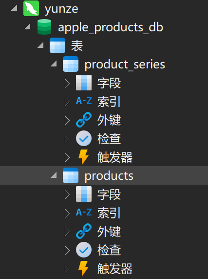
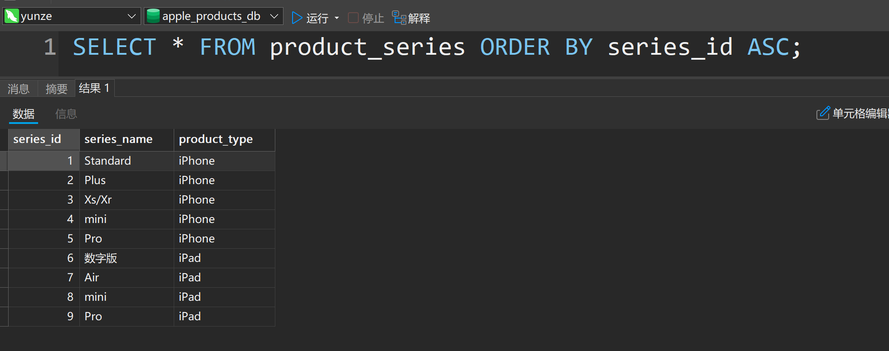
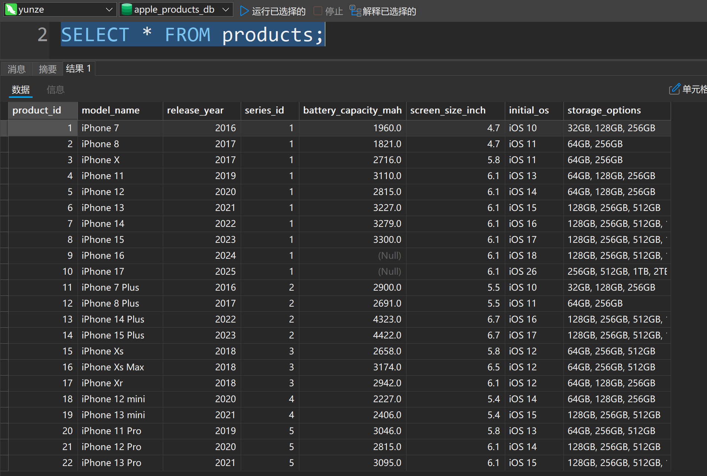

本章内容概述：学习简单的连接查询

本章难度：(⭐⭐⭐⭐/⭐)

## Stp 1：基础知识储备（**新手3问环节**）

### Q：什么是连接查询？

### **A:**

连接查询是一种数据库查询技术，用于**将多张表中存在关联关系的数据合并在一起**，从而获取更完整的信息。以苹果产品库为例，`product_series` 表存储了产品系列的分类信息（如系列名称、产品类型），`products` 表存储了具体产品型号的参数（如型号名称、发布年份）。这两张表通过 `series_id` 字段产生关联（`products` 的 `series_id` 关联 `product_series` 的 `series_id`）。连接查询就是通过这个关联关系，把两张表中匹配的数据 “拼接” 成一条结果，让我们能同时看到产品型号所属的系列和类型等信息

### Q：学了这个连接查询有什么用？

### **A:**

在实际业务中，我们很少只关注单张表的数据，比如：

- 作为苹果产品爱好者，你想知道 “iPhone 15 属于哪个系列”，就需要把 `products` 表的型号和 `product_series` 表的系列关联起来查询
- 作为市场分析师，你想统计 “每个 iPad 系列有多少款产品”，也需要通过连接查询将系列分类和具体产品数结合起来

如果不用连接查询，只用 `products` 表，你只能看到产品的 `series_id` 却不知道对应的系列名称；只用 `product_series` 表，又看不到具体有哪些产品型号。所以连接查询能帮我们**整合多表的关联信息**，解决更复杂的业务问题

### Q：如何去学习这个连接查询:

### **A:**

可以按照 “从简单到复杂” 的路径学习：

- **第一步：掌握基础内连接语法**先学会把两张表通过关联字段连接起来，获取最基础的关联数据
- **第二步：添加筛选条件**在连接的基础上，过滤出自己需要的特定数据
- **第三步：结合排序、聚合等操作**让查询结果更符合业务需求，比如按时间排序、统计平均值等

**了解完基础的概念前奏和对应的疑问，接下来我会带着你结合最简单的几道小题，去学习这个知识点**

## Stp 2：学习前的数据准备

可以参考以下的SQL语句（不懂的语句可以参考注释，实在不明白就去问AI吧，我也没招了）

以下数据可直接**复制粘贴到查询语句中去运行**（必要条件）

```sql
-- 创建数据库：如果不存在名为apple_products_db的数据库则创建，指定字符集为utf8mb4（支持所有Unicode字符），排序规则为utf8mb4_unicode_ci（支持多语言排序）
CREATE DATABASE IF NOT EXISTS apple_products_db CHARACTER SET utf8mb4 COLLATE utf8mb4_unicode_ci;
-- 使用该数据库（后续操作都在这个数据库中执行）
USE apple_products_db;

-- 产品系列表：用于分类产品（如iPhone标准版、iPad Pro等）
CREATE TABLE product_series (
    series_id INT PRIMARY KEY AUTO_INCREMENT,  -- 系列ID：整数类型，主键（唯一标识），自动增长（插入时无需手动填写）
    series_name VARCHAR(50) NOT NULL,  -- 系列名称：字符串类型，最大长度50字符，不能为空（如"Standard"、"Pro"）
    product_type ENUM('iPhone', 'iPad') NOT NULL,  -- 产品类型：枚举类型，只能从指定值中选择，不能为空（限制为iPhone或iPad）
    UNIQUE KEY uk_series_type (series_name, product_type)  -- 唯一键：确保同一产品类型下的系列名称不重复（如不会有两个"Pro"的iPhone系列）
);

-- 产品详细信息表：存储具体型号的参数
CREATE TABLE products (
    product_id INT PRIMARY KEY AUTO_INCREMENT,  -- 产品ID：整数类型，主键，自动增长（唯一标识每个型号）
    model_name VARCHAR(100) NOT NULL,  -- 型号名称：字符串类型，最大长度100字符，不能为空（如"iPhone 15 Pro"、"iPad Air 5"）
    release_year YEAR NOT NULL,  -- 发布年份：年份类型，不能为空（如2023、2024）
    series_id INT NOT NULL,  -- 所属系列ID：整数类型，不能为空，关联到product_series表的series_id
    battery_capacity_mah DECIMAL(6,1) NULL,  -- 电池容量（毫安时）：十进制数字类型，总长度6位（含小数），保留1位小数，允许为空（查不到数据时用NULL）
    screen_size_inch DECIMAL(3,1) NULL,  -- 屏幕尺寸（英寸）：十进制数字类型，总长度3位（含小数），保留1位小数，允许为空（查不到数据时用NULL）
    initial_os VARCHAR(50) NULL,  -- 初始系统：字符串类型，最大长度50字符，允许为空（如"iOS 17"、"iPadOS 16"）
    storage_options VARCHAR(100) NULL,  -- 存储选项：字符串类型，最大长度100字符，允许为空（如"128GB, 256GB"）
    FOREIGN KEY fk_series (series_id) REFERENCES product_series(series_id)  -- 外键约束：series_id的值必须存在于product_series表的series_id中
        ON DELETE RESTRICT ON UPDATE CASCADE  -- 删除限制：不允许删除被引用的系列；更新级联：系列ID更新时，此处自动同步
);

-- 插入产品系列数据：向product_series表添加分类数据
-- 语法格式：INSERT INTO 表名 (字段1, 字段2, ...) VALUES (值1, 值2, ...), (值1, 值2, ...);
INSERT INTO product_series (series_name, product_type) VALUES
('Standard', 'iPhone'),
('Plus', 'iPhone'),
('Xs/Xr', 'iPhone'),
('mini', 'iPhone'),
('Pro', 'iPhone'),
('数字版', 'iPad'),
('Air', 'iPad'),
('mini', 'iPad'),
('Pro', 'iPad');

-- 插入iPhone数据：向products表添加iPhone型号数据
-- 语法格式：INSERT INTO 表名 (字段1, 字段2, ...) VALUES (值1, 值2, ...), (值1, 值2, ...);
INSERT INTO products (model_name, release_year, series_id, battery_capacity_mah, screen_size_inch, initial_os, storage_options) VALUES
-- 标准版
('iPhone 7', 2016, 1, 1960.0, 4.7, 'iOS 10', '32GB, 128GB, 256GB'),
('iPhone 8', 2017, 1, 1821.0, 4.7, 'iOS 11', '64GB, 256GB'),
('iPhone X', 2017, 1, 2716.0, 5.8, 'iOS 11', '64GB, 256GB'),
('iPhone 11', 2019, 1, 3110.0, 6.1, 'iOS 13', '64GB, 128GB, 256GB'),
('iPhone 12', 2020, 1, 2815.0, 6.1, 'iOS 14', '64GB, 128GB, 256GB'),
('iPhone 13', 2021, 1, 3227.0, 6.1, 'iOS 15', '128GB, 256GB, 512GB'),
('iPhone 14', 2022, 1, 3279.0, 6.1, 'iOS 16', '128GB, 256GB, 512GB, 1TB'),
('iPhone 15', 2023, 1, 3300.0, 6.1, 'iOS 17', '128GB, 256GB, 512GB, 1TB'),
('iPhone 16', 2024, 1, NULL, 6.1, 'iOS 18', '128GB, 256GB, 512GB, 1TB'),
('iPhone 17', 2025, 1, NULL, 6.1, 'iOS 26', '256GB, 512GB, 1TB, 2TB'),

-- Plus型号
('iPhone 7 Plus', 2016, 2, 2900.0, 5.5, 'iOS 10', '32GB, 128GB, 256GB'),
('iPhone 8 Plus', 2017, 2, 2691.0, 5.5, 'iOS 11', '64GB, 256GB'),
('iPhone 14 Plus', 2022, 2, 4323.0, 6.7, 'iOS 16', '128GB, 256GB, 512GB, 1TB'),
('iPhone 15 Plus', 2023, 2, 4422.0, 6.7, 'iOS 17', '128GB, 256GB, 512GB, 1TB'),

-- Xs/Xr分支
('iPhone Xs', 2018, 3, 2658.0, 5.8, 'iOS 12', '64GB, 256GB, 512GB'),
('iPhone Xs Max', 2018, 3, 3174.0, 6.5, 'iOS 12', '64GB, 256GB, 512GB'),
('iPhone Xr', 2018, 3, 2942.0, 6.1, 'iOS 12', '64GB, 128GB, 256GB'),

-- mini型号
('iPhone 12 mini', 2020, 4, 2227.0, 5.4, 'iOS 14', '64GB, 128GB, 256GB'),
('iPhone 13 mini', 2021, 4, 2406.0, 5.4, 'iOS 15', '128GB, 256GB, 512GB'),

-- Pro型号
('iPhone 11 Pro', 2019, 5, 3046.0, 5.8, 'iOS 13', '64GB, 256GB, 512GB'),
('iPhone 12 Pro', 2020, 5, 2815.0, 6.1, 'iOS 14', '128GB, 256GB, 512GB'),
('iPhone 13 Pro', 2021, 5, 3095.0, 6.1, 'iOS 15', '128GB, 256GB, 512GB, 1TB'),
('iPhone 14 Pro', 2022, 5, 3200.0, 6.1, 'iOS 16', '128GB, 256GB, 512GB, 1TB'),
('iPhone 15 Pro', 2023, 5, 3279.0, 6.1, 'iOS 17', '128GB, 256GB, 512GB, 1TB'),
('iPhone 16 Pro', 2024, 5, NULL, 6.1, 'iOS 18', '256GB, 512GB, 1TB, 2TB'),
('iPhone 17 Pro', 2025, 5, NULL, 6.1, 'iOS 26', '256GB, 512GB, 1TB, 2TB');

-- 插入iPad数据：向products表添加iPad型号数据
-- 语法格式：INSERT INTO 表名 (字段1, 字段2, ...) VALUES (值1, 值2, ...), (值1, 值2, ...);
INSERT INTO products (model_name, release_year, series_id, battery_capacity_mah, screen_size_inch, initial_os, storage_options) VALUES
-- 数字版
('iPad (5th gen)', 2017, 6, 8827.0, 9.7, 'iOS 10.3', '32GB, 128GB'),
('iPad (6th gen)', 2018, 6, 8827.0, 9.7, 'iOS 12', '32GB, 128GB'),
('iPad (7th gen)', 2019, 6, 8827.0, 10.2, 'iPadOS 13', '32GB, 128GB'),
('iPad (8th gen)', 2020, 6, 8827.0, 10.2, 'iPadOS 14', '32GB, 128GB'),
('iPad (9th gen)', 2021, 6, 8827.0, 10.2, 'iPadOS 15', '64GB, 256GB'),
('iPad (10th gen)', 2022, 6, 7700.0, 10.9, 'iPadOS 16', '64GB, 256GB'),
('iPad (11th gen)', 2024, 6, NULL, 10.9, 'iPadOS 18', '64GB, 256GB, 512GB'),

-- Air系列
('iPad Air 2', 2014, 7, 7340.0, 9.7, 'iOS 8.1', '16GB, 32GB, 64GB, 128GB'),
('iPad Air 3', 2019, 7, 8134.0, 10.5, 'iPadOS 12.2', '64GB, 256GB'),
('iPad Air 4', 2020, 7, 7700.0, 10.9, 'iPadOS 14.1', '64GB, 256GB'),
('iPad Air 5', 2022, 7, NULL, 10.9, 'iPadOS 15.4', '64GB, 256GB'),
('iPad Air 6', 2023, 7, NULL, 10.9, 'iPadOS 17', '64GB, 256GB, 512GB'),
('iPad Air 7 ', 2024, 7, NULL, 10.9, 'iPadOS 18', '128GB, 256GB, 512GB, 1TB'),

-- mini系列
('iPad mini 4', 2015, 8, 5124.0, 7.9, 'iOS 9.0', '16GB, 32GB, 64GB, 128GB'),
('iPad mini 5', 2019, 8, 5124.0, 7.9, 'iPadOS 12.2', '64GB, 256GB'),
('iPad mini 6', 2021, 8, 5124.0, 8.3, 'iPadOS 15', '64GB, 256GB'),
('iPad mini 7', 2024, 8, NULL, 8.3, 'iPadOS 18', '128GB, 256GB, 512GB'),

-- Pro系列
('iPad Pro 11-inch (2018)', 2018, 9, 9720.0, 11.0, 'iPadOS 12.1', '64GB, 256GB, 512GB, 1TB'),
('iPad Pro 12.9-inch (3rd gen, 2018)', 2018, 9, 10307.0, 12.9, 'iPadOS 12.1', '64GB, 256GB, 512GB, 1TB'),
('iPad Pro 11-inch (2nd gen, 2020)', 2020, 9, 9720.0, 11.0, 'iPadOS 13.4', '128GB, 256GB, 512GB, 1TB'),
('iPad Pro 12.9-inch (4th gen, 2020)', 2020, 9, 10090.0, 12.9, 'iPadOS 13.4', '128GB, 256GB, 512GB, 1TB'),
('iPad Pro 11-inch (3rd gen, 2021)', 2021, 9, NULL, 11.0, 'iPadOS 14.5', '128GB, 256GB, 512GB, 1TB'),
('iPad Pro 12.9-inch (5th gen, 2021)', 2021, 9, NULL, 12.9, 'iPadOS 14.5', '128GB, 256GB, 512GB, 1TB'),
('iPad Pro 11-inch (4th gen, 2022)', 2022, 9, NULL, 11.0, 'iPadOS 16', '128GB, 256GB, 512GB, 1TB'),
('iPad Pro 12.9-inch (6th gen, 2022)', 2022, 9, NULL, 12.9, 'iPadOS 16', '128GB, 256GB, 512GB, 1TB'),
('iPad Pro M5 (11-inch, 2024)', 2024, 9, NULL, 11.0, 'iPadOS 26', '256GB, 512GB, 1TB, 2TB');
```

注意：创建完成后别忘记了`USE apple_products_db;`

成功后你会看到以下两张表已经创建成功，并且这两张表的数据也会出现



### 可以使用以下的语句去查看这个product\_series表的创建是否成功

```sql
--查询语句，升序（从小到大排序）
SELECT * FROM product_series ORDER BY series_id ASC;
```

成功后如下图所示：



### 如下语句去查看这个products表是否成功

```sql
--简单的全查询语句，详细解释请看上一篇Part1
SELECT * FROM products;
```

成功后如下图所示：



## Stp 3：实战演练

## `*注`：以下题目会配合讲解一同出现，如有必要，请自行先看题，再去看解析

## 题目 1：请查询所有产品的型号名称、所属系列名称和产品类型

**此题核心点：基础的内连接查询（获取产品 + 系列关联信息**）

本题的SQL示例语句如下：

```sql
-- 查询所有产品的型号、所属系列和产品类型
SELECT 
  p.model_name AS 型号名称,
  ps.series_name AS 系列名称,
  ps.product_type AS 产品类型
FROM products p
INNER JOIN product_series ps
ON p.series_id = ps.series_id;

--语法结构如下
SELECT 
  表1别名.字段1 [AS 别名1],
  表2别名.字段2 [AS 别名2]
FROM 表1 表1别名
INNER JOIN 表2 表2别名
ON 表1别名.关联字段 = 表2别名.关联字段;
```

**含义解释：**

- `FROM products p`：从`products`表查询，给表起个别名`p`（方便后续简写）
- `INNER JOIN product_series ps`：用内连接关联`product_series`表，别名`ps`
- `ON p.series_id = ps.series_id`：连接的条件 ——`products`表的`series_id`必须和`product_series`表的`series_id`相等（这是两张表的 "桥梁"）
- `SELECT`后的字段：从关联后的结果中，提取需要的信息（这里取了型号、系列名称、产品类型）
- `AS`：给字段起中文别名，让结果更易读

## 题目 2：请查询 2022 年及以后发布的 iPhone Pro 系列产品，显示型号名称、发布年份和初始系统

**此题核心点：带筛选条件的内连接（查询特定类型产品）**

本题的SQL示例语句如下：

```sql
-- 查询所有iPhone Pro系列的产品型号和发布年份
SELECT 
  p.model_name AS 型号名称,
  p.release_year AS 发布年份,
  ps.series_name AS 系列名称
FROM products p
INNER JOIN product_series ps
ON p.series_id = ps.series_id
WHERE ps.product_type = 'iPhone'  -- 筛选产品类型为iPhone
AND ps.series_name = 'Pro';     -- 同时筛选系列名称为Pro

--语法结构如下
SELECT 
  表1别名.字段1 [AS 别名1],
  表2别名.字段2 [AS 别名2]
FROM 表1 表1别名
INNER JOIN 表2 表2别名
ON 表1别名.关联字段 = 表2别名.关联字段
WHERE 筛选条件1 
AND 筛选条件2;  -- 多个条件用AND连接
```

**含义解释：**

- 前面的`FROM`、`INNER JOIN`、`ON`和示例 1 作用相同，先完成两张表的关联
- `WHERE`后面的是筛选条件：在关联后的所有数据中，只保留 "产品类型是 iPhone" 且 "系列名称是 Pro" 的数据
- 执行顺序：先关联表，再按条件筛选，最后返回符合条件的结果（比如这里会得到 iPhone 11 Pro、iPhone 12 Pro 等型号）

## 题目 3：请统计每个 iPad 系列的产品平均屏幕尺寸，结果按平均屏幕尺寸从大到小排序

**此题核心点：内连接 + 排序（按发布时间整理结果）**

本题的SQL示例语句如下：

```sql
--请统计每个 iPad 系列的产品平均屏幕尺寸，结果按平均屏幕尺寸从大到小排序
SELECT 
  ps.series_name,
AVG(p.screen_size_inch) AS avg_screen_size
FROM products p
INNER JOIN product_series ps
ON p.series_id = ps.series_id
WHERE ps.product_type = 'iPad'
GROUP BY ps.series_name
ORDER BY avg_screen_size DESC;

--语法结构如下
SELECT 
  表2别名.分组字段,
  聚合函数(表1别名.数值字段) AS 别名
FROM 表1 表1别名
INNER JOIN 表2 表2别名
ON 表1别名.关联字段 = 表2别名.关联字段
WHERE 筛选条件
GROUP BY 表2别名.分组字段
ORDER BY 聚合结果别名 DESC;
```

**含义解释：**

- `WHERE ps.product_type = 'iPad'`：先筛选出所有 iPad 类型的产品，排除 iPhone 的数据干扰
- `GROUP BY ps.series_name`：将筛选后的 iPad 产品按系列名称分组，比如 "数字版"、"Air"、"Pro" 等各自成为一组
- `AVG(p.screen_size_inch)`：对每组内的屏幕尺寸字段计算平均值，例如 Pro 系列可能平均 11.9 英寸，mini 系列可能平均 8.1 英寸
- `AS avg_screen_size`：给计算出的平均值字段起个别名，让结果更易读
- `ORDER BY avg_screen_size DESC`：按平均屏幕尺寸从大到小排序，结果会显示 Pro 系列（最大）在最前面，mini 系列（最小）在最后面

作用：实现 "先筛选特定类型→按系列分组→计算每组平均值→按平均值排序" 的完整统计流程，能快速看出不同 iPad 系列的屏幕尺寸差异

## Stp 4：核心语法总结

## **内连接查询的固定 "公式"：**

```sql
SELECT 要显示的字段
FROM 第一张表 别名1
INNER JOIN 第二张表 别名2
ON 别名1.关联字段 = 别名2.关联字段  -- 必须写，否则会出现数据混乱
[WHERE 筛选条件]  -- 可选，按需求添加
[ORDER BY 排序字段]  -- 可选，按需求添加
```

内连接就像 "找朋友"，只有两张表中共同有 "**关联字段匹配**" 的数据才能被选中

就像只有互相认识的人才能成为朋友一样～

### 结束语：以上就是数据库的入门指南 Part 2 的教程(●'◡'●)
