> 本人贴心的做了专业名词的超链接，如有不懂的，可直接点击**红色文字**直接跳转相关名词解释的网页

## 常识补充

- 通常进入这个设备时显示的`<huawei>`代表着当前为用户模式，权限较低，通常来说，这个模式用于保存数据（`save`命令）
- [huawei]这个为系统模式/特权模式。该模式的权限较高，可以在这个模式下进行配网，划分vlan，配置接口ip等操作，使用`system-view`（可简写成`sys`）命令进入。再次输入这个命令 + 所改设备名称，即可为当前设备改名
- 使用键盘上的`Tab`键，可以补全命令
- 按下键盘的"`q`"同quit，返回上一级，比如从特权模式切换回用户模式
- 在系统视图下，可使用`display current-configuration`（可简写成`dis cu`）来查看所有的配置信息，以便后续排错
- 在对应的接口，或者任何模式下，使用`display this`（可键写成`dis th`）来查看当前这个当前的模式的配置情况
- 大部分使用`undo + 对应输入的命令`，即可删除

## 基础概念&设备

网络设备配置技术：通过路由器和交换机协同工作，实现数据在不同设备、网段间的高效传输

**路由器**：用于识别网络地址，并选择最佳路径进行数据传输。它通常被称为网络层设备，因为它们在网络层上进行数据传输。工作在网络层（3 层），基于 IP 地址转发数据，核心作用是跨网段路径选择、网络互联，还能实现防火墙、NAT 等功能

实体机就长以下这样（图源：ENSP的AR3200）

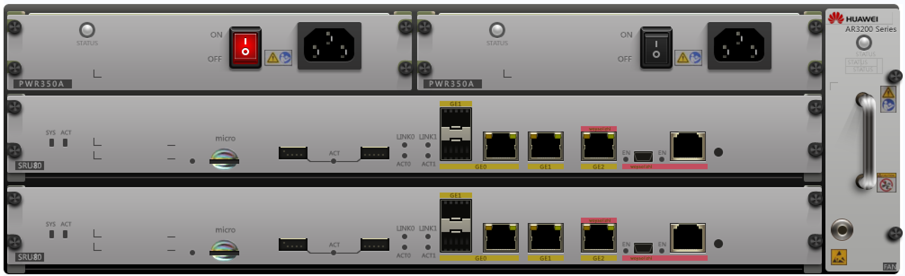

**交换机**：一交换机是局域网基于 MAC 转发数据帧、分割冲突域的设备。二层仅 MAC 转发，不能跨 VLAN；三层叠加 IP 路由，可跨 VLAN。ENSP 中 S3700 多为弱三层（仅简单 VLAN 间路由），S5700 是全三层（支持 OSPF 等动态路由，适合汇聚 / 核心）

实体机就长以下这样（下一来源：ENSP的S5700，下二来源：互联网）

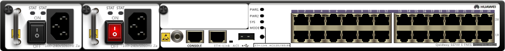

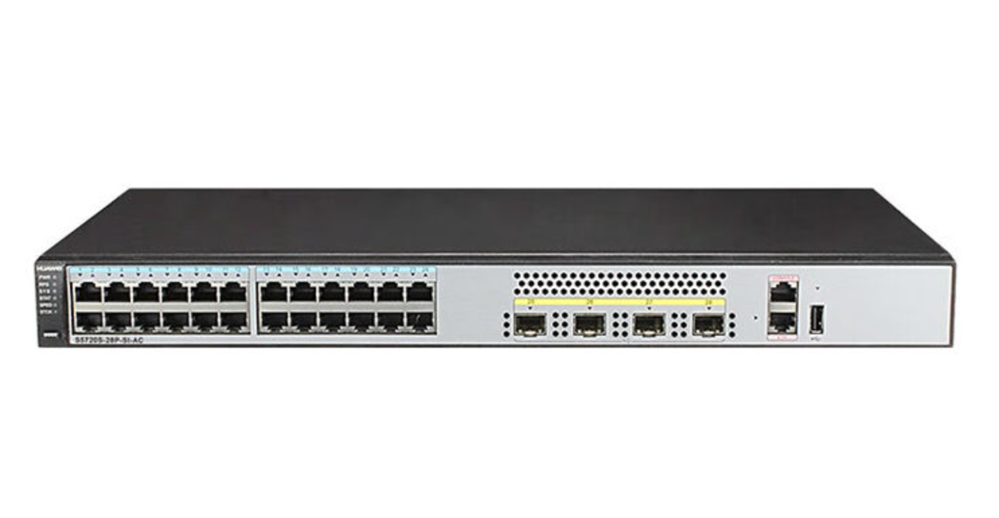

**以下讲解将会全部使用华为的ENSP环境来模拟，请先准备好运行环境**

华为ENSP下载教程：[点我直达](https://blog.csdn.net/weixin_43113691/article/details/124847964)

本次所使用的知识点大全：[点我下载](https://wwve.lanzn.com/b014wtwq5g)，密码：8m8l

现在我们来模拟一个企业的网络环境，从而实现边学边用

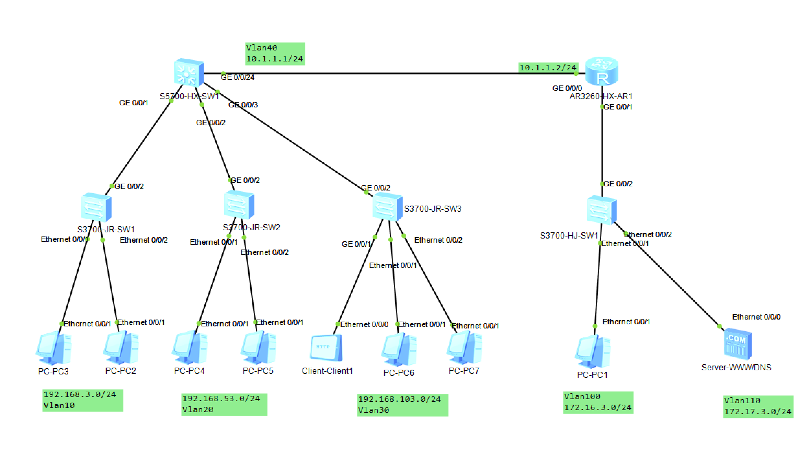

网络拓扑图分析：现将PC2-3，PC4-5，PC6-7&Client-1，划分成3个不同的vlan，代表着3中不同的网络环境，统一使用2层交换机来管理，并且最终将会汇聚到一个三层交换机中，使得可以连接路由器去访问在vlan100和vlan110下的网络，真实环境的效果图如下（使用思科模拟搭建模拟）

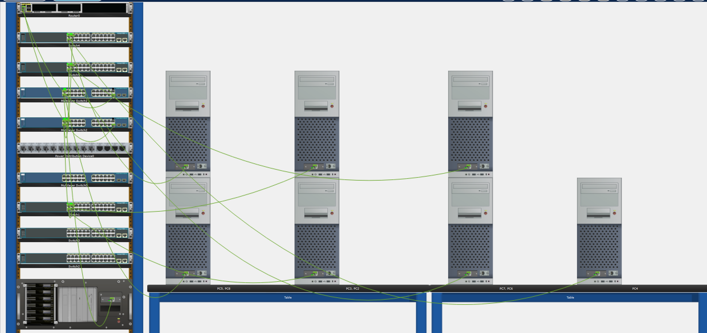

## 实验1：给设备重命名

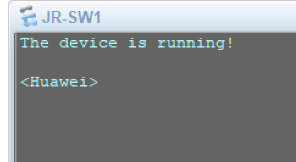

如果不重新命名的话，默认的名字会导致后面的配网工作混淆，导致不能顺利的理清思路，所以一般来说，会使用**设备层次+设备名称+编号来命名**，这里我将会使用L2-JR-SW1来去命名这台交换机，后面的设备也是同理

```bash
#进入系统视图，通常前面的设备会从 <huawei> 变成 [huawei] 这样，就代表成功了
system-view

#改名，将[huawei]改成[L2-JR-SW1]
sysname L2-JR-SW1
```

改名完成后如下：

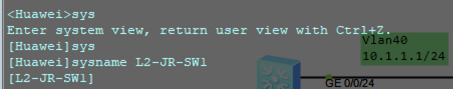

## 实验2：关闭烦人的消息日志

通常情况下，我们每次输入完成指令后，都会弹出一长串的消息日志，这些日志对我们输入一些长指令的时候很不友好，通常情况下，会选择关闭（每台交换机和路由器都会这样做）指令如下：

```bash
undo info-center enable
```

关闭后的指令如下：


## 实验3：配置合理的[IP地址](https://baike.baidu.com/item/IP%E5%9C%B0%E5%9D%80/150859)和[网关](https://baike.baidu.com/item/%E7%BD%91%E5%85%B3/98992)，使得**各个区域的网络设备和计算机能够正常的内网通讯**

通常会将同一个vlan下的网络设备划分到同一网段，PC3的配网如下图所示：

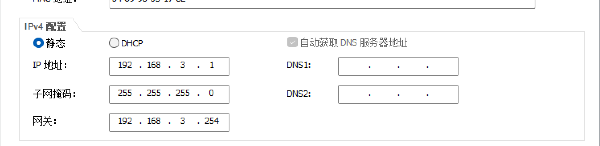

PC2的配网如下：

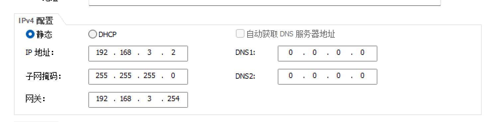

验证成果（使用PC3的终端去 ping PC2 的IP，检测是否Ping通）：

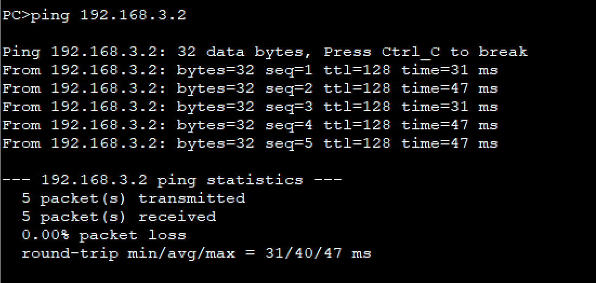

可以看到，我这台PC3的IP为192.168.3.1去ping192.168.3.2的时候是可以ping的通的

其余的设备也是如此，我在下面写了网段的划分，只需将这个IP地址的后一位划分成1/2就行，通常情况下我们习惯将网关设置成254，[子网掩码](https://baike.baidu.com/item/%E5%AD%90%E7%BD%91%E6%8E%A9%E7%A0%81?fromModule=lemma_search-box)通常划分成255.255.255.0就行

## 实验4：**在交换机上划分对应的VLAN，并且将其对应的物理端口划入到对应的[VLAN](https://baike.baidu.com/item/%E8%99%9A%E6%8B%9F%E5%B1%80%E5%9F%9F%E7%BD%91/419962?fromtitle=VLAN&fromid=320429&fromModule=lemma_search-box)中，使其能够进行正常的网络通讯**

进入L2-JR-SW2，vlan10的创建，划分和修改接口类型的步骤如下：

```bash
#先创建vlan，这里是创建vlan10的指令如下
vlan 10

#按下q退出这个[L2-JR-SW1-vlan10]模式，这里只是创建，而不是进入
q

#进入需要划分的接口，注意是eth口还是ge口
int e0/0/1

#随后修改接口类型为access模式
port link-type access 

#将该接口划分至vlan10
port default vlan 10
```

其他的设备也都是如此，比如vlan10，20，30，100，110

以上的操作都是进入交换机的**系统模式**下进行的操作

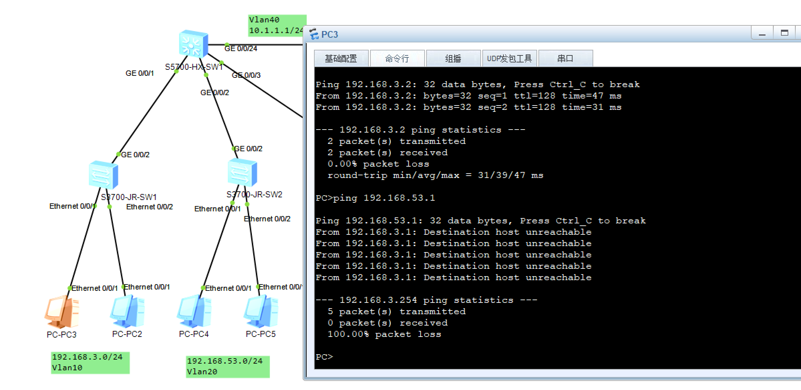

成功过后可以看到，在同一vlan下的PC相互能够成功通讯，而不在同一vlan下的PC相互不可通讯

**至此，最基础的子网划分以及一些基本操作你已经学会ヾ(≧ ▽ ≦)ゝ**

**看第二章前，请务必记住本章开头的”常识补充“**
