- 本项目基于华为的ENSP模拟器实现
- 我在这里会更加侧重于实践的步骤，至于部分的理论知识，请参考互联网或者Ai

> 本章的主要讲解的内容如下
>
> 1. 网关的配置
> 2. Rip路由&Rip的对端的简单加密
> 3. DHCP服务
> 4. OSPF路由
> 5. Rip路由与OSPF的结合

拓扑下载：[点我下载](https://wwbte.lanzn.com/b014wwaaja) ，密码：8hc8

本项目的拓扑如下图所示（可以看到，图片中划分了很多的网段，还有很多路由，不用慌，我会一步一步的来）

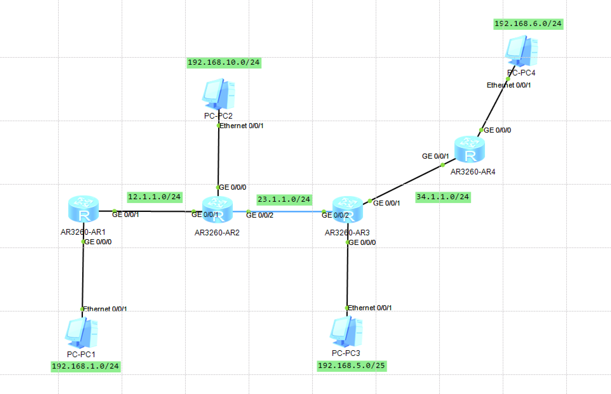

开始之前，可以输入sys（等同于system-view，为了方便，以下我将会使用sys这个简化后的指令来操作），进入特权模式（就是[huawei]的这个）输入以下指令，从而关闭烦人的操作日志：

```bash
undo info-center enable
```

出现以下提示则关闭成功：


另外，可以输入以下命令给设备命名，方便管理和以防混淆

```bash
sys + 你设备的名称
```


上图为我给路由器1，命名为AR1的截图

此外，退出特权模式（就是[huawei]的这个），进入用户模式下（就是`<huawei>`的这个），输入save，再按照提示输入y，可以随时保存（此操作强烈建议经常做，如遇到ensp模拟器死机的时候，重启设备的时候，保存前的信息不会丢）


**以上的操作非必须，但是建议这样做**

## I.项目1：给每个网段，配对应的网关

核心思路：该网关的IP其实就是上层与他连接的路由的IP

例如：我需要给PC1配网关的IP，那么我需要先进入上层的AR1与PC1连接的GE0/0/0口配IP，而这个IP就是PC1的网关IP

代码如下：

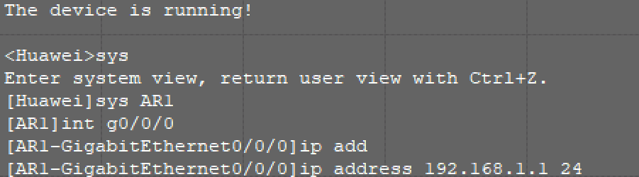

```bash
ip address + IP地址 + 子网掩码（255.255.255.0或24都行）
```

然后再进入PC1，给他配上网关和对应的IP，记得点击右下角的“应用”才会生效

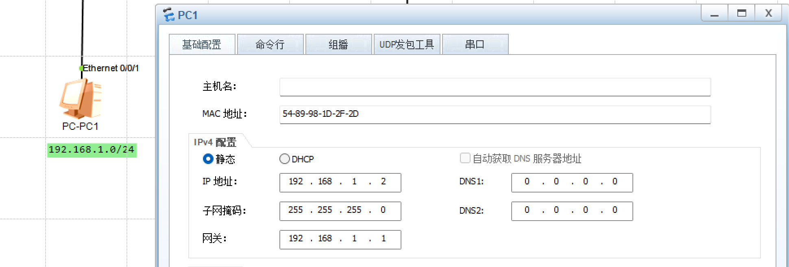

去在PC1上Ping自己的网关，可以看到能有结果，即可成功（这一步很关键，很多后续的实验未能成功，很有可能就是卡在了这一步）

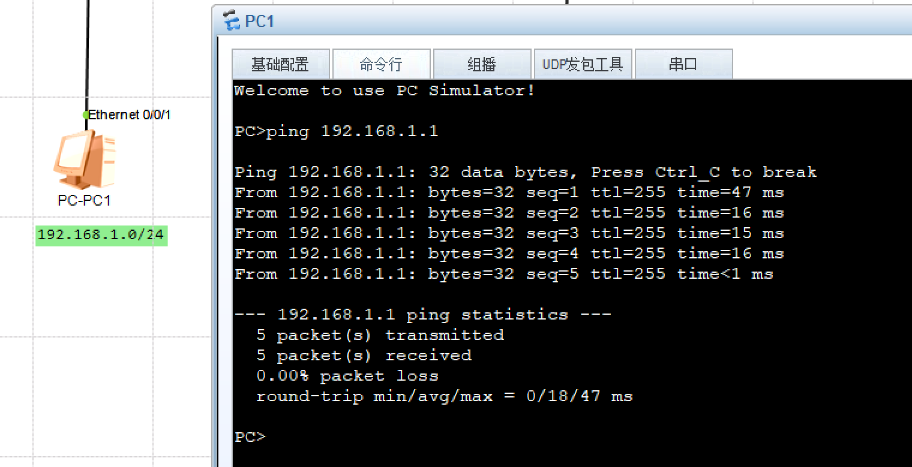

其他的设备也是如此(基本上连接路由器的PC机)都需要配置这个网关的（当然这也仅限于手动配IP的机器，DHCP自动分发IP的则不用在PC上手动配置网关）

## II.项目2：Rip路由

（1）首先先配合拓扑图，给对应的网段配网

我这里以我截选的这个来去分析


可以看到，我这里截图的是路由器，俩俩之间的网段的网络配置。需要进入所对应的端口来进行配置

比如我这里的最左边的这台路由，我就需要进入GE0/0/1口，去配置对应的IP地址，即为12.1.1.1/24（注意：这里的12.1.1.0是网段，不可俩边都配12.1.1.0/24）

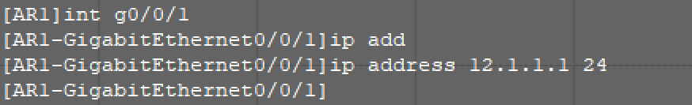


配置完成后，即可尝试着Ping试一下

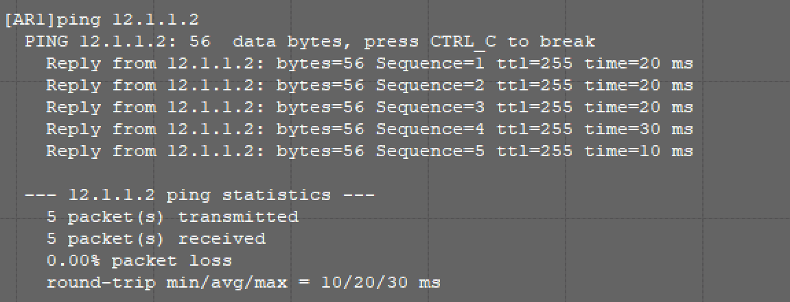

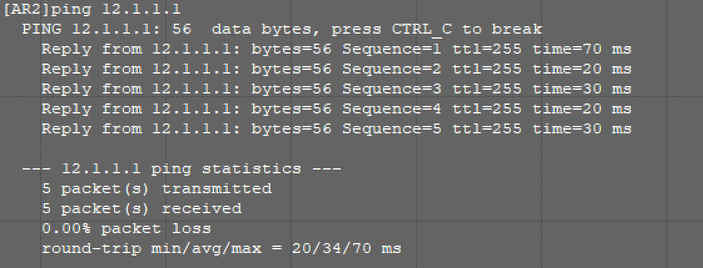

可以看到，能够相互通讯，成功！

以上演示的是AR1和AR2的配置（同样的AR2和AR3，AR3和AR4，AR5和AR6...）也都需要这样的配置

在三个路由器上启用RIP路由，并且设置版本为2

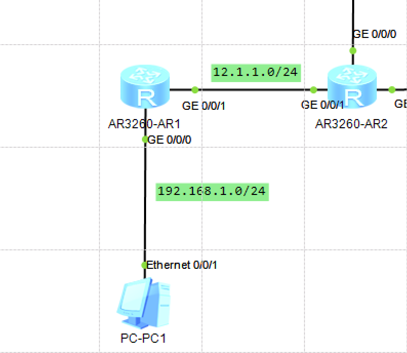

可以看到，这个AR1的路由涉及了两个网段（192.168.1.0/24和12.1.1.0/24）

（2）那么就需要创建RIP路由，去关联这两个网段

例如我们的这个拓扑图，就有12.1.1.0和192.168.1.0的

语法如下：

```bash
rip 1
//创建一个rip路由
version 2
//版本设置为2
network 192.168.1.0
network 12.0.0.0
//宣告网段
```

`*注`：这里RIP版本的原因，使用的是有类别路由协议，它的路由更新报文里不带子网掩码，只能按主类网络来发布路由信息，所以配置时得用12.0.0.0而非12.1.1.0，但效果都一样

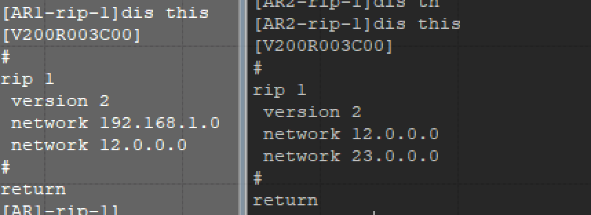

可以看到我在两边都添加了rip的网段，并且可以Ping通这个路由器的端口IP

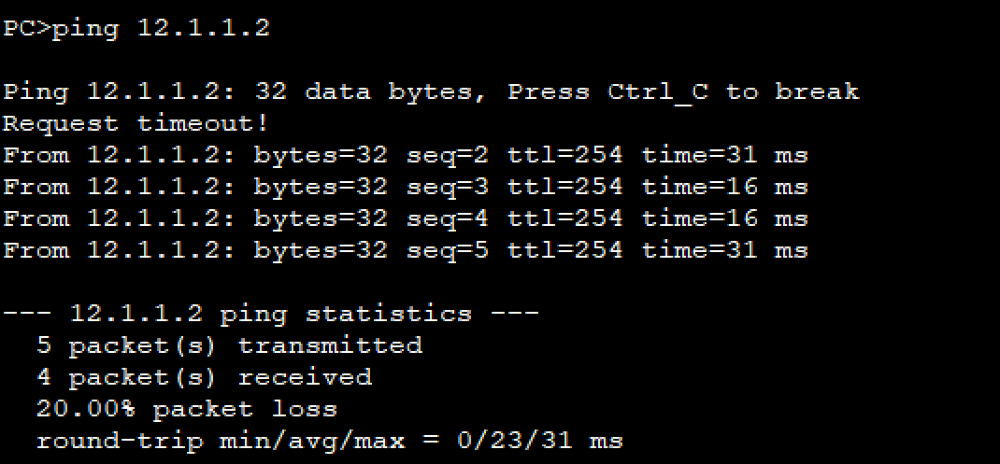

同理可得，在AR2，AR3....上也是如此，输入两个相邻的网段的IP，即可

最终结果，实现全网互通（这里我用的是PC3去Ping的PC1来进行验证）

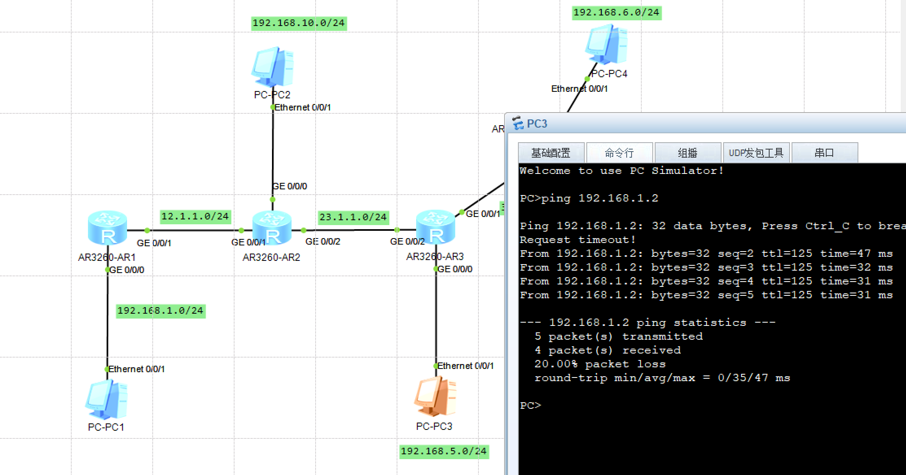

## Rip的对端简单加密：

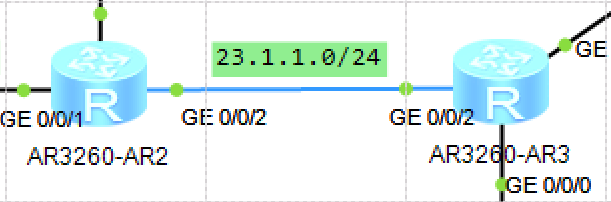

这里演示AR2和AR3的GE0/0/2和GE0/0/2口的端口加密

首先进入AR2的g0/0/2端口，代码示例如下：

```bash
[AR2]int g0/0/2  //进入AR4的接口
[AR2-GigabitEthernet0/0/2]rip authentication-mode simple cipher 123456  
//配置简单认证，密码123456（密文存储）
```

可以看到，这里我添加的密码已经转换成密文

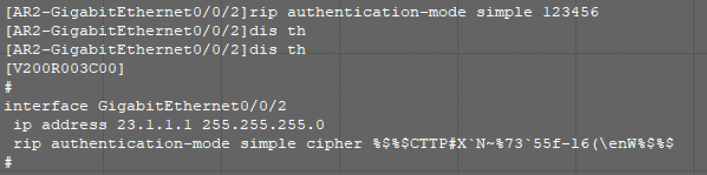

看到这，则说明这个AR2的g0/0/2端口已经加密了

我们来使用PC4去Ping PC1验证一下：

我设置了AR2的g0/0/2口的这个Rip密码，但是AR3的g0/0/2没设置，现在我用这个PC4pingPC1，并在AR2和AR3的这两个g0/0/2口抓的包

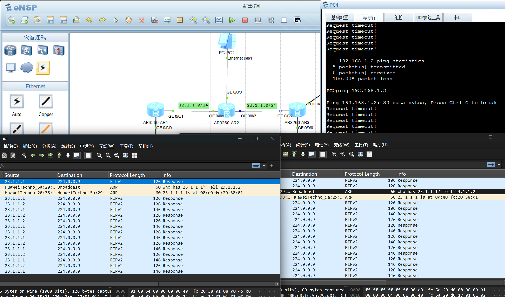

可以看到并没有Ping成功，代表着被Rip的密码给拦截了

当给AR3的g0/0/2口添加后这个Rip密码后，则可看到来自PC4的成功Ping请求

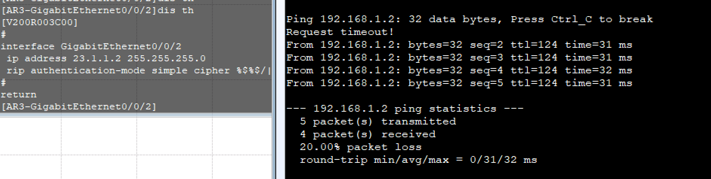

## III.项目3：DHCP拓展模块

我们在此基础之上，给PC4创建一个DHCP服务，使得其可以自行获取IP地址

首先先进入AR4，去配置DHCP服务

输入以下代码：

```bash
[AR4]ip pool pc4pool  //创建地址池，命名为pc4pool
[AR4-ip-pool-pc4pool]network 192.168.6.0 mask 255.255.255.0  //配置地址池网段
[AR4-ip-pool-pc4pool]gateway-list 192.168.6.1  //配置网关（即AR4的GE 0/0/1接口IP）
```

回到PC4，打开DHCP选项

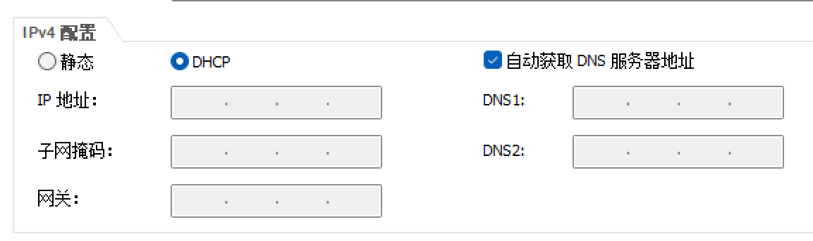

在终端中输入：`ipconfig /renew`来查看这个更新的信息

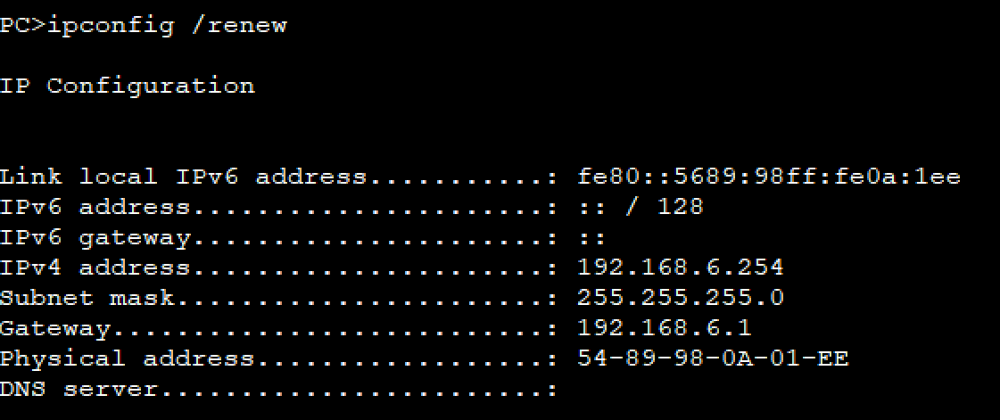

可以看到，已经获取到了IP地址

尝试Ping一下PC1的IP，当然也可以Ping通

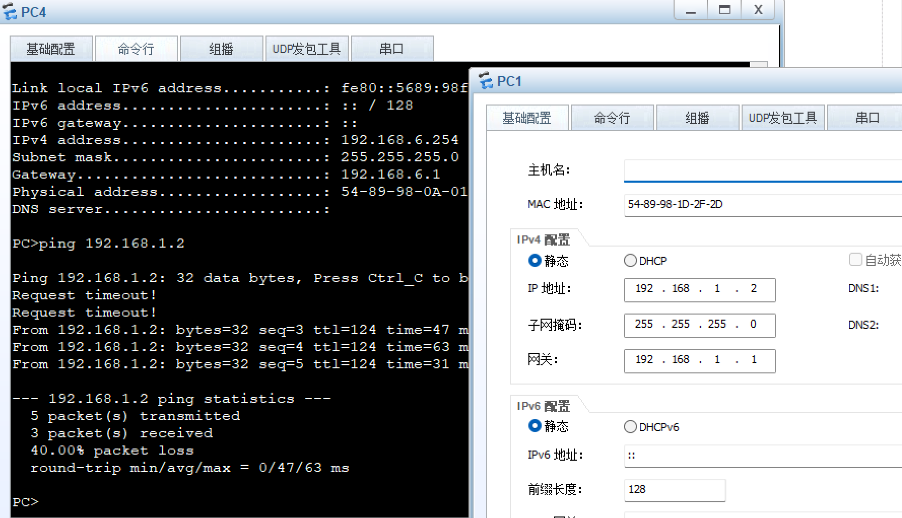

如果Ping不通，有问题，先尝试Ping一下自己网关，然后就是回头看看这个配RIP路由时候的，是不是两两之间的配置有一边network没配上

## IV.项目4：OSPF路由

在此基础之上，我们现在手动给这个AR2添加上这个拓展模块（此操作会使得AR2断电，一定要先保存！！！）

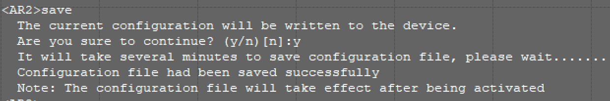

先进入用户视图`<huawei>`（也就是特权模式[huawei]下，输入q即可切换用户视图）

输入save，保存当前配置，否则会丢失配置

其次，右击AR2，鼠标点击“设置”，找到下面的“4GEW-T”的拓展模块，放入到这个AR3260里面

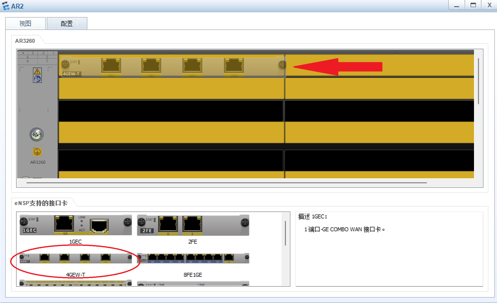

随后再次点击”启动设备“，将AR2启动起来

从左侧拖入两台AR3260和一台PC机，并使用Copper线连接起来

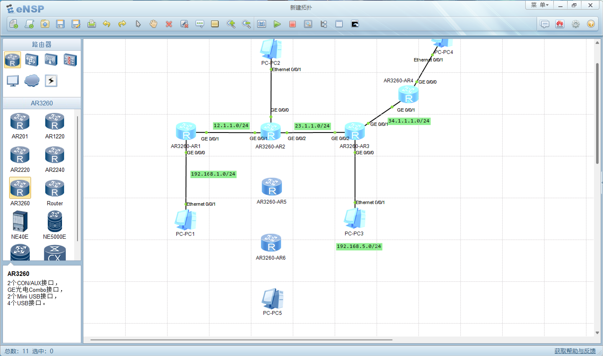

给这个新添加的两个网段（AR2和AR5我设置的是45.1.1.0/24网段，AR5和AR6我设置的56.1.1.0/24网段，AR6和PC5我设置的192.168.20.0/24网段）并且在这个我使用颜色框选的这个区域配置OSPF路由，使得在我所框选的区域内，可以实现设备互通

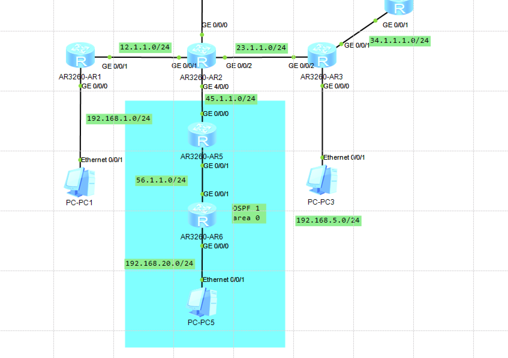

配置OSPF的步骤如下：

（1）首先进行基础配置，在所有终端上关闭Debug信息和对设备进行重新命名（AR5和AR6都都是如此），此处为在AR5上操作的截图

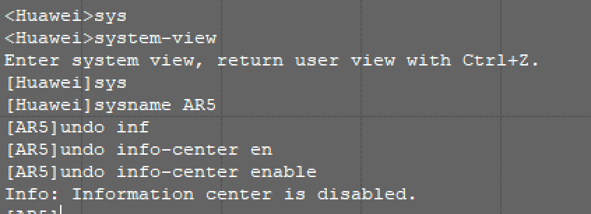

（2）对所有的路由器接口进行配置IP，并对终端进行地址的配置（此处仅演示了AR5上的截图）


`*注`：不要忘记了这个AR2与以下设备连接的GE4/0/0端口也需要配端口IP，这个很重要，千万不能忘记和漏掉（通常情况下，我们习惯将上层设备配xx.xx.xx.1，下层配xx.xx.xx.2）

（3）分别在**AR2,AR5,AR6**上配置OSPF，分别进行创建OSPF中路由器的ID，然后设置OSPF的区域，以及宣告自身的网络（此处演示了AR6的配置过程）

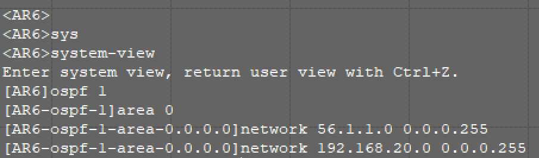

`*注`：不要忘记了这个AR2与以下设备连接的GE4/0/0端口也需要配OSPF，同上！这个很重要，千万不能忘记和漏掉

此处的network网段宣告指的是，与这个路由器所关连的网段，这里是AR6关联的上层的56.1.1.0/24和下层的192.168.20.1/24网段，示意图如下：

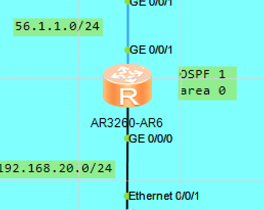

验证配置：（我这里使用PC5和AR6，去PingGE0/0/0口的45.1.1.2，发现可以Ping通，则代表已经实现配置的OSPF的网络全部连通）

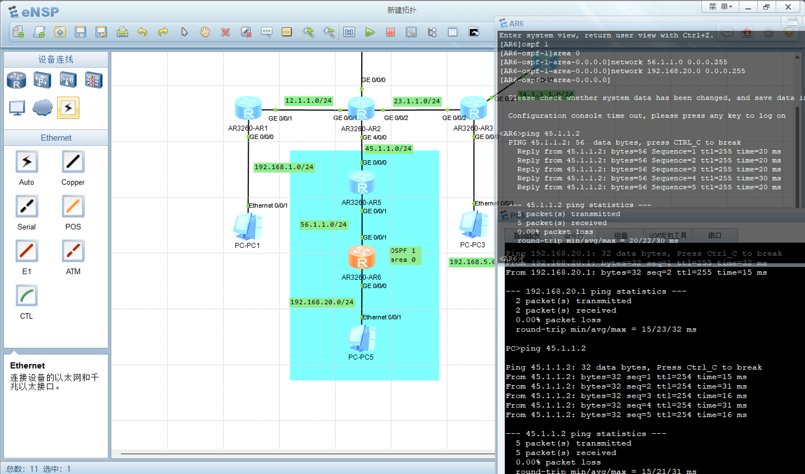

## V.项目5：Rip路由与OSPF的结合

如果在此基础之上，直接使用PC5去Ping PC1你会发现这根本Ping不通

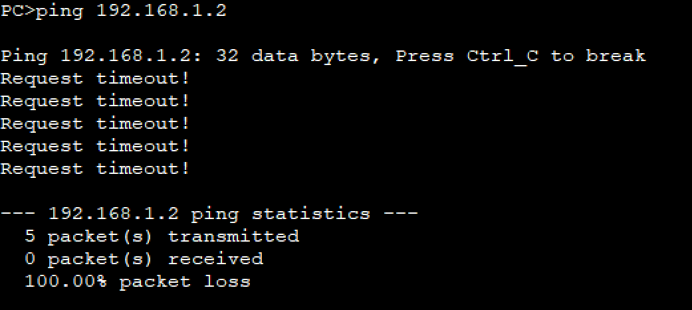

因为这个刚加入进来的这个OSPF以及它底下的所有设备（AR5,AR6,PC5）都没有与之前配置的Rip联动

可以输入以下指令，实现Rip与OSPF的互通

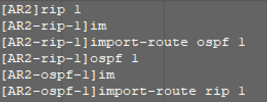

其实原理很简单，先进入Rip 1宣告之前创建的OSPF 1，再进入OSPF 1宣告之前创建的Rip 1就行了

以下是验证OSPF 1的PC5，去Ping跨网段且位于Rip 1的PC1，成功的截图（此外，全网也互通了）

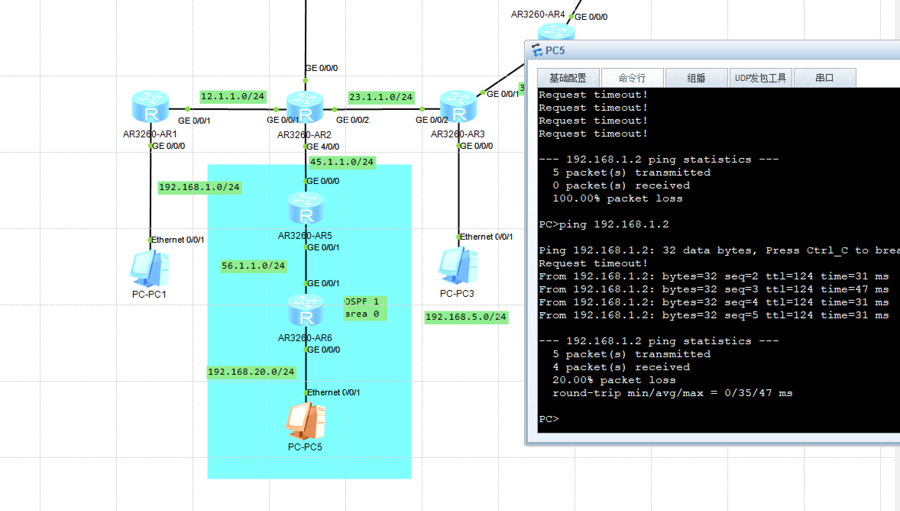

那么至此，你已经成功掌握以上的所有内容

感谢您的阅读，您的肯定是我更新的最大动力(/≧▽≦)/

此外，实战分析 Part 3 已经上线，欢迎访问(‾◡◝)
