本次项目实验目标：

- 实现全网互通（包含OSPF，不同网段vlan规划）
- 冗余网关协议（包含聚合链路，VRRP实验）
- 生成树协议STP&MSTP（含测试实验&拓扑扩展）

环境准备：[点我下载](https://wwbte.lanzn.com/b014wyb2zg)，密码：dqg6

## **全图总览如下**

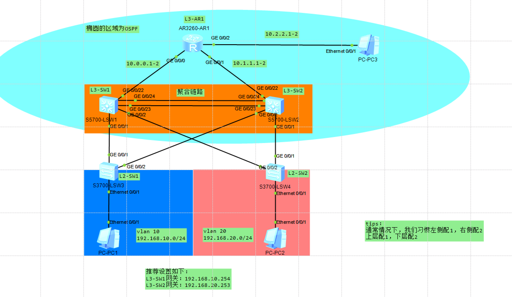

## 实验一：实现全网互通

Step1：先给我们的所有PC机以及各种设备，重命名，配置对应的网路地址和关闭Debug调试（这里我依旧以PC1，L2-SW1，L3-AR1为例）其余设备也是同理

PC1配置如下：（tips：PC3的网关就是与AR1连接的端口IP哦~）

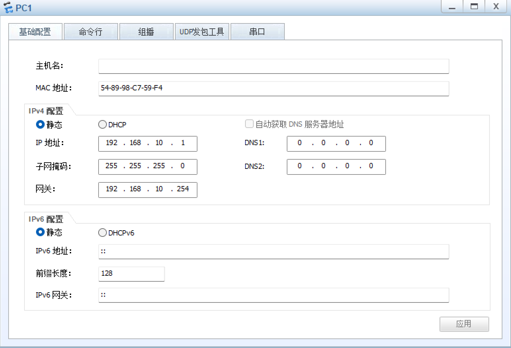

L2-SW1配置如下：

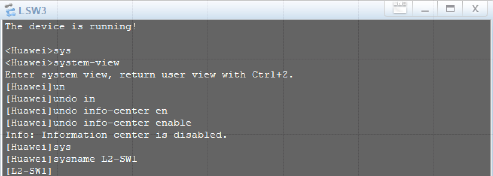

L3-AR1配置如下：

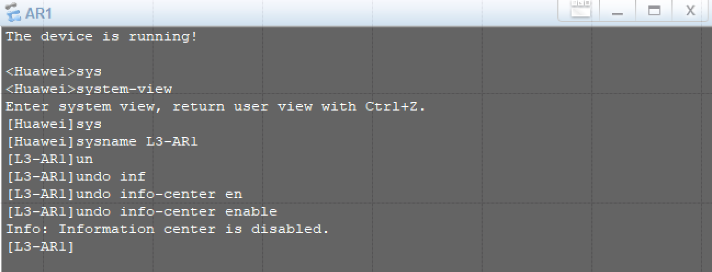

Step2：进入各个设备的对应端口，配置基础信息

先创建几个vlan以便后续的操作（vlan2 ，vlan10，vlan20）

- vlan2：用于给三层的交换机配IP
- vlan10：用于给PC1以及第二层的交换机配IP用
- vlan20：同理，用于给PC2以及对应的第二层的交换机配IP用

我这里依旧以L3-SW1示例：

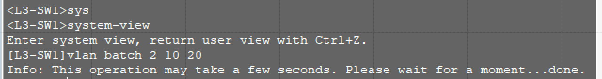

```bash
[L3-SW1]vlan batch 2 10 20
```

使用 vlan batch 命令，可以同时配置多条vlan

其次进入对应的vlan，去给他们分配IP地址

`*注：`在L3-SW1/2上的vlan2/10/20都不是同一个，都需要进入对应机器去单独配置

例如（我这里在L3-SW1上配的vlan2就和L3-SW2的不同）**目前只需要关注我标记出来的就行**

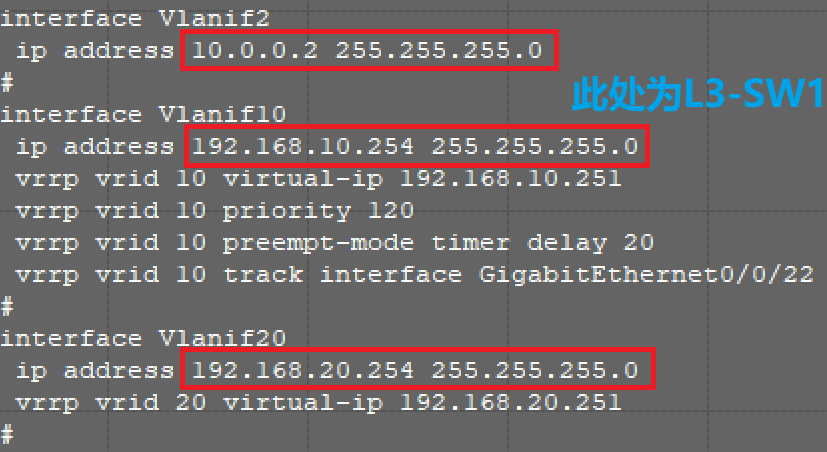

上图为L3-SW1，下图为L3-SW2（**目前先看标记的就行，其余的不着急配**）

看细节，这里我的L3-SW1/2的配置的同为vlan20的**ip最后一位不同**（此处的ip千万不能相同，否则会出现后期配VRRP的Master时候，会为双Master，不过就算配错，解决办法后面也有，往下看就行，别担心）

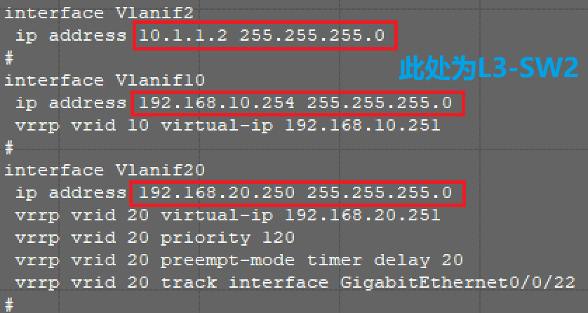

那么这个IP地址怎么去看呢？很简单，看连接的端口IP就行。例如我这个L3-SW1的vlan2的IP地址，就是来自于上层路由的连接端口的IP

Step3：在vlan的信息划分好之后，我们需要进入这个对应的端口，去把刚刚创建的vlan给它加入进来（我这里仅演示了L3-SW1的过程，L3-SW2也是同样的配置方法）

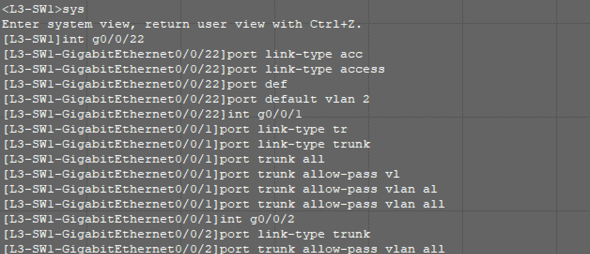

这里我设置 g/0/22 口的解释之后的步骤分别是：

1. 进入 g0/0/22 口
2. 设置 g0/0/22 的端口类型为`Access`模式（简单来说，是给连接终端设备，PC，服务器等用的“专属通道“，只走一个 vlan 的流量的模式）
3. 将之前配置的 vlan2 划分给 g0/0/22 口

设置 g0/0/1 口的步骤解释起来分别是：

1. 进入 g0/0/1 口
2. 设置 g0/0/1 的端口类型为`Trunk`模式（这个模式与Access模式不同的是，这个Trunk模式就是给“交换机之间”用的“共享通道”，使得设备之间的通讯能同时走多个 vlan 的流量）
3. 设置放行所有流量（通常不会这样做，但这里是实验环境，所以我就全部放行了）

 g0/0/2 也是和 g0/0/1 同理，这里我就不过多赘述了

Step4：我比较习惯从下网上配，所以在L3-SW1/2的准备工作做好了之后（也就是在创建好基础的vlan之后）我们先进入L2-SW1/2的 Ethernet 0/0/1 口，去配置与PC1相连接的接口模式

```bash
[L2-SW1]vlan 10
[L2-SW1-vlan10]q
//创建vlan10，并退出这个vlan的视图（IP地址不在这里配）
[L2-SW1-Ethernet0/0/1]int vlan 10
//使用int命令，进入vlan10
[L2-SW1-Vlanif10]ip address 192.168.10.254 24
//配置IP（IP地址+子网掩码）
[L2-SW1]int e0/0/1
//进入e0/0/1
[L2-SW1-Ethernet0/0/1]port link-type access 
//设置端口模式为access
[L2-SW1-Ethernet0/0/1]port default vlan 10
//划分vlan10到这个端口内
```

别忘了在L2-SW1/2还是有两根线连接着L3-SW1/2的（**GE0/0/1，GE0/0/2**口），所以你还需要进入这**两个口**里去配置接口模式，我这里依旧以PC1所对应的L2-SW1演示

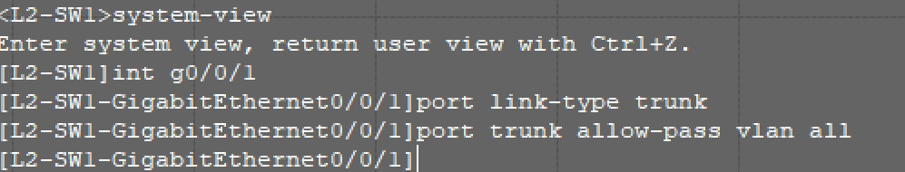

这里的思路依旧是：系统视图下→进入对应的端口→设置模式为`Trunk`模式→放行所有端口

这里使用PC1去Ping网关验证，看看能否Ping通对应网关（PC1的就是之前设置的192.168.10.254的那个）

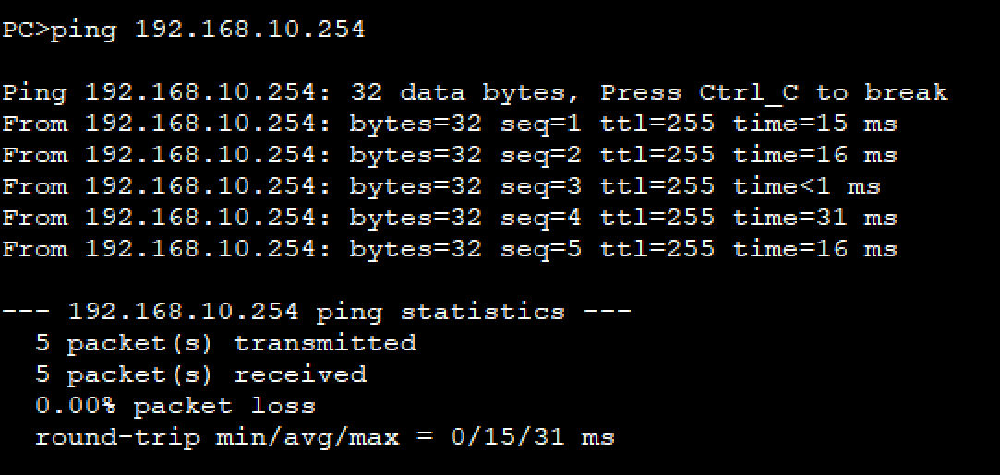

可以看到，我这里已经验证成功

这里的PC2所对应的L2-SW2也是同理，我这里就不过多赘述了（唯一需要注意的就是网关别配错，我这里PC2所对应的网关是**192.168.20.250**，别弄成254了）

Step5：设置在L3-AR1上配置基础信息以及OSPF路由

以下是用于设置各个端口的IP的指令（进入端口配IP就行，没啥难度的）

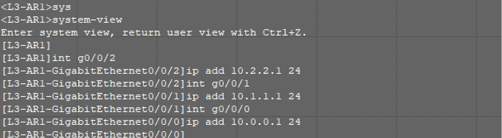

在L3-AR1上创建OSPF路由（就是加入临近的网段），如下图所示

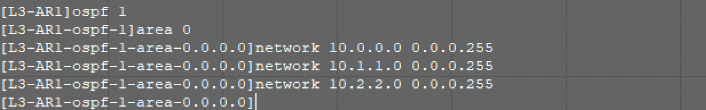

如果OSPF忘记了的朋友，可以去看看我的上一篇文章里面有讲，这里我就不过多赘述了

配置完成后再次回到L3-SW1/2中，我们需要在这**两个设备**中添加OSPF路由，从而实现全网互通

这是我在L3-SW1配置的操作，如下图所示：

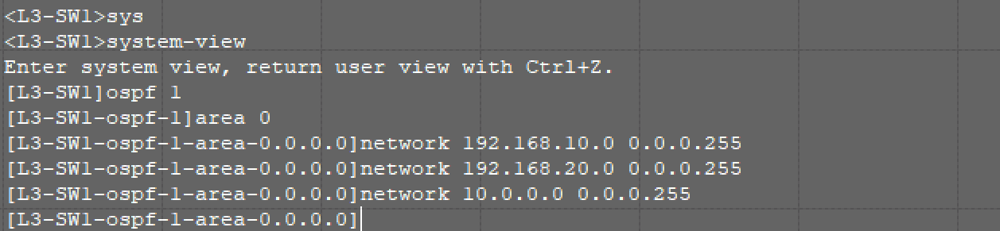

分别对应的是：

- 192.168.10.0的网段 + 反掩码
- 192.168.20.0的网段 + 反掩码
- 10.0.0.0的网段 + 反掩码

`*注：`L3-SW2也需要操作，切记不可以忘记！！！

这里我们依旧使用PC3去PingPC1测试，可以看到即使不在同一个网段也能Ping通，即为成功

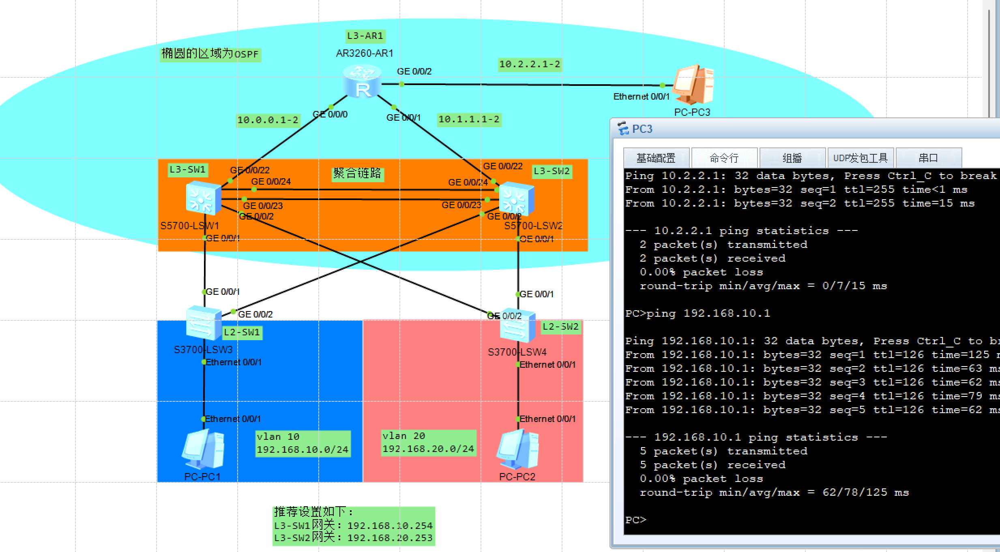

**至此，恭喜你已经实现基础的全网通**

## 实验二：冗余网关协议（聚合链路&VRRP）

在原有的基础之上，我们将继续操作（`*注：`以下的Ping实验验证时，可能会存在短时间Ping不通的情况，那是涉及到ENSP模拟器的性能，及这个网络协商的时间差）我会给L3-SW1与L3-SW2之间配聚合链路

## 聚合链路配置

功能概述：是一种将**多个物理链路捆绑成一个逻辑链路**的技术，核心作用是**提升带宽、增加链路冗余**

Step1：首先进入L3-SW1上，创建一个聚合接口为Eth-Trunk2，并且设置聚合口中最大的活动数为2，最后将物理端口加入到当前聚合口中

下图为我在L3-SW1上的演示：（L3-SW2也是同理）

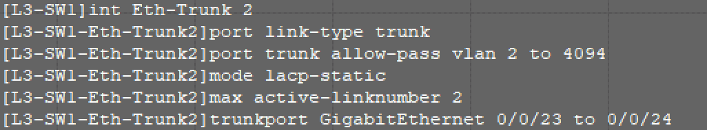

创建聚合链路Eth-Trunk2如下：

```bash
[L3-SW1]int Eth-Trunk 2
//创建名为 Eth-Trunk 2 的隧道
[L3-SW1-Eth-Trunk2]port link-type trunk
//设置端口类型为Trunk模式
[L3-SW1-Eth-Trunk2]port trunk allow-pass vlan 2 to 4094
//放行所有端口
```

在刚刚创建好的Eth-Trunk2链路中加入两个端口，如下所示：

```bash
[L3-SW2]int Eth-Trunk 2
//进入 Eth-Trunk 2 端口
[L3-SW2-Eth-Trunk2]trunkport GigabitEthernet 0/0/23 to 0/0/24
//将之前配置的信息应用到 g0/0/23和24口
```

**至此，聚合链路部分就已经成功配置完毕了**

## VRRP配置

功能概述：它是一种用于**网关冗余备份**的网络协议，核心作用是让多台设备（通常是交换机 / 路由器）共享同一个 “虚拟网关 IP”，避免单点故障导致终端无法上网

Step1：首先创建 vlan 10 和 vlan 20 的虚拟地址（我这里将vlan 10/20 的设置为192.168.10/20.251）

Step2：设置监控上行链路为g0/0/22端口，我将设置 L3-SW1 作为 vlan 10 的 Master 设备（所以需要对vlan 10 的vrrp组设置优先级为 120 ，设置链路抢占时间为 20 秒）

配置如下（我在L3-SW1演示的截图）：

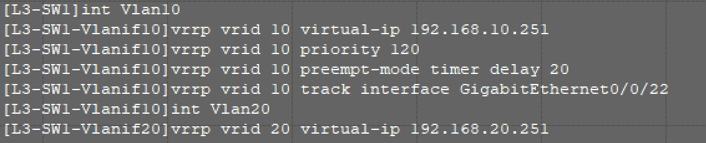

逐行代码解释如下：

```bash
[L3-SW1]int vlan10
//进入 vlan10
[L3-SW1-Vlanif10]vrrp vrid 10 virtual-ip 192.168.10.251
//设置一个虚拟id为10的vrrp vrid，并划分虚拟ip为192.168.10.251
[L3-SW1-Vlanif10]vrrp vrid 10 priority 120
//设置这个vlan10下的虚拟id的优先级为120
[L3-SW1-Vlanif10]vrrp vrid 10 preempt-mode timer delay 20
//设置vlan10的虚拟id链路抢占时间为20秒
[L3-SW1-Vlanif10]vrrp vrid 10 track interface GigabitEthernet0/0/22
//让vrrp 10的配置应用在L3-SW1的g0/0/22的端口
[L3-SW1-Vlanif10]int vlan20
//进入vlan20
[L3-SW1-Vlanif20]vrrp vrid 20 virtual-ip 192.168.20.251
//配置vlan20的vrrp的虚拟id
```

此外在L3-SW2上也亦是如此：

```bash
[L3-SW2]interface vlan10
[L3-SW2-Vlanif10] vrrp vrid 10 virtual-ip 192.168.10.251
//以上用于在这个L3-SW2上去宣告vlan10下的的虚拟id

[L3-SW2-Vlanif10]int vlan20
[L3-SW2-Vlanif20]vrrp vrid 20 virtual-ip 192.168.20.251
//以上用于去设置一个虚拟id为20的vrrp vrid，并划分虚拟ip为192.168.20.251

[L3-SW2-Vlanif20]vrrp vrid 20 priority 120
//设置这个vlan20下的虚拟id的优先级为120
[L3-SW2-Vlanif20] vrrp vrid 20 preempt-mode timer delay 20
//设置vlan20下的虚拟id链路抢占时间为20秒
[L3-SW2-Vlanif20] vrrp vrid 20 track interface GigabitEthernet0/0/22
//让vrrp 20的配置应用在L3-SW2的g0/0/22端口
```

 L3-SW2的配置图片如下：

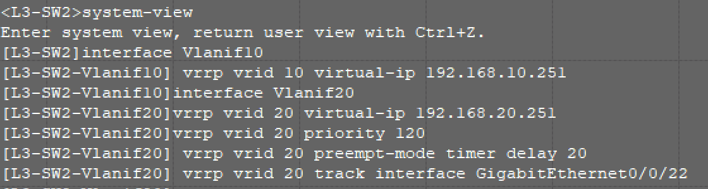

`*常见问题`：如果我已经配了不同的的优先级（也就是输入了在L3-SW1和L3-SW2不同的vrrp vrid 10 priority 120/100）还是显示都为Master，怎么解决？（如下图所示）

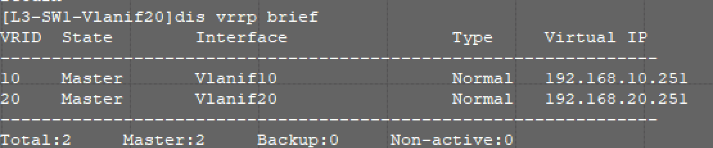

上图的这个vlan20理应是Backup，而不是Master（此处为错误示范）

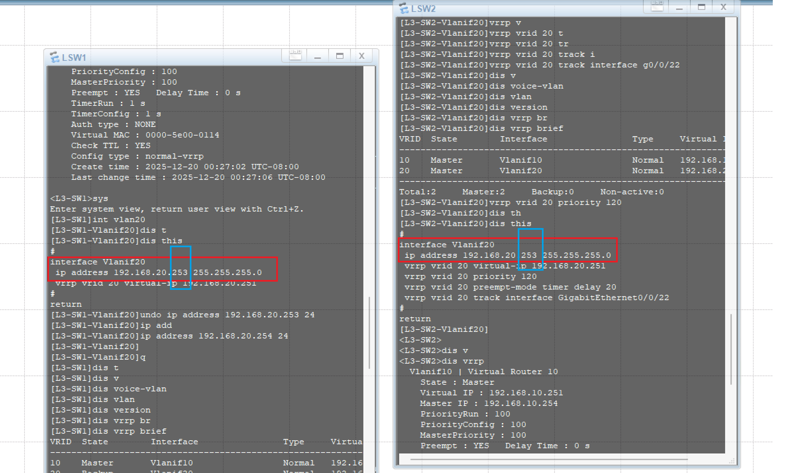

这个很显然就是L3-SW1或L3-SW2的vlan10/20的IP地址最后一位冲突了，只需要进入对应的vlan，修改vlan的ip就可以解决

## 需要注意的是这里的L3-SW1和L3-SW2上的vlan20下的ip不能和同网段的ip一样，否则大概率失败

操作如下（比如我这里就是L3-SW1上的vlan20的ip配错了，不小心配成和L3-SW2一样的ip了）：

```bash
<L3-SW1>sys
//进入系统试图
[L3-SW1]int vlan20
//进入vlan20

[L3-SW1-Vlanif20]dis this
#
interface Vlanif20
 ip address 192.168.20.253 255.255.255.0
 vrrp vrid 20 virtual-ip 192.168.20.251
#
return
//查看这个端口的情况，发现错误地方

[L3-SW1-Vlanif20]undo ip address 192.168.20.253 24
//删除错误ip，使用undo + 需要删除的指令

[L3-SW1-Vlanif20]ip address 192.168.20.254 24
//添加新的ip
```

修改后即可恢复正常状态（如下图所示）：

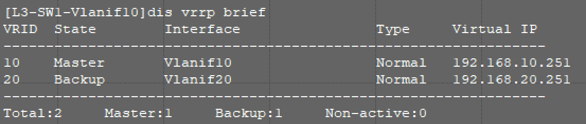

Step3：设置完成VRRP之后，需要将全部网络进行联通，所以需要在三层设备上配置OSPF路由，首先进行路由器ID设置，设置路由器的ID信息如下

|  |  |
| --- | --- |
| **设备** | **ID** |
| L3-AR1 | 1.1.1.1 |
| L3-SW1 | 2.2.2.2 |
| L3-SW2 | 3.3.3.3 |

配置命令如下（这里我以L3-SW1演示）：

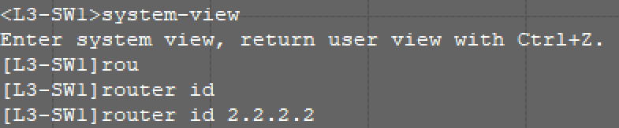

```bash
[L3-SW1]router id 2.2.2.2
//修改router id
```

至于在L3-AR1，L3-SW1与L3-SW2之间的OSPF部分，我已经在前面的部分说过了，这里我就不在过多赘述了（前面配过的可以跳过此步骤，没配的记得配一下）

## 验证环节

这里我使用wireshark抓包工具向你直观的展示VRRP的“起死回生”环节

我们首先使用PC1去一直Ping PC3（我使用的是ping + ip地址 + ”-t“命令）来保持PC1一直往PC3发送[ICMP](https://baike.baidu.com/item/ICMP/572452)的报文

可以看到这里的PC1走的是GE0/0/2口（图中展示了GE0/0/2抓到了来自PC1与PC3之间通讯的ICMP报文，而这个GE0/0/1口则没有，只是普通的VRRP和OSPF的[多播协议](https://blog.csdn.net/x13262608581/article/details/134025835)）

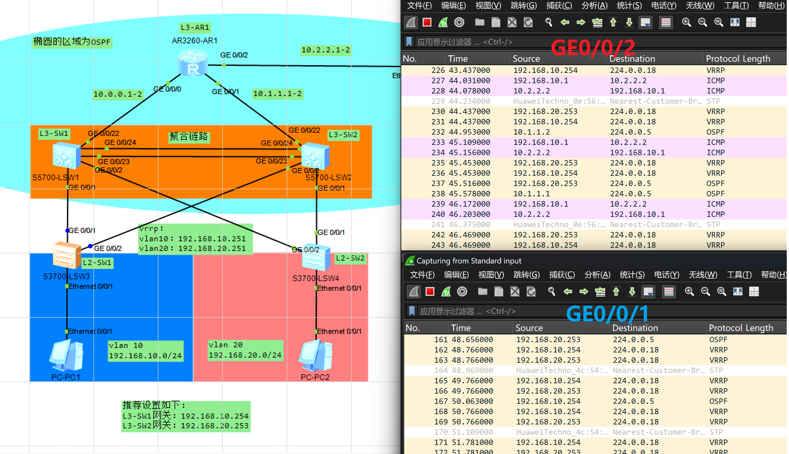

接下来，我将这个PC1与PC3通讯的L3-SW2机器给它物理关掉，那么则会发生下图的的情况（由于本人的电脑性能不佳，等待了较长的时间）最终成功等待到了这个L3-SW1的再次通讯

可以看到我在下图的这个GE0/0/1口，成功捕捉到了来自于这个VRRP协议再次拉起的PC1于PC3的ICMP的通讯信息的数据包

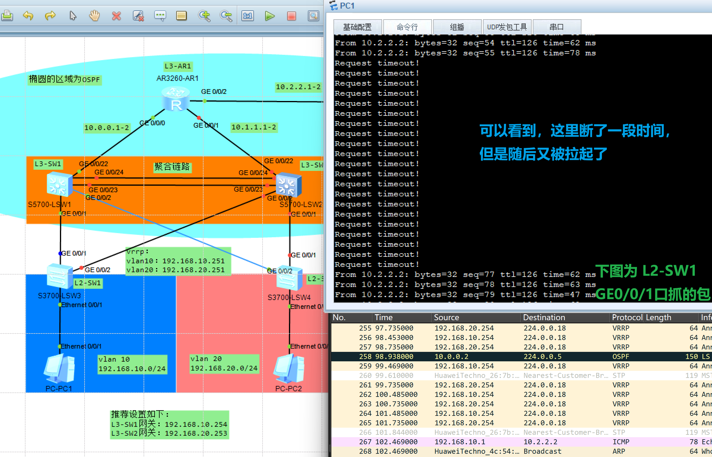

从以上的实验可简单说明这个VRRP冗余网关协议的作用

**至此，VRRP配置的部分就已经成功配置完毕了**

## 实验三：生成树协议STP&MSTP

在学习这个概念之前，我们需要先简单的了解有关于以下这几个问题的产生原理，才能理解这STP协议和MSTP协议的本质

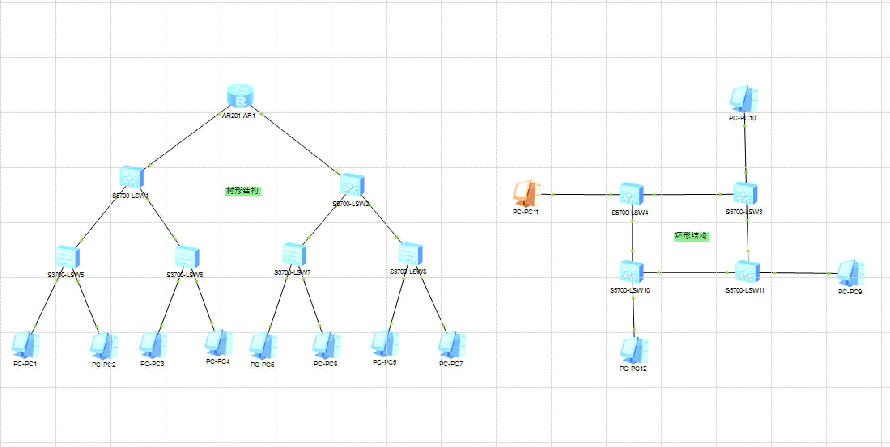

> ##### Q：网络环路的产生&什么是网络环路？
>
> **A：**网络设备之间物理意义上的形成环形连接，简单来说就是网络设备之间不存在树状结构的网络拓扑，而全是按照环形拓扑所连接的，那这个我们就称之为网络环路（如上图所示**左侧所示为树状结构，右侧为环形结构**）
>
> ##### Q：环形网络会导致什么问题？
>
> **A：**网络环路会导致**广播风暴**和交换机的**帧交换表震荡**
>
> ##### Q：什么是生成树协议？
>
> **A：**以太网交换机使用生成树协议STP（Spanning Tree Protocol），可以在**提高网络可靠性的同时又避免环路带来的各种问题**
>
> ##### **Q：什么是生成树算法？**
>
> **A：**那顾名思义，前面我们知道了环路没有树形结构，那么这个生成树算法就可以简单理解成**在这个环路的网络中创建一个树形拓扑**，既可以利用环路的备用优势，还可以避免环路的劣势问题
>
> ##### Q：生成树算法的定义及目标
>
> **A：**生成树算法STA（Spanning Tree Algorithm）是生成树协议STP（Spanning Tree Protocol）的核心。而它的实现目标是：**在包含有物理环路的网络中，构建出一个能够连通全网各节点的树型无环逻辑拓扑**

**接下来我来为你展示STP是怎么工作的**

首先我们线看到下图，这张图表示着有3台PC（分别为命名为H1&2&3），在每台机器的上层都连接着一个交换机，为了保障这3台机器之间能正常通讯，我们会把这3个交换机的连接设置成环路（目的是为了利用环路的优势去创建备用链路），而这个STP协议就是为了防止环路的产生而设置的（而这个STP协议则会在保证线路通畅的同时，暂时阻塞一个用不着的端口，从而实现防止环路的形成）

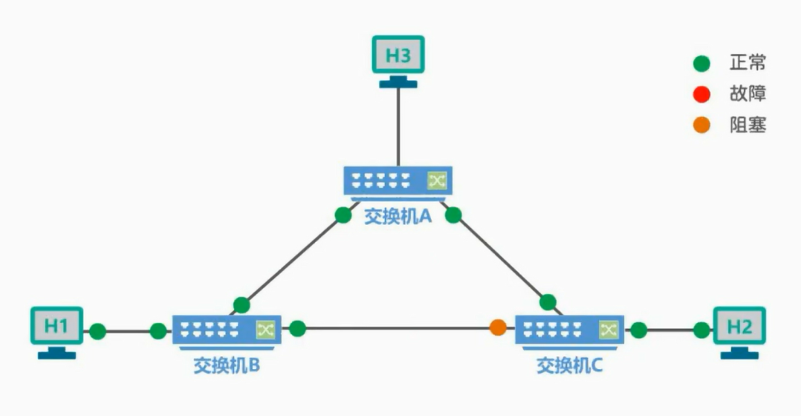

如上图所示，我们在3台交换机上设置了STP生成树协议，可以看出STP协议的工作原理是把交换机C上的一个接口调整成暂时阻塞的状态，来实现保证网络拓扑的树状结构的

如下图所示，我们的交换机A的一个端口出现了故障，那么这个STP协议就会立即打开原本阻塞的端口**顶替已经故障的线路**，实现内网的正常通讯

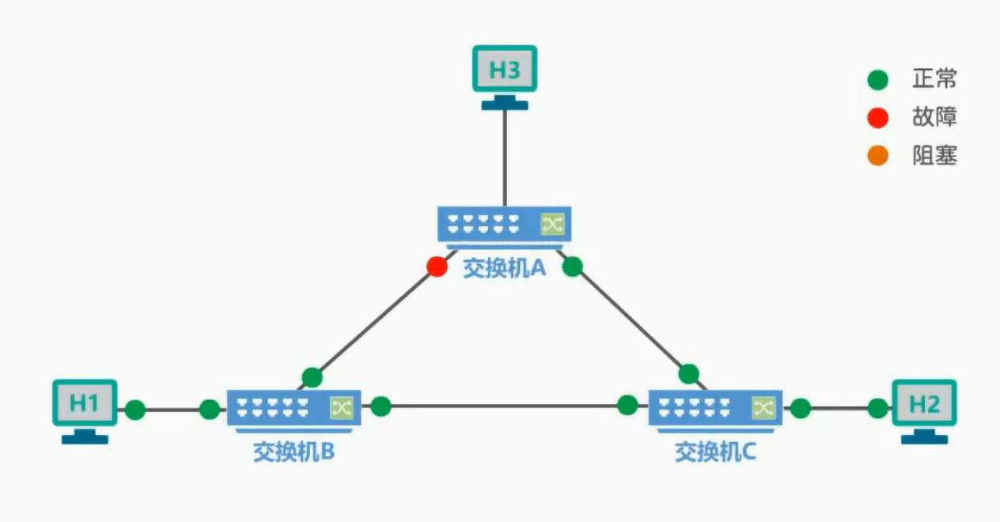

**以上就是STP协议的的简单理解**

生成树算法的三个步骤：

1. “选举”根交换机
2. “选举”根端口
3. “选举”指定端口并阻塞备用端口

现在我们在之前的那个拓扑里再次添加几个路由器，和一台“傻瓜”交换机（这里的傻瓜不是字面意思，指的是这个交换机不做配置，只是默认当成路由器的集线器使用）组成一个新的网段，并设置成VRRP来实验

由于前面我说过这个VRRP的配置过程了，那我这里只作简要说明了

（1）：给L3-AR1添加网口，用于拓展连接（记住，这里新添加的接口是GE4/0/\*了，别ip配错了）

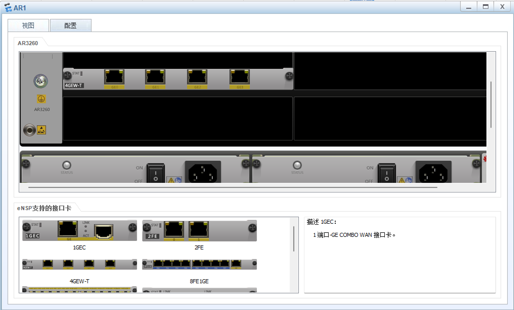

（2）：添加&配置新的路由，拓扑如下（改名，配端口ip等基础操作）

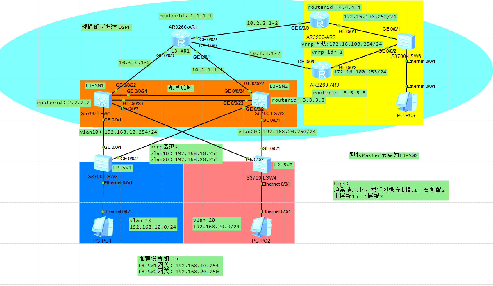

`*注意点`：（重要核对排查信息点已使用方框括起来了）

（1）L3-AR1的OSPF要添加一条来自于10.3.3.0网段的记录

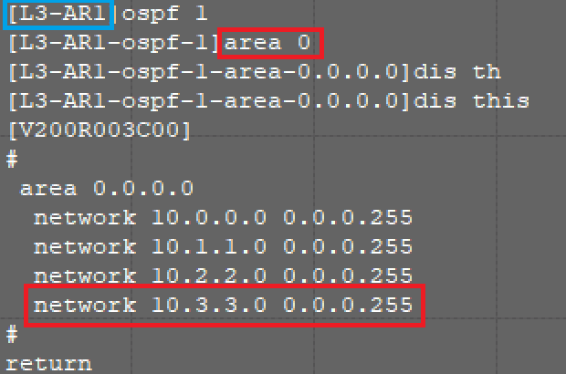

（2）新添加的L3-AR2/AR3都要添加OSPF（网段来自10段和172段的）

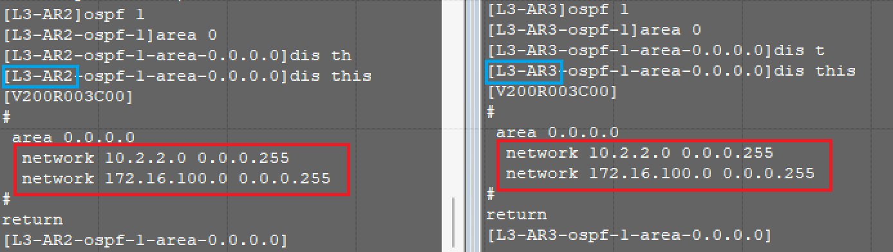

（3）新添加的这个L3-AR2/3对应的router id分别为4.4.4.4和5.5.5.5（1~3已经被前面的L3-SW1/2&L3-AR1占用了）

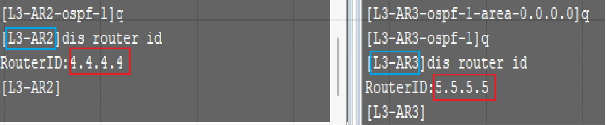

（4）VRRP设置的时候需要将L3-AR2设置成Master节点，(即这个端口的优先级设置为120）L3-AR3则不需要设置优先级，但是vrrp virtual-ip必须要两个都配置（还需注意vrid的分组）

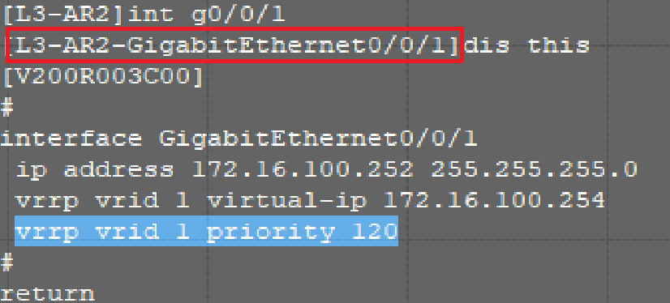

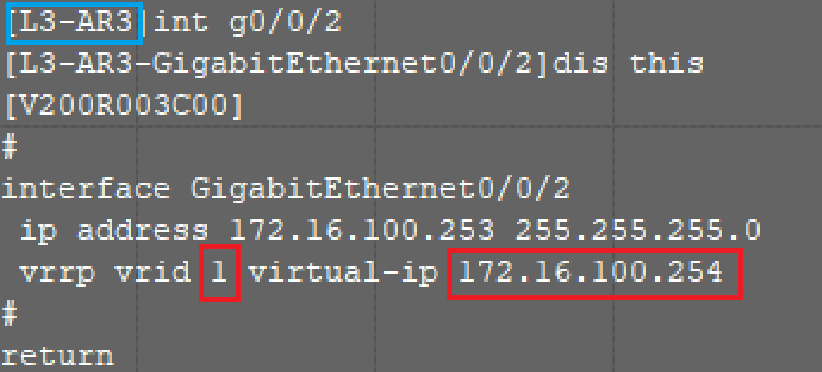

（5）PC3的网关改成VRRP的虚拟ip，这个直接配在L3-AR2/3的GE0/0/2口就行（PC3的地址我配置的默认是172.16.100.1）

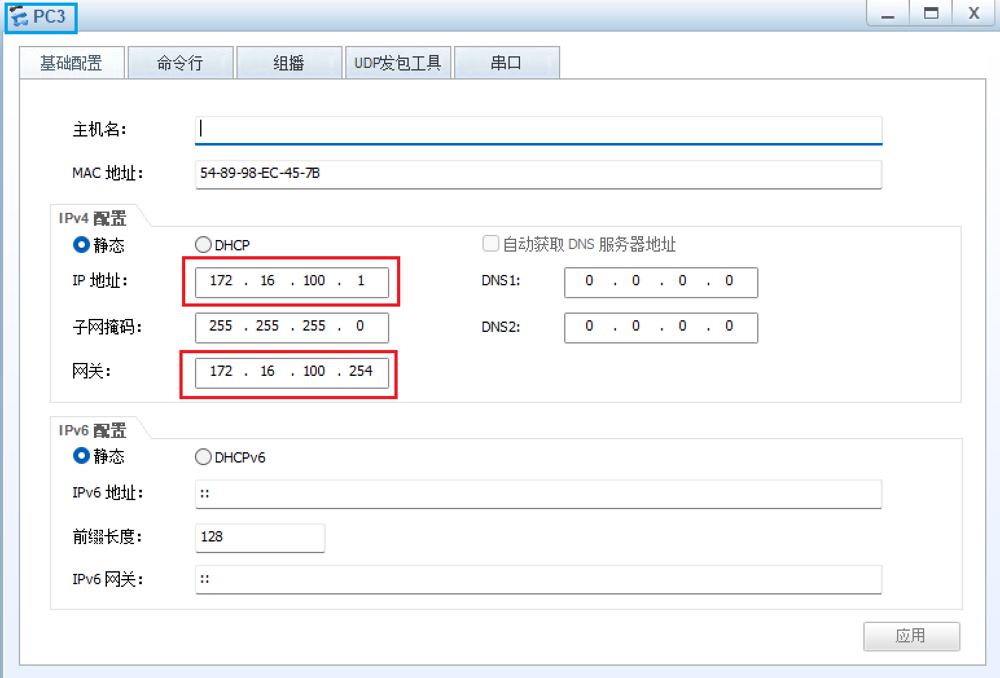

（6）L2-SW3可以不用做任何的设置，直接当成“傻瓜”交换机就行

（7）测试是否全网通（我这里使用PC3去Ping pc1&pc2去测试网路连通性）

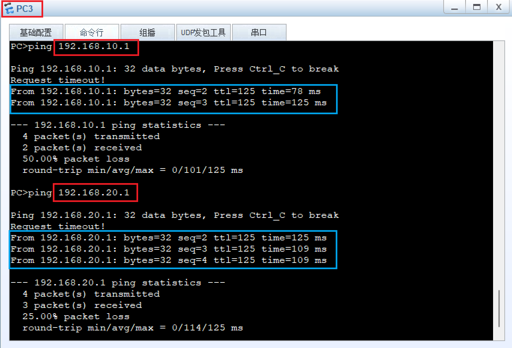

**可以看到能成功相互通讯，那么即代表成功**

在掌握了STP的一些基础的概念之后，那么MSTP和STP就很好区分了

**MSTP 的域概念：**

MSTP 引入了**MST域（MST Region）** 的概念，同一域内的交换机必须配置相同的**域名、修订级别和vlan的实例映射关系**，否则会被视为不同的域，按**RSTP**的方式处理（RSTP就是STP的快速版本，而MSTP则是在RSTP基础上扩展了多实例功能，因此 MSTP同时具备**“快速收敛”**和**“多 VLAN 灵活控制”**的优势）

**MSTP的核心作用：为不同 VLAN 映射的实例指定根桥，实现流量按需转发**

**MSTP相关的实验：**

**步骤一：**先进入L3-SW1和L3-SW2的这俩个交换机，配置状态为MSTP

首先在四台交换机上配置MSTP的区域（需要四台设备的参数完全一致，我这里仅在L3-SW1演示）

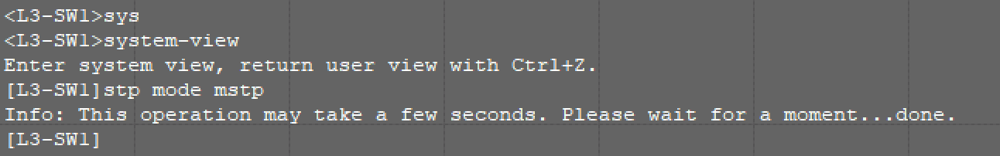

然后在L3-SW1和L3-SW2上输入以下的指令

```bash
[L3-SW1]stp region-configuration
//进入MSTP域的配置视图
[L3-SW1-mst-region]region-name huawei
//设置MSTP域名为 huawei（同域设备域名需一致）
[L3-SW1-mst-region]instance 1 vlan 10
//将vlan10映射到生成树实例 1
[L3-SW1-mst-region]instance 2 vlan 20
//将vlan20映射到生成树实例 2
[L3-SW1-mst-region]active region-configuration 
//激活上述MSTP域配置，使其生效
```

**核心作用**：让vlan10/20分别按实例 1、2 独立计算生成树，实现不同vlan的流量负载分担

输入stp region-configuration进入配置界面，使用display this来查看当前配置是否生效，以及复制以下内容，后续有用

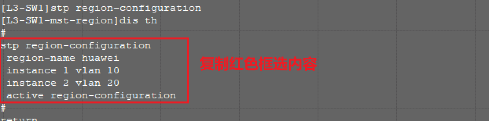

**步骤二：**继续在L3-SW1上和L3-SW2上进行根节点的配置，因为在VRRP中配置了vlan10的Master节点为L3-SW1所以，在配置的时候，将生成树的1区域，在SW1上设置为根节点，将2号区域设置为非根节点

```bash
[L3-SW1]stp instance 1 root primary
//设置本交换机为MSTP实例 1 的主根桥（优先级最高）
[L3-SW1]stp instance 2 root secondary
//设置本交换机为MSTP实例 2 的备根桥（优先级次高），主根桥故障时它接替成为实例 2 的根桥
```

下图为L3-SW1的配置（注意root的顺序，1为主要，2为次要）


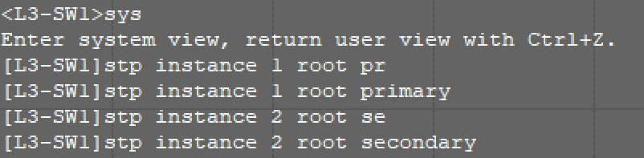

`*细节注意：`在L3-SW1上是这样配的，一旦到了L3-SW2可就不是这样了（如下所示，要和L3-SW1对称配）

```bash
[L3-SW2]stp instance 1 root secondary
//设置 1 号区域为非根节点
[L3-SW2]stp instance 2 root primary
//设置 2 号区域为根节点
```

下图为L3-SW2的配置（注意root的顺序，2为主要，1为次要）


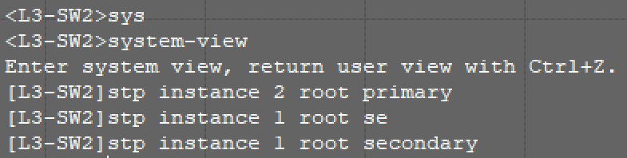

**检查配置环节**

（1）使用这个PC1去PingPC3，可以Ping通

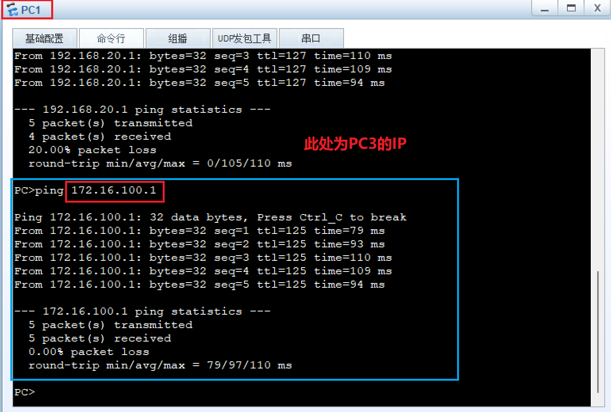

（2）查看L3-SW1的stp设置情况，可以看到各个端口都是打开的状态，意味着L3-S我处于根桥，如下图所示

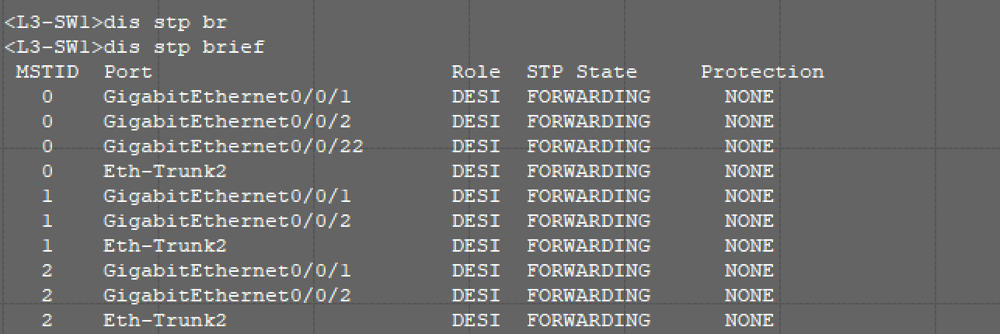

（3）L2-SW1上，查看一下stp的情况，也是可以发现之前设置，也是可以实现PC1的流量走L3-SW1

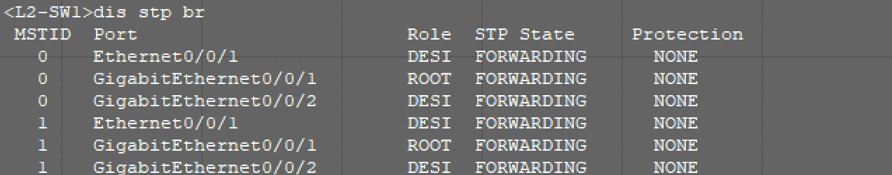

L3-SW2的配置如下

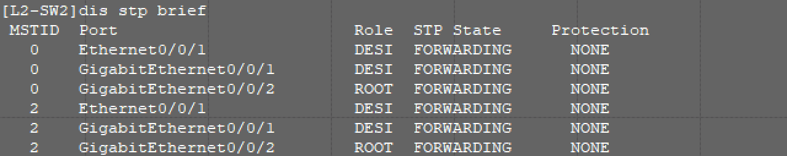

可以看到，这俩个PC都是默认走G0/0/1的上去，而不是GE0/0/2的备用线路

**本次内容到此结束，感谢您的观看，谢谢ԅ(¯﹃¯ԅ)**
