> #### 本章内容如下
>
> （1）简单介绍ACL  
> （2）ACL 2000-2999（基本 / 标准）的配置实验  
> （3）ACL 3000-3999（高级 / 扩展）的配置实验

## **Q：什么是ACL？**

**A:**ACL 是 “访问控制列表（Access Control List）” 的缩写，是网络设备（如路由器、交换机）上的一种**安全技术规则**集合，用来对经过设备的数据包进行 “允许 / 拒绝” 的权限判断，从而实现流量过滤、访问控制等功能

## **Q：ACL的应用有哪些？**

**A：**

1. 过滤网络流量：比如拒绝特定 IP 的数据包通过设备
2. 控制资源访问：限制某些主机访问服务器、特定服务（如 HTTP）
3. 配合其他技术：比如和 NAT、QoS 结合，实现更精细的网络管理
4. 提升网络安全：阻挡非法访问、减少网络攻击风险

**粗略的来说，ACL的核心功能是实现数据的过滤操作**

## ACL的实验&配置过程（包含ACL2000和ACL3000）

让我们继续沿用之前的[网络设备配置实战分析Part3](/posts/network_with_huawei_ensp_part3/)配置拓扑的基础之上，来稍微简化一些去讲解ACL部分的内容（当然，为了更好的实现ACL的理解和实验，我会将配置好基础环境的拓扑提供给大家下载）

拓扑：[点我下载](https://wwbte.lanzn.com/b014wz3opg)，密码：hb93

拓扑图如下所示：

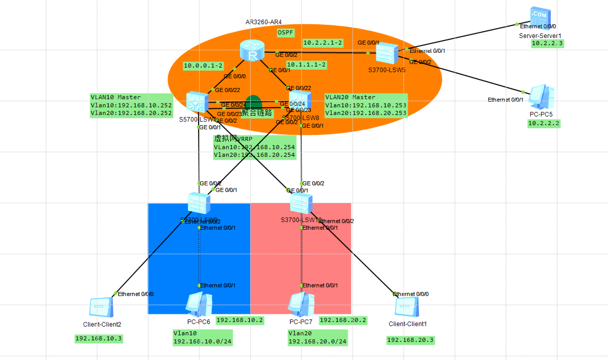

**拓扑介绍：**三层路由及三层交换机上配置OSPF（路由id：R4为0.0.0.0，SW7为1.1.1.1，SW8为2.2.2.2），在SW7和SW8配置聚合链路，并将SW7设置为根桥（SW5为傻瓜交换机，不做任何配置，这里仅作为集线器使用），此外在这个和Part3一样的拓扑之上，添加Server端和Client端，用于测试ACL的HTTP访问的拦截效果

由于这个拓扑本人已经在[网络设备安全配置实战分析 Part3](/posts/network_with_huawei_ensp_part3/)做过详细的讲解，那么这里我会提供已经配置好以上基础（指的是OSPF，链路聚合，vlan划分等等）配置的拓扑，涉及到ACL相关的内容，我才会在以下实验中提及

```bash
常见的命令如下：
[huawei]dis acl all
//查看所有acl（必须要在全局模式下）
[huawei]undo acl all
//删除所有acl（部分acl需要进入端口，使用dis this 查看acl相关的命令，
//再去输入undo + 这个acl命令即可）
[huawei]acl + 端口号
//配置acl
[huawei]dis acl
//查看当前acl
[huawei]undo acl name deny10-3
//若有改名/编号的需求，需要彻底删除这个acl配置，再重新覆盖（我这里以deny10-3为例）
[huawei]acl number 3000 name deny10-3
[huawei]acl name deny10-3 3000
//这两个都行的，只需要正常加上编号即可
```

## 实验一：使得10和20网段的所有机器都能访问Server服务器端提供的Http服务

题目解构：理论上给这个不同网段的IP，那么该网段下的机器就可以实现访问（因为华为的ENSP不支持在PC机上直接操作，所有这里我配置在独立的Client客户机上来测试Http服务）

**步骤一：**给服务器的Http选项打开

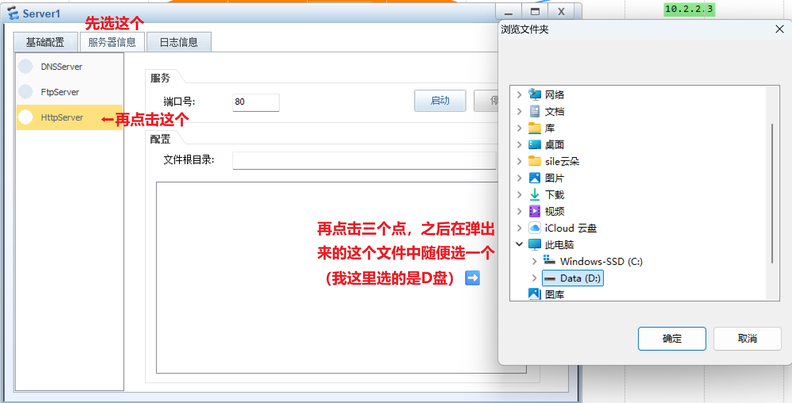

之后点击“启动”即可

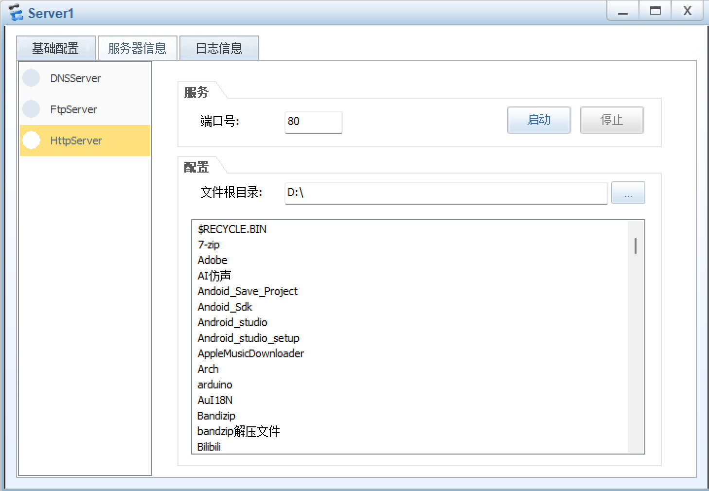

**步骤二：**配置Client客户机IP

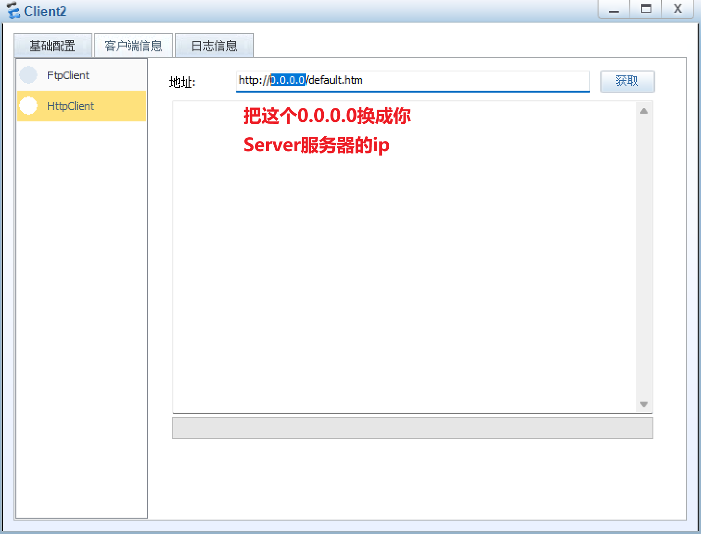

### 验证实验：

可以看到，在点击获取后会得到一个网页的下载信息（这里和我图中一样的就是正常的），之后点击取消就行，测试能否连通的，该文件不需要保存

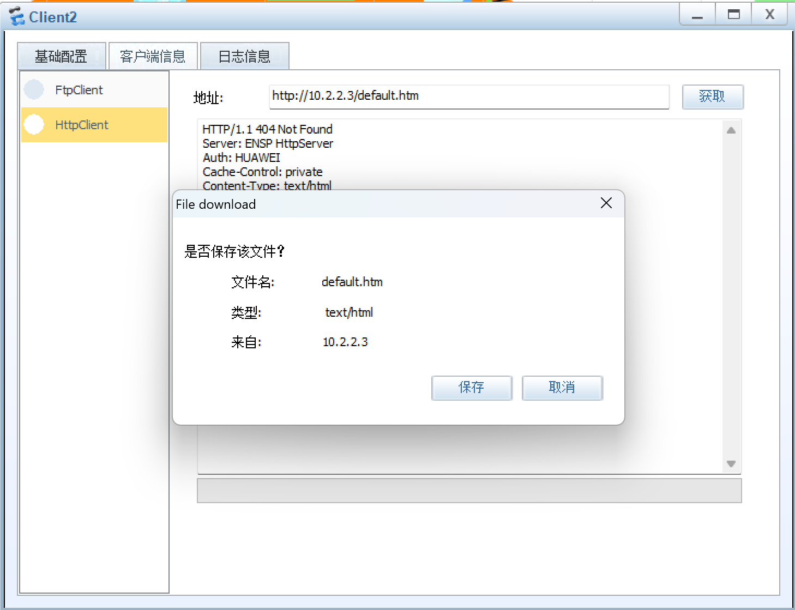

## 实验二：使得左侧的10网段不能访问Http服务，20网段可以实现访问

题目解构：在R4的G0/0/2口配置对应的出站丢弃有关于Http访问的包的ACL即可

**步骤一：**安装以下的代码步骤来配置ACL 2000（这里我取别名”deny-10“）

```bash
<AR4>sys
//进入特权模式
[AR4]acl name deny-10 2000
//配置acl，我这里给我的这个acl命名为“deny-10”（名字可有可无，但后面一定要加上2000）
[AR4-acl-basic-deny-10]rule 5 deny ip source 192.168.10.0 0.0.0.255
//配置acl 2000，我这里写的是拒绝来自ip为192.168.10.0的任何网络设备（语法如上所示）
[AR4-acl-basic-deny-10]int g0/0/2
//输入int命令，进入g0/0/2口
[AR4-GigabitEthernet0/0/2]traffic-filter outbound  acl 2000
//使用“traffic-filter”命令，应用出站规则（outbound）为之前定的acl 2000
[AR4-GigabitEthernet0/0/2]dis this
//使用dis this查看是否成功

//输出以下则为成功，可以看到这个“deny-10”以及成功应用到了g0/0/2口了
[V200R003C00]
#
interface GigabitEthernet0/0/2
 ip address 10.2.2.1 255.255.255.0 
 traffic-filter outbound acl name deny-10
#
return
```

**步骤二：**再次使用来自于这个10网段的设备取连接Http服务器

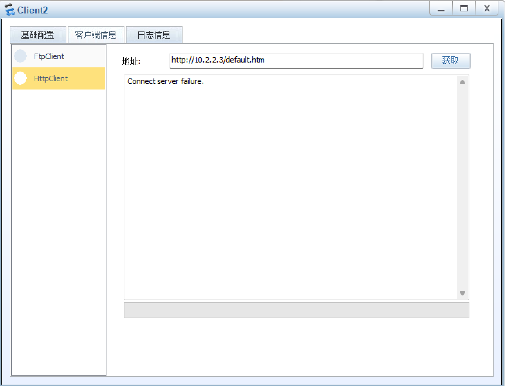

可以看到，这里我们已经不能访问Http服务器了（包括处于10网段的PC6也不能访问服务器，但是处于20网段的PC7就可以正常访问）

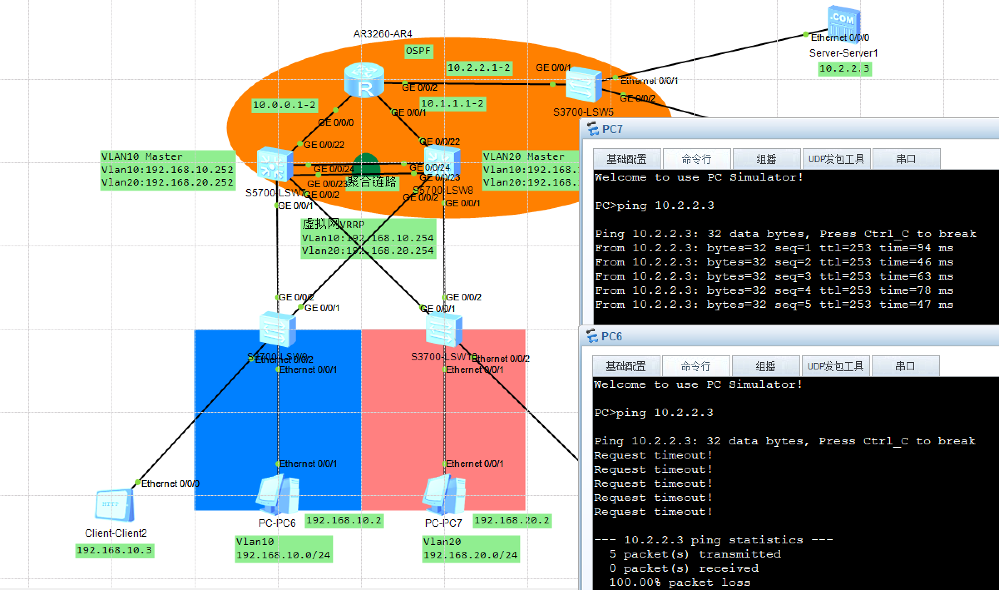

## 实验三：使得仅192.168.10.3这个IP，不能访问20网段的内容，其余可以访问

题目解构：需要在SW7的G0/0/2口，SW8的G0/0/1口，配置来自于10网段的这个指定的IP的拒绝ACL即可（为保证聚合链路的畅通，不在SW7/8的G0/0/23&24端口做acl）

这里不同于ACL 2000，我们需要用到更精细化的ACL 3000，来实现阻止精确的IP访问

在这个实验开始之前可以看到，这里的PC6和PC7都是可以正常访问的（这里我使用IP为192.168.10.3的客户端，去Ping来自于20网段的机器，是可以ing通的）

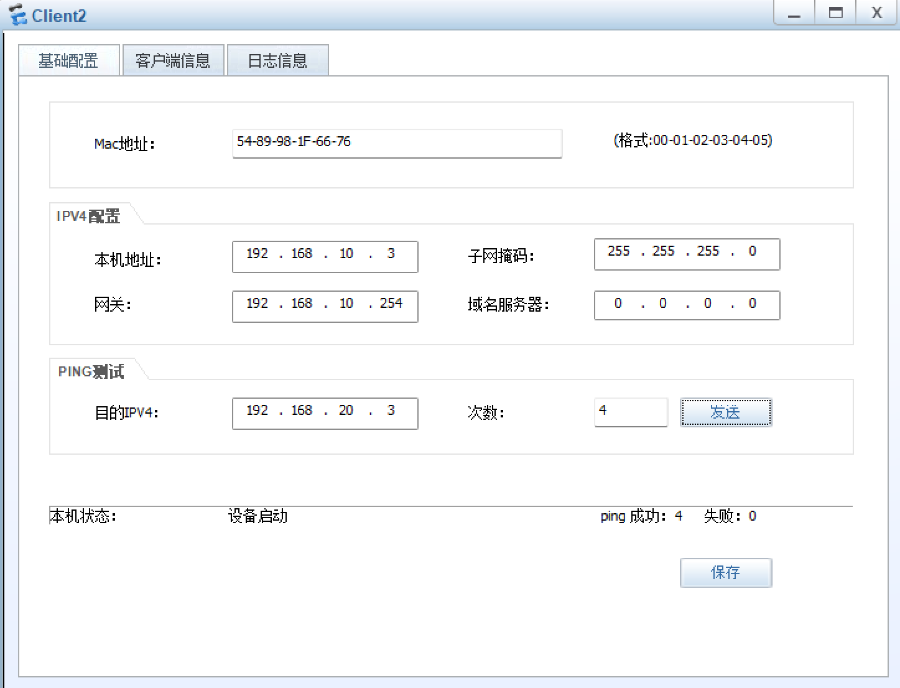

**步骤一：**在SW7的G0/0/2口设置ACL 3000 ，精确阻止来自192.168.10.3的IP流量（如下图所示）

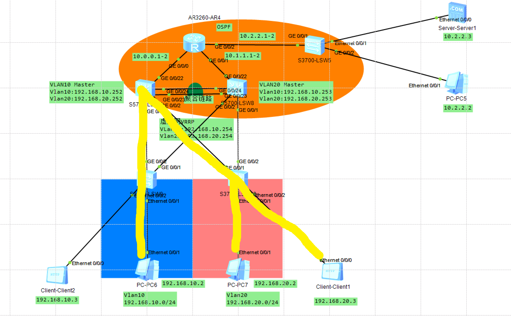

**代码如下：**

```bash
<SW7>system-view 
//进入系统视图
[SW7]acl name deny10-3
//命名为”deny10-3“
[SW7-acl-adv-deny10-3]rule 5 deny ip source 192.168.10.3 0.0.0.255 destination 192.168.20.0 0.0.0.255
//配置为拒绝192.168.10.3这个ip访问目标为192.168.20.0的网段
[SW7-acl-adv-deny10-3]rule 10 permit ip source any destination any 
//允许其他的流量经过
[SW7-acl-adv-deny10-3]int g0/0/2
//进入g0/0/2端口
[SW7-GigabitEthernet0/0/2]traffic-filter outbound acl 3999
//应用这个规则（名字和编号都可以）

//使用dis this看一下，可以看到，这里已经为”deny10-3“了（我忘记加这个3000，默认就最后了）
[SW7-GigabitEthernet0/0/2]dis this 
#
interface GigabitEthernet0/0/2
 port link-type trunk
 port trunk allow-pass vlan 2 to 4094
 traffic-filter outbound acl name deny10-3
#
return
```

**步骤二：**在SW8上去阻止192.168.10.3的流量（如下图所示）

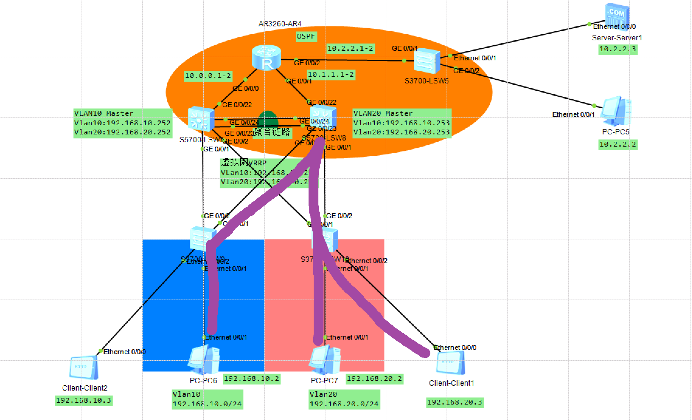

**代码如下：**

```bash
<SW8>system-view 
//进入系统视图
[SW8]acl name deny10-3 3000
//配置”deny10-3“，3000的规则
[SW8-acl-adv-deny10-3]rule 5 deny ip source 192.168.10.3 0.0.0.255 destination 192.168.20.0 0.0.0.255
//拒绝192.168.10.3，至目标的192.168.20.0网段
[SW8-acl-adv-deny10-3]rule 10 permit ip source any destination any 
//放行其他的端口
[SW8-acl-adv-deny10-3]int g0/0/1
//进入g0/0/1的端口
[SW8-GigabitEthernet0/0/1]traffic-filter outbound acl 3000
//应用acl 3000规则

//使用dis this查看，可以看到这个已经生效了
[SW8-GigabitEthernet0/0/1]dis this 
#
interface GigabitEthernet0/0/1
 port link-type trunk
 port trunk allow-pass vlan 2 to 4094
 traffic-filter outbound acl name deny10-3
#
return
```

### 验证成果：

可以看到已经成功了，这个IP为192.168.10.3的客户机已经Ping不通192.168.20.0网段的主机了

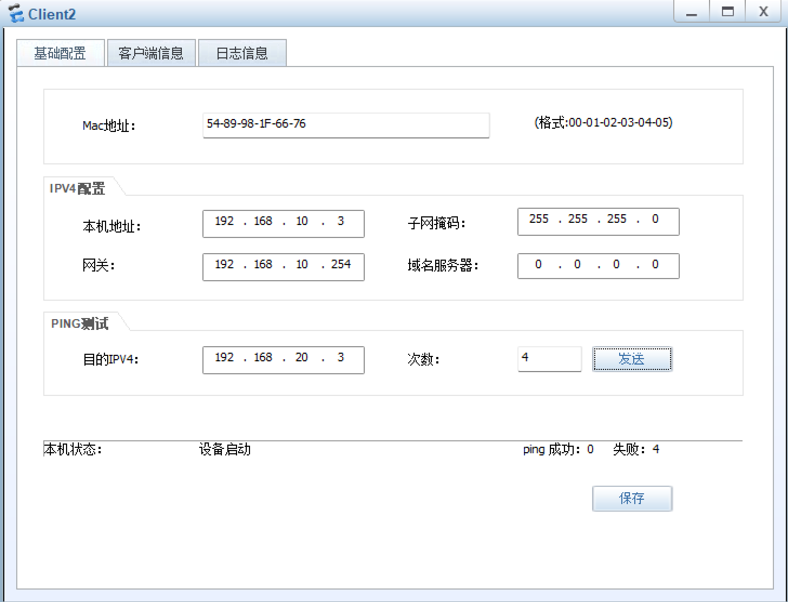

至此，本章内所有有关于ACL的实验已经完成

感谢您的观看 (´▽`ʃ♡ƪ)

此外
