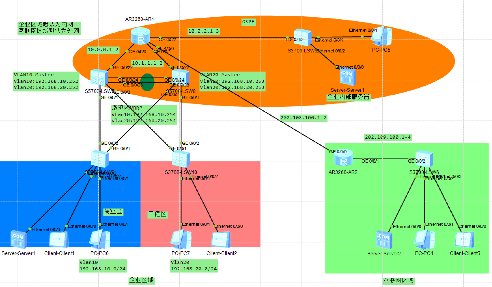
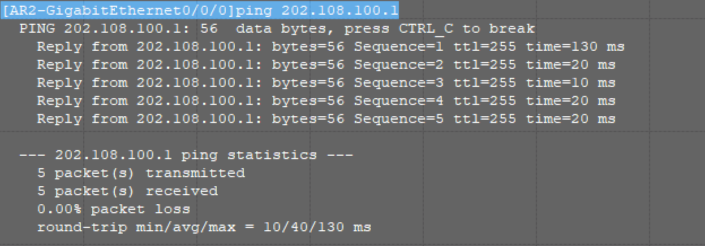
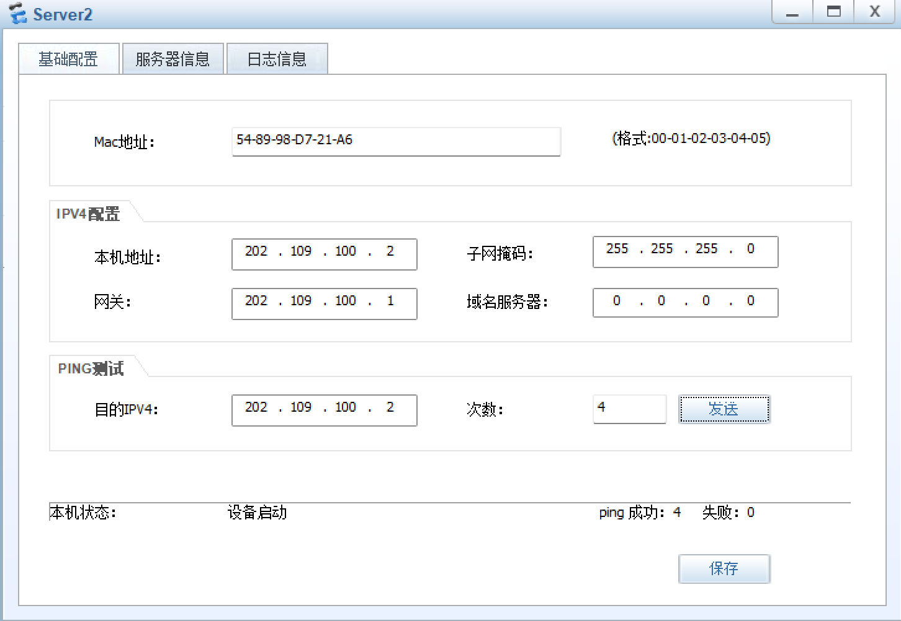
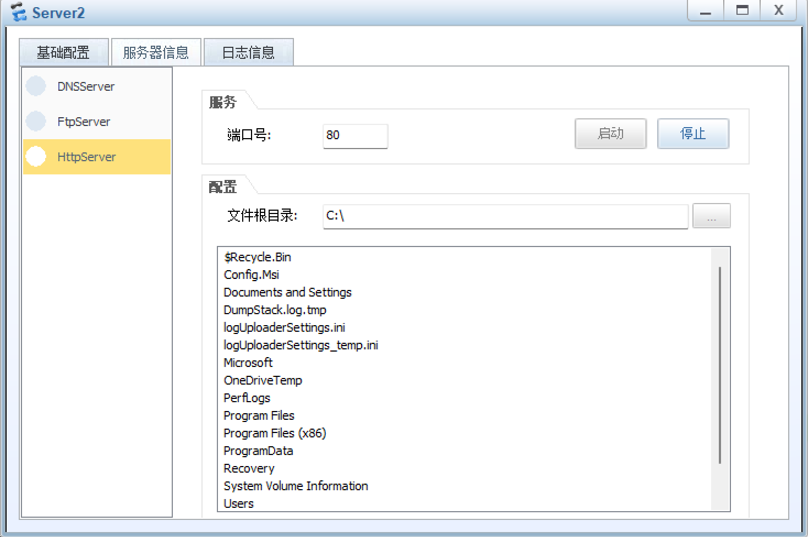
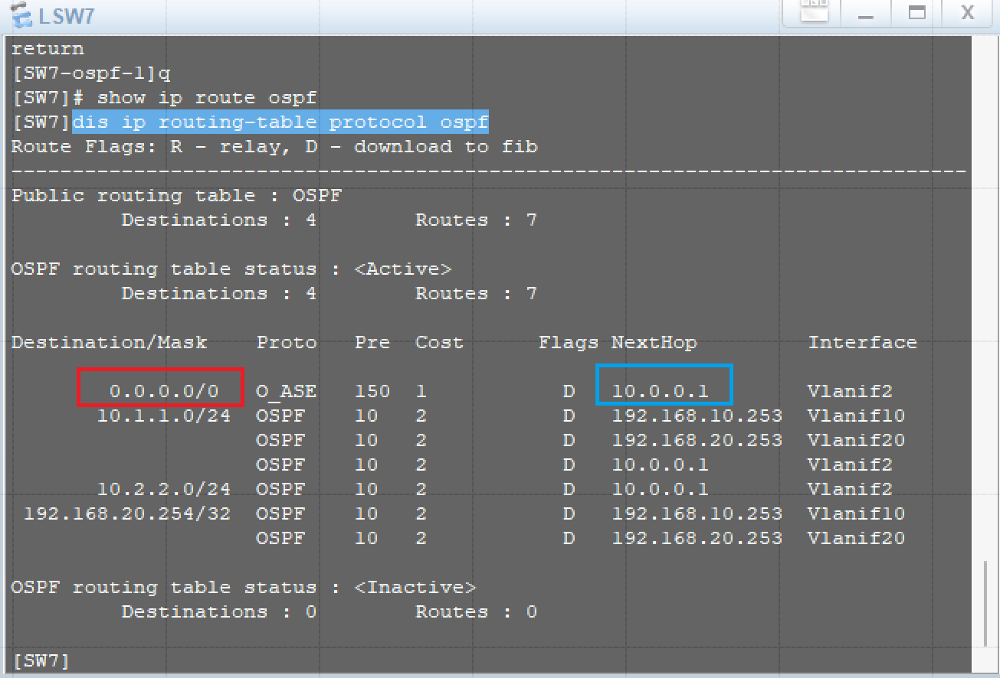
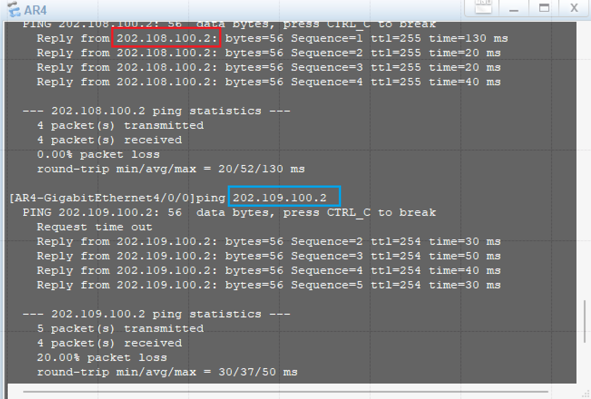
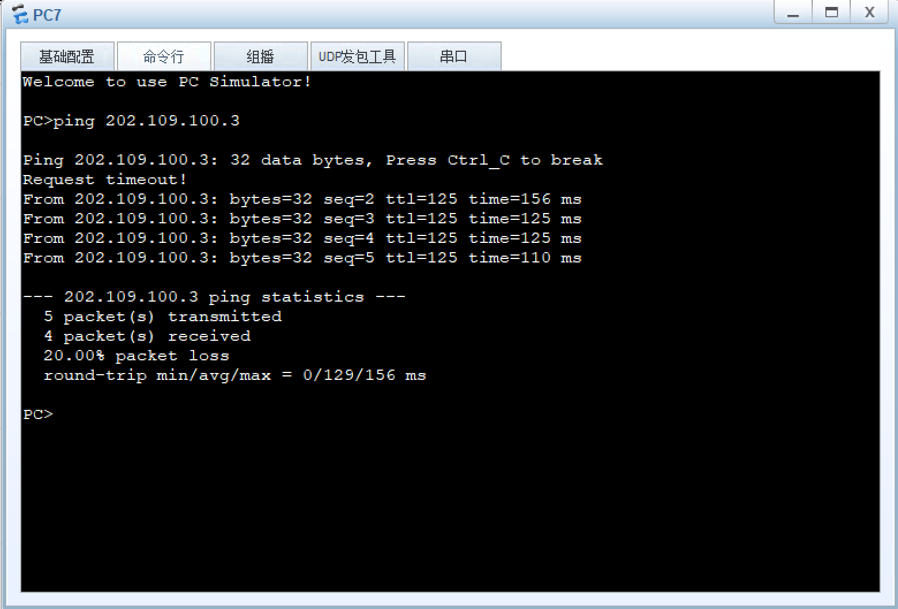
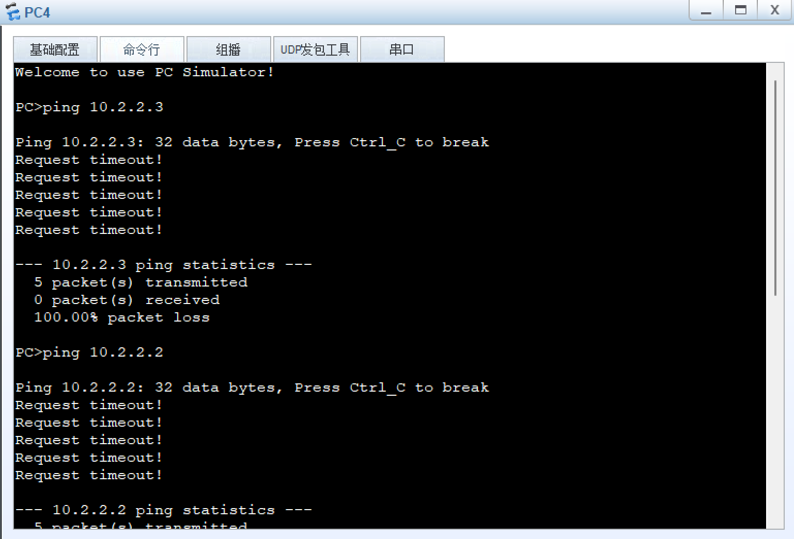
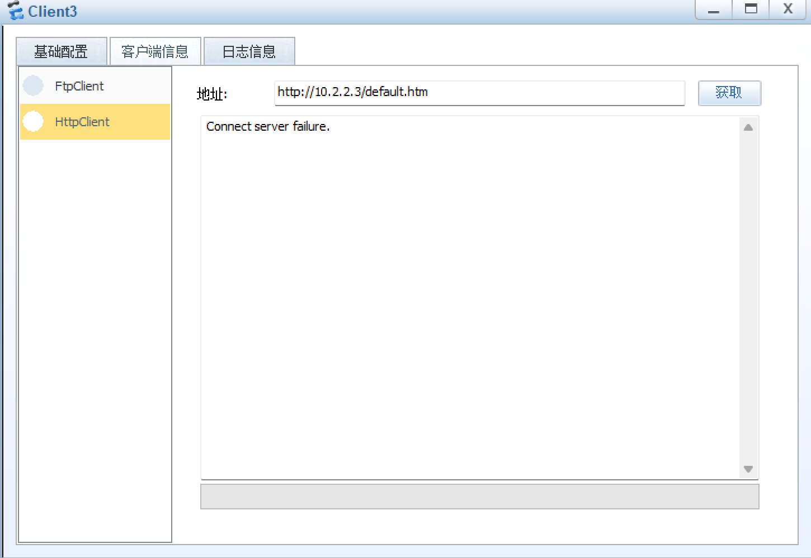
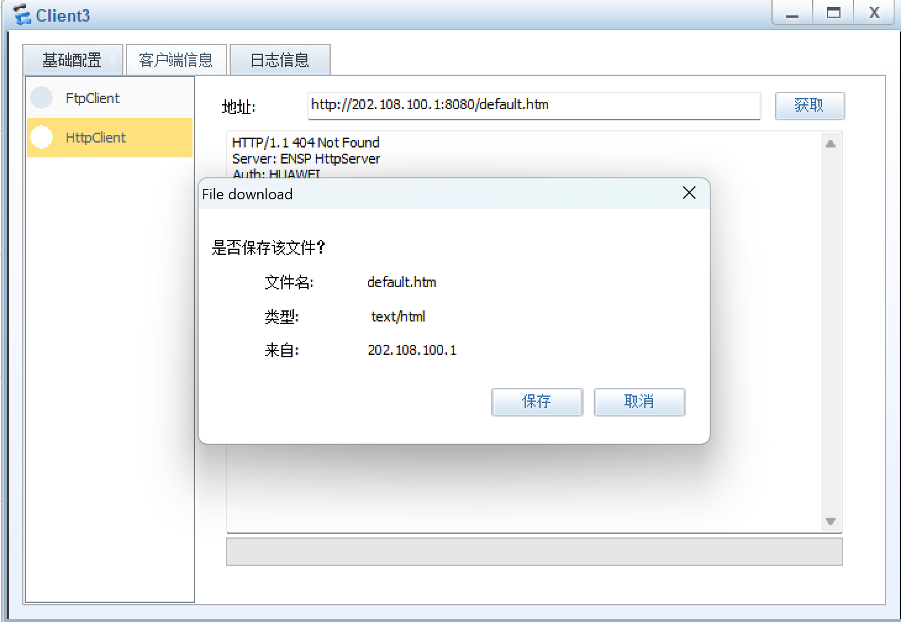

> **本章内容如下**
>
> **i：** 什么是NAT协议？
>
> **ii：** 有关NAT协议的小实验

## Q：什么是NAT协议？

A：NAT 策略是**防火墙 / 路由器上用来控制 “哪些流量需要做地址转换” 的规则**，简单说就是 “指定哪些设备、访问哪些目标时，要把内网 IP 换成公网 IP”

## Q：NAT协议和ACL有啥区别？

A：**ACL 规则（访问控制列表）** 可以理解为是 “交通信号灯”，负责判断流量能不能过（允许 / 拒绝某类流量）比如 “允许 192.168.10.X 网段的设备上网，拒绝 192.168.20.X 网段的设备上网”

**NAT 策略，** 可以理解为 “地址翻译机”，负责把流量的 IP 地址换掉（把内网 IP 转成公网 IP）比如 “让 192.168.10.X 网段的设备，访问外网时用路由器的公网 IP”，这是 NAT 策略的活

简单来说，可以把网络的世界理解成就像搭乘高铁，NAT可以理解为票据，你没有票据，就不能上高铁，而ACL就类似于你票据的详细信息（比如，你的登车口，你的座位号等等），当之后你有了车票，和座位号，也就能正常出发，上网冲浪了（当然，如果没有ACL也行，因为有的票据可以类似于站票一样，没有固定座位，也能到达目的地）

## 基于NAT协议的实验

网路拓扑如下：[点我下载](https://wwbte.lanzn.com/b014wzqvij)

密码：7v6z

拓扑概述：以下为拓扑全貌，主要实现商业和工程区可以访问外部服务器，但是内部的橙色的网络部分不能被外部访问到，而且还要配置NAT转换，仅仅为来自互联网的机器能访问到企业内部的WWW服务器的访问（对外网仅开放vlan10和20的网段的终端设备，不开放vlan10和20的服务器和其他的10网段的内容，但是开放10的WWW服务器）



**题目一：使用NAT服务，实现企业区域能连接到互联网区域的网络设备**

## **步骤一：** 配置基础的设备IP信息

以下为AR4与AR2路由器的设置（这里配置202.108.100网段是用于模拟公网IP）

```bash
//以下为AR2配置IP的过程
[AR2]int g0/0/0
[AR2-GigabitEthernet0/0/0]ip address 202.108.100.2 24

//以下为AR4的配置IP部分
[AR4]int g4/0/0
[AR4-GigabitEthernet4/0/0]ip address 202.108.100.1 24
```

测试连通性：



没问题之后，配置AR2管辖下的设备IP信息（需注意，这里不同的端口会涉及到不同的网段设备，G0/0/0是108网段，而G0/0/1是109网段的）

```bash
//进入AR2的G0/0/0口，配置108网段IP地址
[AR2]int g0/0/0
[AR2-GigabitEthernet0/0/0]ip add 202.108.100.2 24

//继续进入这个G0/0/1口，配置109段的IP地址
[AR2]int g0/0/1
[AR2-GigabitEthernet0/0/1]ip add 202.109.100.1 24
```

可以使用109网段内的设备，去Ping 202.109.100.1（也就是刚刚配的AR2的IP）的这个IP即可验证（可以看到我这里Ping了4次，能成功）



## 步骤二：配置Server2的www服务（如下图所示，正常启动即可）



## 步骤三：在AR4配置IP地址NAT转发（默认路由）

```bash
//进入OSPF 1
[AR4]ospf 1
//配置动态路由协议，让路由器把自己的 “默认路由”，通过动态路由协议 “告诉” 其他邻居路由器
[AR4-ospf-1]default-route-advertise

//使用dis this查看效果
[AR4-ospf-1]dis this 
[V200R003C00]
#
ospf 1 
 default-route-advertise
 area 0.0.0.0 
  network 10.0.0.0 0.0.0.255 
  network 10.1.1.0 0.0.0.255 
  network 10.2.2.0 0.0.0.255 
#
return
//可以看到，已经配置成功
```

使用`dis ip routing-table protocol ospf`命令验证下层设备的实际应用情况

在下层的这个三层交换机上查看这个配置情况（这里我以L3-SW7为例，L3-SW8也是同理）



在上图中的红色框选区域，可以看到，这里已经配置好了默认路由，且下一跳的地址为10.0.0.1（如上图的蓝色区域所示）

## 步骤四：继续在这个AR4配置NAT转发的规则

```bash
//创建NAT2000的这个ACL规则
[AR4]acl name nat 2000
//创建规则，rule5和rule10允许192.168.10/20的两个网段的网络通过
[AR4-acl-basic-nat]rule 5 permit source 192.168.10.0 0.0.0.255//此处为允许10网段通过的部分
[AR4-acl-basic-nat]rule 10 permit source 192.168.20.0 0.0.0.255//此处为允许20网段通过的部分
//查看配置情况
[AR4-acl-basic-nat]dis this 
[V200R003C00]
#
acl name nat 2000  
 rule 5 permit source 192.168.10.0 0.0.0.255 
 rule 10 permit source 192.168.20.0 0.0.0.255 
#
return
//可以看到这里的两条规则，则表示已经配置成功了

//进入g4/0/0
[AR4-acl-basic-nat]int g4/0/0
//将这个信息配置应用在g4/0/0口上
[AR4-GigabitEthernet4/0/0]nat outbound 2000

//使用dis this命令查看配置信息
[AR4-GigabitEthernet4/0/0]dis this
[V200R003C00]
#
interface GigabitEthernet4/0/0
 ip address 202.108.100.1 255.255.255.0 
 nat outbound 2000
#
return
//可以看到，已经生效了
```

**测试AR2与AR4的连通性**

下图可以看到，这个AR2去Ping来自对端IP以及对端路由器的所有IP是可以Ping通的（202.108.100.2为路由器的对端IP，而202.109.100.2为109段的网络设备）



**验证一：** 再次使用这个来自于vlan20的PC7去Ping202.109.100.3的这个服务器（只要是109网段下的任何一台设备都行，我这里为了对比，所以选择的是服务器）发现可以Ping通



**验证二：** 使用来自109网段（互联网）的PC去Ping企业内部服务器（IP为10.2.2.3）和PC5（IP为10.2.2.2）就不能Ping通



**验证三：** 使用外网的客户端（Cilent3），访问内网服务器（Server1，IP为10.2.2.3）发现目前还并不能访问



Q：奇怪，是我错了吗？为啥能Ping通除了公司内网以外的主机，而不能访问所以的服务器以及内网的主机？？？

A：并没有错，公司内网在先前划分ACL的时候并没有将这个公司内外网的网段加入其中，所以访问不了，是正常的。至于服务器访问层面，只不过还没配NAT Server策略，将这个服务器映射到公网中，所以在没有配之前，是不会有响应的

## 步骤三：此时继续创建一个NAT Server策略，将内网10.2.2.3的www服务映射到AR4中G4/0/0的8080端口上

```bash
//进入G4/0/0端口
[AR4]int g4/0/0
//配置NAT转发
[AR4-GigabitEthernet4/0/0]nat server protocol tcp global current-interface 8080 inside 10.2.2.3 www
//以下为含义解释
//nat server：启用NAT服务（端口映射服务）
//protocol tcp：将这个协议指定为TCP
//global current-interface 8080：外网使用G4/0/0的配置的IP，并开放8080的端口
//inside 10.2.2.3 www：内网的IP是10.2.2.3，服务为WWW（端口为80）
```

**验证：** 使用来自109网段（互联网的客户机）去访问边界IP，发现可以成功访问内网服务器



**至此，本实验全部结束**

**那么本章内容到此结束，感谢您的阅读，我们下一期见 (o\_ O)ﾉ**
