## 网络实战分析综合练习

**本次拓扑涉及点如下**：

- 内部用 OSPF + VLAN + VRF 做核心交换与隔离
- 分部用 RIP 做简化路由
- 出口通过防火墙NAT转化连接互联网区域
- 同时提供 DNS、WWW 等基础服务

拓扑图下载：[点我下载](https://wwbte.lanzn.com/b014x43hpe)        密码：ck4t

防火墙镜像下载：[点我下载](https://www.ilanzou.com/s/KdUn3eSj)

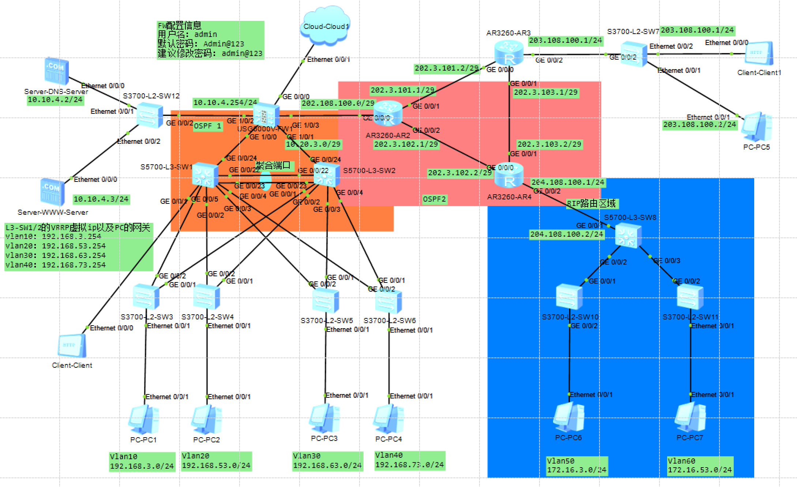

## 模拟实验环境概述：

上图中的橙色区域作为企业内部的核心内网区域（涉及内网的全网通，虚拟vlan，链路聚合，OSPF 1，内网访问服务器等等），防火墙的左侧为企业内网服务器区域（DMZ区域，实现内网的机器访问，并且提供外网的绑定80端口访问），防火墙右侧的粉色区域为模拟运营商的公网区域（需要在相邻的路由上配置端口加密）运营商的网络部分涉及到搭建OSPF 2以及右侧蓝色区域的RIP路由配置，及OSPF 2与RIP之间的相互引入，右上角的区域用于模拟外网（通过运营商连接的公网机器）来访问内网的模拟机器

接下来的所演示的配置信息都将围绕这个模拟的拓扑图展开

## **习题一：按照拓扑要求对所有网络设备进行重新的命名，为了方便查看和配置关闭所有设备的信息中心功能，停止记录设备的日志和Debug信息**

实操步骤：需要在每一台终端设备中操作（PC，Cilent，Server除外）

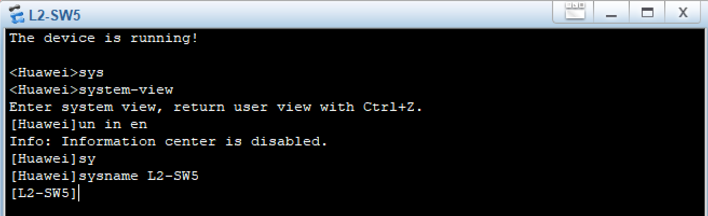

配置的代码思路部分如下：

```bash
<Huawei>system-view 
//切换系统视图
[Huawei]sysname + 设备名称
//改名
[Huawei]undo info-center enable
//关闭Debug信息
```

提示部分：没啥难度，就是设备多，不要遗漏

## **习题二：按照网络配置的要求为各个区域的网络设备和计算机，配置合理的IP地址和网关使其能够内网的通讯，并且按照网络拓扑的要求在交换机上划分对应的VLAN，并且将其对应的物理端口划入到对应的VLAN中**

实操步骤如下：

（1）根据提示的拓扑，完成vlan的划分（这里是vlan10，20，30，40）需要在L3-SW上操作（两台设备都要操作），先进入L3-SW1上创建vlan

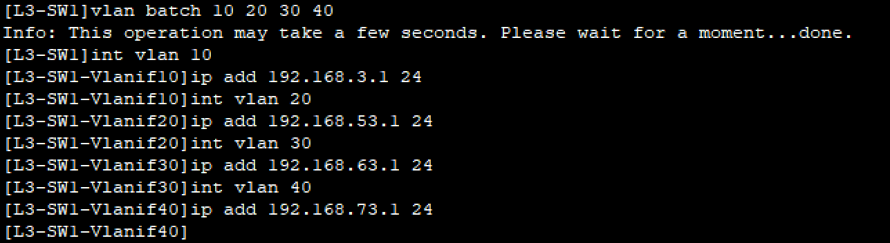

在L3-SW1的代码部分如下（`*注意`：在L3-SW2配置vlanif的ip时，不能使用和L3-SW1一模一样的ip，必须同网段，不能同ip）：

```bash
[L3-SW1]vlan batch 10 20 30 40
//使用vlan batch同时创建多个vlan
[L3-SW1]int vlan 10
//进入vlanif10，注意是”vlanif“而不是”vlan10“
[L3-SW1-Vlanif10]ip add 192.168.3.1 24
//添加ip地址（此地址将作为下层对应vlan下PC的网关ip）

//剩余的vlan20，30，40也是同理（我这里就不过多解释）
[L3-SW1-Vlanif10]int vlan 20
[L3-SW1-Vlanif20]ip add 192.168.53.1 24
[L3-SW1-Vlanif20]int vlan 30
[L3-SW1-Vlanif30]ip add 192.168.63.1 24
[L3-SW1-Vlanif30]int vlan 40
[L3-SW1-Vlanif40]ip add 192.168.73.1 24
```

在L3-SW2的配置如下（注意ip地址的变动）：

```bash
[L3-SW1]vlan batch 10 20 30 40
//使用vlan batch同时创建多个vlan
[L3-SW1]int vlan 10
[L3-SW1-Vlanif10]ip add 192.168.3.2 24
//添加ip地址（此地址将作为下层对应vlan下PC的网关ip）

//剩余的vlan20，30，40也是同理，注意ip变成.2了
[L3-SW1-Vlanif10]int vlan 20
[L3-SW1-Vlanif20]ip add 192.168.53.2 24
[L3-SW1-Vlanif20]int vlan 30
[L3-SW1-Vlanif30]ip add 192.168.63.2 24
[L3-SW1-Vlanif30]int vlan 40
[L3-SW1-Vlanif40]ip add 192.168.73.2 24
```

提示部分：配置vlan ip的时候，不要进入到错误的vlan下，此外注意自己的网关和这个要对应

（2）在各层交换机上配置端口模式，放行所有vlan

（2-1）在L3-SW1和L3-SW2上配置所有的下层接口为Trunk模式，并且配置为放行所有vlan（这里以L3-SW1示例）

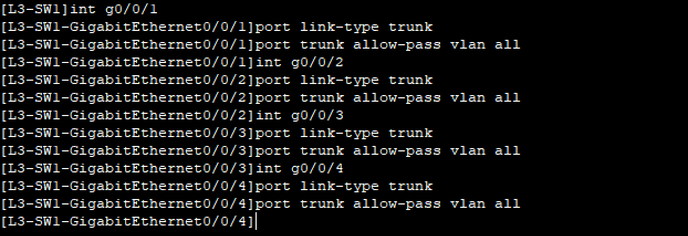

L3-SW1的代码部分如下（`*注意`：L3-SW2也要进行相同配置）：

```bash
[L3-SW1]int g0/0/1
//进入g0/0/1口
[L3-SW1-GigabitEthernet0/0/1]port link-type trunk
//配置端口类型为Trunk模式
[L3-SW1-GigabitEthernet0/0/1]port trunk allow-pass vlan all
//放行所有vlan
//剩下的g0/0/2，3，4都是同理
[L3-SW1-GigabitEthernet0/0/1]int g0/0/2
[L3-SW1-GigabitEthernet0/0/2]port link-type trunk
[L3-SW1-GigabitEthernet0/0/2]port trunk allow-pass vlan all
[L3-SW1-GigabitEthernet0/0/2]int g0/0/3
[L3-SW1-GigabitEthernet0/0/3]port link-type trunk
[L3-SW1-GigabitEthernet0/0/3]port trunk allow-pass vlan all
[L3-SW1-GigabitEthernet0/0/3]int g0/0/4
[L3-SW1-GigabitEthernet0/0/4]port link-type trunk
[L3-SW1-GigabitEthernet0/0/4]port trunk allow-pass vlan all
```

提示部分：L3-SW1和SW2都需要放行vlan，且在L2-SW3/4/5/6的连接PC的Eth0/0/1接口，需要配置为`Access模式`，并划分归属到对应vlan内。其余的设备之间连接的设置为`Trunk模式`

（2-2）在L2-SW3/4/5/6上配置与上下层接口对应的模式（我这里依旧以L2-SW3来示例）

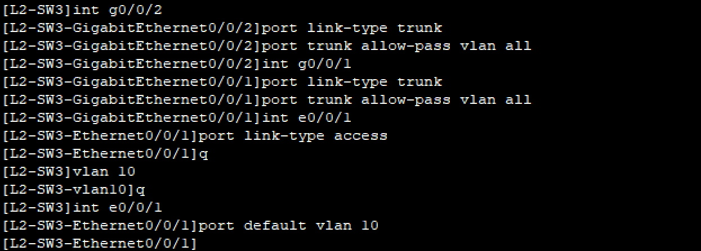

在L2-SW3的代码部分（L2-SW4/5/6可能稍有不一样，但是思路一样的）：

```bash
[L2-SW3]int g0/0/2
//进入上层g0/0/2口
[L2-SW3-GigabitEthernet0/0/2]port link-type trunk
//配置与其上层一样的接口模式（这里为trunk模式）
[L2-SW3-GigabitEthernet0/0/2]port trunk allow-pass vlan all
//放行所有vlan
//下面的g0/0/2口也是同理
[L2-SW3-GigabitEthernet0/0/2]int g0/0/1
[L2-SW3-GigabitEthernet0/0/1]port link-type trunk
[L2-SW3-GigabitEthernet0/0/1]port trunk allow-pass vlan all

[L2-SW3-GigabitEthernet0/0/1]int e0/0/1
//进入下层e0/0/1接口
[L2-SW3-Ethernet0/0/1]port link-type access
//配置接口模式为access模式
[L2-SW3-Ethernet0/0/1]q
//暂时退出这个接口的配置界面
[L2-SW3]vlan 10
//创建vlan10
[L2-SW3-vlan10]q
//退出vlan10
[L2-SW3]int e0/0/1
//在次进入下层的e0/0/1接口
[L2-SW3-Ethernet0/0/1]port default vlan 10
//划分到属于vlan10
```

提示部分：L2-SW3/4/5/6会涉及到层的交会，与上层LS-SW的接口需要设置为Trunk模式（并放行所有vlan），与下层涉及到的接口需要配置成Access模式，并且划分到对应vlan内（如果此交换机没有配置vlan，则需要先创建对应vlan。也可以像我一样，配到了这个部分再退出创建vlan，也是一样的效果）`*注意`：2层交换机创建的vlan不需要配置ip地址

验证部分（这里我在PC1来进行操作，其他的PC设备也是一样的操作）：

（1）在PC1输入对应的ip地址信息（我这里给PC的ip地址是192.168.3.2/24）

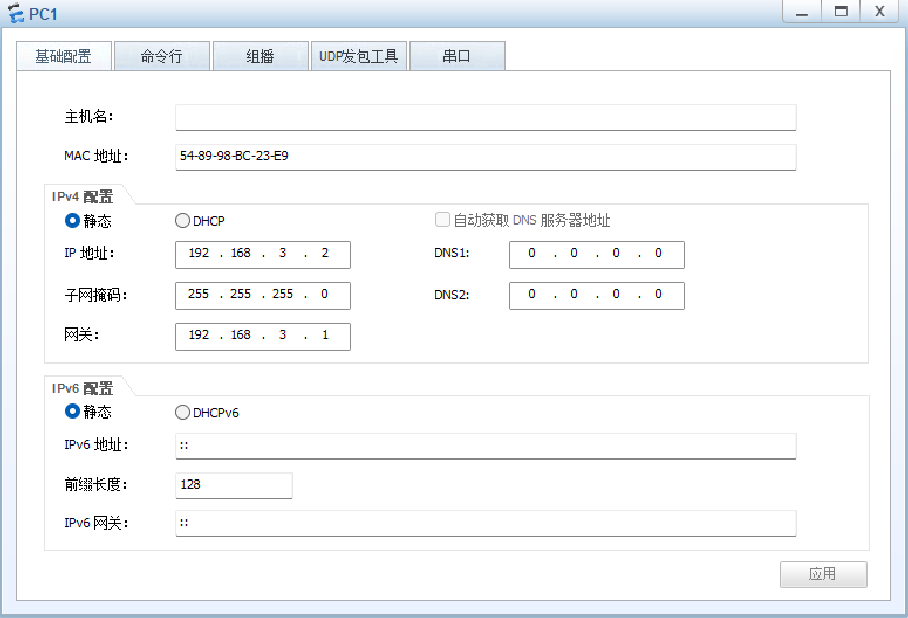

（2）使用PC1去给上层配有vlan10的L3-SW1发送ICMP请求（也就是使用PC1去Ping自己的网关验证是否正确）

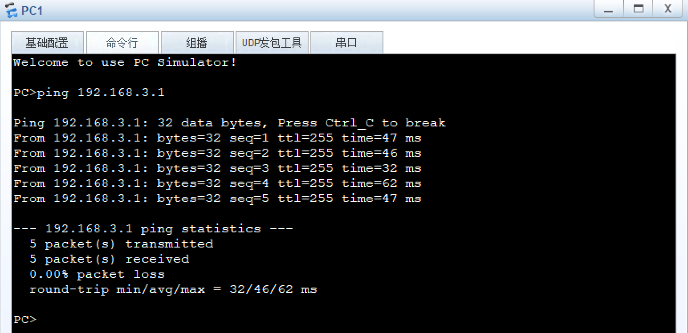

配置好后，当所有设备都可以Ping通网关，即为成功（下图分别为PC1/2/3/4的截图）

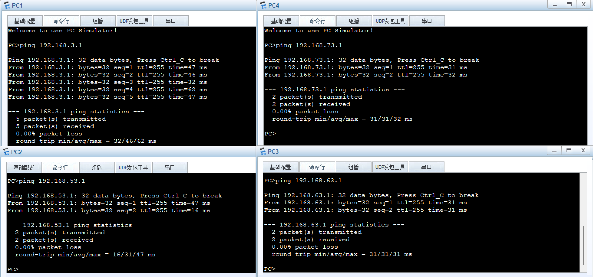

## **习题三：在L3-SW1和L3-SW2之间配置聚合链路，并且设置聚合链路的模式的LACP，设置L3-SW1为主动端**

实操步骤如下：

（1）在L3-SW1上配置Eth-Trunk 23的聚合链路，并设置为主动端（优先级高于SW2就行）

```bash
[L3-SW1]int eth-trunk 23
//创建名叫eth-trunk23的聚合链路
[L3-SW1-Eth-Trunk23]mode lacp-static
//设置模式为lacp模式
[L3-SW1-Eth-Trunk23]q
//暂时退出eth-trunk23
[L3-SW1]lacp priority 100
//配置lacp的系统级的优先级，我这里为主动端，则设置为100，我在L3-SW2会设置成200
[L3-SW1]int eth-trunk 23
//再次进入到eth-trunk23
[L3-SW1-Eth-Trunk23]trunkport GigabitEthernet 0/0/22 to 0/0/23
将需要聚合的端口划分到这个聚合链路里面
[L3-SW1-Eth-Trunk23]port link-type trunk
//设置聚合链路的类型为trunk
[L3-SW1-Eth-Trunk23]port trunk allow-pass vlan all
//放行所有vlan
```

（2）在L3-SW2上来配置对端的聚合链路（设置L3-SW2的优先级为200）

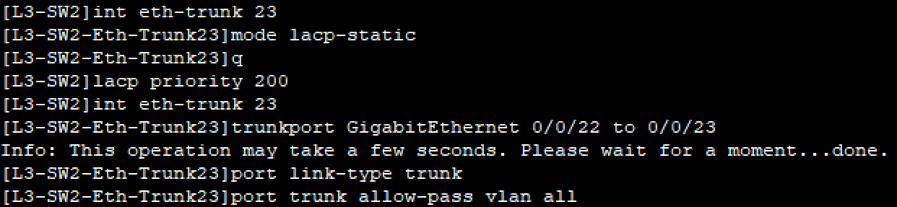

（聚合链路的数字是自定义的，我这里以需要加入聚合端口号来命名了，是22端口和23端口的组合，2和3，即为23）只需要确保端口号一样即可

验证部分：

（1）这里我是用查看stp的命令来去检查L3-SW2的聚合链路是否创建成功

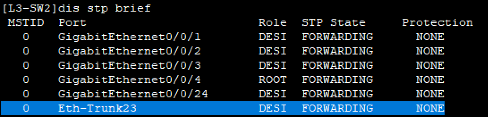

可以看到，这里的G0/0/22和23已经合成一个Eth-Trunk 23的虚拟接口了，即为成功

（2）我使用查看刚刚创建的聚合链路指令，看优先级（主/被动端）

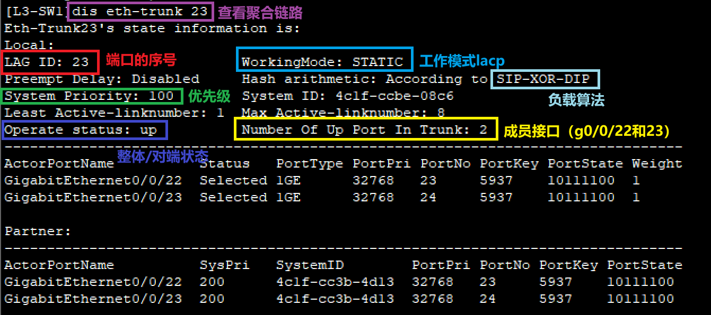

提示部分：聚合链路的本质是将交换机的多个端口聚合成一个链路，从而间接地实现增加带宽的效果。在交换机两端配置聚合链路的时候必须确保名字一样（也就是那个0~63的数字）。lacp是聚合链路中的一种模式（交换机自动协商，可设置系统优先级的高或者低）

## **习题四：在内网的L3-SW1-SW4交换机上配置MSTP使其配合VRRP协议实现冗余链路和负载均衡**

实操步骤如下：

（1）配置L3-SW1上的基础mstp服务

```bash
//基础配置信息
[L3-SW1]stp region-configuration
//开启stp服务
[L3-SW1-mst-region]region-name huawei
//给服务起名为huawei（这里的名字不限）
[L3-SW1-mst-region]instance 1 vlan 10 30
//将vlan 10 vlan 20 划分到一个区域1里面
[L3-SW1-mst-region]instance 2 vlan 20 40
//将vlan 20 vlan 40 划分到是个区域2里面
[L3-SW1-mst-region]active region-configuration 
//启动服务

[L3-SW1]stp instance 1 root  primary
//在L3-SW1里设置区域1为根桥（master）
[L3-SW1]stp instance 2 root secondary 
//在L3-SW2库设置区域2为备用（secondary）
```

（2）在L3-SW2配置mstp服务（需要注意的是这个根桥的设置需要为和L3-SW1相反的配置）

```bash
//上面的基础信息配置都是一样的
//也可以使用这个接下来的dis this指令，来一键配置

//注意：以下内容需要更改
[L3-SW2]stp instance 2 root primary
//在L3-SW2里设置区域1为根桥（master）
[L3-SW2]stp instance 1 root secondary 
//在L3-SW2里设置区域1为备用（secondary）
//注意，这里是与L3-SW1上反过来的
```

（3）在L3-SW1的基础mstp配置完成后，需要将这个对应的mstp配置的信息宣告给局域网内的其他交换机配置（这里的是L3-SW2,L2-SW3,L2-SW4,L2-SW5,L2-SW6都需要配置）

```bash
[L3-SW1-mst-region]dis this 
#
stp region-configuration
 region-name huawei
 instance 1 vlan 10 30
 instance 2 vlan 20 40
 active region-configuration
#
return
//将以上的结果打印出来，后面需要在每一台交换机里执行
```

（3）配置边缘端口（在与非交换机与交换机的接口上配置）：

已知需要配置边缘端口：所有2层交换机上与PC连接的端口，3层交换机上层去连接路由器的端口

（3-1）在3层交换机上配置边缘路由（L3-SW1和L3-SW2）

```bash
[L3-SW1]int g0/0/24
//进入3层交换机的与AR的端口
[L3-SW1-GigabitEthernet0/0/24]stp edged-port enable
//设置边缘端口
```

（3-2）在2层交换机上配置边缘路由（L2-SW3,L2-SW4,L2-SW5,L2-SW6）

```bash
[L2-SW3]int e0/0/1
//进入2层交换机的与PC接入的接口
[L2-SW3-Ethernet0/0/1] stp edged-port enable
//配置端口配置边缘端口模式
```

## 习题五：**在L3-SW1和L3-SW2上配置VRRP，其中设置VLAN10，30的Master节点为L3-SW1，设置VLAN20，40的Master节点为L3-SW2**

实操步骤如下：

（1）在L3-SW1/2上，给已经创建的vlan划分新的虚拟ip（不需要配置掩码）

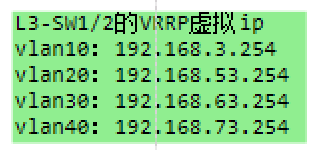

我划分的vlan的虚拟ip如上图所示

（1-1）进入L3-SW1的操作如下（配置划分的虚拟ip）

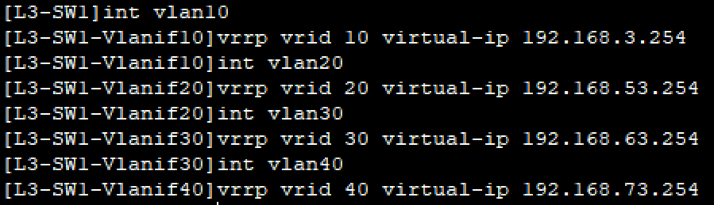

L3-SW1的配置命令如下：

```bash
[L3-SW1]int vlan10
//进入vlan10
[L3-SW1-Vlanif10]vrrp vrid 10 virtual-ip 192.168.3.254
//创建vrrp，命名为vrrp 10 ，并配置虚拟ip
[L3-SW1-Vlanif10]int vlan20
//进入vlan20
[L3-SW1-Vlanif20]vrrp vrid 20 virtual-ip 192.168.53.254
//创建vrrp，命名为vrrp 20 ，并配置虚拟ip
[L3-SW1-Vlanif20]int vlan30
//进入vlan30
[L3-SW1-Vlanif30]vrrp vrid 30 virtual-ip 192.168.63.254
//创建vrrp，命名为vrrp 30 ，并配置虚拟ip
[L3-SW1-Vlanif30]int vlan40
//进入vlan40
[L3-SW1-Vlanif40]vrrp vrid 40 virtual-ip 192.168.73.254
//创建vrrp，命名为vrrp 40 ，并配置虚拟ip
```

（1-2）L3-SW2的配置命令如下（相同的点在于vrrp的地址和名称和L3-SW1一模一样）：

```bash
[L3-SW2]int vlan 10
//进入vlan10的配置界面
[L3-SW2-Vlanif10]vrrp vrid 10 virtual-ip 192.168.3.254
//创建vrrp，命名为vrrp 10 ，配置与L3-SW1同样的虚拟ip地址
[L3-SW2-Vlanif10]int vlan 20
//进入vlan20的配置界面
[L3-SW2-Vlanif20]vrrp vrid 20 virtual-ip 192.168.53.254
//创建vrrp，命名为vrrp 20，配置与L3-SW1同样的虚拟ip地址
[L3-SW2-Vlanif20]int vlan 30
//进入vlan 30的配置界面
[L3-SW2-Vlanif30]vrrp vrid 30 virtual-ip 192.168.63.254
//创建vrrp，命名为vrrp 30，配置与L3-SW1同样的虚拟ip地址
[L3-SW2-Vlanif30]int vlan 40
//进入vlan40的配置界面
[L3-SW2-Vlanif40]vrrp vrid 40 virtual-ip 192.168.73.254
//创建vrrp，命名为vrrp 40，配置与L3-SW1同样的虚拟ip地址
```

（2）设置主/次优先级（也成为Master节点）

**`*核心`：优先级越大，则为Master**

（2-1）提高在L3-SW1的vlan10，30的优先级（这里我将优先级设置成150）

```bash
//进入L3-SW1操作
[L3-SW1]int vlan 10
//进入需要配置的vlan，这里是vlan10
[L3-SW1-Vlanif10]vrrp vrid 10 priority 150
//提高虚拟id的优先级为150
[L3-SW1-Vlanif10]int vlan 30
//进入vlan30
[L3-SW1-Vlanif30]vrrp vrid 30 priority 150 
//同样提高优先级，在这个L3-SW1上设置为Master
```

（2-2）在L3-SW2配置vlan20，40的优先级（同样为150的优先级）

```bash
//L3-SW2操作如下
[L3-SW2]int vlan 20
[L3-SW2-Vlanif20]vrrp vrid 20 priority 150
[L3-SW2-Vlanif20]int vlan 40
[L3-SW2-Vlanif40]vrrp vrid 40 priority 150
//都是相同操作，只不过换vlan了
```

验证部分（vrrp配置情况以及mstp的配置情况）：

使用`dis vrrp brief`查看L3-SW1的配置情况

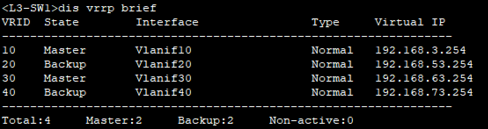

可以看到这里以及配置成功（分配了Master和Backup）

也可以使用`dis stp brief`查看L3-SW1的配置情况

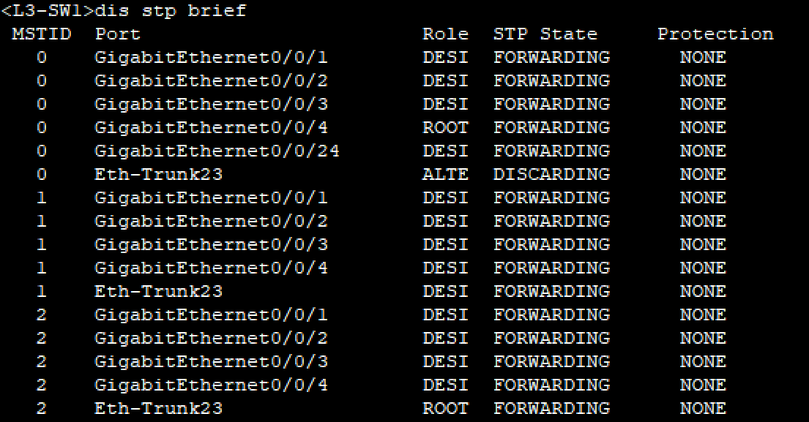

## **习题六：设置VLAN50的地址方式为DHCP获取，并且在L3-SW8上为VLAN50配置DHCP服务（其中DNS设置为内网的DNS服务器的地址），使其能够正常获取IP地址**

实操步骤如下：

（1-1）在L2-SW10上配置基础的端口模式转发流量，在L3-SW10上配置vlan50

```bash
//进入L2-SW10配置的操作如下：
[L2-SW10]vlan 50
//创建vlan50
[L2-SW10-Vlanif50]q
//这里直接退出即可不需要配置信息
[L2-SW10]int g0/0/2
//进入这个与PC连接的端口
[L2-SW10-GigabitEthernet0/0/2]port link-type access
//配置端口为access模式
[L2-SW10-GigabitEthernet0/0/2]port default vlan 50
//并划分到vlan 50（2层交换机的vlan50不用配ip）
[L2-SW10-GigabitEthernet0/0/2]int g0/0/1
//进入到上层接口配置
[L2-SW10-GigabitEthernet0/0/2]port link-type trunk
//改成trunk口
[L2-SW10-GigabitEthernet0/0/2]int g0/0/1port trunk allow-pass vlan all
//放行所有vlan

//进入L3-SW8的配置如下：
[L3-SW8]int g0/0/2
//进入g0/0/2口
[L3-SW8-GigabitEthernet0/0/2]port link-type trunk
//改成trunk口
[L3-SW8-GigabitEthernet0/0/2]port trunk allow-pass vlan all
//放行所有vlan
```

（1-2）继续在这个3层交换机上配置ip地址池划分&dns设置

```bash
[L3-SW8]ip pool pc5pool
//创建地址池，命名为pc5pool
[L3-SW8-ip-pool-pc5pool]network 172.16.3.0 mask 255.255.255.0
//设置地址池范围为172.16.30.0网段的内容，掩码为/24即为255.255.255.0
[L3-SW8-ip-pool-pc5pool]gateway-list 172.16.3.1
//设置网关，及与PC5连接的哪个接口ip（这里我用vlan50的那个ip了）
[L3-SW8-ip-pool-pc5pool]dns-list 10.10.3.2
//根据题目要求，配置内网dns服务器的ip
```

（2）在PC及上选择“DHCP”，自动获取ip地址

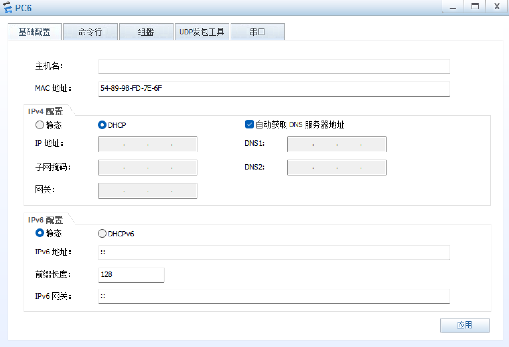

（3）验证一下：（可以获取到ip地址，即为成功）

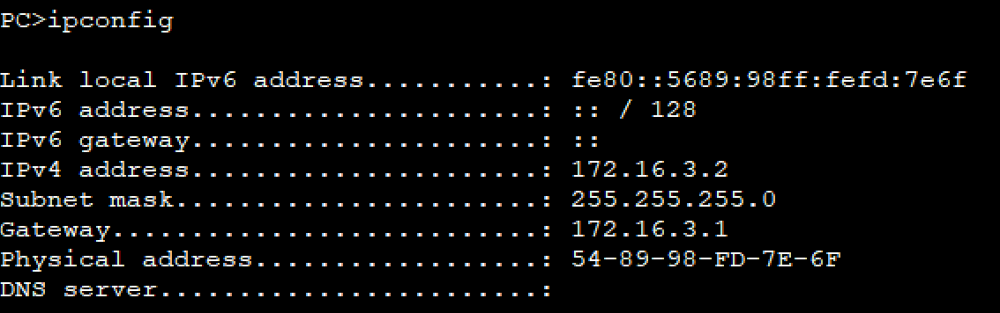

## **习题七：设置FW1连接内网的区域为Trust，连接外网的区域为Untrust，连接服务器区域的为DMZ。并且为了测试全部区域放行ICMP协议**

实操步骤如下：

为了便于操作，我们防火墙的地方将使用图形化界面操作

### **防火墙基础连接配置**

（1）从左侧拖入并启动Cloud模块，打开这个界面

（1-1）先选择这个界面的UDP选项，再点击“增加”按钮

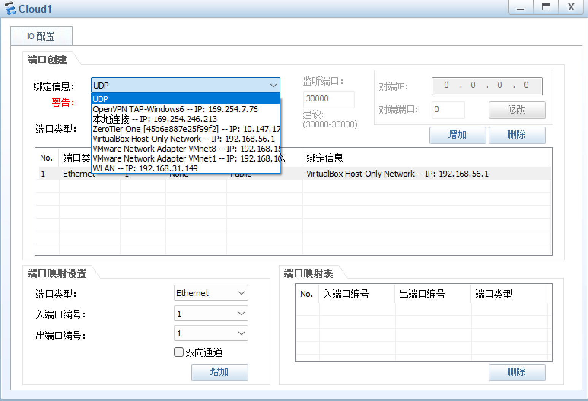

（1-2）其次选择这个界面的VMnet8这个网卡，选择好后，点击“增加”按钮

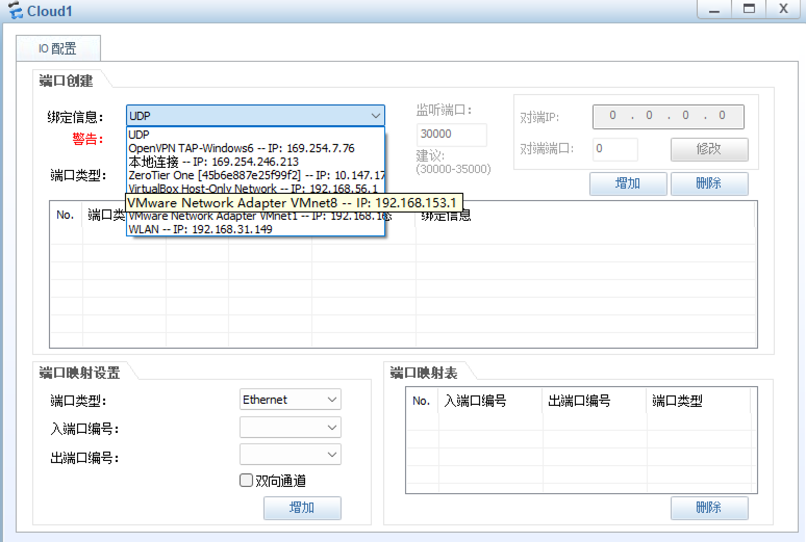

（2-1）再次选择UDP网卡，在下方的“端口映射类型设置中”选择入端口编号为1，出端口编号为2（这个图是我截图截错了，地址不对，正确的是192.168.153.1的这个）

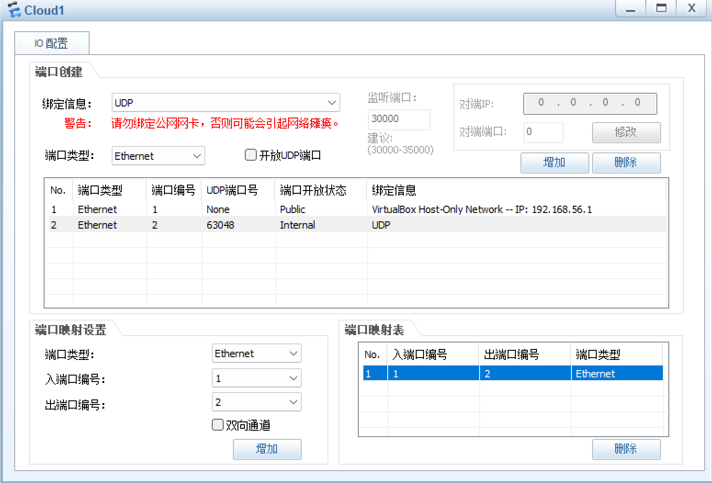

（2-2）再次选择VMnet8网卡，在下方的“端口映射类型设置中”选择如入口编号为2，出端口编号为1（这里出入端口编号，一定要是和上面的这个UTP反着来的）

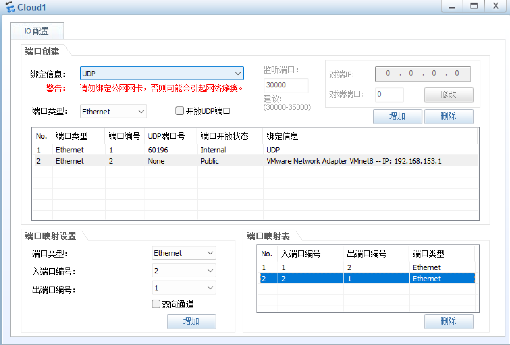

如上图所示配置即可

### **配置防火墙远程访问**

（3-1）使用这个Copper线，连接这个Cloud和防火墙

（3-2）输入密码，并按照提示，进入防火墙

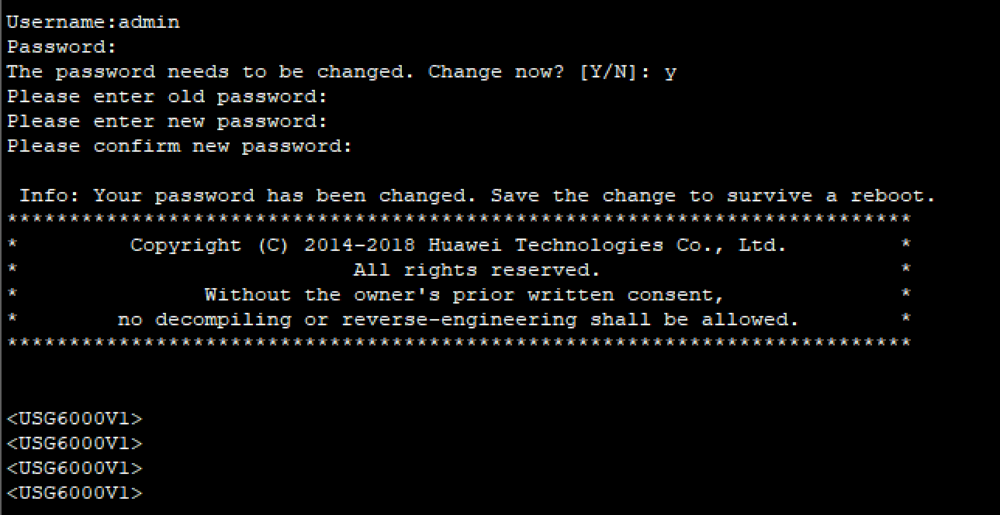

（3-3）进入防火墙，配置这个与这个Cloud连接的这个端口ip为同网段ip，并放行连接协议`service-manage all permit`

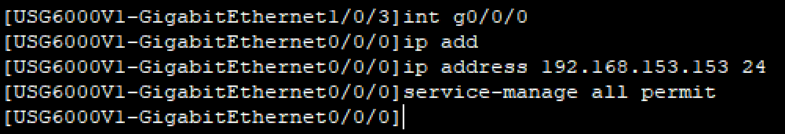

`*注意`：一定要在这个防火墙的g0/0/0口配置（因为这个g0/0/0口是管理口，只有连接这个口了，才能远程连接）

（3-4）在自己的电脑浏览器中输入这个刚刚设置的ip地址，即可（我这里设置的是192.168.153.153）

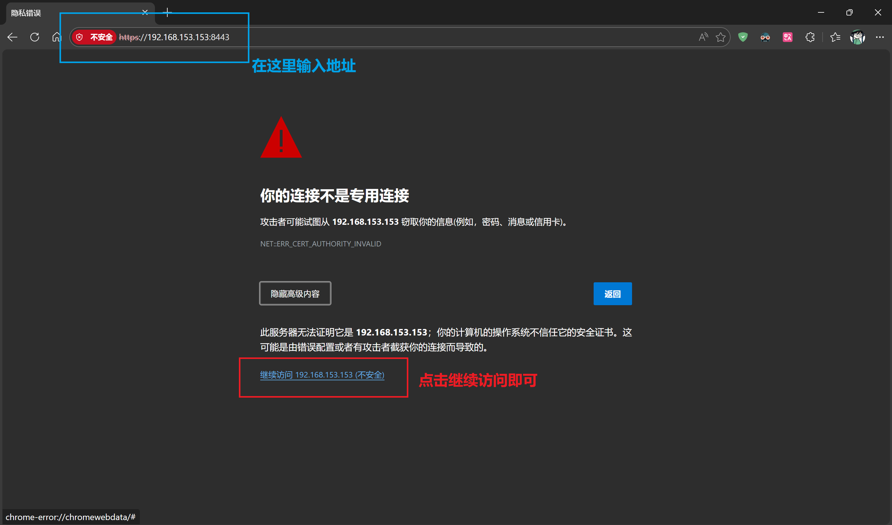

（3-5）之后即可访问到这个图像化界面的后台界面（再次输入密码登录即可）

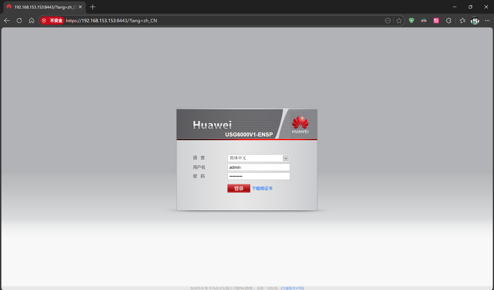

登陆后一直点“取消”即可，随后按照下图的数字顺序来即可打开区域配置

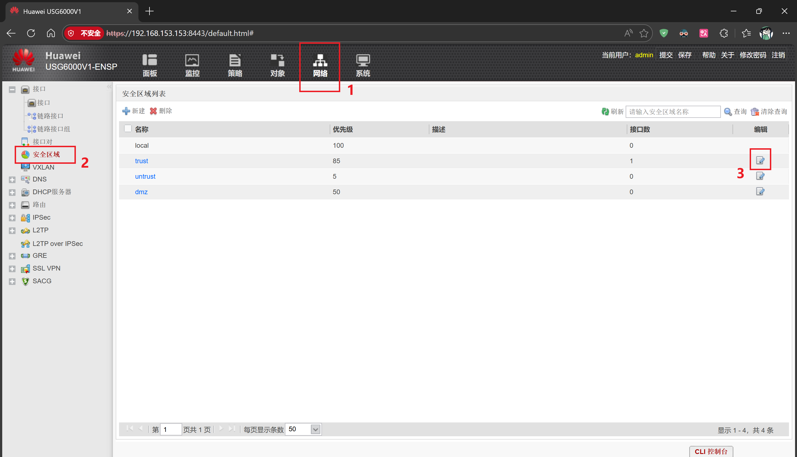

### 配置内网的区域为Trust（信任区域）

（1）选取对应的端口为Trust（g1/0/0，g1/0/1）

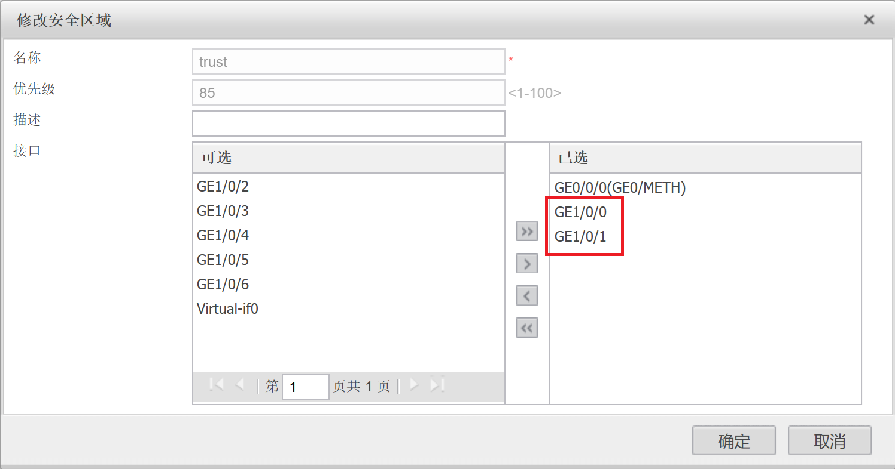

### 连接外网的区域为Untrust（非信任区域）

（1）选取对应的端口为Untrust（g1/0/3）

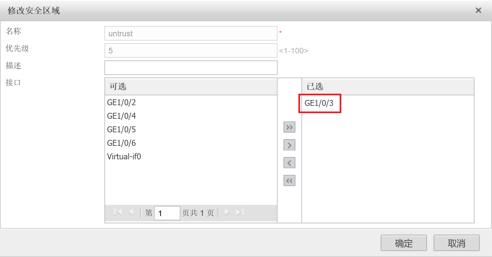

### 连接服务器区域的为DMZ（非军事化区域：让外网能访问这些服务器，同时隔离它们与内网，防止服务器被攻破后波及内网核心数据）

（1）选取对应的端口为DMZ（g1/0/2）

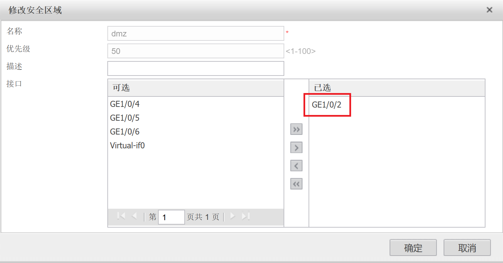

## **全部区域放行ICMP协议**

（1）依次找到“策略”->"安全策略"->"新建安全策略"

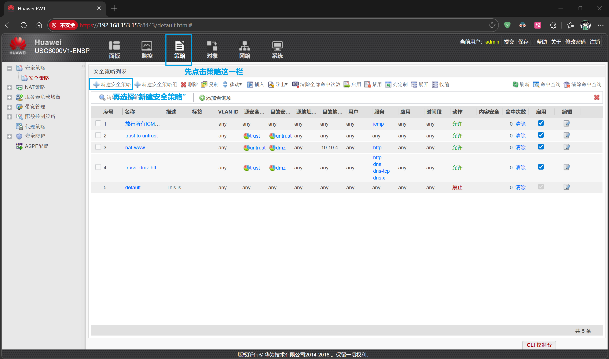

（2）策略新建后，选择如下图所示即可（由于我这里修改过了，所以选择的是“修改安全策略”，正常选择新建策略，而不是修改原有的策略）

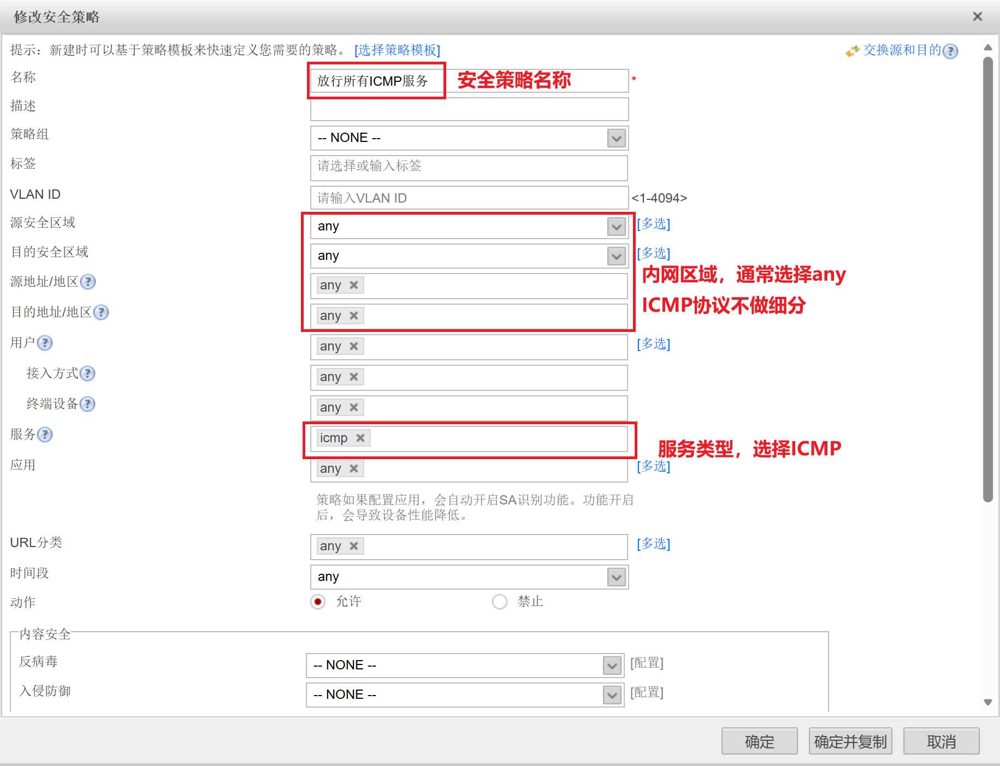

## **习题八：在内网中配置OSPF协议，进程为1，使其内网网络联通**

实操步骤如下：

### 内网网络为：L3-FW1，L3-SW1和L3-SW2，三台设备之间的配置

（1）配置端口FW1的名字以及端口ip

```bash
<USG6000V1>sys
//和路由器一样的配置，都是system view（简写sys）
[USG6000V1]sysname FW1
//改名为FW1
[FW1]int g1/0/0
//进入g1/0/0口，配置ip
[FW1-GigabitEthernet1/0/0]ip address 10.10.3.1 29
//习惯于把上层设备设置为10.10.3.1的这个ip（这里的掩码非标准掩码，需注意！）
[FW1-GigabitEthernet1/0/0]int g1/0/1
//进入g1/0/1口配置ip
[FW1-GigabitEthernet1/0/1]ip address 10.20.3.1 29
//同样地，设置为10.20.3.1的这个ip（注意掩码！！）
```

（2）配置FW1上的OSPF 1

```bash
[FW1]router id 1.1.1.1
//先配置router id 为1.1.1.1
[FW1]OSPF 1
//宣告ospf 1
[FW1-ospf-1]area 0
//区域为area 0
[FW1-ospf-1-area-0.0.0.0]network 10.10.3.0 0.0.0.7
//宣告10.10.3.0的网段（注意，这里是非标准掩码）
[FW1-ospf-1-area-0.0.0.0]network 10.20.3.0 0.0.0.7
//宣告10.20.3.0的网段（注意，这里是非标准掩码）
[FW1-ospf-1-area-0.0.0.0]quit
//这里在退出系统视图的时候，不能直接使用q，而必须使用全拼
```

（3）在L3-SW1上的配置（L3-SW2也是同理）

（3-1）端口信息配置（创建vlan2，配ip地址给g0/0/24口）

```bash
[L3-SW1]vlan 2
//创建vlan 2用于配置ip
[L3-SW1-vlan2]q
[L3-SW1]int vlan 2
[L3-SW1-Vlanif2]ip address 10.10.3.2 29
//添加g0/0/24端口所需要的ip地址
[L3-SW1-Vlanif2]q
[L3-SW1]int g0/0/24
//进图g0/0/24端口
[L3-SW1-GigabitEthernet0/0/24]port link-type access
//配置为access模式
[L3-SW1-GigabitEthernet0/0/24]port def vlan 2
//把vlan2划分给g0/0/24
```

（3-2）OSPF 1 配置（内网都要宣告）

```bash
[L3-SW1]router id 2.2.2.2
//先划分router id（按顺时针配置了）
[L3-SW1]ospf 1
//宣告区域为ospf 1
[L3-SW1-ospf-1]area 0
//配置区域为area 0
[L3-SW1-ospf-1-area-0.0.0.0]network 10.10.3.0 0.0.0.7
[L3-SW1-ospf-1-area-0.0.0.0]network 192.168.3.0 0.0.0.255
[L3-SW1-ospf-1-area-0.0.0.0]network 192.168.53.0 0.0.0.255
[L3-SW1-ospf-1-area-0.0.0.0]network 192.168.63.0 0.0.0.255
[L3-SW1-ospf-1-area-0.0.0.0]network 192.168.73.0 0.0.0.255
//内网的所有网段都需要宣告
```

L3-SW2也是一样，这里我就不展示了，配好即可

## **习题九：****在互联网的AR2-AR4区域上配置OSPF路由进程为2，并且在连接FW1和AR2的路由器接口上开启OSPF的加密认证，密码为admin@123**

实操步骤如下：

（1）配置OSPF 2的步骤如下：

（1-1）进入AR2配置端口ip地址（这里的AR3，AR4也都是同理，这里我不过多赘述）

```bash
[AR2]int g0/0/0
//进入与FW1链接的配置接口，配置与FW1对应的网段ip地址
//FW1我配置的是202.108.100.1/29，所以我在这里配置202.108.100.2/29
[AR2-GigabitEthernet0/0/0]ip address 202.108.100.2 29
//进入其他的接口，配置对应的ip地址
[AR2-GigabitEthernet0/0/0]int g0/0/1
[AR2-GigabitEthernet0/0/1]ip add 202.3.101.1 29
[AR2-GigabitEthernet0/0/1]int g0/0/2
[AR2-GigabitEthernet0/0/2]ip add 202.3.102.1 29
//配置对应的ip地址，这里我选择是的左侧配置.1，其他的配置.2
```

（1-2）进入AR2，配置OSPF 2（AR3，AR4都是同理）

```bash
[AR2]ospf 2
//宣告区域为ospf 2
[AR2-ospf-2]area 0
//创建区域0
[AR2-ospf-2]network 202.3.101.0 0.0.0.7
//添加涉及到的三个网段的ip地址
[AR2-ospf-2]network 202.3.102.0 0.0.0.7 
//需注意，这里的与FW1连接的也需要配置
[AR2-ospf-2]network 202.108.100.0 0.0.0.7 
//需要注意的是这里的网段是以29结尾的，所以这改成0.0.0.7
```

提示部分：配ip的时候别配置错误，在配置AR3的这个路由时，需要把G0/0/2口的这个网段也划分到这个OSPF 2中，但是在这个AR4配置的时候，则不需要把这个G0/0/2口划分到OSPF 2中（后面会配置RIP路由，目前只需要配置端口ip就行）

验证部分：

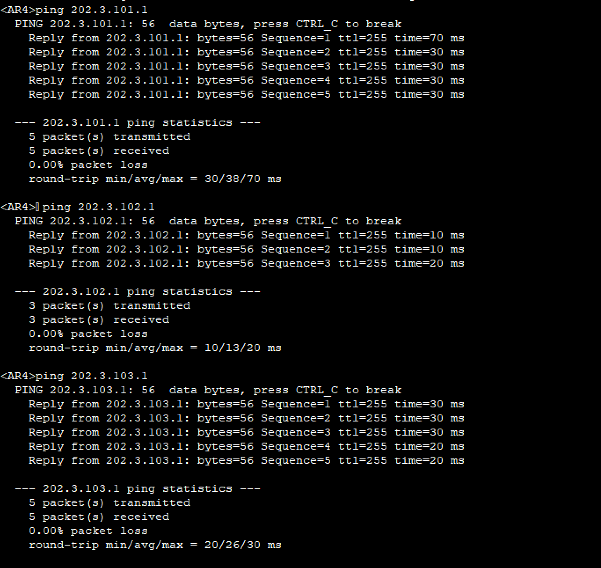

这里我使用的是AR4去ping在OSPF 2中的不同的端口ip，来验证是否联通

（2）配置FW1与AR2的OSPF加密认证（加密方式有很多，这里我选择MD5加密方式）

（2-1）进入需要认证的端口，配置认证信息（以下为添加密码的配置代码）

```bash
ospf authentication-mode md5 1 cipher + 你的密码
```

（2-2）在AR2和FW1对应端口，配置OSPF密码认证，详细配置信息如下：

```bash
[AR2]int g0/0/0
[AR2-GigabitEthernet0/0/0]ospf authentication-mode md5 1 cipher admin@123

[FW1]int g1/0/3
[FW1-GigabitEthernet1/0/3]ospf authentication-mode md5 1 cipher admin@123
```

提示部分：由于还没有配置内外网区域的协议相互引入，所以这里ping不通是属于正常现象（通常情况下，这里是外网配置OSPF的加密，内网则不需要）

## 习题十：**在AR4和L3-SW8上开启RIP路由，并且实现互联网区域的OSPF和RIP之间互相引入，实现网络的联通**

设备划分思路如下：

| 设备 | 运行的路由协议 | 作用 |
| --- | --- | --- |
| AR2/AR3 | 只运行 OSPF 2 | 只和 OSPF 域内的设备（AR4）交换路由 |
| AR4 | 同时运行 OSPF 2 + RIP 1 | 一边连 OSPF 域（AR2/AR3），一边连 RIP 域（L3-SW8） |
| L3-SW8 | 只运行 RIP 1 | 只和 RIP 域内的设备（AR4）交换路由 |

实操步骤如下：

（1-1）配置L3-SW8的IP配置，及vlan2划分IP的基础操作

```bash
[L3-SW8]vlan batch 2 50 60
//创建vlan 2 用于给L3-SW8的端口配置ip
[L3-SW8]int vlan 2
[L3-SW8-Vlanif2]ip add 204.108.100.2 24
//进入vlan2配置ip地址
[L3-SW8]int g0/0/1
[L3-SW8-GigabitEthernet0/0/1]port link-type acc
[L3-SW8-GigabitEthernet0/0/1]port default vlan 2
//把vlan2划分到g0/0/1口，即为配置好ip
```

（1-2）验证环节

使用已经配置好的去ping AR4的端口IP，发现可以ping成功

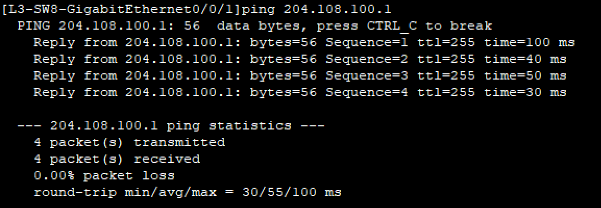

（2）划分vlan50，60的配置

vlan50的划分如下：

```bash
[L3-SW8]int vlan 50
//进入vlan50
[L3-SW8-Vlanif50]ip address 172.16.3.1 24
//添加ip地址
[L3-SW8]int g0/0/2
//进入g0/0/2，配置对应的端口模式
[L3-SW8-GigabitEthernet0/0/2]port link-type trunk
[L3-SW8-GigabitEthernet0/0/2]port trunk allow-pass vlan all

//进入L2-SW10的对应端口配置端口模式
[L2-SW10]int g0/0/1
[L2-SW10-GigabitEthernet0/0/1]port link-type trunk
[L2-SW10-GigabitEthernet0/0/1]port trunk allow-pass vlan all

[L2-SW10]vlan 50
[L2-SW10-vlan50]q
//宣告vlan50，不需要配置ip
[L2-SW10]int g0/0/2
//进入到与下层pc上连接的端口，配置端口模式为access模式
[L2-SW10-GigabitEthernet0/0/2]port link-type access
[L2-SW10-GigabitEthernet0/0/2]port default vlan 50
```

vlan60也是同理，这里我就不再进行概述了（需要注意的是vlan60的配置的时候，下层PC的接口是Eth0/0/1，而非是G0/0/1）

验证环节：

使用对应的PC去ping它们自己的网关，发现可以ping通

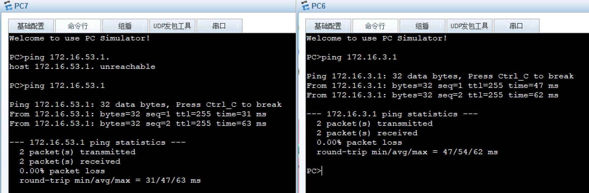

（3）RIP路由部分

核心思路：在AR4和L3-SW8上创建Rip路由，并且在AR4上的这个OSPF2中相互引入

（3-1）在AR4上的操作

```bash
AR4]rip 1
//创建Rip1
[AR4-rip-1]version 2
//版本设置为2
[AR4-rip-1]network 204.108.100.0
//将这个与LS-SW8连接的这个端口绑定到Rip路由中
```

（3-2）在L3-SW8上的操作

```bash
L3-SW8]rip 1
//同样创建Rip1
[L3-SW8-rip-1]version 2
//设置版本为2
[L3-SW8-rip-1]network 172.16.0.0
[L3-SW8-rip-1]network 204.108.100.0
//添加这个两个IP地址
//分别为之前划分vlan的主网地址（包含了172.16.3.0和172.16.53.0的这个两个网段）
//还用与AR4连接的这个网段的地址
```

提示部分：这里的这个Rip路由在创建的时候，Rip的`network`命令要求**只写主类网络的网络号**，不能写子网段（比如 172.16.3.0 是子网，172.16.0.0 才是主类）

（4）Rip路由和OSPF的相互引入

核心思路：只需在AR4上操作就行，不需要再L3-SW8上配置OSPF和Rip的引入

可以简单理解成，只有AR4有两个协议（OSPF 2和RIP），而这个L3-SW8只有一个Rip协议，所以不需要配置相互引入的这个操作

实操步骤如下：

```bash
[AR4]ospf 2
//进入AR4的OSPF 2
[AR4-ospf-2]import-route rip 1
//宣告Rip 1的路由
[AR4]rip 1
//进入Rip 1
[AR4-rip-1]import-route ospf 2
//宣告OSPF 2的路由
```

验证环节：

这里我使用PC6，去Ping分别来自AR2的202.3.102.1的这个IP地址，和来自AR3的202.3.103.2的这个IP地址，从而验证这个配置的情况

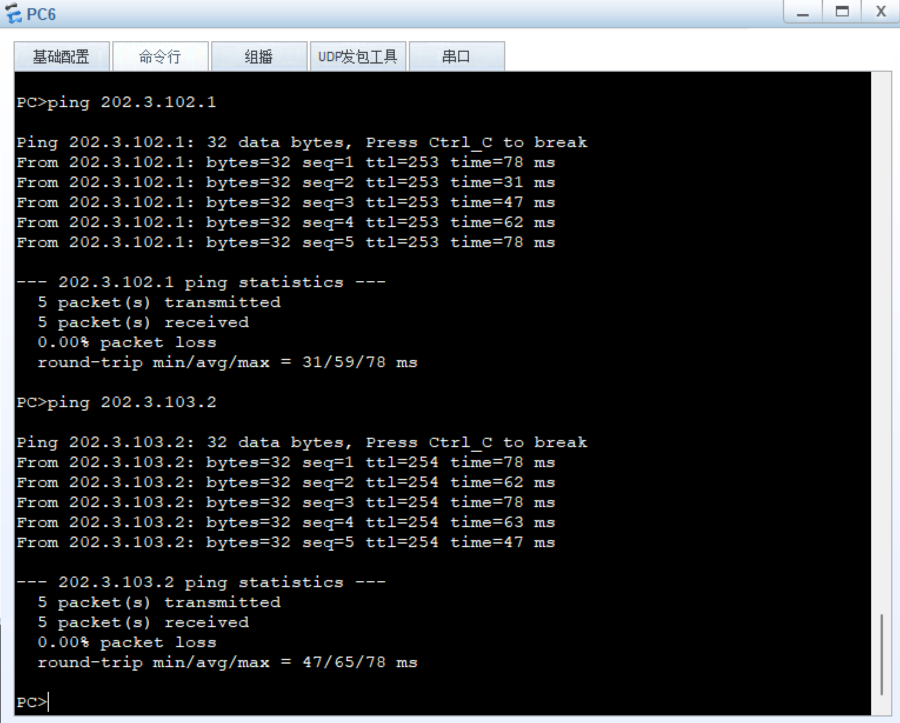

可以看到，可以收到来自于AR2和AR3的回复包，即如上图所示

## **习题十一：设置内网服务器区域的WWW服务器的http服务，实现内网客户端通过域名成功访问到WWW服务，其中设置DNS的解析为www.test.com解析到WWW服务器的IP上**

实操步骤如下：

（1）在FW1的配置

（1-1）给 FW1 G1/0/2 配置服务器段网关

```bash
[FW1]system-view
//进入FW1系统视图
[FW1]interface GigabitEthernet1/0/2
//进入G1/0/2接口（DMZ区，已加入dmz zone，无需再加）
[FW1-GigabitEthernet1/0/2]ip address 10.10.4.254 24
//配置服务器段网关IP，选10.10.4.254/24（避开所有重叠网段，掩码24满足服务器段需求）
[FW1-GigabitEthernet1/0/2]quit
//接口已undo shutdown，无需再操作，退出
```

（1-2）将服务器段加入 OSPF，让内网互通

```bash
[FW1]ospf 1
//FW1系统视图下
[FW1-ospf-1]area 0
//进入area 0
[FW1-ospf-1-area-0.0.0.0]network 10.10.4.0 0.0.0.255
//把10.10.4.0/24加入OSPF 0区（反掩码0.0.0.255对应掩码24）
[FW1-ospf-1-area-0.0.0.0]quit
[FW1-ospf-1]quit
[FW1]quit
<FW1>save
//保存配置
```

操作目的：将**DNS/WWW 服务器段从 10.10.3.0/24 调整为不重叠的网段**（比如`10.10.4.0/24`，避开 FW1 已有的 10.10.3.0/29、10.20.3.0/29），网关放在 FW1 的 G1/0/2（DMZ 区），同时把该网段加入 OSPF，让内网 L3-SW1/2 能通过 OSPF 学习到路由

（2）在DNS服务器的配置

如下图所示，网关设置成上层的连接

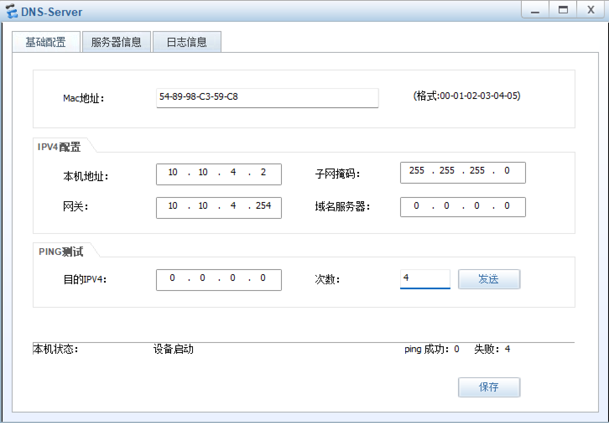

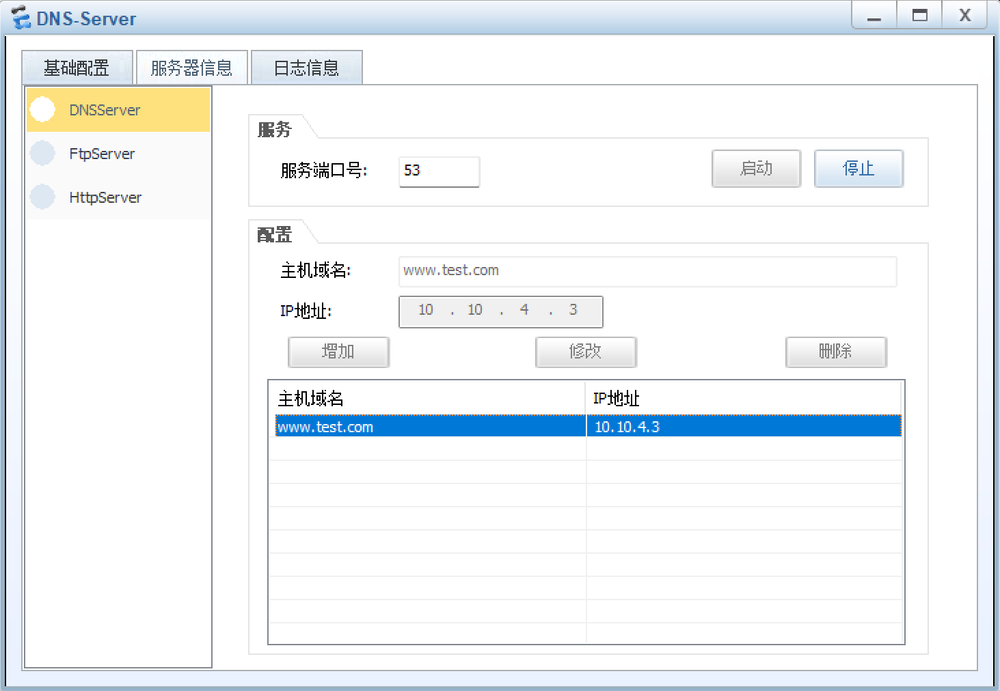

（3）在WWW服务器上的配置

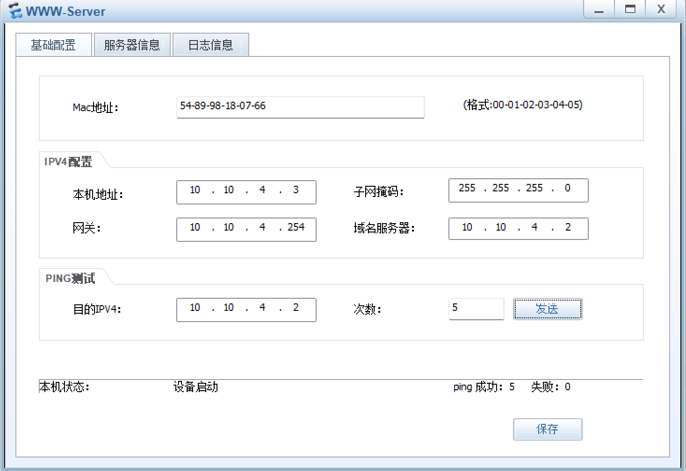

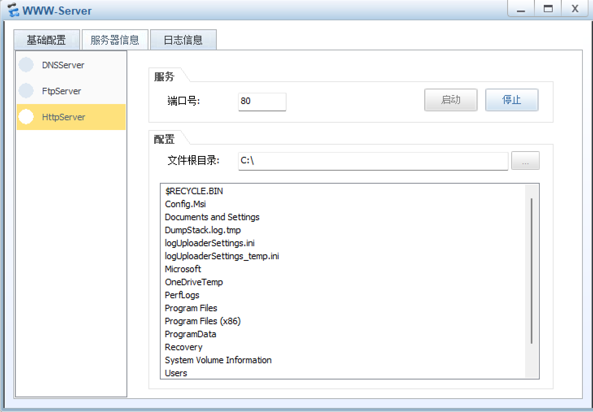

（4）在防火墙上的配置（放行DNS和HTTP协议）

这里我依旧使用图形化界面操作，便于理解

（4-1）进入防火墙，新建一条策略（如下图所示）

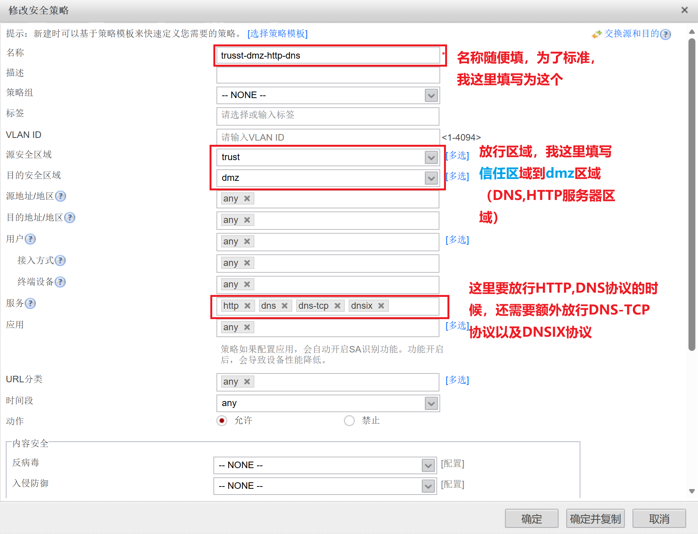

提示部分：这里的DMZ区域（非军事化管理区域），这里通常将**要给外网访问，但又不能直接放进内网服务器**放在这里，因为服务器需要为外网提供服务，但是服务器又属于内网区域，而DMZ区域就是做这个用途的（核心服务器不能放在这里）

（5）添加内网Client客户端（进行网页访问的验证）

这里我选择在L3-SW1的G0/0/5口添加（因为这样只需要将这个口划分到vlan10即可）

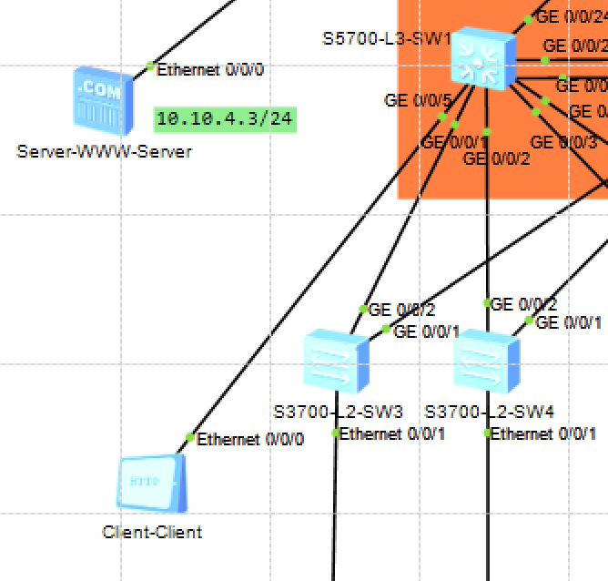

（5-1）在L3-SW1操作，将G0/0/5划分到vlan10

```bash
<L3-SW1>system-view 
//进入特权模式
[L3-SW1]int g0/0/5
//进入g0/0/5端口
[L3-SW1-GigabitEthernet0/0/5]port link-type access
//设置端口类型为access模式
[L3-SW1-GigabitEthernet0/0/5]port default vlan 10
//划分到vlan10
```

验证环节：

（1）使用内网Client客户端访问10.10.4.3这个IP地址，发现可以正常解析到文件

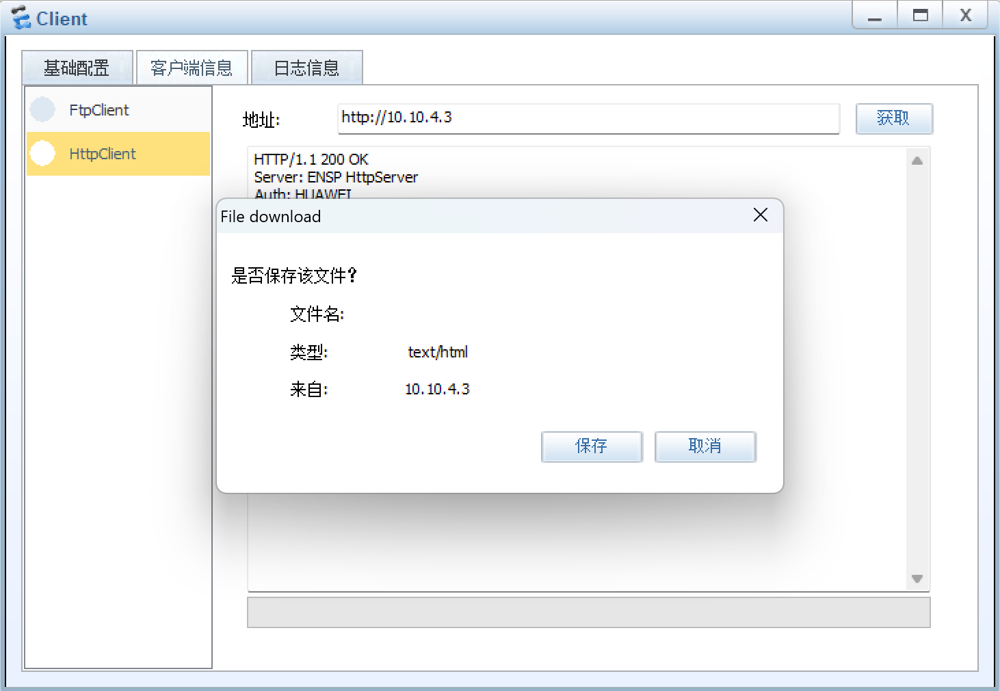

（2）使用内网Cilent客户端访问这个www.test.com这个网址，依旧可以解析到文件


## **习题十二：在防火墙FW1上通过配置NAT实现使其内网实现互联网的访问**

打开防火墙（为了便于演示，我这里依旧使用网页来进行操作）

步骤一：新建NAT策略

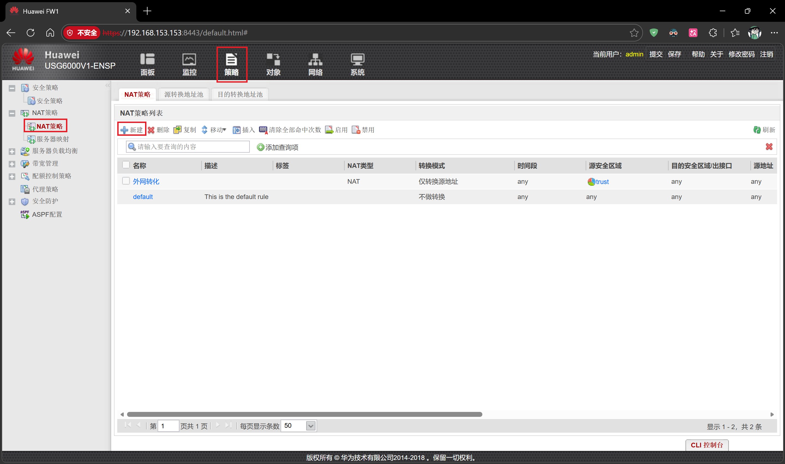

配置策略（这里我之前配置过了，所以是修改，正常配置时会显示的是新建）

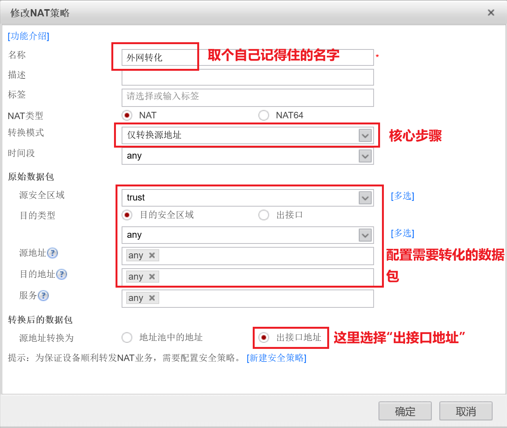

提示部分：出接口地址，默认是下一跳的外网地址（AR2上的配置的IP地址）

也可以选择新建唯一ip的地址池，也就是配置单独的一个出接口地址（但是那样有些麻烦，所以我们还是选择“出接口地址“这个选项，来的方便）

提一下：如果要自己配置这个唯一ip的地址池的时候，需要勾选这个”允许端口地址池转化“的这个选项（如下图所示，没单独配地址池则不需要选择和新建）

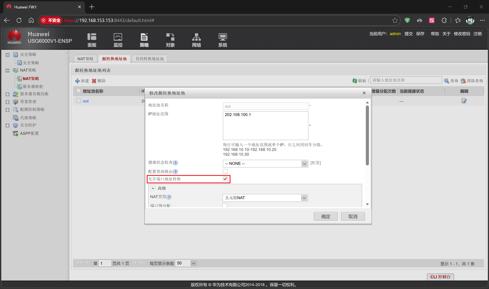

步骤二：选择新建安全策略，并添加以下安全策略

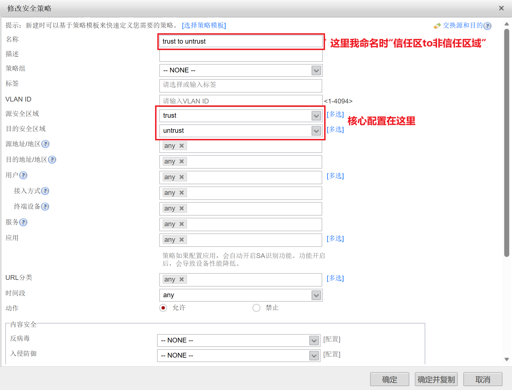

配置缺省路由（就是当路由器**找不到更精确的路由条目**时，**唯一的、最后的出口**）

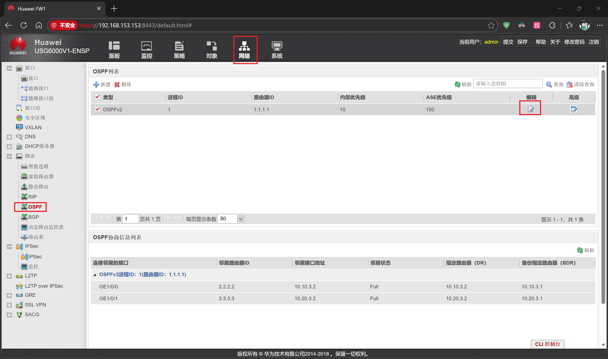

打开这里的“缺省路由的”这个选项

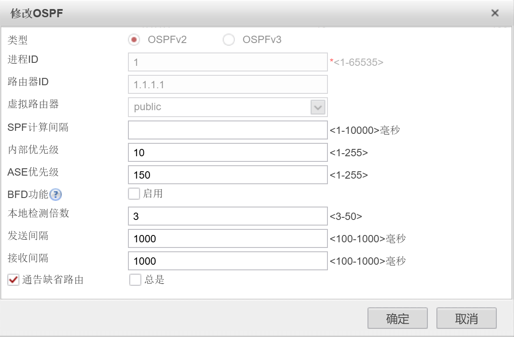

测试部分：

现在可以使用内网的PC机器去Ping外网的机器，来验证示范成功

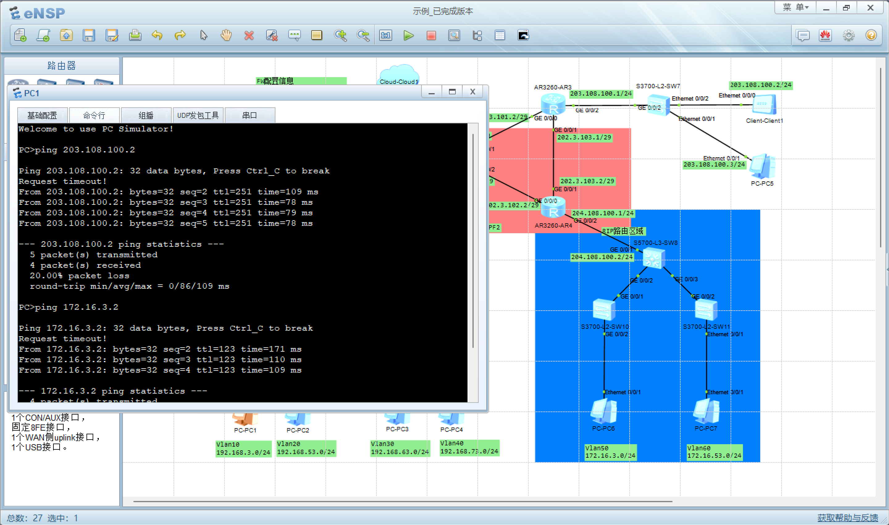

我这里选择是PC1去Ping外网的Cilent1的IP，以及PC6的IP

可以看到，这里可以Ping通，即为验证配置成功

## **习题十三：在防火墙FW1上配置NAT发布，使其互联网通过访问防火墙的外部端口可以访问到内网WWW服务的80端口**

步骤一：这里我们再次创建一个安全策略配置（用于外网的机器访问内网的DMZ区域）

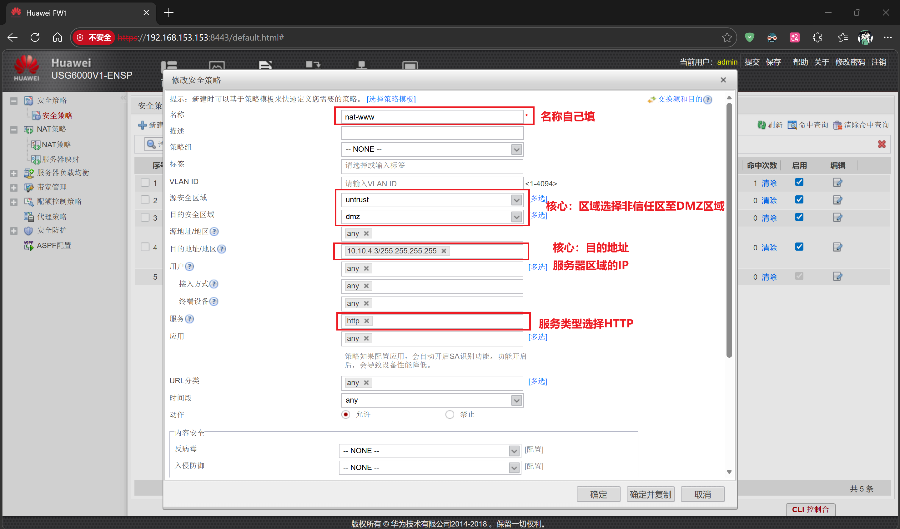

添加一条80端口的服务器映射


提示部分：黑洞路由（可选），主要目的是将外网的访问其他非指定的内网IP直接丢包

验证部分：

可以点击”诊断“按钮，测试是否联通，并启用这个端口映射


使用外网的Cilent1机器访问FW1的ip地址（由于没有配置域名绑定，所以使用域名访问不到）


可以成功，即为配置没问题

## **习题十四：在内网中配置ACL控制，使其VLAN20和VLAN40两个网段不能互相访问**

配置思路如下：

- **使用高级 ACL 3000**：需同时匹配**源 IP + 目的 IP**，精准拦截 V20↔V40，不影响其他网段
- **应用位置**：选择在**Vlanif20、Vlanif40 接口入方向**设置（也就是流量进入三层网关时拦截，效率最高）
- **规则逻辑**：
  - 拒绝 VLAN20 源 IP 访问 VLAN40 目的 IP
  - 拒绝 VLAN40 源 IP 访问 VLAN20 目的 IP
  - 无需额外配置`permit any any`：华为**接口入方向**应用 ACL 时，仅拦截匹配规则的流量，未匹配的流量默认放行（避免误拦截其他网段）

实操步骤：

步骤一：在L3-SW1的配置如下

```bash
# 1. 为Vlanif20创建ACL 3001（拦截V20→V40）
[L3-SW1]acl number 3001 name deny1-V20-to-V40
[L3-SW1-acl-adv-deny-V20-to-V40]rule 5 deny ip source 192.168.53.0 0.0.0.255 destination 192.168.73.0 0.0.0.255
[L3-SW1-acl-adv-deny-V20-to-V40]quit

# 2. 为Vlanif40创建ACL 3002（拦截V40→V20）
[L3-SW1]acl number 3002 name deny2-V40-to-V20
[L3-SW1-acl-adv-deny-V40-to-V20]rule 5 deny ip source 192.168.73.0 0.0.0.255 destination 192.168.53.0 0.0.0.255
[L3-SW1-acl-adv-deny-V40-to-V20]quit

# 3. 将ACL 3001绑定到Vlanif20入方向
[L3-SW1]interface Vlanif20
[L3-SW1-Vlanif20]traffic-filter inbound acl 3001
[L3-SW1-Vlanif20]quit

# 4. 将ACL 3002绑定到Vlanif40入方向
[L3-SW1]interface Vlanif40
[L3-SW1-Vlanif40]traffic-filter inbound acl 3002
[L3-SW1-Vlanif40]quit

# 验证配置（可选）
[L3-SW1]dis acl all  # 查看ACL规则
[L3-SW1]dis cu interface Vlanif20  # 查看Vlanif20配置
[L3-SW1]dis cu interface Vlanif40  # 查看Vlanif40配置
```

步骤二：在L3-SW2的配置如下（和L3-SW1的配置大相径庭）

```bash
# 1. 创建ACL 3001（拦截V20→V40）
[L3-SW2]acl number 3001 name deny1-V20-to-V40
[L3-SW2-acl-adv-deny-V20-to-V40]rule 5 deny ip source 192.168.53.0 0.0.0.255 destination 192.168.73.0 0.0.0.255
[L3-SW2-acl-adv-deny-V20-to-V40]quit

# 2. 创建ACL 3002（拦截V40→V20）
[L3-SW2]acl number 3002 name deny2-V20-to-V40
[L3-SW2-acl-adv-deny-V20-to-V40]rule 5 deny ip source 192.168.73.0 0.0.0.255 destination 192.168.53.0 0.0.0.255
[L3-SW2-acl-adv-deny-V20-to-V40]quit

# 3. 绑定ACL到接口
[L3-SW2]interface Vlanif20
[L3-SW2-Vlanif20]traffic-filter inbound acl 3001
[L3-SW2-Vlanif20]quit
[L3-SW2]interface Vlanif40
[L3-SW2-Vlanif40]traffic-filter inbound acl 3002
[L3-SW2-Vlanif40]quit

# 验证配置（可选）
[L3-SW2]dis acl all
```

提示部分：

在L3-SW1/2配置ACL时候需要注意的点，命名的时候不可以重复（例如我这里的使用deny1-V20-to-V40，deny2-V20-to-V40区分），ACL规则编号也不能重复（例如我这里的使用3001和3002区分）

验证环节


可以看到，我使用PC4去Ping属于vlan20的PC（53网段）全部超时，再次去Ping属于vlan10的PC（3网段）可以成功，那么就证明了前面配置的acl规则配置的没有问题

### 至此，本次的分析到此结束，如果您能完全理解，那么恭喜你，你已经成功掌握最基础的企业级复合网络

### 感谢您的阅读(\*/ω＼\*)

致谢：本文思路来源于[PigTeacher](https://www.pigteacher.com/)的课程考题
