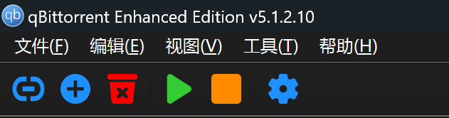
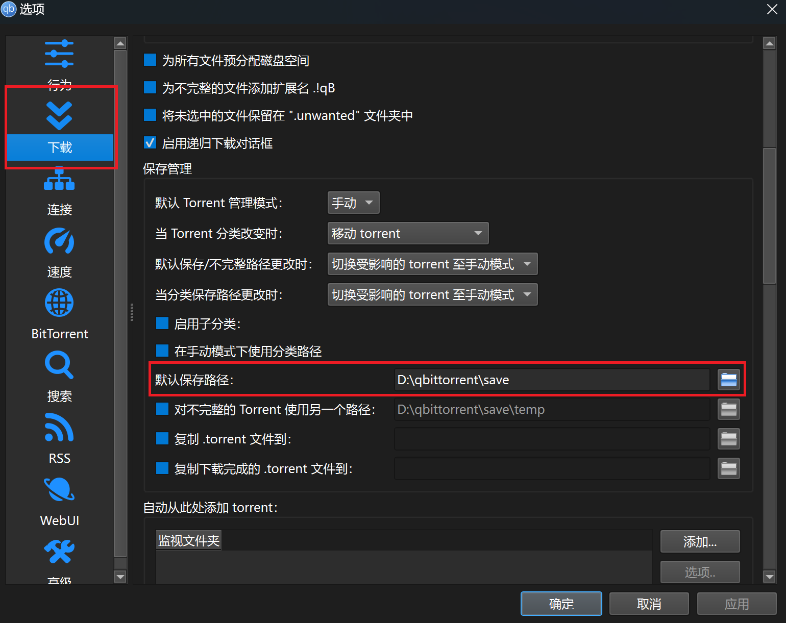
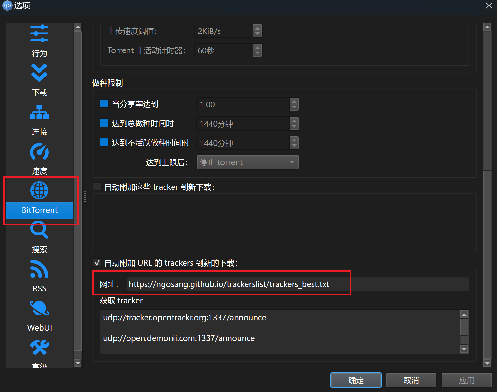
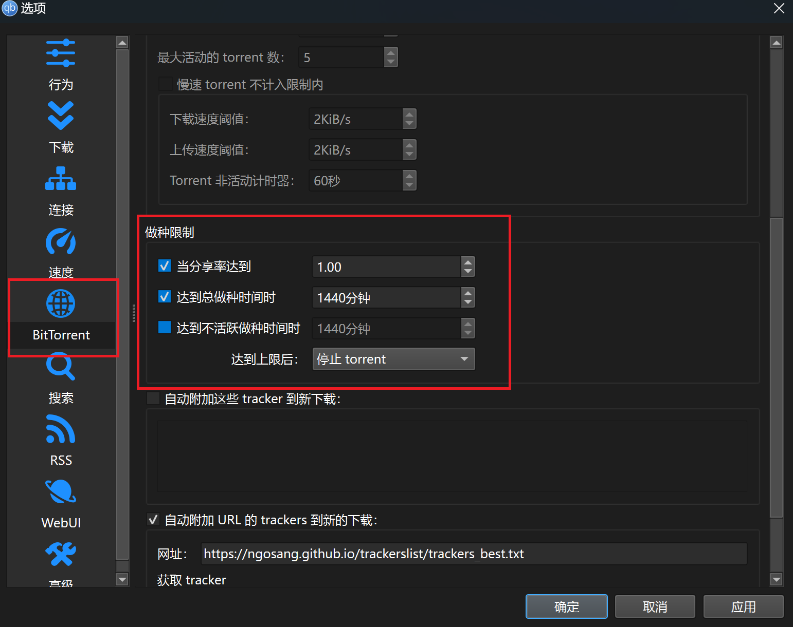
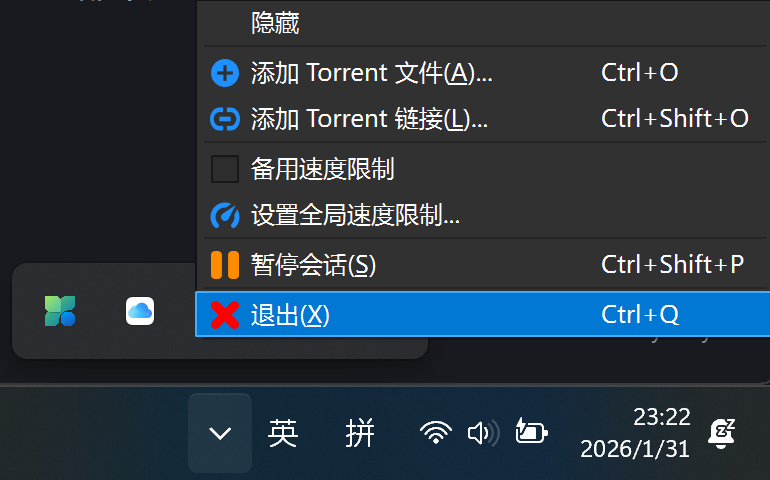
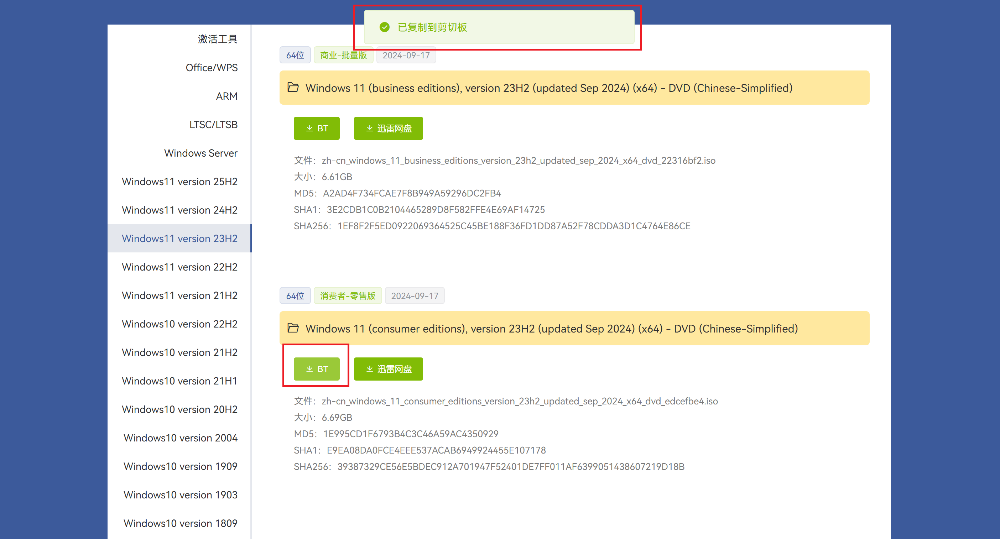
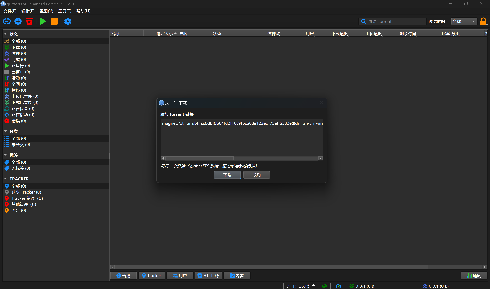
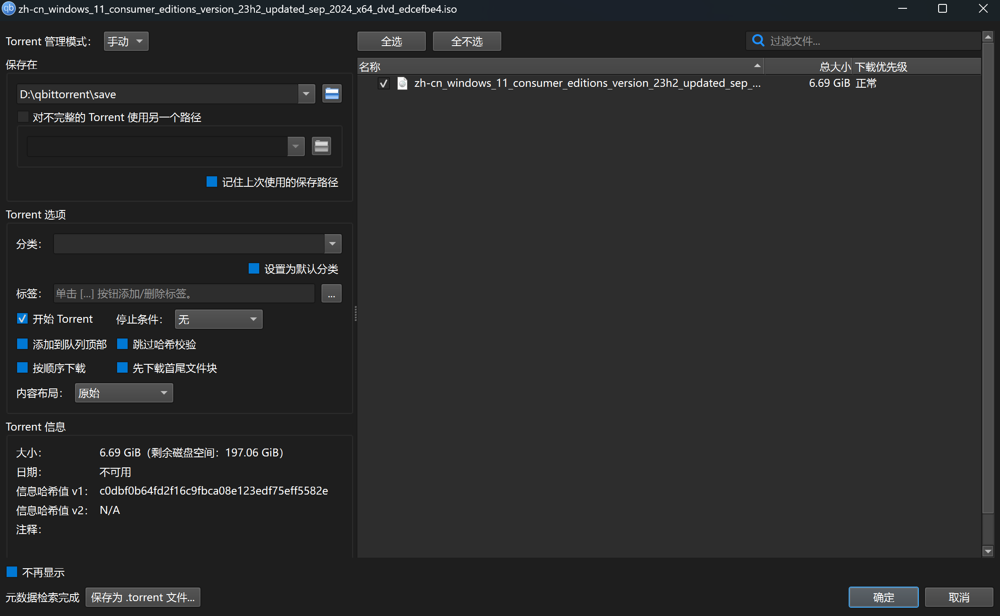
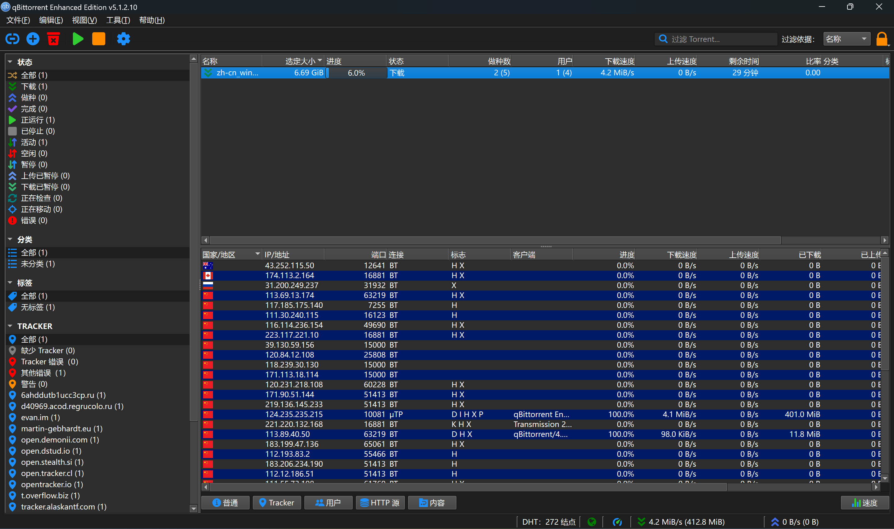
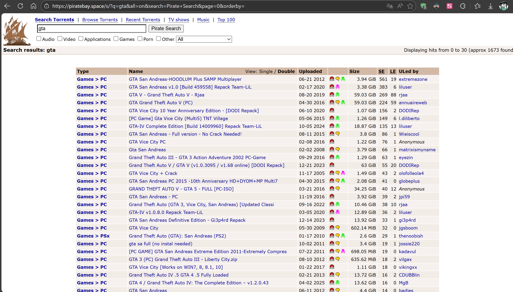

**软件下载：**[点我下载](https://wwbte.lanzn.com/b014x1es3g)    **密码：**414a

**软件介绍：**基于 BitTorrent 协议的 P2P（点对点）文件下载工具，该软件是一款开源，免费且无广告的 BitTorrent 客户端，旨在为用户提供安全、高效的文件下载和分享体验的优秀软件

**软件功能：**用来下载他人提供的种子链接，以及自己"做种"，为他人提供下载（尤其是文件不限速，隐私性极高，比国内的网盘好用多了，你的电脑就是服务端，没有审核）

**什么是"做种"：**做种就是当你下载完一个文件后，继续保持软件运行，把你已有的文件片段上传给其他正在下载这个文件的人

- 你就像一个"种子节点"，为后来的用户提供下载源，所以这个行为叫”做种“
- 这是 BT 协议的核心精神：**人人为我，我为人人**

（不过为了保持"开源分享精神"，可以在软件里设置分享的阈值，具体的设置及原理，在该文章中我也会提到）

**软件原理：**简单理解成，把你要的文件被拆成了很多小块，软件帮你找到一堆也在下载这个文件的人，你从他们手里分别拿不同的小块，同时也把自己已经拿到的小块传给别人，最后拼出完整的文件（这样一来，人越多，你拿到小块的速度就越快，而且不用全都从一个地方慢慢等）

**至此，在这里感谢互联网里每一位无私的"做种人"**

## 软件使用教程：

软件功能介绍，打开这个软件后，你会看见左侧的几个按键的功能依次是

左侧第一个（蓝色胶囊的样式，是添加来自于他人分享的BT种子链接）

左侧第二个（蓝色加号的样式，是用于他人分享的.torrent的文件）

左侧第三个（红色垃圾桶样式，是用于删除当前选中的下载任务）

左侧第四个（绿色表示演示，启动任务）

右侧第二个（黄色标识，暂停任务）

右侧第一个（打开设置按钮）

## 软件优化教程：

（1）找到下载路径这一栏，选择合适的下载路径（我这里windows做了分盘，所以我选择D盘的一个文件夹）

（2）填写trucker地址，提高下载速度（必要操作，否则会下载很慢）

我们通常来说会进入设置界面，填写一个自动获得trucker的地址，以此来增快下载速度

在这个BitTorrent设置里的这一栏，添加图片里面的这个网址，可直接复制括号里的内容（https://ngosang.github.io/trackerslist/trackers\_best.txt）

简单来说，Tracker就像是BT下载里的 “信息中转站”，它负责帮你找到正在下载同一文件的其他用户（也就是"Peer"）

（3）分享设置（给自己做种设置限制）

打开这个界面，设置和我图片里一样即可

图片内的含义解释：

**1.当分享率达到 1.0**

- 分享率 = 你上传的总流量 ÷ 你下载的总流量
- 1.0 代表你上传的流量和下载的流量一样多，相当于 “你拿了别人多少，就还给别人多少”
- 达到这个数值后，软件就会停止做种

**2.达到总做种时间时 1440 分钟**

- 1440 分钟 = 24 小时
- 意思是从你下载完成开始，无论分享率是否达标，只要做种满 24 小时，软件就会自动停止做种

我的建议是：只需要在你想下载文件的时候再打开软件，下载完成后按你的设置自动停止做种，然后直接退出就好。长期挂着做种会增加上行流量，虽然正常使用不会被封PCDN，但没必要给自己增加风险

下图是在任务栏的"隐藏图标"这一栏中的退出选项（如果直接叉掉这个软件不会直接退出的）需要和下图一样，在这里选择退出的按钮

如果你家里有7\*24h运行着的NAS，那么我是强烈建议你开着的（如果你连NAS都不知道，仅仅是偶尔下载一两次的他人分享的链接，那没有必要一直开着）

毕竟，独乐乐不如众乐乐(>ω< )

## 使用示例：

这里我用我下载的这个windows11 23H2 系统镜像（也是我本人正在使用的windows11版本，很推荐的一个版本）的这个下载链接，来示例这个软件的使用（这个系统镜像下载网站我也收录在了我的博客内的“网站推荐”页面内）

（1）寻找下载链接（这里我在这个Hello Windows这个网站里找到了我需要下载的BT链接）

（2）打开qbittorrent软件，选择这个链接下载的选项

（3）查看下载的信息是否与你的需求一致

（4）点击确定下载即可（如果下载速度慢，可以尝试开启"🪄魔法"或者加速器）如果实在是速度很慢（冷门资源，做种数少，那么就会很长时间了）

标志的含义介绍如下图所示：

| 标志 | 英文全称 | 含义 |
| --- | --- | --- |
| **D** | DHT | 来自 DHT 网络的连接 |
| **T** | Tracker | 来自 Tracker 服务器的连接 |
| **P** | Peer Exchange | 通过 Peer Exchange（PEX）发现的连接 |
| **X** | Encrypted/uTP | 加密连接 或 使用 uTP 协议 |
| **U** | Upload Only | 对方只上传，不下载你的数据 |
| **D** | Download Only | 你只下载，不从对方那里上传数据 |
| **I** | Incoming | 对方主动连接到你 |
| **O** | Outgoing | 你主动连接到对方 |

至此，你已经完全学会这款软件的下载和使用

说了这么多，我这里分享一个推荐的BT种子下载软件的使用，祝你使用愉快(●'◡'●)

**好用的网址下载推荐qbittorrent的网站（已收录在“[网站推荐](/good-web/)”里）**

海盗湾：[点我直达](https://thepiratebay.asia/)

这里我以"GTA"关键词来搜索，可以看到有提供超多的文件种子下载链接
