买了云服务器，第一件事不是装软件，而是**把安全基础打好**

很多人拿到服务器就直接开始装宝塔、建网站，结果没多久就被扫描爆破（轻则跑满带宽，重则数据全丢）本文整理了一套适用于 Ubuntu Server 的安全加固流程，按步骤做完基本能挡住绝大多数自动化攻击

**实验环境：** Ubuntu Server 22.04.5 LTS（推荐版本，兼容性最好）

```bash
Ubuntu 的版本命名
├── 按"有没有图形界面"分
│   ├── Desktop 版  → 有桌面，给普通电脑用
│   └── Server 版   → 纯命令行，给服务器用
│
└── 按"支持周期"分
    ├── LTS 版      → 长期支持，5年维护
    └── 普通版      → 只维护9个月
```

Ubuntu镜像下载：[点我跳转](https://ubuntu.com/download/server/thank-you?version=22.04.5&architecture=amd64&lts=true)

之前演示了安装Ubuntu Desktop版本（[点我跳转](/posts/install_ubuntu/)）

现在我将演示一下如何从零安装没有图形化版本的 Ubuntu Server 22.04.5 LTS

\*由于我是本地安装，所以没有ssh连接的这个步骤（正常你选择购买云服务器的话，通常是安装好的版本，可直接跳转至后半段的安全加固的部分）

## 第一步：选择`Try or Install Ubuntu Server`

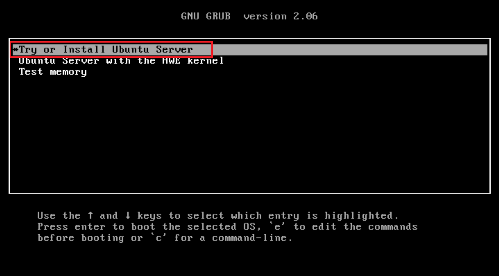

## 第二步：选择界面为`English`

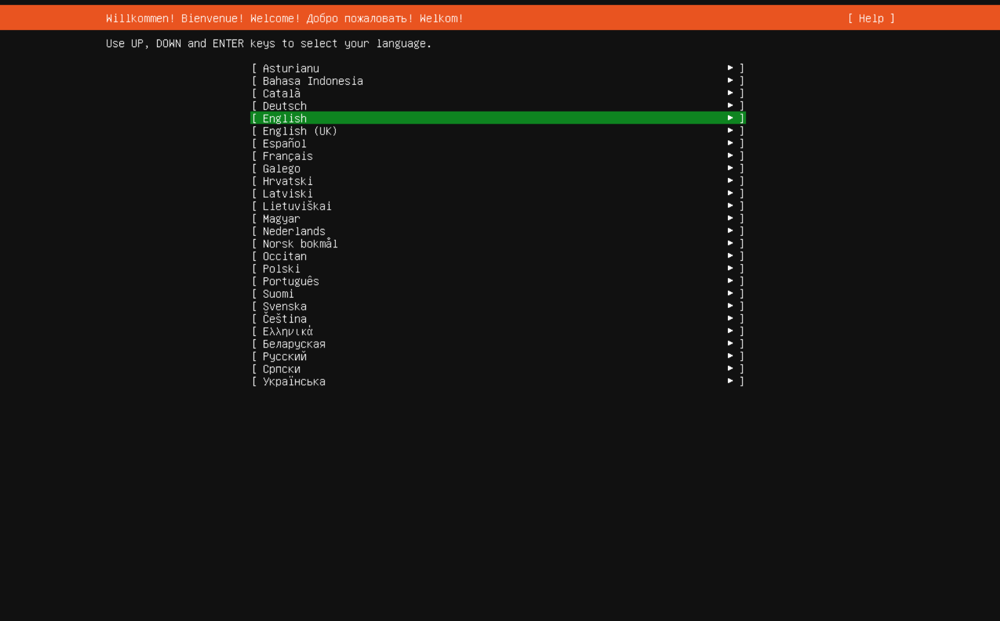

## 第三步：键盘选择默认的`English`，这里是`Done`，点击继续

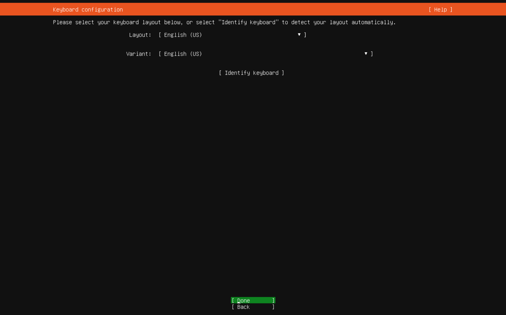

## 第四步：保持 (X) Ubuntu Server （已经选中即可），不要勾 "Ubuntu Server (minimized)"（那个是极简版，功能少），不要勾 "Search for third-party drivers"（我们不需要）

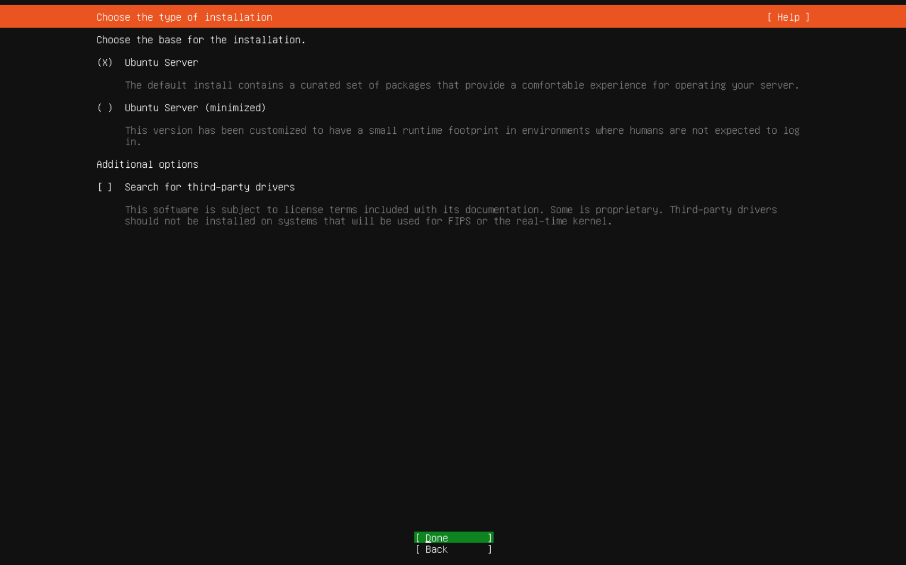

## 第五步：配置IP地址（由于我是虚拟环境，所以我这里需要手动配置IP地址）如果你买的VPS云服务器，那么这个IP/DNS是默认给你配好的，千万不要改动！

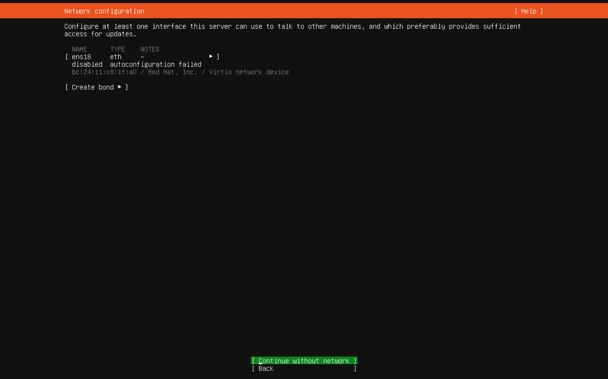

### 我这里需要手动配置IP地址（仅供参考）

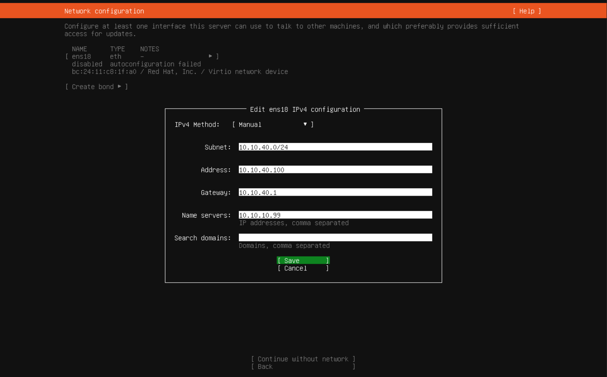

## 第六步：代理配置（这里我们不需要配置代理，所以留空，直接选择`Done`即可）

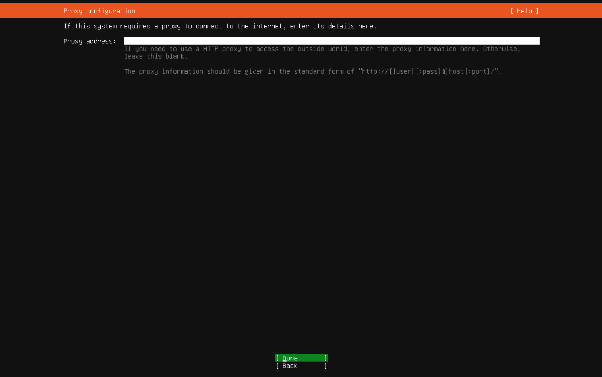

## 第七步：配置源（这里我就默认选择官方的源了，后续可换的）这里直接选择`Done`下一步即可

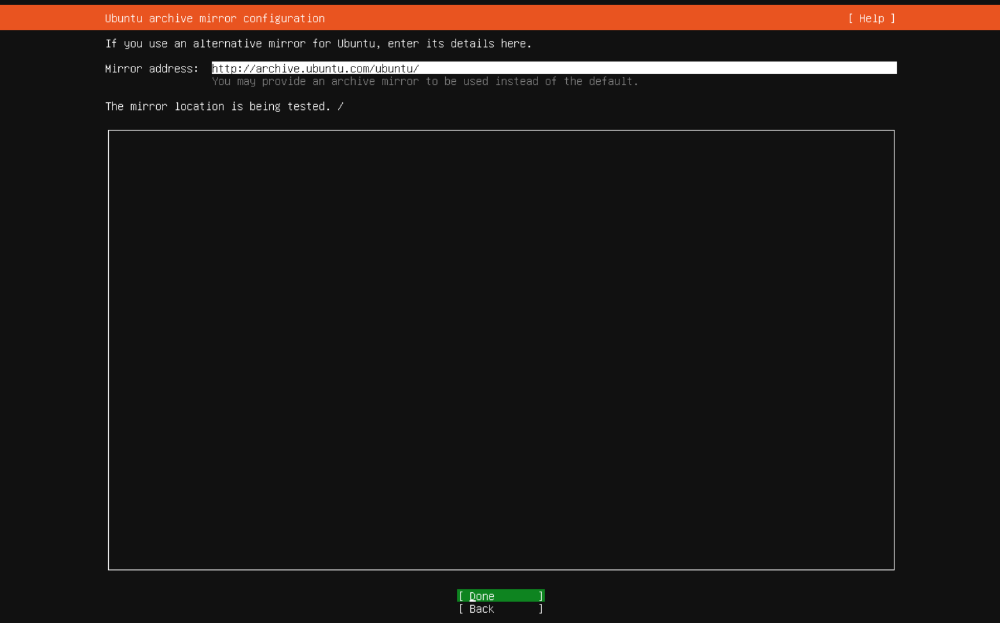

### 这里是我网段设置的缘故，直接选择`Continue`即可

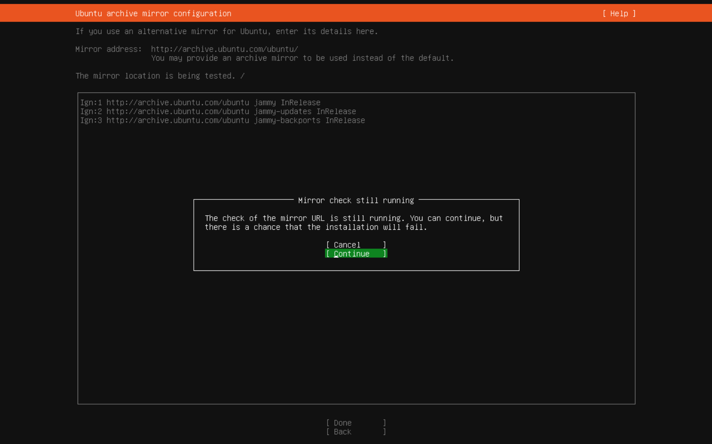

## 第八步：磁盘分区选项

### 和我一样，把 (X) Use an entire disk → 保留（使用整块磁盘），(X) Use an entire disk → 保留（使用整块磁盘）打上 X 即可

- **不要勾** Encrypt with LUKS（加密）——除非你特别需要加密，否则不要选
- **不要选** Custom storage layout

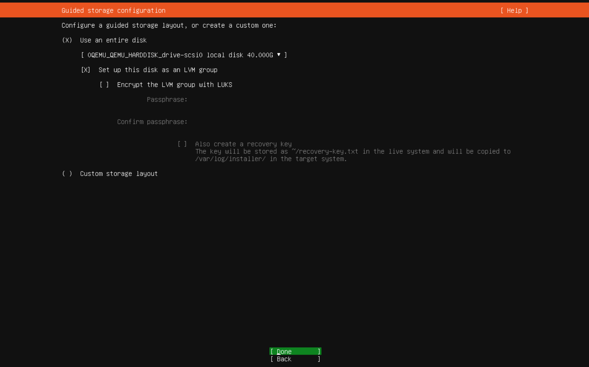

### 最终的磁盘分区确认界面（选择`Done`即可）

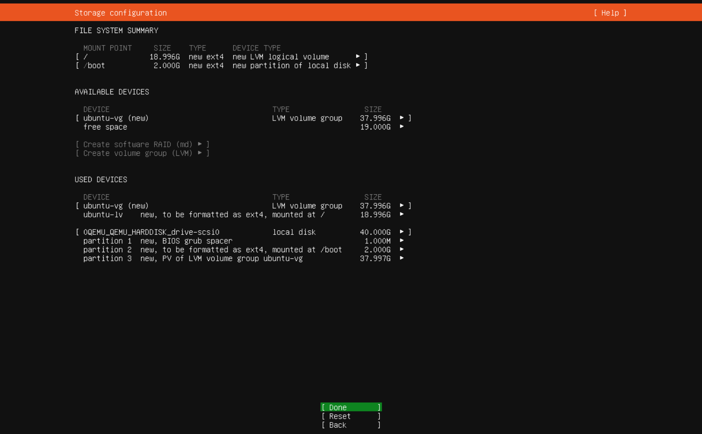

这个弹窗选择`Continue`即可（最终确认界面）

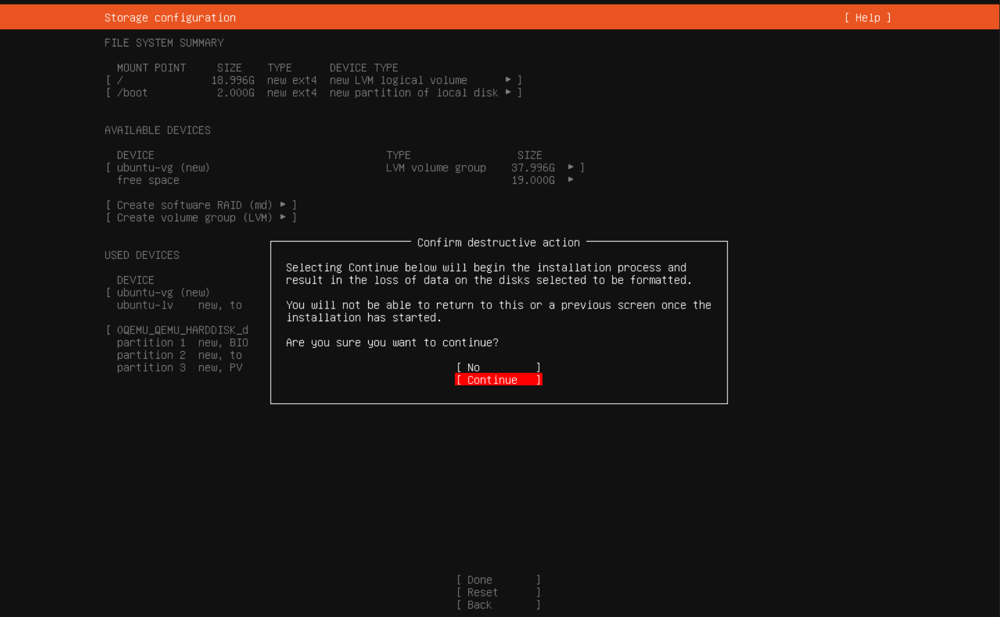

## 第九步：配置用户名和密码

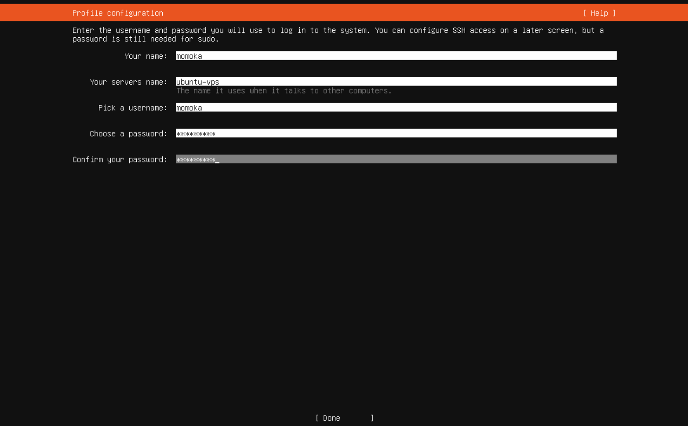

## 第十步：不要选择Ubuntu Pro服务，只需勾选这下面的即可

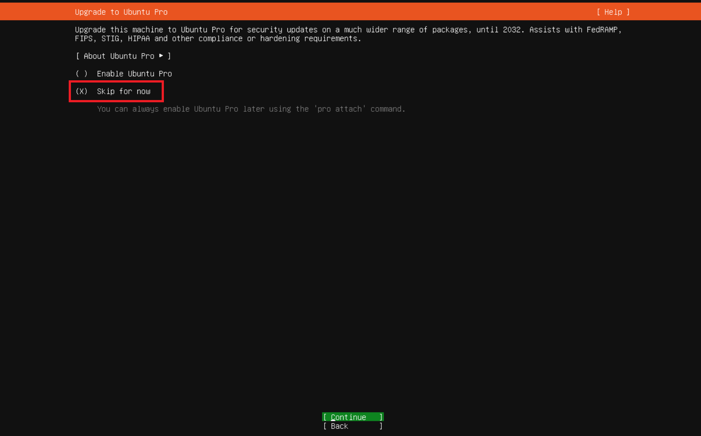

## 第十一步：安装远程SSH工具

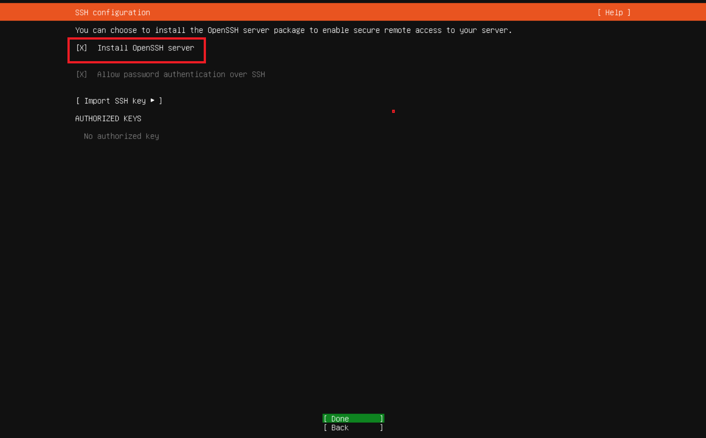

## 第十二步骤：等待系统完成安装

### 不需要操作，耐心等待 即可（通常需要 5-15 分钟，取决于网速）

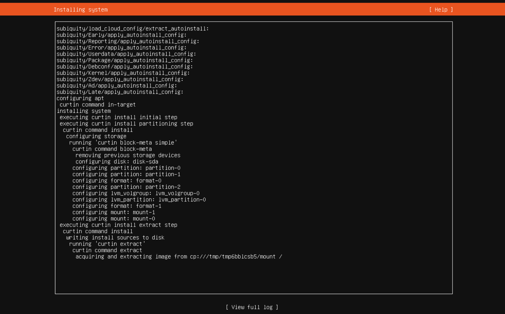

## 安全加固部分如下

## 第一步：更新系统软件包

```bash
sudo apt update && sudo apt upgrade -y
```

## 第二步：SSH 安全加固（最重要）

### **2.1 创建普通用户，禁止 root 直接登录**

```bash
# 创建新用户
adduser yourname
# 加入 sudo 组
usermod -aG sudo yourname
```

### **2.2 配置 SSH 密钥登录**

在你的 **本地电脑**（Windows）上生成密钥对：

```bash
ssh-keygen -t ed25519 -C "your-server"
# 默认生成在 C:\Users\你的用户名\.ssh\id_ed25519
```

把公钥上传到服务器：

```bash
# 在服务器上，切换到新用户
su - yourname
mkdir -p ~/.ssh && chmod 700 ~/.ssh
# 把你本地的 id_ed25519.pub 内容粘贴进来
nano ~/.ssh/authorized_keys
chmod 600 ~/.ssh/authorized_keys
```

### 2.3 修改 SSH 配置

```bash
nano /etc/ssh/sshd_config
```

需要修改或确认的关键项：

```bash
Port 22222          # 改成非标准端口（减少扫描骚扰）
PermitRootLogin no  # 禁止 root 登录
PasswordAuthentication no  # 禁止密码登录（配好密钥后再改）
MaxAuthTries 3
```

改完重启 SSH（**先不要断开当前连接，开一个新窗口测试**）：

```bash
systemctl restart sshd
```

## 第三步：配置防火墙 UFW

```bash
apt install ufw -y

# 先允许你的新 SSH 端口，再启用！顺序很重要
ufw allow 22222/tcp   # 替换成你设的端口
ufw allow 80/tcp      # 如果有 Web 服务
ufw allow 443/tcp

ufw enable
ufw status
```

## 第四步：安装 Fail2Ban（防爆破）

```bash
apt install fail2ban -y
systemctl enable fail2ban
systemctl start fail2ban
```

基础配置已经够用，它会自动监控 SSH 登录失败并封 IP

## 第五步：关闭不需要的服务

```bash
# 查看当前监听的端口
ss -tlnp
# 查看运行的服务
systemctl list-units --type=service --state=running
```

看到不需要的服务就 `systemctl disable --now 服务名`
