## 环境说明：

- 使用ImmortalWrt 24.10.5 作为内网网关（使用家庭路由器下发的固定IP）
- 家庭内网 WiFi 网段是 `192.168.31.0/24`
- 虚拟机内网网段是 `10.10.10.0/24`
- 目标是在家庭网段直接通过VPN拨号进内网虚拟机

## 实现思路：

```bash
笔记本 (10.10.20.2)
  ↓ WireGuard 加密隧道
ImmortalWrt wg0 (10.10.20.1)
  ↓ 路由转发（经过 eth1: 10.10.10.1）
虚拟机网段 (10.10.10.x)
```

注意这里有**三个网段**，不要搞混

| 网段 | 用途 |
| --- | --- |
| `192.168.31.0/24` | 家庭 WiFi，路由器的外网侧 |
| `10.10.10.0/24` | PVE 虚拟机内网（最终访问的） |
| `10.10.20.0/24` | WireGuard 专用虚拟网段（新建的） |

`*注意事项`：

- WireGuard 需要一个**独立的虚拟网段**来做隧道（不能和已有网段重叠，所以我们新开了 `10.10.20.0/24`）
- 这里的 ImmortalWrt 24.10.5 我添加了两张网卡（需要同时涉及到家庭内网网段和虚拟机内网网段）

## 有关于 ImmortalWrt 的配置部分

（我这里的ImmortalWrt为了方便演示和理解，我安装了图形化的操作环境）

## 第一步：登录ImmortalWrt Web操作界面

这里我装了一个主题（都是一样的用法）


## 第二步：安装必要的 WireGuard 装包

ImmortalWrt 已经内置了 `wireguard-tools` 和 `kmod-wireguard`（内核模块）

按照下图所示，搜索这3个包，并安装

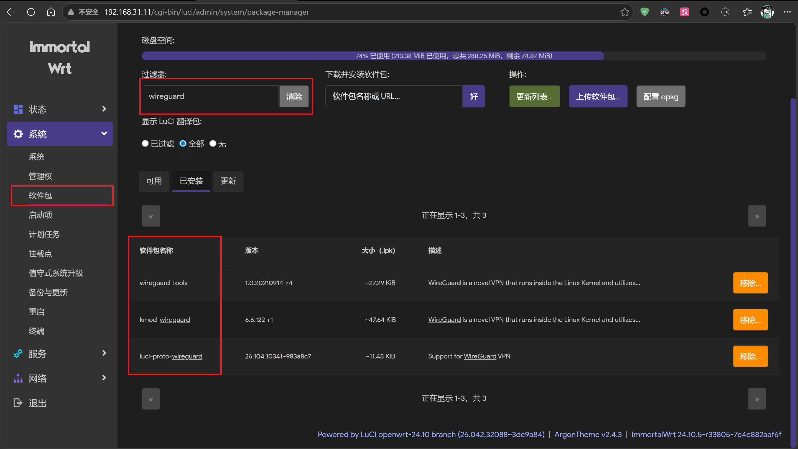

这些wireguard资源包，如果能搜索到，可以直接在图形化界面里安装，如果搜索不到，可使用如下bash命令，在终端里安装

```bash
opkg update && opkg install luci-proto-wireguard wireguard-tools kmod-wireguard
```

装完之后刷新 LuCI 页面，网络 → 接口 → 新建接口时，协议下拉列表里就会出现 **WireGuard VPN** 选项

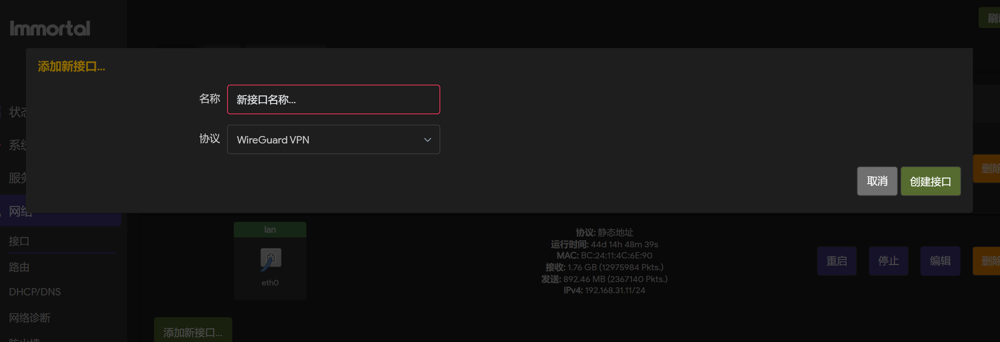

## 第三步：创建 wg0 接口

进入 **网络 → 接口 → 添加新接口**：

- 名称：`wg0`
- 协议：`WireGuard VPN`
- 点「创建接口」

进入配置页面后：

1. 点「**生成新的密钥对**」—— 私钥和公钥自动填好
2. **把公钥单独复制保存**，后面配客户端要用
3. 监听端口填 `51820`（固定端口，不要用随机）
4. IP 地址点绿色 `+`，填 `10.10.20.1/24`

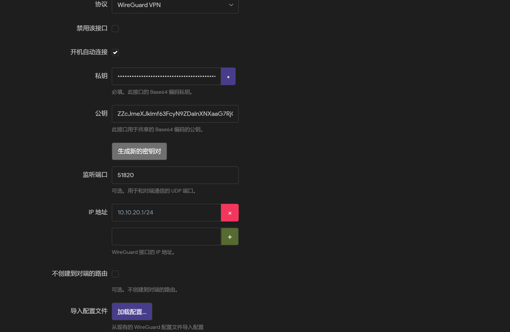

（我们配置的这个 IP 是路由器在 WireGuard 虚拟网段里的地址，就像它在这个虚拟局域网里的"门牌号"）

## 第四步：防火墙设置

在 wg0 接口的「**防火墙设置**」标签，把防火墙区域选为 **lan**

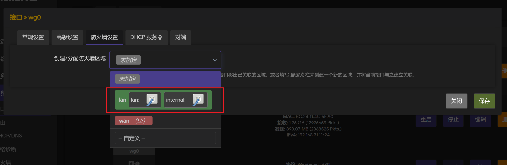

(把 VPN 拨进来的客户端当成"自家人"，和内网设备享受同等待遇，可以互相访问)

## 第五步：添加对端（Peer）

切换到「**对端**」标签，点「添加对端」，填写笔记本的信息

| 字段 | 填写内容 |
| --- | --- |
| 描述 | `My Computer`（随便写，备注用） |
| 公钥 | 笔记本客户端的公钥（暂时先不填，别急着保存，获取请见第六步） |
| 允许的 IP | `10.10.20.2/32` |
| 持续保活 | `25` |

## 第六步：配置笔记本客户端

下载Wireguard客户端：[点我前往官网](wireguard.com/install)

安装完之后：

1. 点「新建隧道 → 新建空隧道」
2. 它会自动生成客户端的密钥对，界面上显示**公钥**
3. 把这个公钥填回第四步的服务端配置里

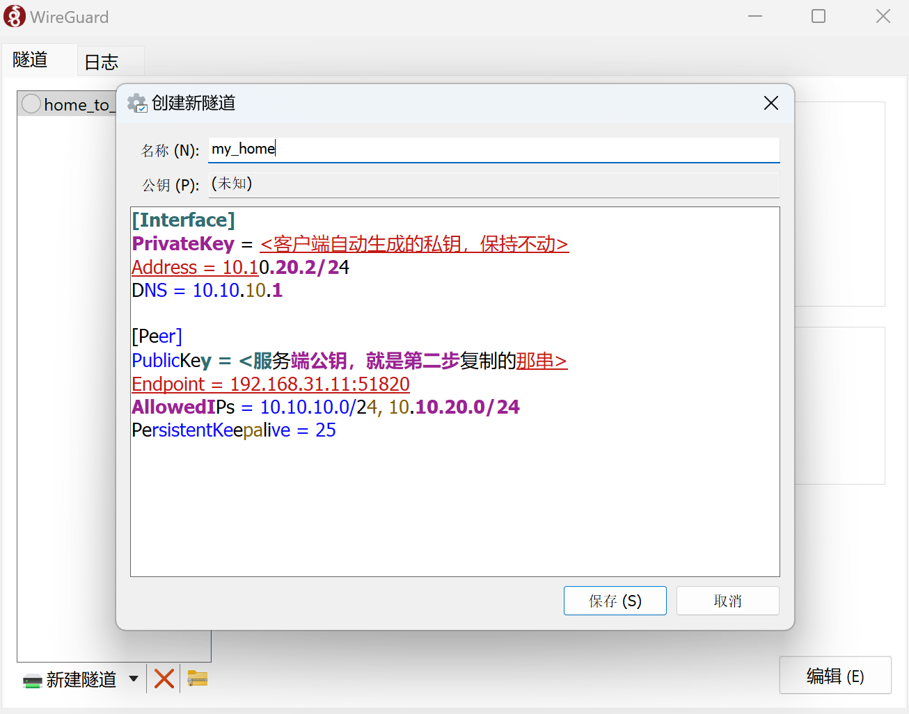

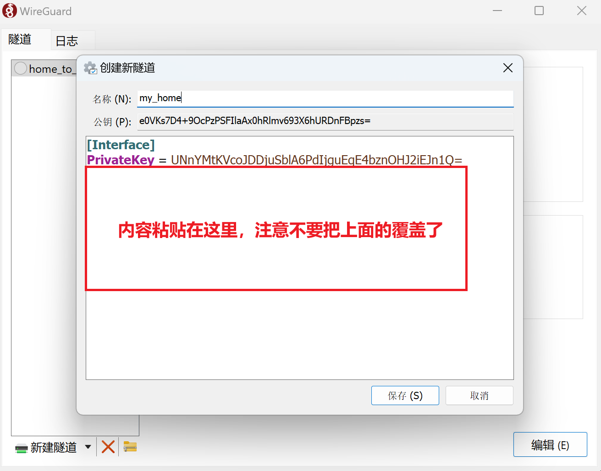

配置文件内容如下（直接粘贴在上图红色框框的部分）

```ini
Address = 10.10.20.2/24
DNS = 10.10.10.1

[Peer]
PublicKey = <服务端公钥，就是第二步复制的那串>
Endpoint = 192.168.31.11:51820
AllowedIPs = 10.10.10.0/24, 10.10.20.0/24
PersistentKeepalive = 25
```

重点说一下 **AllowedIPs** 这个参数，翻译成人话就是：**只有访问这两个网段的流量才走 WireGuard 隧道**，其他流量（比如你正在用的 v2rayN）完全不受影响

如果你写 `0.0.0.0/0` 才会把所有流量都抢过来（这里我们配置的时候选择这个我们需要的两个10和20网段）

## 回到网页端，配置 ImmortalWrt  上的信息

最终配置的像我下图一样即可

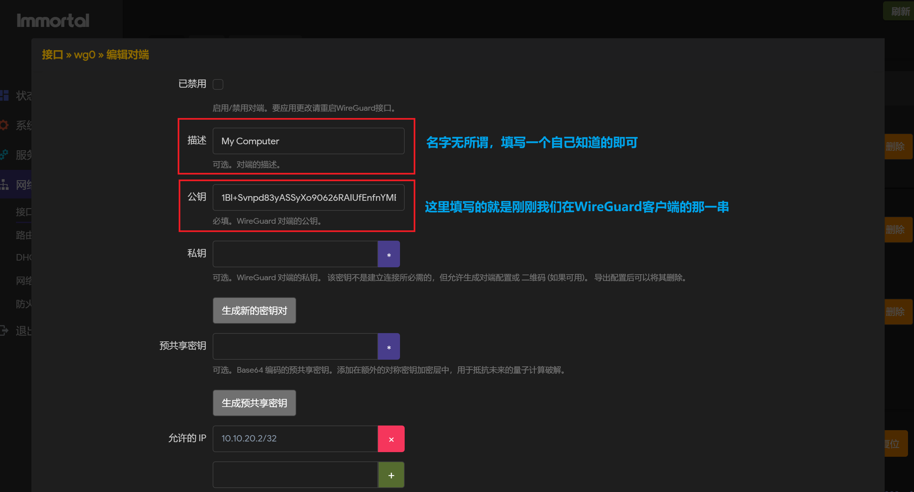

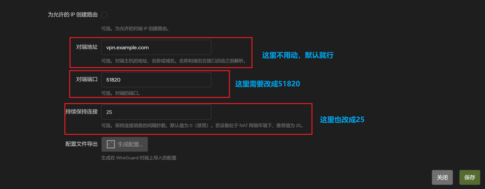

## 第七步：保存并应用

服务端配置完之后，点「**保存并应用**」，然后在笔记本客户端点「**连接**」

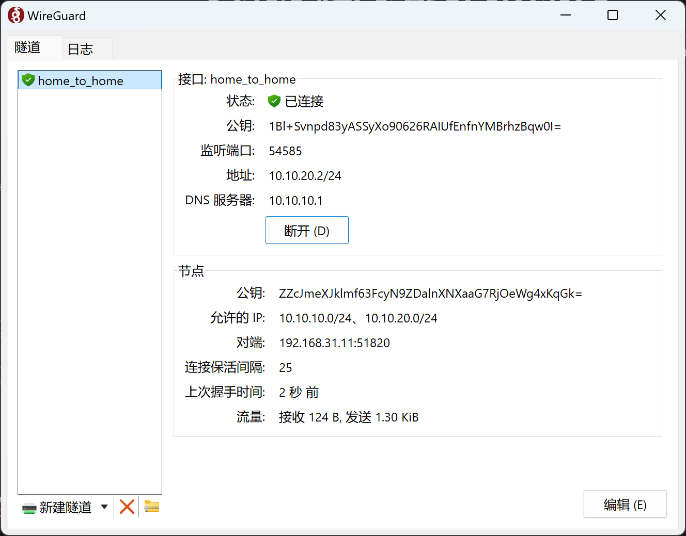

## 验证&排错部分

先验证一下机器能否Ping通内网的网关

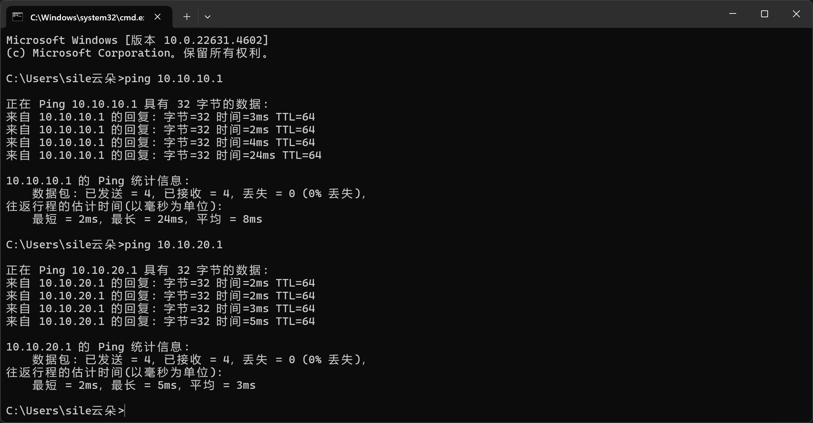

发现没用问题后，尝试远程连接内网机器

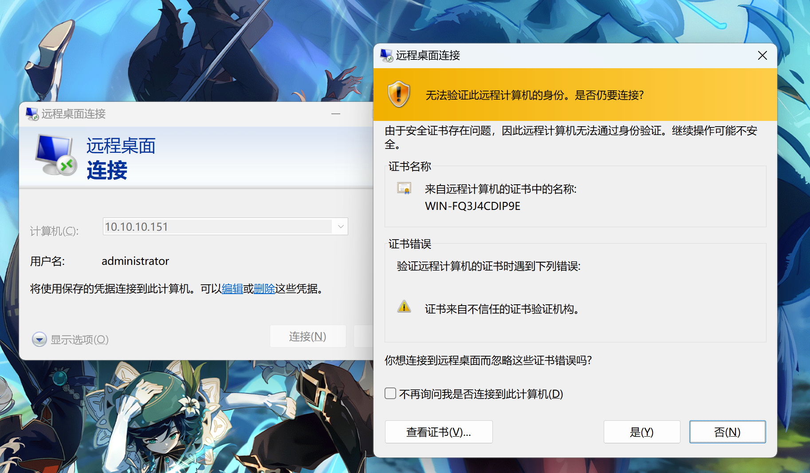

可以连通，即为成功

## 我在配置时候遇到的问题

### 问题一：激活之后 ping 不通任何内网地址

**现象**：客户端显示已连接，但 `ping 10.10.20.1` 全部超时

**排查**：在 ImmortalWrt 终端执行 `wg show`，发现输出里**没有任何 peer 信息**，说明服务端根本没加载到对端配置（例如下图所示）

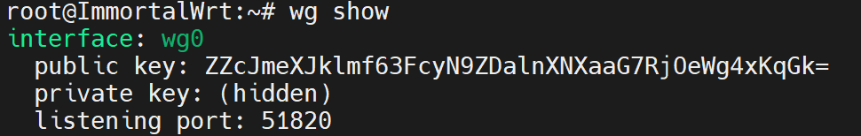

**原因**：LuCI 保存了配置，但接口没有重新加载，配置只写进了文件却没有应用到内核

使用以下命令，重启接口

```bash
ifdown wg0 && ifup wg0
```

重启接口之后再执行 `wg show`，peer 就出现了，同时能看到 `latest handshake: X seconds ago`，说明握手成功（如下图所示）

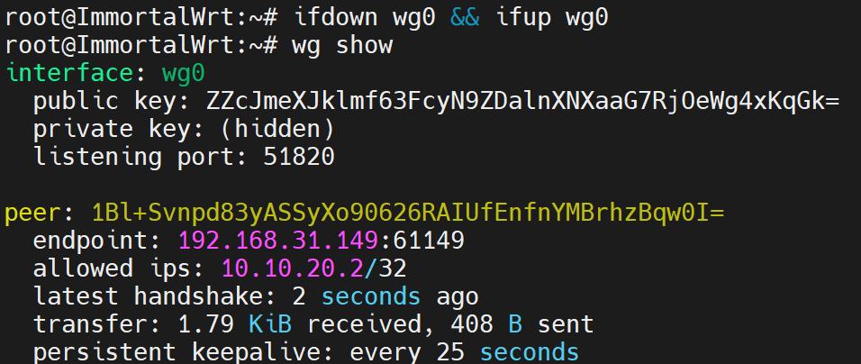

**问题二：能 ping 通路由器但 RDP 连不上虚拟机（这里我以windows为例）**

**排查**：你可能没用开启远程访问的权限，请自行检查

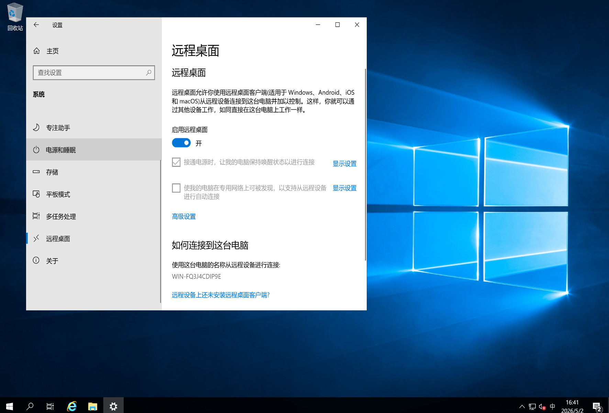

## 总结

整个流程其实不复杂，核心就三件事：

1. ImmortalWrt上建 WireGuard 接口，分配虚拟网段
2. 客户端和服务端互换公钥，建立信任
3. AllowedIPs 控制哪些流量走隧道

最容易踩的坑是**配置保存后接口没有重载**，只要 `ifdown wg0 && ifup wg0` 重启一下就好了
