# 网络攻防技术环境快速搭建

# 前言

> 本文记录 VMware 网络攻防实验环境的快速搭建步骤，主要用于环境复现与实验准备
> 
> 环境主要包括 Kali，VyOS，OPNsense，DMZ 靶机，Docker 靶场及后续 VPN 扩展
> 
> 本文仅保留最终实际使用的网络规划，配置步骤，关键命令与必要验证，不详细展开相关网络原理，协议机制及排障过程
> 
> 更完整的原理说明与详细实验过程将整理在另一篇详细版飞书文档中（[点我前往详细版本](https://my.feishu.cn/wiki/ETvBwP4l6iUe4Hk4yjWc1xzAn5e?from=from_copylink)）
> 
> 不同设备及软件版本下，网卡名称，接口名称等内容可能存在差异，实际配置时请以当前环境为准
> 
> 

# 实验环境说明

本文记录 VMware 环境下 Kali，VyOS，OPNsense 与 DMZ 靶机构成的网络安全实验环境最终配置

本文以"快速复现环境"为主要目的，不再详细解释每一项配置的工作原理，仅记录最终网络规划、关键配置及验证方法，最终网络路径如下： 

```Markdown
Kali
  ↓ 
VyOS
  ↓ 
OPNsense
  ↓ 
DMZ Alpine
  ↓ 
Docker 靶场
其中 VyOS 作为整个内网实验网络的统一互联网出口
```

## 以下搭建的网络拓扑如下（不包含VPN）

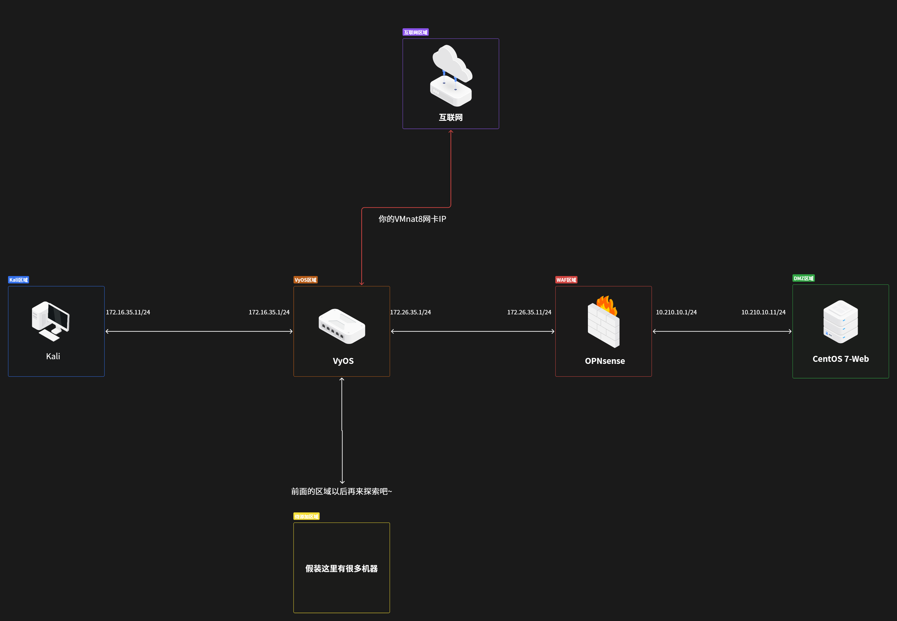

下图为纯文本形式，内容完全同上

```Markdown
Internet
                            │
                            │
                  VMware VMnet8 / NAT
                    192.168.153.0/24
                            │
                    VyOS eth0
                 192.168.153.120/24
                            │
              ┌─────────────┴─────────────┐
              │                           │
       172.16.35.1                  172.26.35.1
        VyOS eth2                    VyOS eth1
              │                           │
              │                           │
       Kali eth0                   OPNsense LAN
    172.16.35.11/24              172.26.35.11/24
                                          │
                                    OPNsense DMZ
                                     10.210.10.1
                                          │
                                          │
                                     Alpine eth0
                                   10.210.10.11/24
                                          │
                                      Docker
                                     ZhaoSec
```

# 网络拓扑与地址规划

## VMware 网络划分表

|机器|网卡数量|区域|IP地址网段划分|
|---|---|---|---|
|Kali|1|Kali\_VyOS|172\.16\.35\.0|
|OPNsense|2|WAF\_DMZ,<br>VyOS\_WAF|10\.210\.10\.0,<br>172\.26\.35\.0|
|VyOS|3<br>|Kali\_VyOS,<br>VyOS\_WAF,<br>NAT8|172\.16\.35\.0,<br>172\.26\.35\.0,<br>192\.168\.153\.0|

## 设备对应IP地址表

|设备|接口|IP 地址|网络|
|---|---|---|---|
|VyOS|eth0|192\.168\.153\.120/24|VMnet8|
|VyOS|eth1|172\.26\.35\.1/24|VyOS\_WAF|
|VyOS|eth2|172\.16\.35\.1/24|Kali\_VyOS|
|Kali|eth0|172\.16\.35\.11/24|Kali\_VyOS|
|OPNsense|LAN|172\.26\.35\.11/24|VyOS\_WAF|
|OPNsense|OPT/DMZ|10\.210\.10\.1/24|WAF\_DMZ|
|Alpine|eth0|10\.210\.10\.11/24|WAF\_DMZ|

# VMware LAN 区段配置

## 打开网卡编辑页面

打开任意虚拟机的"编辑虚拟机"页面

## 添加3个`LAN`区段

像下图一样，点击一个网卡，然后点击下方的"LAN区段"

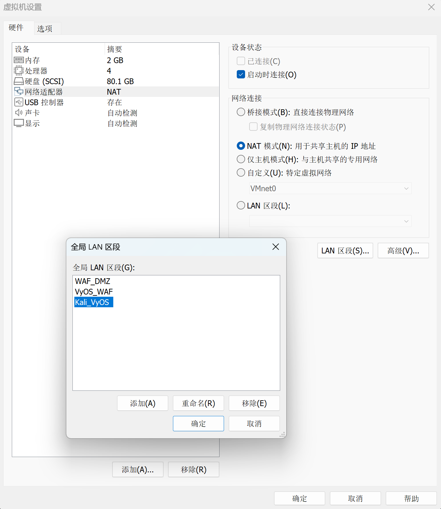

在弹出的选项卡中，自己添加3个区段，并重命名为上图所示的样子

\*此操作是全局配置，后续的LAN区段的选择都会根据这来进行配置，所以这一步的LAN区段配置不可跳过

之后再选择"`确定`"选项即可

# VyOS 配置

## 网卡配置

在启动 VyOS 虚拟机之前，进入 VMware：`编辑虚拟机设置`

配置三张网络适配器：

|VMware 网卡|网络类型|VyOS 接口|IP 地址|
|---|---|---|---|
|网络适配器 1|NAT（VMnet8）|eth0|192\.168\.153\.120/24|
|网络适配器 2|LAN 区段：VyOS\_WAF|eth1|172\.26\.35\.1/24|
|网络适配器 3|LAN 区段：Kali\_VyOS|eth2|172\.16\.35\.1/24|

启动 VyOS 后，首先查看网卡：

```Bash
show interfaces
```

你会看到仅有一张`eth0`网卡是从VMnat8网卡那里DHCP拿到的一个IP地址（为了方便操作，可以使用这个IP地址进行SSH）

确认当前实验环境中的接口对应关系：

```Bash
eth0 → VMnet8 
eth1 → VyOS_WAF 
eth2 → Kali_VyOS
```

\*注：网卡编号可能因 VMware 中添加网卡的顺序不同而发生变化，请以 `show interfaces` 的实际结果为准

进入配置模式：

```Bash
configure
```

配置三张网卡的静态 IP：

```Bash
set interfaces ethernet eth1 address '172.26.35.1/24' 
set interfaces ethernet eth2 address '172.16.35.1/24'
#建议先配置另外的两张网卡，eth0网卡的IP可直接使用DHCP的模式即可
#（如果和我一样想要使用静态IP，可继续配置eth0接口IP）
```

如接口原先已经通过 DHCP 获取地址，先删除原有 DHCP 地址配置，再重新设置静态地址，例如：

```Bash
delete interfaces ethernet eth0 address dhcp
set interfaces ethernet eth0 address '192.168.153.120/24' 
#这里的IP地址不是随便改的，是要根据自己的NAT8网卡来进行修改
#例如：我的NAT8网段是192.168.220.0，那我这里就可以修改成192.168.220.X/24
```

\*注：配置`eth0`的接口IP地址的时候，需要直接使用VMware里面的终端来进行操作，使用SSH配置会因为IP地址修改而断连

应用并保存配置：

```Bash
commit
save
```

退出配置模式：

```Bash
exit
```

查看网卡配置：

```Bash
show interfaces
```

正常情况下应看到：

```Bash
eth0    192.168.153.120/24 
eth1    172.26.35.1/24 
eth2    172.16.35.1/24
```

也就是：

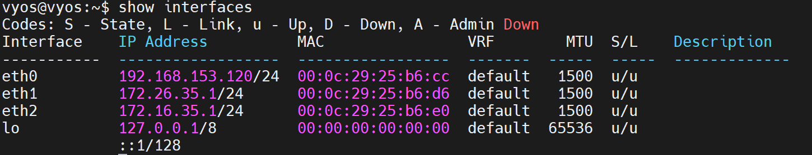

修改好之后，可直接使用新的固定IP来进行SSH访问

## 静态路由

DMZ 网段 `10.210.10.0/24` 位于 OPNsense 后方，因此需要在 VyOS 中添加一条静态路由：

```Bash
目标网段：10.210.10.0/24 
下一跳：172.26.35.11
```

进入配置模式：

```Bash
configure
```

添加静态路由：

```Bash
set protocols static route 10.210.10.0/24 next-hop 172.26.35.11
```

应用并保存配置：

```Bash
commit
save
```

退出配置模式：

```Bash
exit
```

查看路由表：

```Bash
show ip route
```

正常情况下应看到类似：

```Bash
S>* 10.210.10.0/24 [1/0] via 172.26.35.11, eth1 
C>* 172.16.35.0/24 is directly connected, eth2 
C>* 172.26.35.0/24 is directly connected, eth1 
C>* 192.168.153.0/24 is directly connected, eth0
```

其中：

```Bash
S → Static，静态路由
C → Connected，直连路由
L → Local，VyOS 自己接口上的地址
```

待后续 OPNsense 和 DMZ 主机配置完成后，再测试：

```Bash
#OPNsense
ping 172.26.35.11
#DMZ靶场
ping 10.210.10.11
```

## 默认路由

VyOS 的 `eth0` 接口连接 VMware 的 VMnet8 NAT 网络

当前实验环境中：

```Bash
VyOS eth0：192.168.153.120/24
VMware NAT Gateway：192.168.153.2
```

为了使 VyOS 能够访问互联网，需要添加一条默认路由，将无法匹配其他路由的流量发送至 VMware NAT 网关

进入配置模式：

```Bash
configure
```

添加默认路由：

```Bash
set protocols static route 0.0.0.0/0 next-hop 192.168.153.2
#这里的192.168.153.2不能直接copy我的，需要根据你自己的NAT8网卡来
```

应用并保存配置：

```Bash
commit
save
```

退出配置模式：

```Bash
exit
```

查看路由表：

```Bash
show ip route
```

正常情况下应看到类似：

```Bash
S>* 0.0.0.0/0 [1/0] via 192.168.153.2, eth0
```

其中`0.0.0.0/0`，表示默认路由

此时可以测试 VyOS 自身是否能够访问互联网：

```Bash
ping 223.5.5.5
#这里Ping域名通不了是正常的，因为DNS还没有配置
```

如果能够正常收到回复，则说明默认路由配置成功

## NAT 配置

为了使内部网络能够通过 VyOS 的 `eth0` 接口访问互联网，需要配置 Source NAT（源网络地址转换）

当前需要进行 NAT 的网段为：

```Bash
172.16.35.0/24
172.26.35.0/24
10.210.10.0/24
```

出口接口为：

```Bash
eth0
```

进入配置模式：

```Bash
configure
```

为 Kali 网段添加 NAT 规则：

```Bash
set nat source rule 100 outbound-interface name 'eth0'
set nat source rule 100 source address '172.16.35.0/24'
set nat source rule 100 translation address 'masquerade'
```

为 VyOS 与 OPNsense 之间的网段添加 NAT 规则：

```Bash
set nat source rule 110 outbound-interface name 'eth0'
set nat source rule 110 source address '172.26.35.0/24'
set nat source rule 110 translation address 'masquerade'
```

为 DMZ 网段添加 NAT 规则：

```Bash
set nat source rule 120 outbound-interface name 'eth0'
set nat source rule 120 source address '10.210.10.0/24'
set nat source rule 120 translation address 'masquerade'
```

应用并保存配置：

```Bash
commit
save
```

退出配置模式：

```Bash
exit
```

查看 Source NAT 规则：

```Bash
show nat source rules
```

正常情况下应看到三条 NAT 规则，分别对应：

```Bash
100 → 172.16.35.0/24
110 → 172.26.35.0/24
120 → 10.210.10.0/24
```

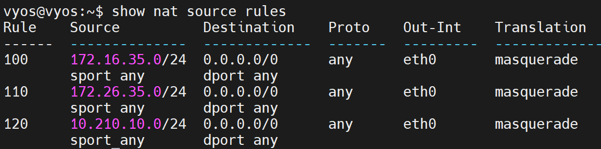

并且出口均为：`eth0`

转换方式均为：`masquerade`

## DNS 配置

为了使 VyOS 能够正常进行域名解析，需要配置 DNS 服务器

\*注：**这里配置的是 VyOS 自己使用的 DNS**，不是给下游设备提供 DNS 服务（下游的机器我们给他单独配置DNS）

进入配置模式：

```Bash
configure
```

配置 DNS 服务器：

```Bash
set system name-server '223.5.5.5'
set system name-server '223.6.6.6'
```

应用并保存配置：

```Bash
commit
save
```

退出配置模式：

```Bash
exit
```

查看当前系统配置：

```Bash
show configuration commands | match name-server
```

正常情况下应看到：

```Bash
set system name-server '223.6.6.6'
set system name-server '223.5.5.5'
```

随后测试域名解析：

```Bash
ping www.baidu.com
```

如果域名能够成功解析为 IP 地址，则说明 DNS 配置已经生效

## 验证

\*注：这里的验证部分会涉及到其他网段的机器，所以建议等全部配置好之后，统一进行验证

# Kali 配置

## 添加 LAN 网卡

关闭 Kali 虚拟机，VMware → 编辑虚拟机设置 → 添加 → 网络适配器

将网络连接方式设置为`LAN`，并选择`Kali_VyOS`

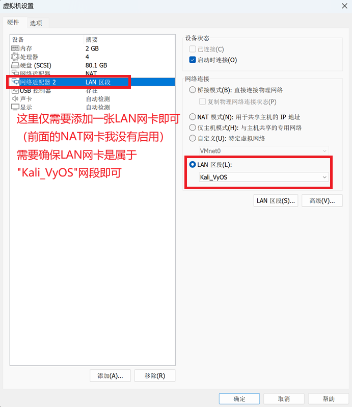

完成后启动 Kali

## 配置静态 IP

执行：

```Bash
ip addr
```

找到连接 `Kali_VyOS` 的网卡

\*注意：网卡名称可能因虚拟机原有网卡数量而不同，请以`ip addr`实际显示结果为准

本实验中：

```Bash
eth0 → 原 NAT 网卡（已禁用）
eth1 → Kali_VyOS
#如果你没有添加过NAT网卡，那么直接使用默认的eth0即可
```

由于我这里先前已经添加过NAT网卡，我的网卡顺序发生了改变，因此我的后续配置使用`eth1`，如果你的Kali 从一开始就只有一张 LAN 网卡，那么它大概率就会成为`eth0 = Kali_VyOS`

当前 LAN 地址规划：

```Bash
IP：172.16.35.11/24
Gateway：172.16.35.1
```

## 配置 NetworkManager

首先查看 NetworkManager 连接名称：

```Bash
nmcli connection show
```

查看自己的`Wired connection`对应情况，我这里是`Wired connection 2 → eth1`

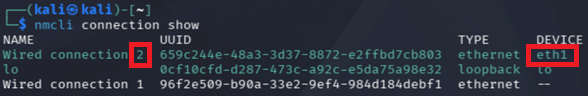

因此后续配置 `Wired connection 2`，你需要配置正确你的对应顺序

\*你的首次配置如果和我有出入，那么请你对照你自己的Wired connection编号以及eth编号来配置（以下命令建议先粘贴到文本文档中修改，将`Wired connection`编号修改正确之后，再粘贴至Kali）

配置静态 IP命令如下：

```Bash
sudo nmcli connection modify "Wired connection 2" \
ipv4.method manual \
ipv4.addresses 172.16.35.11/24 \
ipv4.gateway 172.16.35.1
#这里需要改动的就是这个Wired connection后面的数字，其余不需要改动
```

配置静态路由命令如下：

```Bash
sudo nmcli connection modify "Wired connection 2" \
ipv4.routes "172.26.35.0/24 172.16.35.1,10.210.10.0/24 172.16.35.1"
#这里的Wired connection也需要改动
```

配置 DNS：

```Bash
sudo nmcli connection modify "Wired connection 2" \
ipv4.dns "223.5.5.5 1.1.1.1"
```

重新启用连接：

```Bash
sudo nmcli connection up "Wired connection 2"
#这里需要对应上你的Wired connection编号，不可直接粘贴运行
```

检查：

```Bash
ip addr
ip route
```

正常情况下应存在：

```Bash
172.16.35.0/24 dev eth0
default via 172.16.35.1 dev eth0
```

## 验证

\*注：这里的验证部分会涉及到其他网段的机器，所以建议等全部配置好之后，统一进行验证

# OPNsense 配置

OPNsense 的新建虚拟机、下载镜像、正式安装系统（含分区，设置 root 密码等）步骤与《网络攻防技术学习笔记》"安装 OPNsense"章节完全一致，请参考该笔记完成系统安装：[点我前往](https://my.feishu.cn/wiki/ETvBwP4l6iUe4Hk4yjWc1xzAn5e?from=from_copylink)

也就是说，最终 VMware 里只有：

```Bash
Network Adapter
→ VyOS_WAF

Network Adapter 2
→ WAF_DMZ
```

**唯一区别：本环境不使用 NAT 网卡，OPNsense 最终只保留两张网卡，分别连接 ****`VyOS_WAF`**** 与 ****`WAF_DMZ`**** 两个 LAN 区段**

## 接口配置

先说明我们的最终接口规划：

```Bash
VyOS
172.26.35.1
    │
    │ VyOS_WAF
    │
    ▼
OPNsense
WAN：172.26.35.11/24
LAN：10.210.10.1/24
    │
    │ WAF_DMZ
    │
    ▼
DMZ Alpine
10.210.10.11/24
```

### 确认两张网卡对应关系

安装完成并重新启动 OPNsense 后，使用 `root` 用户登录系统

进入：

```Bash
1) Assign interfaces
```

OPNsense 会列出当前识别到的物理网卡，例如：

```Bash
em0
em1
```

\*注意：这里的接口名称不一定与本文完全相同，也可能显示为其他名称，请以自己实际环境为准

此时需要确认：

```Bash
哪一张网卡 → VyOS_WAF
哪一张网卡 → WAF_DMZ
```

这里可以继续沿用完整版笔记中那个方法：**通过 MAC 地址对应 VMware 网卡和 OPNsense 接口**

在 VMware 中：

```Bash
虚拟机设置
→ 网络适配器
→ 高级
```

记录对应网卡的 MAC 地址

然后与 OPNsense 控制台显示的 MAC 地址进行对照

假设最终确认：

```Bash
em0 → VyOS_WAF
em1 → WAF_DMZ
```

后续就按照这个关系配置

\*注：如果你的实际结果不同，请使用自己实际识别到的接口名称，不要直接照搬 `em0`，`em1`

### 分配 WAN / LAN 接口

进入：

```Bash
1) Assign interfaces
```

如果询问是否配置 LAGG：

```Bash
Do you want to configure LAGGs now? [y/N]
```

输入：

```Bash
n
```

如果询问 VLAN：

```Bash
Do you want to configure VLANs now? [y/N]
```

同样输入：

```Bash
n
```

然后按照刚才确认的接口对应关系配置

假设：

```Bash
em0 → VyOS_WAF
em1 → WAF_DMZ
```

则设置：

```Bash
WAN interface:
em0
```

然后：

```Bash
LAN interface:
em1
```

如果继续询问：

```Bash
Optional interface 1:
```

直接按：

```Bash
Enter
```

留空即可

最终应显示类似：

```Bash
WAN → em0
LAN → em1
```

确认无误后：

```Bash
Do you want to proceed? [y/N]
```

输入：

```Bash
y
```

### 配置 WAN 静态 IP

回到 OPNsense 主菜单，选择：

```Bash
2) Set interface IP address
```

选择：

```Bash
WAN
```

如果询问：

```Bash
Configure IPv4 address WAN interface via DHCP? [y/N]
```

输入：

```Bash
n
```

IPv4 地址填写：

```Bash
172.26.35.11
```

子网前缀：

```Bash
24
```

到这里需要注意

如果它继续询问：

```Bash
For a WAN, enter the new WAN IPv4 upstream gateway address.
```

**这里填写：**

```Bash
172.26.35.1
```

也就是 VyOS 在 `VyOS_WAF` 网段中的地址

这个地方我建议**现在直接填**，而不是留空

如果遇到需要填写DNS服务器的地方，则直接填写阿里的DNS：`223.5.5.5`

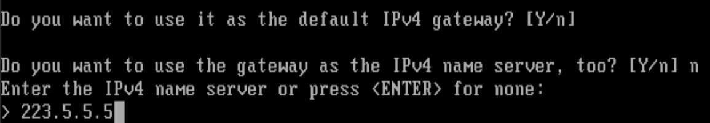

因此 WAN 最终为：

```Bash
WAN

IP：
172.26.35.11/24

Upstream Gateway：
172.26.35.1
```

IPv6 当前实验不使用，可以保持不配置

### 配置 LAN 静态 IP

再次进入：

```Bash
2) Set interface IP address
```

选择：

```Bash
LAN
```

关闭 DHCP 获取：

```Plain Text
Configure IPv4 address LAN interface via DHCP? [y/N]

n
```

设置地址：

```Bash
10.210.10.1
```

前缀：

```Bash
24
```

这里如果询问：

```Bash
For a LAN, press <ENTER> for none:
```

直接：

```Bash
Enter
```

**不要配置 Gateway**

因为：

```Bash
10.210.10.1
```

本身就是后续 DMZ Alpine 所使用的网关

最终：

```Plain Text
LAN
IP = 10.210.10.1/24
Gateway = None
```

如果询问 DHCP Server：

```Bash
Do you want to enable the DHCP server on LAN?
```

选择：

```Bash
n
```

因为后面的 Alpine 我们会手动配置：

```Bash
IP      = 10.210.10.11/24
Gateway = 10.210.10.1
```

### IP 配置对应表

|接口角色|VMware 网络|OPNsense IP|上游网关|
|---|---|---|---|
|WAN|VyOS\_WAF|172\.26\.35\.11/24|172\.26\.35\.1|
|LAN|WAF\_DMZ|10\.210\.10\.1/24|无|

至此，OPNsense 两张基础接口配置完成

此时暂时不进行完整连通性验证，后续还需要继续配置 Gateway、静态路由及防火墙规则

## 启用 WebGUI

由于当前尚未配置允许 Kali 从 WAN 侧访问 OPNsense WebGUI 的防火墙规则，因此首次配置时暂时关闭 pf 防火墙，以便进入 WebGUI 完成后续配置

然后：

```Bash
8) Shell
```

执行：

```Bash
pfctl -d
```

Kali 浏览器访问：

```Bash
172.26.35.11
```

即可打开OPNsense Web页面（如果中途Web页面卡死，可再次进入终端，输入"`pfctl -d`"）

## 关闭 WAN 私网阻止

进入：

```Bash
接口
→ WAN
```

找到：

```Bash
取消勾选：
阻止私有网络（Block private networks）

保留：
拦截 bogon 网络（Block bogon networks）
```

原因：

```Bash
本实验中的 WAN 并不直接连接公网，
而是连接 VyOS_WAF 私有网段 172.26.35.0/24

Bogon 网络过滤主要用于拦截无效，保留或尚未分配的地址，本实验不需要使用这些地址，因此可保持开启
```

如果保持启用，可能会影响：

```Bash
VyOS → OPNsense
Kali → OPNsense
Kali → DMZ
```

这类经过 WAN 进入 OPNsense 的私网流量

\*本实验中的 WAN 表示 OPNsense 的“上游接口”，并不代表该接口一定连接公网

## 静态路由

进入：

```Bash
系统
→ 路由
→ 配置
```

点击右上角的：

```Bash
+
```

添加新的静态路由

填写：

```Bash
网络地址： 
172.16.35.0/24  

网关： 
选择 IP 为 172.26.35.1 的 WAN Gateway  

描述： 
Route to Kali network via VyOS
#或者用中文：通过 VyOS 连接到 Kali 网络
```

由于前面配置 WAN 时已经创建了指向：

```Bash
172.26.35.1
```

因此这里只需要选择该 Gateway 即可

\*注：Gateway 名称可能由 OPNsense 自动生成，例如 `WAN_GW`、`WAN_GW_2` 等。不要根据名称判断，应确认其 Gateway 地址为 `172.26.35.1`，并且接口为 `WAN`

完成后点击：

```Bash
保存
```

然后：

```Bash
应用更改
```

## 防火墙规则

### 放行 Kali 访问 OPNsense

先保持：

```Bash
pfctl -d
```

接着去：

```Bash
防火墙
→ Rules[new]
→ 添加
```

先创建第一条规则，专门允许 Kali 访问 OPNsense WebGUI

配置建议如下：

```Bash
操作：
通过

接口：
WAN

方向：
in

TCP/IP版本：
IPv4

协议：
TCP
```

源：

```Bash
单个主机或网络  
172.16.35.11/32
```

目标：

```Bash
防火墙自身
```

目标端口范围：

```Bash
HTTPS/443
```

描述可以写：

```Bash
允许 Kali 访问 OPNsense WebGUI
```

向上翻，打开左上角的：

```Bash
高级模式
```

向下翻，找到并勾选：

```Bash
禁用回复
```

点击"应用"

然后回 OPNsense 控制台执行：

```Bash
pfctl -e
```

再从 Kali 访问：

```Bash
https://172.26.35.11
```

### 放行 Kali 访问 DMZ 靶场

再次添加一条规则

```Bash
操作：
通过

接口：
WAN

方向：
in

TCP/IP版本：
IPv4

协议：
any

源：
单个主机或网络
172.16.35.11/32

目标：
单个主机或网络
10.210.10.0/24

目标端口范围：
any

描述：
允许 Kali 访问 DMZ 靶场
```

由于现在还没有配置靶场的docker服务，所以，这里先不进行验证

### 放行 VyOS SSH DMZ 机器

继续添加规则

```Bash
操作：
通过

接口：
WAN

方向：
in

TCP/IP版本：
IPv4

协议：
TCP

源：
单个主机或网络
172.26.35.1/32

目标：
单个主机或网络
10.210.10.11/32

目标端口范围：
SSH
（也就是 22）

描述：
允许 VyOS SSH 访问 DMZ 靶机
```

如果你的DMZ区域配置了对应的IP地址和网关，那么即可成功SSH访问

## 验证

\*注：这里的验证部分会涉及到其他网段的机器，所以建议等全部配置好之后，统一进行验证

# DMZ 靶机配置

\*注：以下我演示的命令是来自与我已经安装好的定制虚拟机，而不是普通的CentOS 7

- 线路一：[点我下载](https://qfile.qq.com/q/fyyZnFNxF6)（QQ分享链接，此分享文件预计2026\.9\.17日过期）

- 线路二：[点我下载](https://pan.baidu.com/s/12Wu0crzBjKKwbLKLzwue4w?pwd=n38i)（百度网盘，永久有效，需要会员，可在PDD上使用低价购买临时账号下载）

- 以上的镜像，都是我以及默认`安装好docker&配置好国内镜像站版本`

此虚拟机登录信息如下：

- 用户名：root

- 密码：root

## 网卡配置

在 VMware 中打开 DMZ 区域虚拟机的：

```Bash
虚拟机设置
→ 网络适配器
```

选择：

```Bash
LAN 区段
→ WAF_DMZ
```

DMZ 区域的机器**不需要再单独添加 VMnet8 NAT 网卡**

然后启动此虚拟机

## 静态 IP 与网关

进入 Alpine\-Docker虚拟机后，执行：

```Bash
ip addr
```

我们真正要找的是`eth0`

编辑当前文件：

```Bash
vi /etc/network/interfaces
```

把 `eth0` 相关配置改成这样：

```Bash
auto lo
iface lo inet loopback

auto eth0
iface eth0 inet static
    address 10.210.10.11/24
    gateway 10.210.10.1
```

改完以后，可以重启网络：

```Bash
rc-service networking restart
```

\*注：如果你当前就是通过Kali SSH 连这台机器操作，执行这一步可能会断线；直接在 VMware 控制台操作最稳

然后检查：

```Bash
ip addr show eth0
```

有看到对应的IP，即为配置正确

再检查默认路由：

```Bash
ip route
```

应该至少有：

```Bash
default via 10.210.10.1 dev eth0
10.210.10.0/24 dev eth0
```

## 配置 DNS

设置 DNS 服务器为 `223.5.5.5` 和 `223.6.6.6`

```Bash
printf "nameserver 223.5.5.5\nnameserver 223.6.6.6\n" > /etc/resolv.conf
```

然后检查：

```Bash
cat /etc/resolv.conf
```

应当得到：

```Bash
nameserver 223.5.5.5
nameserver 1.1.1.1
```

## 验证网络链接情况

输入：

```Bash
ping -c 4 10.210.10.1
```

如果这个通，说明：

```Bash
Alpine → OPNsense LAN
```

这一段正常

然后测试纯公网 IP：

```Bash
ping -c 4 223.5.5.5
```

最后再测试 DNS：

```Bash
ping -c 4 www.baidu.com
```

域名和公网 IP 都能 ping → 基本可以确认 Alpine 已经可以正常上网

## Docker 配置部分

由于我已经在之前的网络攻防技术学习笔记（详细版）里面写过相关的内容，所以我这里就不在进行概述了

这里，我简单写一下如何拉取镜像（以拉取`zhaosec:v3.2`靶场为例子）

### 拉取docker镜像

```Bash
docker pull lanso4/zhaosec:v3.2
```

### 启动docker靶场镜像

输入以下命令，查看内部的端口情况：

```Bash
docker inspect --format='{{json .Config.ExposedPorts}}' lanso4/zhaosec:v3.2
```

这里默认是80端口

运行并设置端口与别名：

```Bash
docker run -d --name zhaosec -p 8080:80 lanso4/zhaosec:v3.2
```

设置开机自启动：

```Bash
docker update --restart unless-stopped zhaosec
```

### 验证docker运行状态

查看容器是否正常存活：

```Bash
docker ps
```

如果状态显示 `Up`，在对应网段的浏览器访问：

```HTML
http://<DMZ靶机的IP>:8080
```

# 最终连通性测试（验证部分）

## 验证 DMZ 到上游网络

在 DMZ 靶机中执行：

```Bash
ping -c 4 172.16.35.1
```

其中：

```Bash
172.16.35.1
```

为 VyOS 连接 `Kali_VyOS` 网段的接口地址

如果能够正常收到回复，例如：

```Bash
4 packets transmitted, 4 packets received, 0% packet loss
```

说明 DMZ 靶机能够经过：

```Bash
DMZ
→ OPNsense
→ VyOS
```

正常访问上游网络，同时返回流量也能够正确返回 DMZ

## 验证 Kali 到 DMZ 靶机

使用 Kali 的浏览器，访问已经在 DMZ 区域部署好的靶场IP

```Bash
10.210.10.11:8080
```

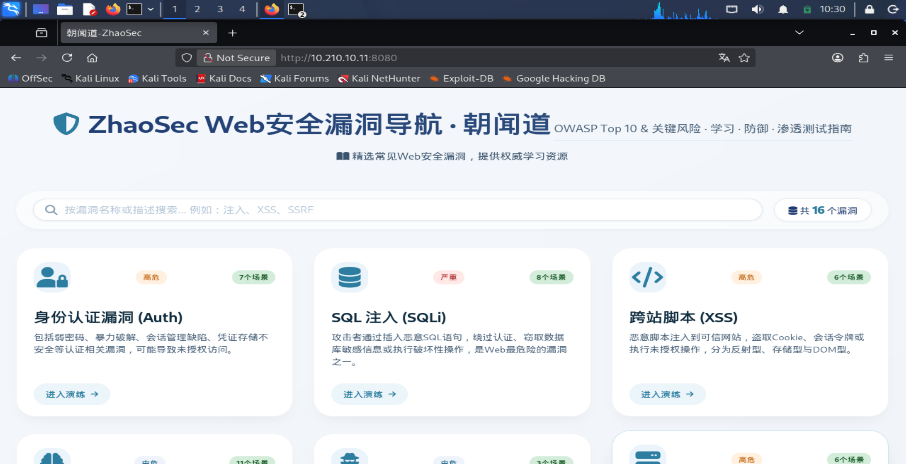

## 验证 Kali 访问互联网

在 **Kali** 上执行：

```Bash
ping -c 4 www.baidu.com
```

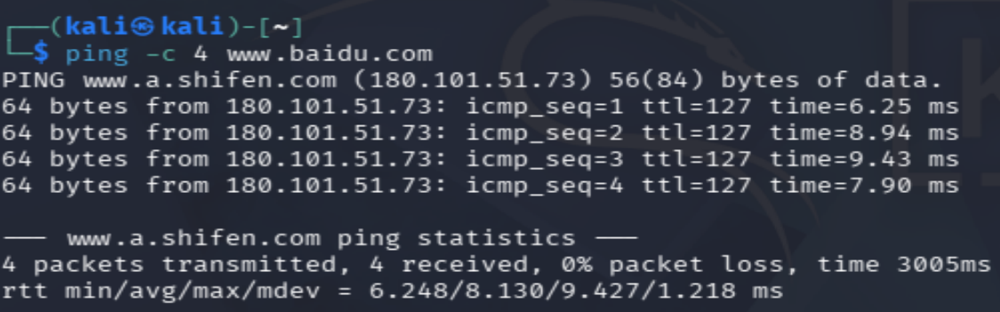

## 验证 OPNsense 访问互联网

现在进入 **OPNsense 控制台 Shell**，执行：

```Bash
ping -c 4 223.5.5.5
ping www.baidu.com
```

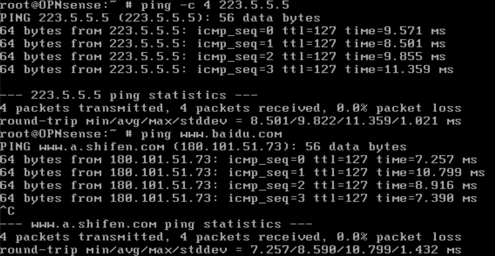

## 验证结果

完成上述测试后，如果：

```Bash
DMZ 可以正常访问互联网
Kali 可以正常访问互联网
OPNsense 可以正常访问互联网
Kali 可以正常访问 DMZ 中的 ZhaoSec 靶场
各设备 DNS 解析正常
```

则说明当前实验网络中的：

```Bash
路由
防火墙
NAT
DNS
DMZ 网络
Docker 靶场
```

均能够正常工作，基础网络攻防实验环境搭建完成

# VPN（后续）

## 此次部分的拓扑如下（包含VPN服务）

```Markdown
Windows WireGuard
10.99.0.2
        |
        | Encrypted WireGuard
        | Endpoint = 192.168.153.120:51820
        |
        v
VyOS eth0
192.168.153.120
        |
        | DNAT UDP 51820
        v
OPNsense WAN
172.26.35.11:51820
        |
        | WireGuard decrypt
        v
OPNsense wg0
10.99.0.1
        |
        +----------------------+
        |                      |
        v                      v
10.210.10.0/24          172.26.35.0/24
DMZ                     VyOS / OPNsense
        |
        v
172.16.35.0/24
Kali
```

## WireGuard 客户端安装

官网安装连接：[点我下载](https://download.wireguard.com/windows-client/wireguard-installer.exe)

## 启用 WireGuard 实例

进入 OPNsense Web 管理页面

请在右侧找到：

```Plain Text
VPN
→ WireGuard
```

点右侧橙色 `+` 新建实例

按照以下表格内容进行填写

|**字段**|**填写内容**|
|---|---|
|启用|勾选|
|名称|`WG_VPN_Win`|
|公钥/私钥|先不要手填|
|监听端口|`51820`|
|隧道地址|`10.99.0.1/24`|
|CARP 依赖|`None`|
|端点|暂时不选|
|禁用路由|不勾选|
|调试日志|暂时不选|

然后点击 **公钥那一行左侧的小齿轮按钮**

这个按钮通常会自动生成：

```TOML
Private Key
Public Key
```

也就是 OPNsense 这端自己的密钥对

生成以后，确认这两个字段都出现内容即可

这里有两个地方先别动：

```Bash
端点：Nothing selected
禁用路由：不要勾选
```

因为我们还没有创建 Windows 客户端对应的 Peer

然后点：

```Bash
保存
```

最后记得把这里的"启用WireGuard"给打上勾

如果页面出现 **应用**，再点一次 **应用**

## 配置 VyOS 的 UDP 转发

现在进入 VyOS 配置模式：

```Bash
configure
```

然后只添加这一组：

```SQL
set nat destination rule 200 description 'WireGuard_to_OPNsense'
set nat destination rule 200 inbound-interface name 'eth0'
set nat destination rule 200 protocol 'udp'
set nat destination rule 200 destination port '51820'
set nat destination rule 200 translation address '172.26.35.11'
set nat destination rule 200 translation port '51820'
```

执行：

```Bash
commit
save
```

## 配置 VyOS 静态路由

还是在 VyOS 进入配置模式：

```Bash
configure
```

然后：

```Bash
set protocols static route 10.99.0.0/24 next-hop 172.26.35.11
```

接着：

```Bash
commit
save
```

然后退出配置模式：

```Bash
exit
```

## 配置 Windows 端公钥

现在在 Windows WireGuard 里点左下角：

```Bash
新建隧道
```

选择：

```Bash
新建空隧道
```

正常会自动生成：

```TOML
PrivateKey = ...
PublicKey = ...
```

名称填写：

```Bash
WG_VPN_Win
```

在 `[Interface]` 下保留自动生成的 `PrivateKey`，再增加一行：

```Bash
Address = 10.99.0.2/32
```

也就是类似：

```TOML
[Interface]
PrivateKey = 这里保留自动生成的私钥
Address = 10.99.0.2/32
```

然后点 **保存**，但不要激活隧道

## 配置 OPNsense 端

下一步去 OPNsense：

```Plain Text
VPN → WireGuard → 端点
```

点击右侧橙色 `+`，新建一个 Windows Peer。按下面填：

|**字段**|**内容**|
|---|---|
|启用|勾选|
|名称|`WG_Windows_Client`|
|公钥|`刚刚在Windows端生成的公钥`|
|预共享密钥|留空|
|允许的 IP|10\.99\.0\.2/32|
|地址|留空|
|端口|留空|
|实例|选择 `WG_VPN_Win`|
|保活间隔|留空|

然后点 **保存，出现 应用，再点一次 应用**

## 新增 WireGuard 规则

下一步去：

```Bash
防火墙
→ 规则
→ WAN
```

点右下角橙色 `+`，新增一条规则，填：

```Bash
操作：通过
接口：WAN
方向：in
TCP/IP 版本：IPv4
协议：UDP

源：
单个主机或网络
192.168.153.1/32

源端口：
any

目标：
防火墙自身

目标端口：
Single port or range
51820

描述：
Allow Windows WireGuard
```

向上翻，打开左上角的：

```Bash
高级模式
```

向下翻，找到并勾选：

```Bash
禁用回复
```

点击"应用"

## 配置 Windows 端 `Peer`

先去 OPNsense：

```Bash
VPN → WireGuard → 实例
```

打开 `WG_VPN_Win`编辑选项，找到 OPNsense WireGuard 的公钥（先暂时粘贴到记事本中）

现在回到 Windows WireGuard，编辑 `WG_VPN_Win`，在你现有的 `[Interface]` 下面加入 `[Peer]`

最终先写成这样：

```TOML
[Interface]
PrivateKey = 你现有的Windows私钥
Address = 10.99.0.2/32

[Peer]
PublicKey = 刚刚复制的 OPNsense WireGuard 的公钥
Endpoint = 192.168.153.120:51820
AllowedIPs = 10.99.0.0/24, 172.16.35.0/24, 172.26.35.0/24, 10.210.10.0/24
```

现在**只把这些内容替换填进去并保存**

先不要点“激活”

## OPNsense 接口分配

在 OPNsense 打开：

```Bash
接口
→ 分配
```

在下面"分配新接口"这里：

```Plain Text
设备：wg0 (WireGuard - WG_VPN_Win)
描述：WG_VPN
```

然后点击：

```Plain Text
添加
```

添加之后，左侧“接口”菜单下面应该会多出一个：

```Plain Text
[OPT1]
```

现在点击左侧：

```Plain Text
接口
→ [OPT1]
```

进去以后按下面设置：

```Bash
启用接口：勾选

描述：
WG_VPN

IPv4 配置类型：
None

IPv6 配置类型：
None
```

然后：

```Plain Text
保存
→ 应用更改
```

## 防火墙放行 WireGuard 隧道流量

下一步去：

```Plain Text
防火墙
→ 规则
→ WG_VPN
```

点击右上角橙色 `+`，填写：

|项目|设置|
|---|---|
|操作|通过|
|方向|进|
|版本|IPv4|
|协议|any|
|源|`WG_VPN`|
|源端口|any|
|目标|any|
|目标端口|any|
|网关|`None`|
|描述|Allow WireGuard VPN access|

这一条规则**不需要勾"禁用回复"**，因为这是 WireGuard 虚拟接口本身，不是之前 WAN 那种特殊回程场景

然后可以直接 **保存 → 应用**

## 激活 Windows 客户端

Windows 的 WireGuard 客户端，选中：

```Plain Text
WG_VPN_Win
```

点击：

```Plain Text
激活
```

## 测试与验证

在 Windows CMD 执行：

```Plain Text
ping 10.99.0.1
ping 10.210.10.1
```

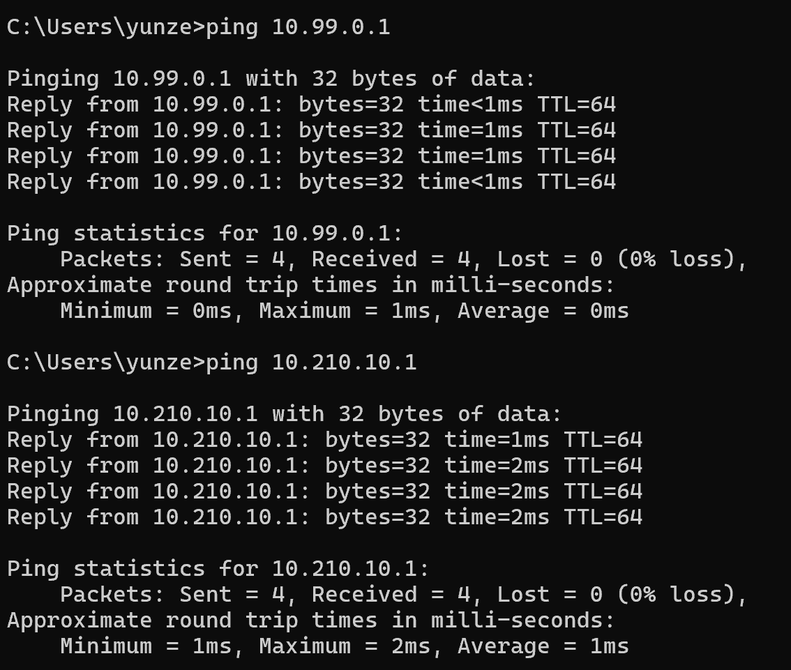

尝试在Windows本机访问 DMZ 区域靶场

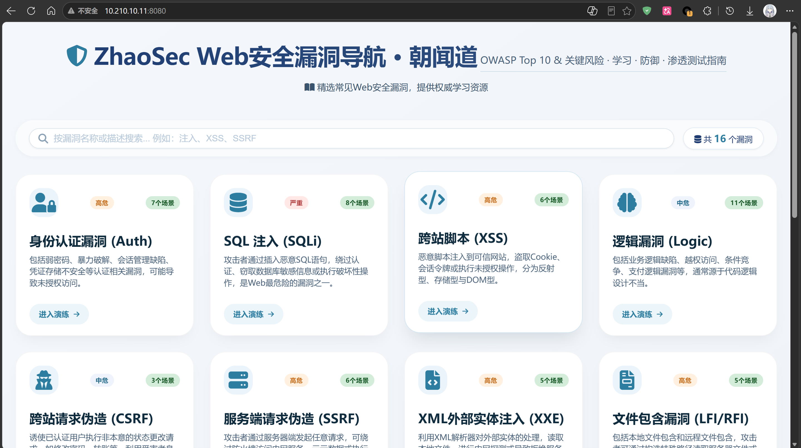

尝试使用 SSH 连接 Kali

```Bash
ssh kali@172.16.35.11
```

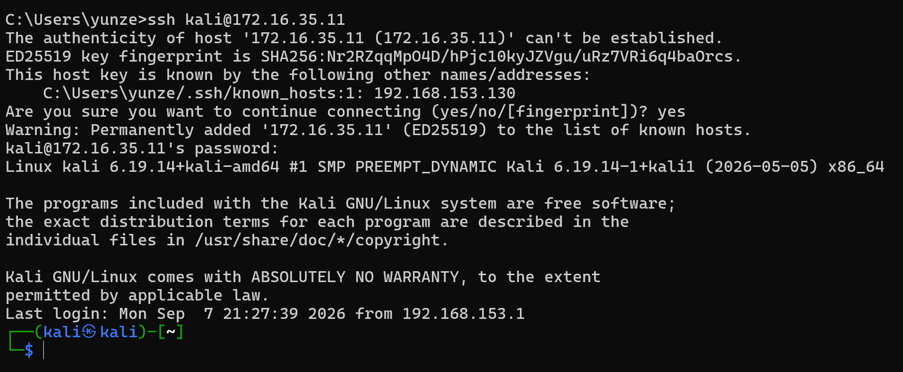

尝试 SSH 连接 VyOS

```Bash
ssh vyos@172.26.35.1
```

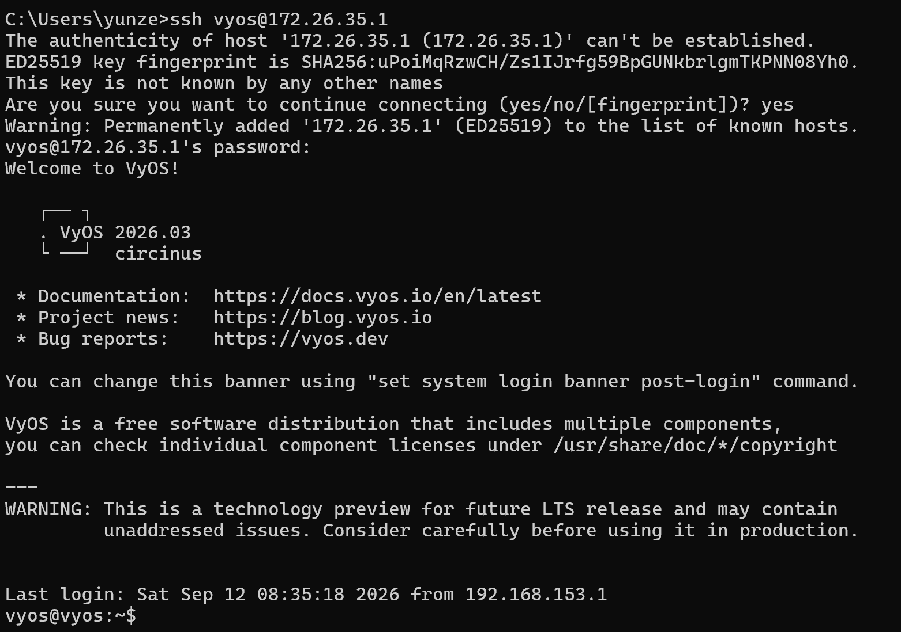

尝试 SSH 连接 DMZ 靶机

```Bash
ssh root@10.210.10.11
```

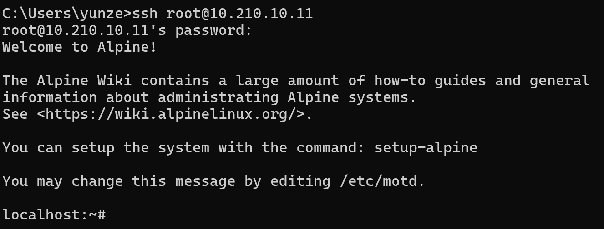

至此，对应已经验证

```Markdown
基础网络                         ✓
VyOS 路由                        ✓
OPNsense 路由                    ✓
DMZ                              ✓
Docker / ZhaoSec                 ✓
Windows WireGuard Client         ✓
OPNsense WireGuard Server        ✓
VyOS UDP 51820 DNAT              ✓
VPN 回程路由                      ✓
WireGuard 防火墙                  ✓
VPN Tunnel                       ✓
VPN → DMZ                        ✓
VPN → VyOS                       ✓
VPN → Kali 网段                  ✓
```
---

# 结语

到这里，这套网络攻防实验环境的基础搭建部分就算完成了٩(ˊᗜˋ)و✧

目前主要完成的是网络规划，路由，防火墙，DMZ，Docker 靶场以及 WireGuard VPN 等基础环境，重点是先把整个实验网络完整搭起来并保证各部分能够正常通信

至于真正的靶场攻击，漏洞利用，内网攻防等实验内容，我会在后续更新~

总之，环境已经搭好了，接下来才是真正开始“玩”的部分

剩余内容施工中……(ง •_•)ง