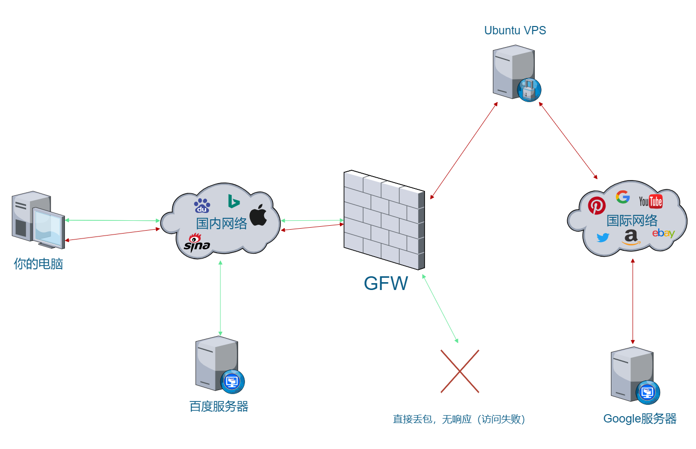
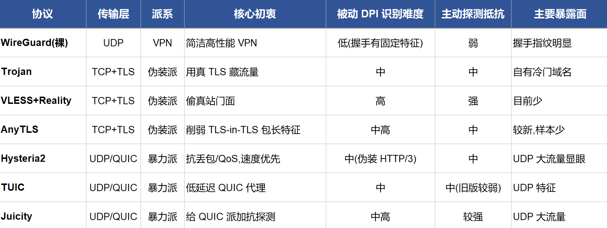

由于众所不一定周知的原因，在国内正常网络环情况下，你是无法直接打开 Google、YouTube、Gmail 等一系列国际服务的……

这一切的根源，就是在我们和真实互联网之间，横着一堵看不见却又无处不在的「墙」

这堵墙在行内人嘴里有个响亮的名字——**长城防火墙**（简称 **GFW**）

**Q：那么这个所谓的「GFW」到底是什么东西？**

**A：** 它其实并不是一堵实体意义上的「墙」，而是一套**智能检测 + 主动阻断**的系统，部署在各大运营商的骨干网出口

它主要靠以下几种手段「工作」：

- **深度包检测（DPI）**：不仅看域名（DNS）、HTTP 头，连 TLS SNI，部分加密流量的特征都敢硬抠
- **DNS 污染**：你一查被墙域名，它就抢答一堆假 IP，让你直接连不上
- **TCP 重置攻击**：发现敏感关键词，瞬间伪造 RST 包，让双方以为对方主动断开连接
- **IP 封锁**：直接把境外服务器 IP 扔进黑洞路由，流量石沉大海
- **主动探测**：对可疑的 VPN、Shadowsocks、VLESS 等协议进行主动探测并封杀

**Q：那「翻墙」到底是个什么原理？**

**A：** 直白点说，就是把你的流量**加密 + 伪装 + 境外中转**，让 GFW 看不懂、拦不住（ 简单理解就是：**翻墙 = 让 GFW 觉得你在访问一个「正常」的国际网站，而不是在翻墙**）




| 场景 | 对应演化阶段 | 演示的攻防点 |
| --- | --- | --- |
| A | 最古老的 DNS 污染 | 连域名解析都过不了 |
| B(Trojan) | 第 3 代 | 有指纹的协议被 DPI 识破 |
| C(Reality) | 第 4 代 | 借真站门面骗过检测 |

为了能够更好的理解上面的内容，我把会涉及到的一些关键名词概念，在这里先做一个统一的讲解

## 先给个全局：当我们正常打开一个网页时，背后具体发生了什么

```bash
当你输入 google.com
  → ① DNS 查询:把域名 google.com 换成 IP 地址(问"DNS 服务器")
  → ② 拿到 IP,向这个 IP 发起 TCP 连接
  → ③ 如果是 https,做 TLS 握手(建立加密通道,握手里带 SNI)
  → ④ 加密传输网页内容
```

GFW 在每一步都有对应的干预手段，下面的名词就是按这几步展开的

## 1. DNS —— 域名的"电话簿"

**DNS(Domain Name System)** 解决一件事:人记得住 `google.com`,但网络只认 IP 地址(如 `142.250.x.x`)。DNS 就是那本"域名 → IP"的电话簿。你每次访问网站,第一步都是先问 DNS:"google.com 的 IP 是多少?"

**DNS 污染 / DNS 投毒：**GFW 最省事的封锁手段。既然你要先问 DNS，那我(GFW)就在答案上做手脚——你问 `google.com` 的 IP，正常应该返回谷歌的真 IP，但被污染后返回一个**假 IP** 最终会发现，你压根连不到真谷歌

## 2. IP 地址 & 端口 —— 网络上的"门牌号 + 房间号"

- **IP 地址**:每台机器在网络上的门牌号,如 10.10.40.100。
- **端口(port)**:同一台机器上,不同服务用不同房间号。443 是 HTTPS 的标准端口,80 是 HTTP,22 是 SSH。所以"连 10.10.40.100 的 443 端口"= 找那台机器上的 HTTPS 服务。

**IP 封锁**:GFW 最粗暴的手段——直接把某个 IP 拉黑,任何人连它都不通。前面讲的"主动探测确认是梯子后封 IP"，封的就是这个

## 3. TCP —— 可靠传输的"打电话"约定

**TCP(Transmission Control Protocol)** 是最常用的传输方式。特点是"先握手建立连接,再传数据,保证不丢不乱"。开头有个"三次握手"(SYN → SYN-ACK → ACK),你可以理解成打电话前的"喂?——喂,能听到吗?——能"

GFW 的 `block` 是丢包让连接建不起来(超时)，而现实中的 GFW 常发 **RST(reset)包**——相当于强行挂断电话,连接立刻重置。RST 是 TCP 协议里的"立即终止"信号

## 4. TLS —— 加密的"信封"

**TLS(Transport Layer Security)** 就是 HTTPS 里的那个"S"(Secure)。没有它,你和网站之间的数据是明文,谁都能看；有了它，数据被加密封进"信封"，中间人(包括 GFW)只能看到信封，看不到里面写了啥

TLS 开始时要**握手(handshake)**：双方协商加密方式、交换证书、生成密钥。**这个握手过程本身有一部分是明文的**——这就给 GFW 留了破绽，见下面的 SNI

**证书(certificate)**：TLS 握手时,网站要出示一张"身份证"，证明"我真的是 google.com，不是假冒的"。这张证书由权威机构(CA)签发。**Reality 偷的"门面",偷的就是真实网站的这张证书表现。** 自签证书 = 自己给自己发身份证,正规浏览器会警告"不可信"

## 5. SNI —— 信封上的"明文收件人"

**SNI(Server Name Indication)** 是 TLS 握手里的一个字段,作用是告诉服务器"我要访问的是哪个域名"。为什么需要它:一台服务器可能同时托管很多网站(同一个 IP)，SNI 让服务器知道该出示哪张证书

**关键破绽:SNI 是明文的。** 虽然 TLS 把网页内容加密了，但握手阶段的 SNI 字段("我要连 google.com")是**不加密、GFW 能直接看到的**。所以 GFW 根本不用破解加密,只要看 SNI 里的域名在不在黑名单里，就能封。这叫 **SNI 封锁 / SNI-based blocking**，是现在真 GFW 的主力手段之一

Reality 之所以强,一部分就是它让 SNI 显示成一个正常大站(如 microsoft.com)，GFW 看 SNI 觉得没问题就放行了

## 6. 熵值 —— 判断"这堆数据像不像随机噪音"

**熵(entropy)** 是信息论里衡量"**不确定性 / 混乱程度**"的指标

用大白话:**一段数据越接近纯随机、越没规律,熵越高;越有规律、越可预测,熵越低**

举例(直觉):

- 一段中文文章 → 有语法、有重复的字词 → **低熵**(有规律,可压缩)
- 一段全是随机字节的加密数据 → 每个字节都像掷骰子 → **高熵**(无规律,压不动)

为什么 GFW 用它抓翻墙：

- **正常协议**(HTTP、TLS 握手)开头都有**明文的、有固定结构的部分** → 那一段熵不会顶格
- **全加密翻墙协议**(如 Shadowsocks)**从第一个字节就是加密数据** → 从头到尾高熵、看起来像纯随机噪音
- 于是 GFW 反推:**一个连接如果开头就是一坨高熵随机数据、不匹配任何已知明文协议特征,那它很可疑,大概率是全加密梯子。** 这就是"全加密流量检测(fet)"的核心判据之一

简单来说，**熵值高 = 看起来太像随机噪音 = 反而暴露了"你在藏东西"** 正常流量不会通篇都是噪音,通篇是噪音本身就是一种特征

早期以为"全加密 = 最安全"，结果恰恰相反——**太干净的随机性反而成了指纹**

## 7.RST 注入 —— GFW 怎么"强行挂断"你的连接

上一轮讲过 TCP 用 RST 包表示"立即终止"。**RST 注入(RST injection)** 是 GFW 的经典主动干预手段:

GFW 在旁边监听你的连接,一旦判定要阻断,它**伪造一个看起来来自对方的 RST 包**塞进来。你的电脑收到这个"对方发来的"RST，以为是服务器要断开,就真的把连接关了

关键点:

- GFW **不需要拦截或代理你的流量**，它只是旁路监听 + 注入伪造包，成本极低，能大规模部署
- 伪造的前提是它能看到你连接的序列号(TCP 包的编号)，而这些在明文 TCP 头里——所以加密网页内容没用，TCP 头它照样看得见
- 你观感上是"连一下就断/重置"，和我们实验里的 OpenGFW 的"丢包超时"不同

## 8.中间人 & 旁路 —— GFW 站在什么位置

- **旁路(on-path / passive)：**GFW 像路边装了个摄像头，流量从主干道过,它复制一份来看,必要时往里"扔"伪造包(如 RST 注入、DNS 污染)。它不挡在你和服务器中间,所以**不能修改真实流量,只能抢先注入**（真 GFW 主体是这种模式——因为要处理的流量太大，做不到全都拦下来）
- **中间人(in-path / MITM)**：真正挡在中间,所有流量必须穿过它,它能改、能拦、能代理

## 9.DPI —— 深度包检测

**DPI(Deep Packet Inspection,深度包检测)** 是个统称，指"不只看包的信封(IP/端口)，还拆开看内容和特征"（上一轮讲的协议指纹识别，SNI 提取，熵值分析，全都属于 DPI 的范畴）

对比:

- **浅层检测**:只看 IP 和端口(如"封掉这个 IP")，快但粗。
- **DPI**:深入看数据包里的模式、协议特征、字段(如"这个连接的握手像 Trojan")
- OpenGFW 的 analyzer 层做的就是 DPI

## 10.主动探测

研究者是怎么**证实** GFW 在主动探测的?

方法很巧：GFW 架一个只有自己知道的 Shadowsocks 服务器，不告诉任何人 IP。结果没多久，就有**来自中国的陌生 IP 主动来连这个服务器，**发各种畸形探测包。既然除了自己没人知道这个 IP，那这些探测只可能来自"看到了流量、记下 IP、来复查"的 GFW。这是"主动探测"从猜测变成实锤的经典研究

## 11.加密 DNS(DoH / DoT)—— 对抗 DNS 污染的手段

既然 DNS 污染的根源是"DNS 查询是明文,GFW 能看能改"，那对策就是**把 DNS 查询也加密：**

- **DoH(DNS over HTTPS)**：把 DNS 查询伪装成普通的 HTTPS 请求(443 端口),GFW 看到的只是"你在访问某个 HTTPS 网站",看不出你在查 DNS，也就没法投毒
- **DoT(DNS over TLS)**：类似,但用专门的 853 端口（反而容易被端口封锁，所以 DoH 更流行）

## 12.端口封锁 & 协议白名单

- **端口封锁**：直接封某些端口，比如 DoT 的 853、某些 VPN 的固定端口。所以翻墙协议大多躲在 443(HTTPS 端口)后面——因为封 443 等于封掉全网 HTTPS，代价太大，GFW 不敢
- **这解释了一个现象**：为什么几乎所有现代翻墙协议都伪装成 443 上的 TLS 流量？因为 **443 是"不能封的港湾"，**挤进去就获得了"投鼠忌器"的保护

## 说完了一些常见的 GFW 的检测手段的技术名词，接下来我们来探讨一下，翻墙协议演化史

## 第 0 代:VPN(PPTP / L2TP / OpenVPN / IPsec)

**思路**:建一条加密隧道,所有流量走隧道出境  
**破绽**:VPN 协议有**明显固定的握手特征和固定端口**。OpenVPN 的握手、IPsec 的特征,GFW 的 DPI 一看一个准  
**结局**:特征太明显,容易被批量识别封锁。于是需要"看起来不像 VPN"的东西

## 第 1 代:Shadowsocks(SS)—— "让流量看起来像随机噪音"

**思路**:不做"隧道",而是一个加密的 SOCKS 代理。核心创新是**从第一个字节就全加密,没有任何明文握手特征**。GFW 想找指纹?没有指纹给你找  
**GFW 的反击**:既然找不到"像 SS 的特征",那就反过来找"**不像任何正常协议**的特征——全加密 = 高熵随机流(就是上一轮讲的 fet)。再配合**主动探测**:看到可疑全加密流,主动连过去试探,SS 服务器对畸形包的响应模式暴露了自己  
**结局**:SS 被"全加密流量检测 + 主动探测"两面夹击,大量 IP 被封。**教训:太干净的随机性,本身就是一种指纹**

## 第 2 代:混淆插件(obfs / simple-obfs / v2ray 的 mKCP 等)

**思路**:既然"纯随机"暴露,那就给 SS 套个壳,伪装成别的东西。比如 **obfs 把流量伪装成普通 HTTP 或 TLS**,让开头有点"正常协议的样子"  
**破绽**:伪装得不够真。伪装成 TLS,但 TLS 握手细节(证书、扩展字段)经不起细看;而且**这些伪装本身又成了新指纹**(GFW 学会认"假 TLS")  
**结局**:一时管用,但伪装和真实之间总有缝,DPI 精细化后逐渐失效

## 第 3 代:Trojan —— "干脆用真的 TLS,别伪装了"

**思路**:一个反直觉的聪明想法——**不要"伪装成 TLS",而是"就用真正的 TLS"**。Trojan 服务器就是一个**真的 HTTPS 网站**(有真实域名、真实证书)。翻墙流量披着完全合法的 TLS 外衣;**如果有人(或 GFW)不带正确密码来访问,服务器就给他看一个真实的正常网页**,表现得和普通网站毫无区别  
**破绽**(也是你场景B 的核心):

- Trojan 虽然用真 TLS,但**它的 SNI 用的是你自己的域名**——这个域名没有真实网站的访问历史、没有名气,GFW 可以针对"连向冷门小域名的 TLS + 流量特征"下手
- 内层 payload 结构仍有一定可识别性(所以 OpenGFW 有 Trojan analyzer 能启发式认它)
- 依赖你**自己买域名**,域名一旦被标记就完了  
  **结局**:比前几代强很多,但"用自己的域名"是软肋。下一代要解决的就是这个

## 第 4 代:VLESS + XTLS + Reality —— "偷用别人的真域名"

这是你场景C 的主角,分三个词拆:

- **VLESS**:一个**轻量的传输协议**,本身不加密(把加密交给外层 TLS 负责),减少冗余特征。可以理解成"更干净的 Trojan 内核"
- **XTLS**:一种优化,让加密不做两遍(避免 TLS 套 TLS 的性能损耗和特征),这里不用深究
- **Reality**(最关键):解决 Trojan"得用自己域名"的死穴

**Reality 的核心魔法：**它**不需要你买域名、不需要你自己的证书**。它在 TLS 握手时,**直接借用一个真实知名大站(如 microsoft.com)的握手和证书**——你的 SNI 显示成 microsoft.com,证书也是微软的真证书(因为握手被转发给了真的微软)

对 GFW 来说：

- **看 SNI**:是 microsoft.com，正常大站，不敢封(封了误伤全国访问微软)
- **主动探测**：GFW 伪装成客户端来连你的 VPS 试探你的服务器**把它当成不认识的访客，直接把它的握手转发给真正的 microsoft.com，**让它看到一个**货真价实的微软网站**。GFW 探测的结果是"这就是个访问微软的正常服务器"，无从下手
- 只有**握手中带了正确密钥的真实用户**，服务器才切换到翻墙模式

**这就是为什么 Reality 目前很难被识别**:它同时骗过了**被动检测**(SNI、证书、指纹全正常)和**主动探测**(探测者看到真微软)。这是当前攻防的前沿

## 把演化串成一句话

```bash
VPN:有明显特征        → 被指纹识别封
SS:全加密无特征       → 被"全加密=高熵"和主动探测封
obfs:伪装成正常协议   → 伪装不够真,又成新指纹
Trojan:用真 TLS      → 但用自己冷门域名,是软肋
Reality:偷真站门面    → 被动/主动探测都正常,当前最难识别
```

**贯穿始终的博弈逻辑：**

1. 翻墙方想让流量"看起来正常"
2. GFW 就找"什么叫不正常"的特征
3. 每一次"藏"的方式,都可能变成新的"特征"
4. 直到 Reality 想通——**与其自己造一个"正常",不如直接借用一个真实的正常**

下面我总结了一个目前比较常见的协议图，可供参考



**免责与说明**  
本表格是为帮助理解"翻墙协议演化"而做的**教学性归纳**，服务于本篇文章的技术讨论，不构成任何使用建议，抗审查技术处于持续对抗中，未来实际情况可能与此不同，阅读时请结合协议官方文档与最新研究判断

### 相信看完这些，你会对于 GFW 有一个清晰的理解
